## Podobné matice, diagonalizace (15:01, 64M)

https://kam.mff.cuni.cz/~fiala/LA2/412-podobnost.pdf

> Jedno, a to samé lineární zobrazení může být reprezentováno řadou různých matic, a to vzhledem k různým bazím.

> Vlastní číslo i vlastní vektor ovšem zůstává neměnným, pouze co se může měnit, jsou souřadnice vlastního vektoru = vyjádřené vůči různým bazím.

> Dnes si ukážeme, jak se tyto souřadnice mění, a jak lze hledat šikovný popis matice lineárního zobrazení.

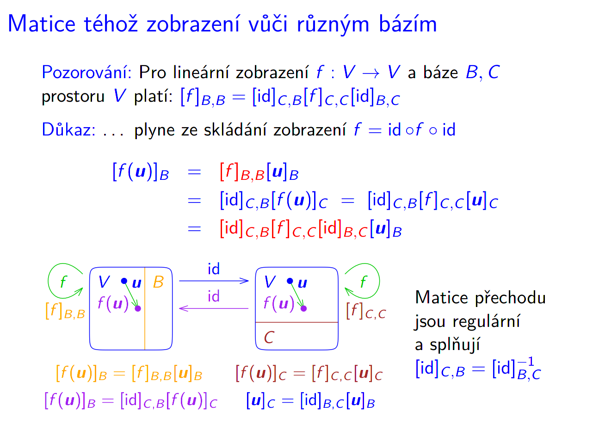
$[id]_{B,C}$ = matice přechodu od báze $B$ k bázi $C$

To $[f]_{C,C} [id]_{B,C}$ je $f(id(\mathbf u))$

> Matice přechodu jsou regulární a splňují $[id]_{C,B} = [id]_{B,C}^{-1}$. To vede na koncept podobnosti matic.

### Podobné matice

$$\underbrace{\mathbf A}_{\large [f]_{B,B}} = 
\underbrace{\mathbf R^{-1}}_{\large [id]_{C,B}} \cdot 
\underbrace{\mathbf B}_{\large [f]_{C,C}} \cdot 
\underbrace{\mathbf R}_{\large [id]_{B,C}}$$

To jest **matice $\mathbf A$, $ \mathbf B$ jsou si podobné, právě když jsou to matice stejného zobrazení, akorát vůči různým bazím**
- jedná se stále o stejné zobrazení, co s vektory dělá stejnou věc, je je jinak "pojmenováváme" pomocí souřadnic. Proto musí mezi maticemi $A$, $B$ existovat vztah = podobnost.

> (někdy se to definuje jako $A = R \cdot B \cdot R^{-1}$ = pak se jen liší, co přesně je ta matice $R$:
> - v té 1. definici je to $[id]_{B,C}$
> - v téhle 2. definici je to $[id]_{C,B}$
>
>)

> Stejný vztah jako: 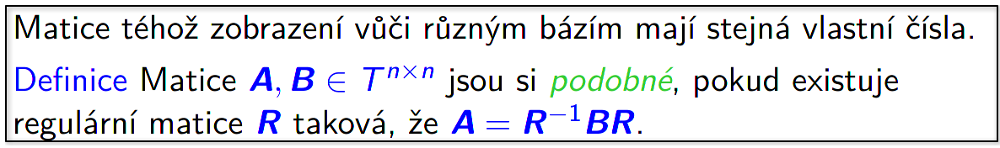 lze formulovat pomocí podobnosti takto:

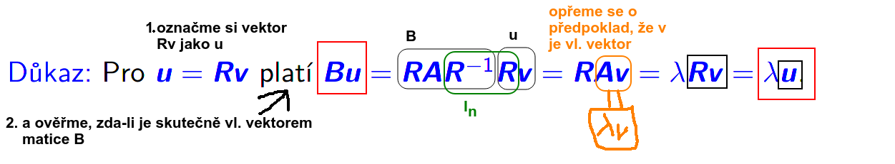

> Bezprostředním důsledkem je, že jsou-li $A$, $B$ navzájem podobné, potom vlastní číslo $\lambda$ má v obou maticích stejnou **geometrickou násobnost** = dimenzi prostoru vlastních vektorů.

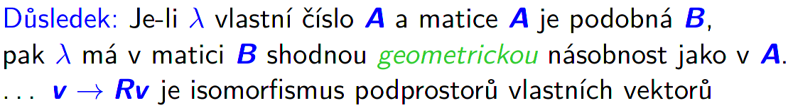

- to "$\mathbf v \to \mathbf{Rv}$ je **isomorfismus**"
	- $R$ je, že jo $[id]_{B,C}$

	- **= Každému nezávislému vlastnímu vektoru $\mathbf v$ v matici 
$A$ odpovídá právě jeden nezávislý vlastní vektor $\mathbf{Rv}$ v matici 
$B$.** (viz pozorování)
		- jak jsme měli o pár řádek výše: "pokud je $\mathbf{v}$ vlastní vektor matice $\mathbf A$, pak $\mathbf{w} = R \mathbf{v}$ je vlastní vektor matice $\mathbf B$ pro stejné vlastní číslo $\lambda$."
	
	- **izomorfismus** (= bijektivní lineární zobrazení) je to proto, že matice $\mathbf R $ je regulární (viz věta o charakterizaci izomorfismů (z LA1))
		- ta věta: **bijektivní zobrazení má inverzní zobrazení - a ta věta říká, že jeho matice je inverzní matice**
						- dává smysl, protože $f \circ f^{-1} = \text{id}$ odpovídá $R \cdot R^{-1} = I$

	- to $\mathbf v \to \mathbf{Rv}$ je "divný" způsob zápisu:

		bijektivní (protože řečeno izomorfismus) zobrazení $f: U \to V$ dané $f(\mathbf v) = \mathbf{Rv}$

		($U$ i $V$ jsou podprostory prostoru, nad kterým matice $A$ i $B$ jsou (konkrétně $U$ je podprostor vlastních vektorů matice $A$, a $V$ je podprostor vlastních vektorů matice $B$) - liší se jenom bází, protože $A$, i $B$ očekávají vstup v různých bazích, dávají výstupu v různých bazích, jejich vl. vektory jsou tudíž taky v různých bazích)
		- někdy se pro tuto šipku používá `\mapsto` = $\mathbf v \mapsto \mathbf{Rv}$

> Další společnou vlastností podobných matic je, že mají shodné charakteristické polynomy:

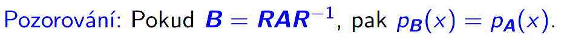

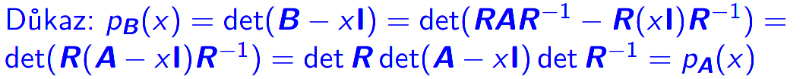
1. definice $p_B(x)$
2. substituce $B = RAR^{-1}$ a rozšíření součinu $xI$ zleva $R$ i zprava $R^{-1}$
	- to můžeme, protože uvnitř je pouze $x$-násobek jednotkové matice:
	
		$R(xI)R^{-1} = x(R(I)R^{-1}) = x(RR^{-1}) = xI$
3. vytknutí $R$ zleva a $R^{-1}$ zprava
4. pravidlo o determinantu součinu matic
5. $\det R$ a $\det(R^{-1})$ jsou navzájem inverzní skaláry
6. definice $p_A(x)$

> Máme-li vlastní číslo matice $A$, která je podobná matici $B$, potom toto vl. číslo má v obou maticích shodnou **algebraickou násobnost**:
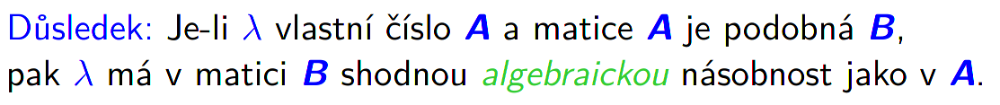
Protože algebraická násobnost je násobnost kořene v charakteristickém polynomu a char. polynomy obou matic jsou naprosto shodné.

> Mezi podobnými maticemi, které přísluší témuž lineárnímu zobrazení se budeme snažit nalézt ty, které mají co nejjednodušší struktury. Ukázka:
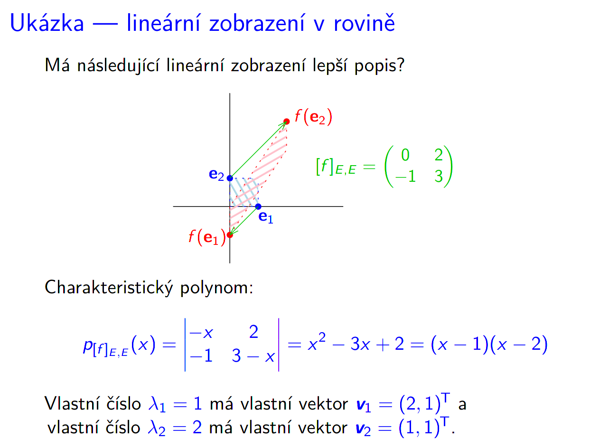
> Má $[f]_{E,E} = \begin{pmatrix} 0 & 2 \\ -1 & 3 \end{pmatrix}$ nějaký jednodušší popis?

> Tato vlastní čísla a vlastní vektory nám o tomto zobrazení něco říkají. Ve skutečnosti na to samé zobrazení se můžeme dívat tak, že podél osy procházející bodem $\mathbf v_1$ je toto lin. zobrazení fixováno (=žejo vl. číslo $\lambda_1 = 1$). Zatímco podél přímky procházející $\mathbf v_2$ odpovídá toto lin. zobrazení 2násobnému natažení.

> Pokud bychom si za bázi vzali právě vektory $B =  \set{\mathbf v_1, \mathbf v_2}$, tak:
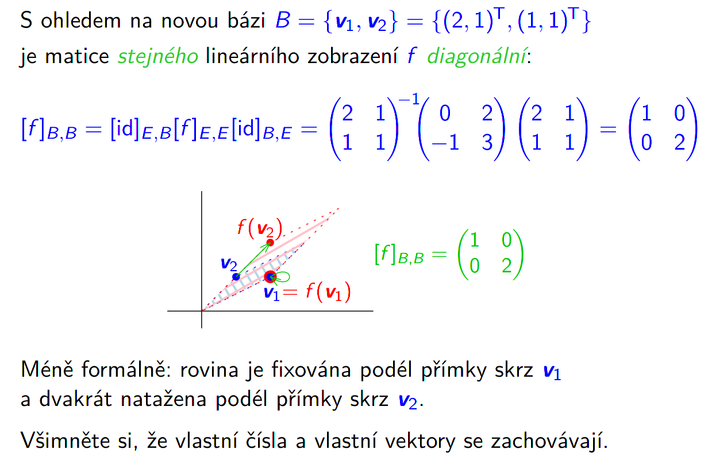

> Situace, kterou jsme si popsali v ukázce, tzn. co se stane, když dosadíme vlastní vektory do báze prostoru, vůči kterému vyjadřujeme matici lineárního zobrazení, ve skutečnosti platí i obecně:

### Proč matice $[f]_{B,B}$, je-li její báze $B$ tvořena pouze vlastními vektory, je diagonální a má na diagonále vlastní čísla
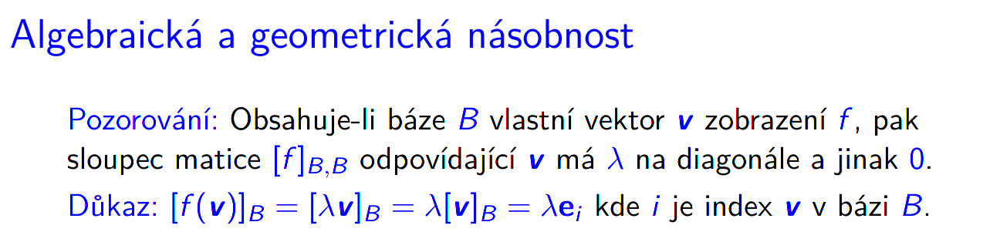

Definice matice lineárního zobrazení:
$[f]_{B,B} = \begin{pmatrix}
\vert & \vert \\
[f(\mathbf{b}_1)]_B & [f(\mathbf{b}_2)]_B \\
\vert & \vert
\end{pmatrix}$, kde $\mathbf{b}_1, \mathbf{b}_2 \in B$ 

A v pozorování se říká, co když nějaký $\mathbf{b}_i$ je vlastní vektor.

V důkazu použito:
1. $f(\mathbf v) = \lambda \mathbf v$
2. výpočet vektoru souřadnic je lineární zobrazení, tj. linearita vůči skalárnímu násobku
	- (viz LA1 ["Lineární zobrazení, afinní prostory"](https://kam.mff.cuni.cz/~fiala/LA1/612-zobrazeni.pdf), slide 5/14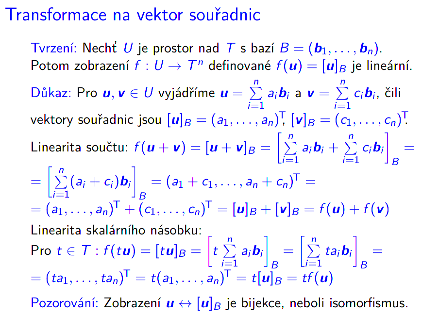)
3. $\lambda [\mathbf v]_B = \lambda \mathbf e_i$ je vidět z příkladu:

	$[\lambda_1 \mathbf v_1]_B = (a_1, a_2)^T$ kde $\lambda_1 \mathbf v_1 = a_1 \mathbf v_1 + a_2 \mathbf b_2$

	$a_1 = \lambda_1$ a $a_2 = 0$ (určeno jednoznačně, protože $\mathbf v_1, \mathbf b_2$ jsou v bázi $B$, jsou tedy lineárně nezávislé)

	= vždy vybereme koeficient u příslušeného vlastního vektoru z báze $1$ a u ostatních $0$.
### Pro každé vlastní číslo platí, že jeho geometrická násobnost je menší nebo rovna jeho algebraické násobnosti

#### Důkaz
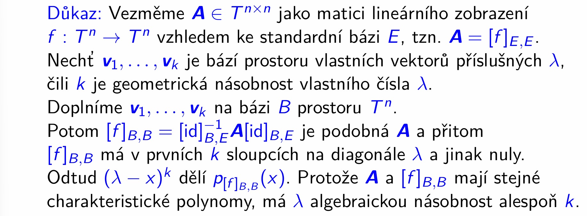

**proč má $[f]_{B,B}$ v prvních $k$ sloupcích na diagonále $\lambda$ a na ostatních pozicích v nich nuly**

Kdybychom si $B$ označili jako $B = \set{\mathbf{v}_1, \dots \mathbf{v}_k, \mathbf b_1, \dots, \mathbf b_m}$ ($m$ je počet doplněných vektorů, aby jich celkově pak bylo $n$), tak:

$$[f]_{B,B} = \begin{pmatrix}
\vert & & \vert & \vert & &\vert\\
[f(\mathbf{v}_1)]_B  & \dots &[f(\mathbf{v}_k)]_B & [f(\mathbf{b}_1)]_B & \dots & [f(\mathbf{b}_m)]_B\\
\vert & & \vert & \vert & & \vert
\end{pmatrix}$$

a $[f(\mathbf{v}_1)]_B = (a_1, \dots, a_n)^T$, kde $\mathbf v_1 = a_1 \mathbf v_1 + a_2 \mathbf v_2 + \dots + a_n \mathbf b_m$, tj. $[f(\mathbf{v}_1)]_B = \mathbf e_1$ apod. pro ostatní:

$$[f]_{B,B} = \begin{pmatrix}
\vert & & \vert & \vert & &\vert\\
\mathbf e_1 & \dots & \mathbf e_2 & [f(\mathbf{b}_1)]_B & \dots & [f(\mathbf{b}_m)]_B\\
\vert & & \vert & \vert & & \vert
\end{pmatrix}$$

Prvních $k$ sloupců nenulové prvky má pouze na diagonále. Když budeme počítat charakteristický polynom $p_{[f]_{B,B}} = \det([f]_{B,B} - xI)$, tak prvních $k$ sloupců $[f]_{B,B} - xI$ bude mít na nenulové prvky pouze na diagonále, a to $\lambda - x$.

**proč $(\lambda - x)^k$ dělí char. polynom $[f]_{B,B}$**

Uvědomme si, že ta matice $[f]_{B,B}$ se skládá z těchto bloků:

$$[f]_{B,B} = \left( \begin{array}{cccc|ccc}
\lambda & 0 & \dots & 0 & * & \dots & * \\
0 & \lambda & \dots & 0 & * & \dots & * \\
\vdots & \vdots & \ddots & \vdots & \vdots & \ddots & \vdots \\
0 & 0 & \dots & \lambda & * & \dots & * \\
\hline
0 & 0 & \dots & 0 & & & \\
\vdots & \vdots & \ddots & \vdots & & \mathbf{C} & \\
0 & 0 & \dots & 0 & & & 
\end{array} \right)$$

($*$ značí libovolný prvek tělesa)

$[f]_{B,B} - xI$ pak z těchto bloků:

$$[f]_{B,B} - xI = \left( \begin{array}{cccc|ccc}
\lambda-x & 0 & \dots & 0 & * & \dots & * \\
0 & \lambda-x & \dots & 0 & * & \dots & * \\
\vdots & \vdots & \ddots & \vdots & \vdots & \ddots & \vdots \\
0 & 0 & \dots & \lambda-x & * & \dots & * \\
\hline
0 & 0 & \dots & 0 & & & \\
\vdots & \vdots & \ddots & \vdots & & \mathbf{C} - x\mathbf{I} & \\
0 & 0 & \dots & 0 & & & 
\end{array} \right)$$

Když pak počítáme determinant, tak do výsledku se započítají (budou nenulové) jenom členy těch permutací, které v prvních $k$ sloupcích vyberou $\lambda-x$. (v zbylých sloupcích vyberou prvky podmatice $\mathbf{C} - x\mathbf{I}$)

Tedy:

$p_{[f]_{B,B}} = \det([f]_{B,B} - xI) = (\lambda-x)^k \cdot \det(\mathbf{C} - x\mathbf{I})$

Btw, Obecný důkaz výpočtu determinantu blokových matic

Platí:

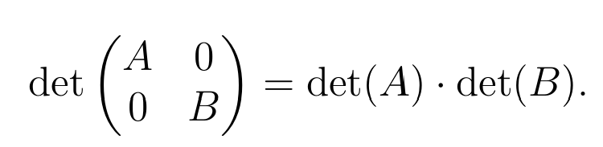

Důkaz (blokovým násobením = prostě násobíme, jako kdyby ty prvky byly čísla, ale pak si uvědomíme, že každý z dílčích součinů na pozici $i,j$ je maticový součin):

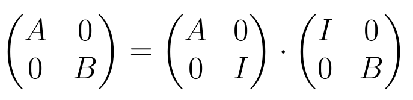
(src: cvičení dr. Maxové, 8. příklad 1. cvičení)

Tedy $(\lambda-x)^k$ skutečně dělí $p_{[f]_{B,B}}$.

**proč je algebraická násobnost $\lambda$ alespoň $k$**
- z $(\lambda-x)^k$ vídíme $= k$
- ale může být i více, protože nikdo neříkal, jak vypadá blok $\mathbf{C}$
	- v $[f]_{B,B}$ jsou všechny sloupce lineárně nezávislé, ale to neznamená, že by v žádném ze sloupců $\mathbf b_1, \dots, \mathbf b_m$ (tedy v bloku $\mathbf C$) nemohlo být **na pozici hlavní diagonály $\lambda$**
		- in fact **very well může**, viz ten blokový obrázek
			- u sloupců $\mathbf b_1, \dots, \mathbf b_m$ je prvek na hl. diagonále na řádku s indexem $(k+1)$ nebo vyšším, kdežto předchozí sloupce $\mathbf v_1, \dots, \mathbf v_k$ mají všechny na tomto řádku $0$, a $1$ mají "nejníž" na $k$-tém řádku

			př.:

			$\begin{pmatrix} 
			\vdots \\
			{*} \\ \hline
			\lambda \\ \hline
			{*} \\
			\vdots
			\end{pmatrix} 
			\begin{matrix} 
			\leftarrow \text{řádek } k \\
			\leftarrow \text{řádek } k+1 \text{ (DIAGONÁLA)} \\
			\leftarrow \text{řádek } k+2 
			\end{matrix}$

			ale nemusí, záleží na zobrazení $f$, proto je tam to **algebraická násobnost $\ge k$** 
			
			= těch $k$ už je zaručeno těmi prvními $k$ sloupci, a případné $\lambda$ v dalších je jen příjemný bonus

No a tedy **algebraická násobnost $\ge k$**  platí pro $[f]_{B,B}$, ale i pro $A$, protože jsou si $A$ a $[f]_{B,B}$ podobné, a tedy mají stejný charakteristický polynom

> Upozorňuji, že tato věta dává pouze nerovnost, protože se může stát, že geometrická násobnost je ostře menší než algebraická násobnost, což si ukážeme na ukázce:

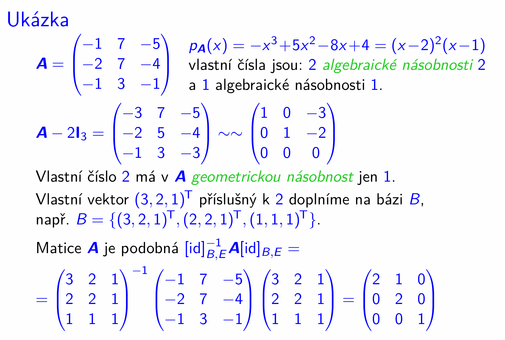
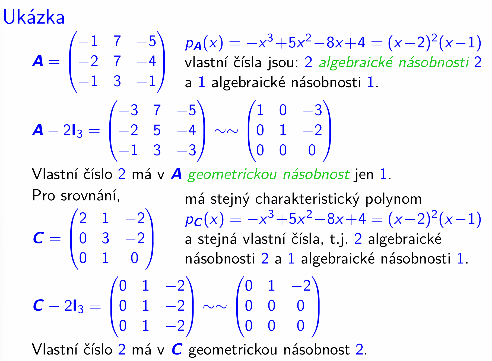
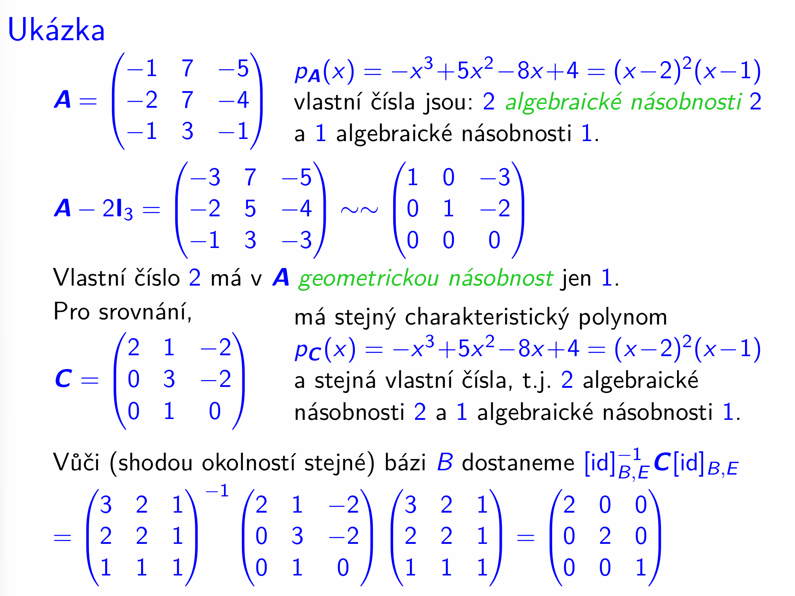

> Mohlo by nás zajímat, za jakých okolností dokážeme k dané matici nalézt podobnou matici, která je diagonální. Protože pokud se na ni díváme jako na matici lineárního zobrazení, pak toto zobrazení se chová velice pěkně. Natahuje prostor ve směru os, které odpovídají vlastním vektorům.

> To je předmětem konceptu diagonalizace.

### Diagonalizace

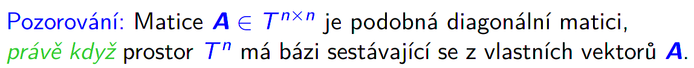

Důkaz:

1. prostor $T^n$ má bázi sestávající se z vlastních vektorů $A$. $\implies$ matice $A \in T^{n \times n}$ je podobná diagonální matici

	> z vlastních vektorů matice $A$ sestavíme matici $R$, a protože jich bude dostatek, tato matice bude nutně regulární, a potom součin $AR$ odpovídá součinu $RD$

	> Čili matice $A$ a $D$ si navzájem budou podobné.

	Rozeberme si to:

	Prostor $T^n$ má bázi z $n$ vektorů. Jsou to vlastní vektory, které jsou nezávislé. Takže máme $n$ vlastních vektorů, které můžeme dát vedle sebe do sloupců, a tím stvořit regulární $R \in T^{n \times n}$. Kdyby jich dostatek nebyl, tak by matice nebyla čtvercová, nebo bychom museli vektory opakovat, čímž by pak byla singulární.

	To, že takto sestrojíme $R$ odpovídá matici přechodu $[id]_{C, E}$, kde $C$ je báze vlastních vektorů, a $E$ je standardní báze. (viz definice matice lin. zobrazení: 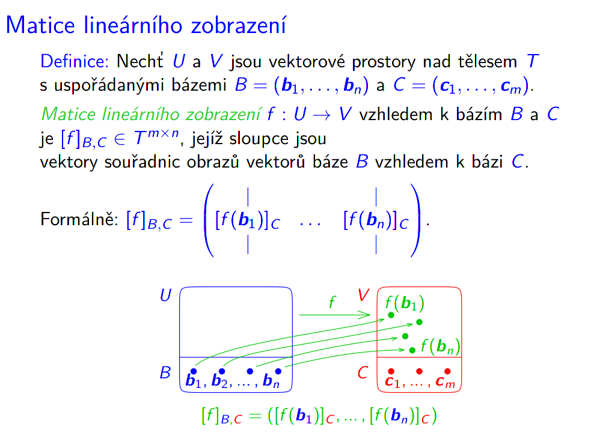).

	> součin $AR$ odpovídá součinu $RD$

	$\underbrace{\mathbf A}_{\large [f]_{E,E}} \cdot \underbrace{\mathbf R}_{\large [id]_{C,E}} = \underbrace{\mathbf R}_{\large [id]_{C,E}} \cdot \underbrace{\mathbf D}_{\large [f]_{C,C}}$

	kde $C$ je báze vlastních vektorů

	To vychází z obrázku **(potřeba nezapomenout, že sloupce $R$ jsou vlastní vektory)**:

	Sloupce matice $R$ jsou tvořeny vlastními vektory matice $A$. Pojďme se opřít o to, že to jsou vlastní vektory, a tedy pro každý z nich platí vztah $A \mathbf v_i = \lambda_i \mathbf v_i$

	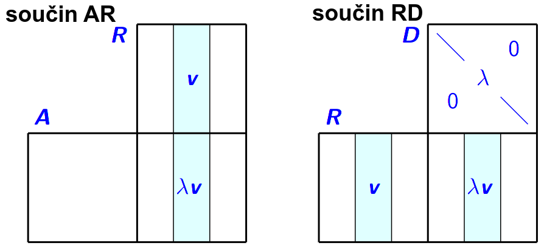

	**Levá část obrázku**
	- provádíme pro každý sloupec součin $A \mathbf v_i$
	- jelikož je $\mathbf v_i$ vlastní vektor matice $A$, tak $A \mathbf v_i = \lambda \mathbf v_i$

	**Pravá část**
	- Násobíme $R \cdot D$, a chceme, aby výsledná matice dopadla tak, že v $i$-tém sloupci bude výsledek $\lambda_i \mathbf v_i$
		- tomu můžeme vyhovět tak, že matice $D$ bude mít na hlavní diagonále vždy $\lambda_i$ a jinde nuly

	Skutečně tedy jsme našli $D$, která vyhoví $AR = RD$.
	Tvar $AR = RD$ můžeme převést na tvar, kterým se běžně definuje "$A$ je podobná $D$" vynásobením zprava $R^{-1}$:

	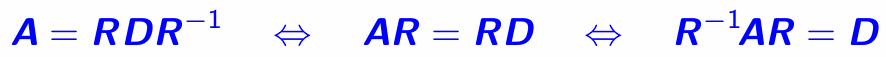

	**JINÝMI SLOVY:**

	Chceme zjistit, jak vypadá matice zobrazení vůči bázi 
	$C = \{\mathbf v_1, \dots, \mathbf v_n\}$. Označme ji 
	$D = [f]_{C,C}$.
	Podle definice matice zobrazení platí, že její sloupce jsou souřadnice obrazů bázových vektorů vyjádřené v téže bázi.
	Vezměme první bázový vektor 
	$\mathbf v_1$:

	Obraz: 
	$f(\mathbf v_1) = A \mathbf v_1 = \lambda_1 \mathbf v_1$.
	Souřadnice obrazu v bázi 
	$C$: Jak zapíšeme $\lambda_1 \mathbf v_1$ pomocí vektorů 
	$\mathbf v_1, \mathbf v_2, \dots, \mathbf v_n$?
	$$\lambda_1 \mathbf v_1 = \lambda_1 \cdot \mathbf v_1 + 0 \cdot \mathbf v_2 + \dots + 0 \cdot \mathbf v_n$$
	První sloupec 
	$D$: Jsou to právě ty koeficienty: 
	$\begin{pmatrix} \lambda_1 \\ 0 \\ \vdots \\ 0 \end{pmatrix}$.

	Když to samé uděláme pro 
	$i$-tý vektor 
	$v_i$:

	Obraz: 
	$f(v_i) = \lambda_i \mathbf v_i$.
	Souřadnice: 
	$\lambda_i \mathbf v_i = 0 \cdot \mathbf v_1 + \dots + \lambda_i \cdot \mathbf v_i + \dots + 0 \cdot \mathbf v_n$.

	$i$-tý sloupec 
	$D$: Bude mít nuly všude, kromě 
	$i$-tého řádku, kde bude 
	$\lambda_i$.

	$D = \begin{pmatrix} \lambda_1 & 0 & \dots & 0 \\ 0 & \lambda_2 & \dots & 0 \\ \vdots & \vdots & \ddots & \vdots \\ 0 & 0 & \dots & \lambda_n \end{pmatrix}$

	**A to je přesně to naše předchozí pozorování**:

	Obsahuje-li báze 
	$B$ vlastní vektor 
	$\mathbf{v}$ zobrazení 
	$f$, pak sloupec matice 
	$[f]_{B,B}$ odpovídající 
	$\mathbf{v}$ má 
	$\lambda$ na diagonále a jinak 
	$0$.

	Důkaz: 
	$[f(\mathbf{v})]_B = [\lambda \mathbf{v}]_B = \lambda [\mathbf{v}]_B = \lambda \mathbf{e}_i$ kde 
	$i$ je index 
	$\mathbf{v}$ v bázi $B$.

	(toto:)
	![Nadpis: Proč matice $[f]_{B,B}$, je-li její báze $B$ tvořena pouze vlastními vektory, je diagonální a má na diagonále vlastní čísla](image-184.png)

2. matice $A \in T^{n \times n}$ je podobná diagonální matici $\implies$ prostor $T^n$ má bázi sestávající se z vlastních vektorů $A$.

	> Pokud je matice $A$ podobná diagonální matici $D$, můžeme si tento součin přepsat do $AR = RD$, a vidíme, že sloupce této matice $R$ je opravdu tvoří bázi prostoru $T^n$ a všechny jsou vlastními vektory matice $A$

	Rozeberme si to:

	Podívejme se na $AR = RD$ znovu po sloupcích (viz ten obrázek). V tuto chvíli o sloupcech matice $R$ nic nevíme, kromě toho, že jsou lineárně nezávislé, protože matice $R$ je regulární. Označme si ty sloupce $\mathbf v_1, \dots, \mathbf v_n$.

	$A \cdot R = \begin{pmatrix} | & | & & | \\ A \mathbf v_1 & A \mathbf v_2 & \dots & A \mathbf v_n \\ | & | & & | \end{pmatrix}$

	$R \cdot D = \begin{pmatrix} | & | & & | \\ d_{1,1} \mathbf v_1 & d_{2,2} \mathbf v_2 & \dots & d_{n,n} \mathbf v_n \\ | & | & & | \end{pmatrix}$

	$AR = RD$

	$\begin{pmatrix} | & | & & | \\ A \mathbf v_1 & A \mathbf v_2 & \dots & A \mathbf v_n \\ | & | & & | \end{pmatrix} = \begin{pmatrix} | & | & & | \\ d_{1,1} \mathbf v_1 & d_{2,2} \mathbf v_2 & \dots & d_{n,n} \mathbf v_n \\ | & | & & | \end{pmatrix}$

	$A \mathbf v_i =  d_{i,i} \mathbf v_i$ je definice toho, že $\mathbf v_i$ je vlastní vektor.
	Takže všechny naše vektory $\mathbf v_1, \dots, \mathbf v_n$ jsou vlastní vektory, a, jak už víme z regularity $R$ jsou lineárně nezávislé. Máme $n$ lineárně nezávislých vektorů = všechno co potřebujeme pro sestavení báze prostoru $T^n$.

### Diagonalizovatelná matice
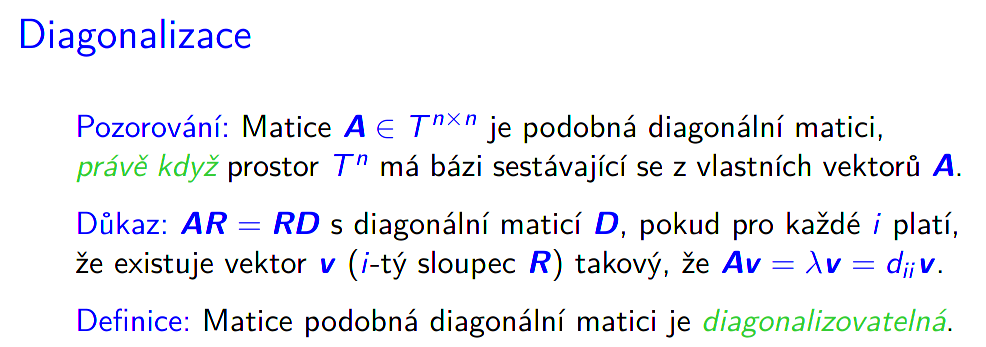
#### Kdy je  matice diagonalizovatelná
> Podmínka z pozorování je splněna př. v případě, že máme tolik různých vlastních čísel, kolik je řád dané matice. Potom totiž platí, že jim odpovídající vlastní vektory jsou navzájem lineárně nezávislé, a lze z nich sestavit hledanou bázi.
>
> 
>
> Toto je však podmínka, která je pouze postačující.

> Pro matice, u kterých dokážeme rozložit charakteristický polynom na součin lin. faktorů pak dokonce máme podmínku, kerá je nutná a postačující:
>
> 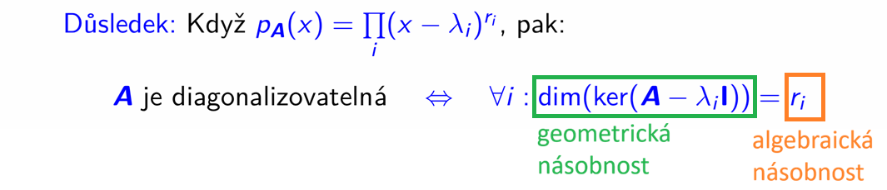

Ten rozklad na lineární faktory (závorky typu $(x - \lambda)$) je nezbytný, protože vlastní čísla musí existovat v daném číselném oboru. (**=aby jich bylo dost**, tj. $r_1 + \dots + r_k = n$) 

Vysvětlení proč

 - a že jo: 
	- a právě když je kořenem toho char. polynomu, tak je to vlastní číslo

	**Takže když polynom nejde rozdělit na lineární faktory => nemá kořeny, nebo jich nemá dost (potřebujeme jich $n$) => nemá dost vlastních čísel => viz předchozí důsledek, matice není diagonalizovatelná**
	

	
Příklad

	Příklad: Představ si realnou matici rotace v rovině o 
	$90^{\circ}$. Ta nemá žádný směr, který by jen “natahovala” (všechny vektory otočí). Její charakteristický polynom je 
	$x^2 + 1$.

	V reálných číslech 
	$\mathbb{R}$ tento polynom nelze rozložit na závorky 
	$(x - \lambda)$.
	Protože nemáme reálná vlastní čísla, nemůžeme vytvořit diagonální matici.

	V komplexních číslech by to šlo rozložit na závorky: $x^2 + 1 = (x - i)(x + i)$.

	Vlastní čísla jsou 
	$\lambda_1 = i$ a 
	$\lambda_2 = -i$.
	V tomto komplexním světě je tato matice rotace diagonalizovatelná!
	

 

##### Implikace $\forall i: \dim(\ker(A - \lambda_iI)) \implies A \text{ je diagonalizovatelná}$

Takže 
$p_{\mathbf{A}}(x) = \prod(x - \lambda_i)^{r_i}$ znamená  $r_1 + \dots + r_k = n$ (=součet algebraických násobností vl. čísel je $n$).

$A$ je diagonalizovatelná $\iff$ prostor $T^n$ má bázi z vlastních vektorů $A$

Tu bázi má právě tehdy, když má $n$ nezávislých vl. vektorů.

Zbývá ukázat, že $$\forall i: \text{geometrická násobnost vl. č. } \lambda_i = \text{algebraická násobnost vl. č.} \lambda_i$$ ukazuje stejnou věc.

Měli jsme už větu, že pro každé vl. č. je jeho geometrická násobnost $\le$ jeho algebraické násobnosti.

Jinými slovy:

**algebraická násobnost** = kolikrát se dané číslo objeví jako kořen char. polynomu. **Je to horní limit, kolik vl. vektorů by toto číslo mohlo dodat.**

**geometrická násobnost** = kolik nezávislých vlastních vektorů *skutečně* dokážeme k tomuto číslu nalézt.

A když stanovíme podmínku jako $$\forall i: r_i = \text{geometrická násobnost vl. č. } \lambda_i$$, a $r_1 + \dots + r_k = n$, tak skutečně $\sum \text{geom. nás.} = \text{počet lin. nezávislých vl. vektorů} = n$

A když je LN vlastních vektorů $n$, tak z nich dokážeme zcela určitě sestavi bázi prostoru $T^n$, tedy $A$ je určitě diagonalizovatelná.

____

##### Implikace $A \text{ je diagonalizovatelná} \implies \forall i: \dim(\ker(A - \lambda_iI))$

Ta je o něco jednodušší.

$A$ je diagonalizovatelná $\iff$ prostor $T^n$ má bázi z vlastních vektorů $A$

Tedy máme $n$ lin. nezávislých vlastních vektorů. Ty jsou rozdělěny mezi jednotlivá vlastní čísla. Každé vlastní číslo má tolik lin. nezávislých vektorů, kolik je jeho geometrická násobnost.

Víme, že pro každé vl. č. je jeho algebraická násobnost $\ge$ jeho geometrické násobnosti.

Též víme, že v matici nemůže být více než $n$ vlastních čísel = protože char. polynom stupně $n$ nemá více než $n$ kořenů, a víme, že $r_1 + \dots + r_k = n$ = tady předpokládáme, existenci toho rozkladu na závorky = ten předpoklad $p_{\mathbf{A}}(x) = \prod(x - \lambda_i)^{r_i}$.

Označíme-li geometrickou násobnost jako $g_i$, a algebraickou násobnost jako $r_i$ tak:

$$\sum_{i=1}^k g_i = n$$

$$\sum_{i=1}^k r_i = n$$

A z té věty víme:

$$\forall i: g_i \le r_i$$

Všechny 3 věci lze splnit právě když $\forall i: g_i = r_i$ (protože jak víme, tak jak všechna $g_i$, tak všechna $r_i$ jsou kladná čísla
- $r_i \ge 1$, protože 
$\lambda_i$ je kořen (takže tam ta závorka aspoň jednou je). 
- $g_i \ge 1$, protože k vlastnímu číslu 
$\lambda_i$ z definice musí existovat alespoň jeden nenulový vlastní vektor.
)

**Jinými slovy:**

Kdyby existovalo alespoň jedno vlastní číslo 
$\lambda_j$, pro které by platila ostrá nerovnost 
$g_j < r_j$ (geometrická by byla menší než algebraická), pak by se to projevilo v celkovém součtu:

$$\underbrace{\sum g_i}_{n} < \underbrace{\sum r_i}_{n}$$

Dostali bychom spor: 
$n < n$, což není možné.

____

> Na závěr si ukážeme, že mocniny diagonalizovatelných matic se snadno spočítají z mocnin příslušných diagonálních matic.

> Diagonální matice se mocní snadno, protože stačí umocnit pouze prvky na hlavní diagonále

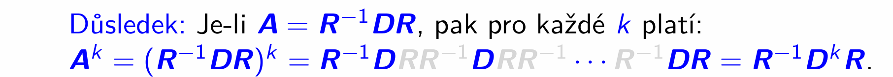

(A samotný ten nadpis **Diagonalizace** tam vysvětlený není, ale I assume, že to JE to nalezení matice $D$ s vlastními čísly matice $A$ na diagonále. To že taková matice dává smysl, platí právě když:

$\exists \text{ regulární } R: AR = RD$)

> Zjistili jsme, že diagonalizace matic lineárních zobrazení má $2$ potenciální překážky:
> - Buď nemusí být dostatek vlastních čísel,
> - a nebo ani vlastních vektorů

> Příště si ukážeme, že některé matice však jde diagonalizovat vždy.

## Diagonalizovatelnost hermitovských matic (16:29, 58M)

> Rád bych vám ukázal , že existuje rozsáhlá třída matic, které lze vždy diagonalizovat. Konkrétně půjde o **realné symetrické matice** a **komplexní hermitovské matice**.

> Nejprve si tyto matice zadefinujeme, a pak se vás pokusím přesvědčit, že je opravdu lze vždy diagonalizovat.

> V této lekci budeme pracovat s komplexními vektory a maticemi, a proto si nejprve připomeňme:

### Komplexně sdružené číslo

### Hermitovská transpozice

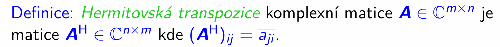

### Hermitovská matice

### Unitární matice

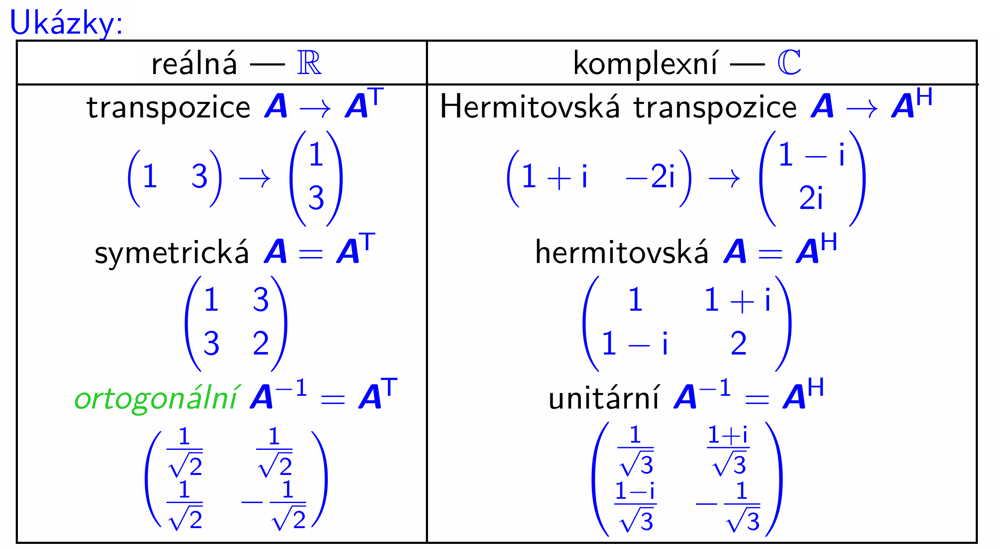
Analogie unitárních matic v realném případě, jsou **ortogonální matice** (použijeme obyč. transpozici místo Hermitovské transpozice)

### Vlastnosti
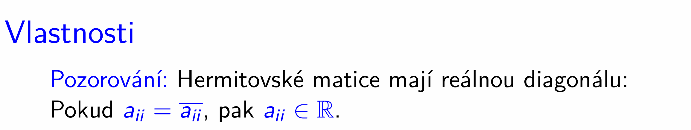

- analogie s obyč. transpozicí
#### $A$ unitární $\implies$ $A^H$ unitární
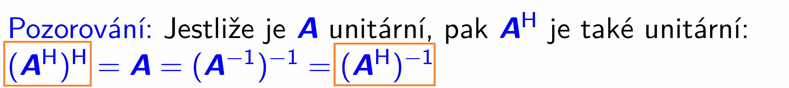
viz. def unitární matice: $A^{-1} = A^H$
#### Součin unitárních matic je unitární
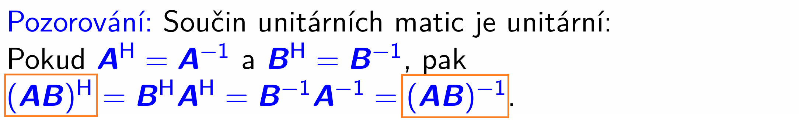
#### Unitární $A$ splňuje $A^H A=I$
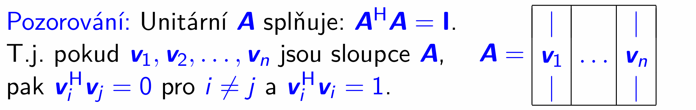
- to platí z definice unitární matice:  $A^{-1} = A^H$

- Analogicky s obyč. transpozicí, kterou si můžeme představit tak, že transponujeme jednotlivé řádky (=co bylo napsané do sloupce napíšeme do řádku):
$$A^H = \begin{pmatrix}
\text{---} & \mathbf v_1^H & \text{---} \\
& \vdots  &\\
\text{---} & \mathbf v_n^H &\text{---} \\
\end{pmatrix}$$

> V naší lekci využijeme Fakt:
>
> 
>
> každý $\mathbf v \in C^n$, t.ž, $\mathbf v^H \mathbf v = 1$ lze doplnit na unitární matici tak, že tento vektor bude tvořit její první sloupec.
>
> To si dokážeme o několik lekcí později.

> Hlavním cílem této lekce je ukázat, že každá Hermitovská matice má všechna vlastní čísla realná, a dokonce ji lze diagonalizovat pomocí unitární matice. To znamená lze nalézt unitární matici $R$ takovou, že součin $R^{-1}AR$ je diagonální.

(že jo matice $A$ je podobná $D$ $\iff$ $A = RDR^{-1}$, kde to $A = RDR^{-1}$ můžeme upravit

$$
\begin{align*}
A &= RDR^{-1} \quad / \cdot R \text{ zprava} \\
AR &= RDR^{-1}R \quad / \cdot R^{-1} \text{ zleva}\\
R^{-1}AR &= R^{-1}RD \\
R^{-1}AR &= D
\end{align*}
$$
)
### Diagonalizace Hermitovských matic
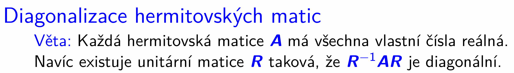

Vysvětlení ukázky

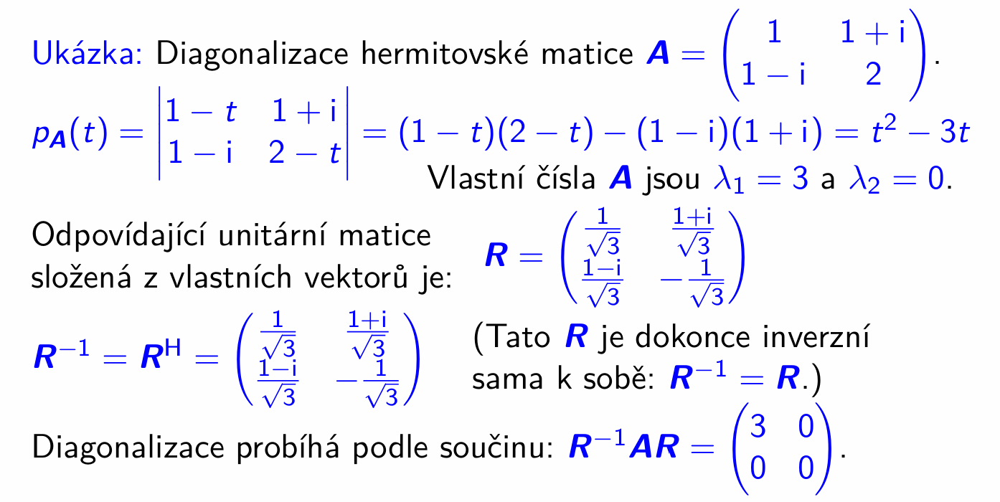

> inverzní matice k této matici $R$ je rovna hermitovské transpozici $R$ (=$R$ je unitární), a dokonce v tomto konkrétním případě dostáváme tutéž matici

**Jak vznikla, co je zač $R$:**

Podle věty $D$ = $R^{-1}AR$ je diagonální

$$\underbrace{\mathbf D}_{\large [f]_{B,B}} = 
\underbrace{\mathbf R^{-1}}_{\large [id]_{E,B}} \cdot 
\underbrace{\mathbf A}_{\large [f]_{E,E}} \cdot 
\underbrace{\mathbf R}_{\large [id]_{B,E}}$$

A viz

 

(právě když v tom prostoru dokážeme nalézt takovou bázi)
=> ta báze je $B$

A viz 

$R$ je $[id]_{B,E}$, proto "je složena z vhodných vlastních vektorů příslušných vlastním číslům", tj:

$$R = [id]_{B,E} = \begin{pmatrix}
\vert & \vert \\
[\text{id}(\mathbf{b}_1)]_E & [\text{id}(\mathbf{b}_2)]_E \\
\vert & \vert
\end{pmatrix}$$

Tj. lineárně nezávislé vlastní vektory jsou sloupce $R$.

Akorát teda ne ledajaké, ale takové, aby pro každý platilo $\mathbf b_i^H \cdot \mathbf b_i = 1$ (=aby ta $R$ byla unitární (Unitární $A$ splňuje $A^H A=I$)). Takže můžeme nalézt nějaké vlastní vektory, pak spočíst součin, a pak vydělit vhodným skalárem.

Matice $R$ vznikla takto:

pro $\lambda = 3$ je vl. vektor $\begin{pmatrix} 1 \\ 1-i \end{pmatrix}$

pro $\lambda = 0$ je vl. vektor $\begin{pmatrix} 1+i \\ -1 \end{pmatrix}$

$\begin{pmatrix} 1 \\ 1-i \end{pmatrix}^H = \begin{pmatrix} 1 & 1+i \end{pmatrix}$

$\begin{pmatrix} 1 & 1+i \end{pmatrix} \cdot \begin{pmatrix} 1 \\ 1-i \end{pmatrix} = 3$

=> chceme to vynásobit $\frac 1 3$, a protože $^H$ se vyrábí z toho pův. vektoru, tak je ho třeba vynásobit $\frac{1}{\sqrt{3}}$

analogicky pro druhý vektor.

Tak tedy 

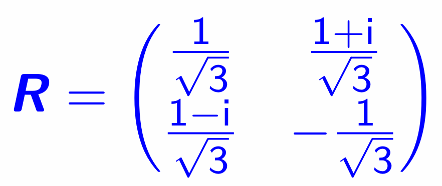

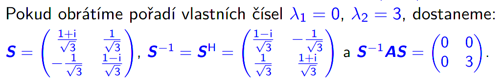
- a v obráceném pořadí tedy vezmeme i vlastní vektory (= tedy prohodíme sloupce)

#### Důkaz

!!! $A_{n-1}$ není podmatice (výřez) z té původní matice 
$A$. - je to nová (v důkazu odvodíme, že hermitovská) matice

Závěr, ke kterému se chceme dostat:

Protože matice 
$D_n$ je diagonální a podobná matici 
$A_n$ (přes unitární transformaci 
$R_n$), obsahuje na diagonále právě všechna vlastní čísla matice 
$A_n$. Protože 
$\lambda$ je reálné a všechna čísla v 
$D_{n-1}$ jsou reálná, jsou všechna vlastní čísla matice 
$A_n$ reálná.

**Indukční předpoklad:** Předpokládejme, že pro **každou hermitovskou matici** o rozměru 
$(n-1) \times (n-1)$ už víme, že:
- její **vlastní čísla jsou reálná**
- a že je **diagonalizovatelná** (=je podobná diagonální matici) pomocí **unitární** matice $R$.
	- tj. existuje unitární $R$ taková, že $R^{-1} A R$ je diagonální

**Indukční krok:** ukázat, že pro hermitovskou matici velikosti $n \times n$ platí:
- je diagonalizovatelná pomocí unitární matice, to je tato cílová rovinka:

	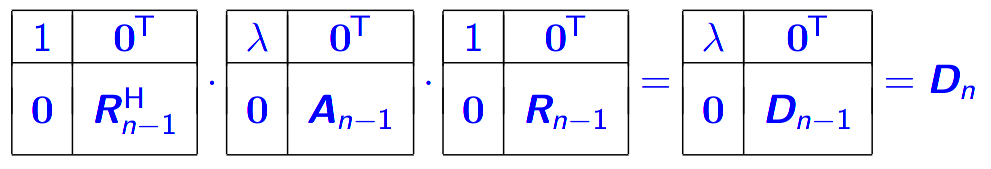

- a že má vlastní čísla realná:
	to je vidět z:

	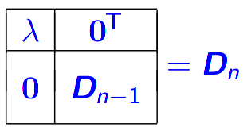
	- $\lambda$ je realné
		- to jsme odvodili od
			
			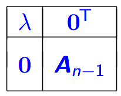,
			
			což je hermitovská matice = platí pro ni, že čísla na hlavní diagonále jsou realná

	- $D_{n-1}$ je hermitovská = dle indukčního předpokladu "pro **každou hermitovskou matici** o rozměru 
$(n-1) \times (n-1)$ už víme, že její **vlastní čísla jsou reálná**"
		- proč je hermitovská:

			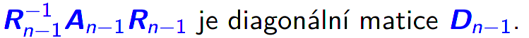
			- **důležité:** $A_{n-1}$ je hermitovská
				- tedy i součin s unitární maticí $R^{-1}_{n-1}$ a unitární maticí $R_{n-1}$ je hermitovský:
					tj. chceme ukázat:

					matice $C$ je hermitovská, tj. $C = C^H$, kde $C = R^{-1}_{n-1} A_{n-1} R_{n-1}$

					pro přehlednost odeberu dolní indexy:

					$(R^{-1}AR)^H$

					1.) použiju $R^{-1} = R^H$ (matice $R$ je unitární):

					$(R^HAR)^H$

					2.) $(ABC)^H = C^H B^H A^H$:

					$R^H A (R^H)^H = R^H A R$

					3.) $R^{-1} = R^H$

					$R^{-1} A R$, což je to $C$

					(přesně tento krok udělal v části 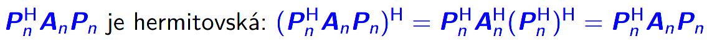 
					
					($P_n$ byla unitární))

Tj.:

1. **Báze indukce** (
$n=1$): Ukážeme, že věta platí pro nejmenší možný rozměr (matice 
$1 \times 1$ je jen jedno číslo, a pokud je hermitovská, je to reálné číslo).
2. **Indukční předpoklad:** Předpokládáme, že věta platí pro libovolnou matici o rozměru 
$(n-1) \times (n-1)$. Tedy předpokládáme, že každá taková hermitovská matice má reálná vlastní čísla a je unitárně diagonalizovatelná.
3. **Indukční krok** (
$n-1 \to n$): Pomocí tohoto předpokladu dokážeme, že věta musí platit i pro matici o rozměr větší, tedy 
$n \times n$.

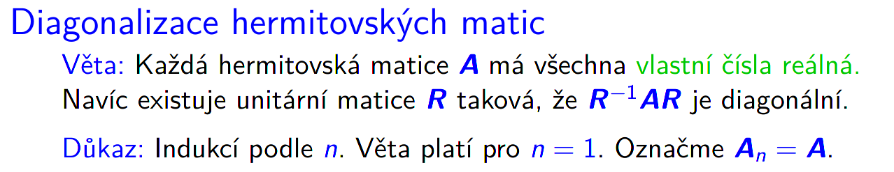

$A = (a_{11})$

Matice řádu $1$ je diagonální a za $R$ můžeme vzít jednotkovou matici řádu $1$

$AR = RD$ splněno

$(a_{11})(1) = (1)(a_{11})$

A vlastní číslo $A$ je přímo to jediné číslo v matici (že jo $A \mathbf v = \lambda \mathbf v$), které je zároveň na hlavní diagonále, a proto je realné.

> protože jde o komplexní matici, víme, že těleso (=$\mathbb{C}$) je algebraicky uzavřené, tzn. charakteristický polynom má alespoň $1$ kořen (protože má stupeň $\ge 1$, a tzn., že komplexní matice má alespoň $1$ vlastní číslo $\lambda$, kterému odpovídá nějaký vlastní vektor $\mathbf v$)
>
> 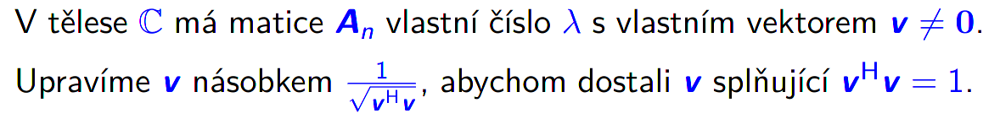

- 

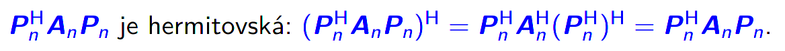
1. $(ABC)^H = C^H B^H A^H$
2. $A_n^H$ je hermitovská (=předpoklad)

- unitární matice $P_n$ má $\mathbf v$ jako 1. sloupec.

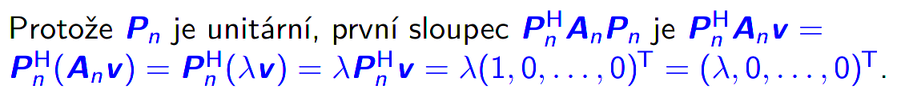
- unitární matice splňuje:
	

- A první řádek $P_n^H$ právě bude $\mathbf v^H$, takže s tím 1. sloupcem $\mathbf v$ to dá $1$, a zbytek sloupců s 1. sloupcem dá $0$

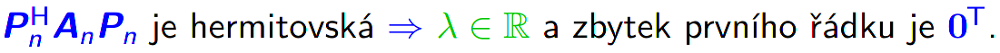
- $\lambda \in \reals$ protože je to prvek na hl. diagonále (hl. diagonála u hermitovských matic vždy realná)
- zbytek 1. řádku nuly, protože symetrické s prvním sloupcem, jehož zbytek jsou $0$, (přesně je zbytek 1. řádku $0^H$, ale $0^T$ dá stejný výsledek)

> Proto ten součin ve skutečnosti vypadá tak, že jde o blokovou matici:
>
> 
- celá tato matice je hermitovská, tak i její blok, který si označíme $A_{n-1}$, je hermitovský
	- znovu zdůrazňuji, $A_{n-1}$ NEVZNIKÁ z $A_n$ něčím jako odseknutím sloupce a řádku - jak $A_{n-1}$ vzniká se odvodí později
		- aka $A_{m}$ je prostě označení hermitovské matice řádu $m$

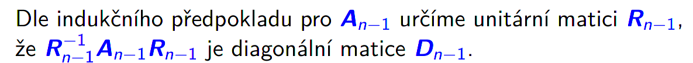

Konkrétně dle této jeho části:

Předpokládejme, že pro **každou hermitovskou matici** o rozměru 
$(n-1) \times (n-1)$ už víme, že je **diagonalizovatelná** (=je podobná diagonální matici) pomocí **unitární** matice $R_{n-1}$.
- tj. **existuje** unitární $R_{n-1}$ taková, že $R_{n-1}^{-1} A_{n-1} R_{n-1}$ je diagonální

- $R_{n-1}$ je unitární z indukčního předpokladu
	- dopněním na matici řádu $n$ přidáním nového sloupce a řádku tímto způsobem pořád bude unitární
- $P_n$ je unitární

> Zbývá už jen ověřit, že takto sestavená $R_n$ je skutečně ta, kterou jsme hledali:
>
> 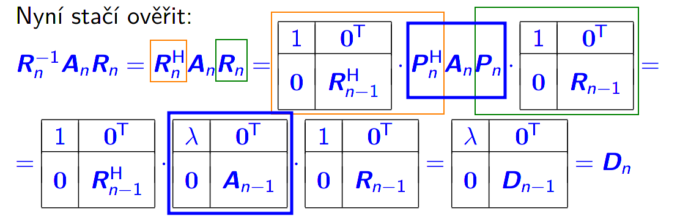
- to je indukční krok
- dá se to vyhodnotit po blocích

> Tím je důkaz obou částí věty dokončen.

> Analogická verze této věty platí i pro realný případ. 
>
> Tzn., že každá realná symetrická  matice má všechna vl. č. realná a lze ji diagonalizovat pomocí ortogonální matice 
> 
> 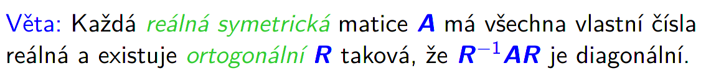

> Důkaz se provede úplně stejně, akorát ve $2$ místech je potřeba zařídit, že objekty, se kterými budeme pracovat, budou realné a ne komplexní.
>
> Druhou ingrediencí je konstrukce ortogonální matice z vektoru $\mathbf v$, který splňuje $\mathbf v^T \mathbf v = 1$. I tento krok lze provést tak, že dokonce získáme ortogonální matici (= takovou unitární matici, že má všechny složky realné)
>
> 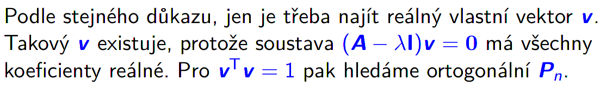
___

> Postup, kterým byla věta dokázána, lze ilustrovat na konkrétní ukázce:
>
> 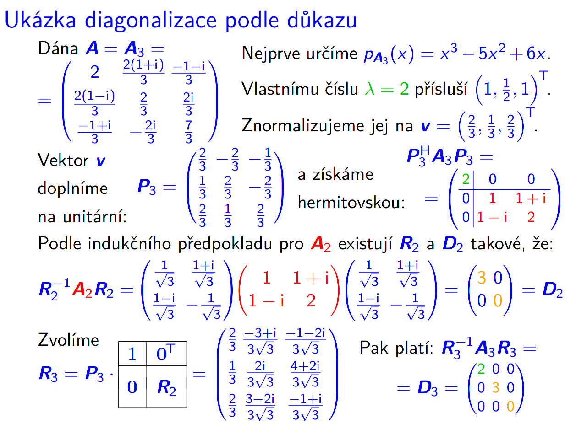

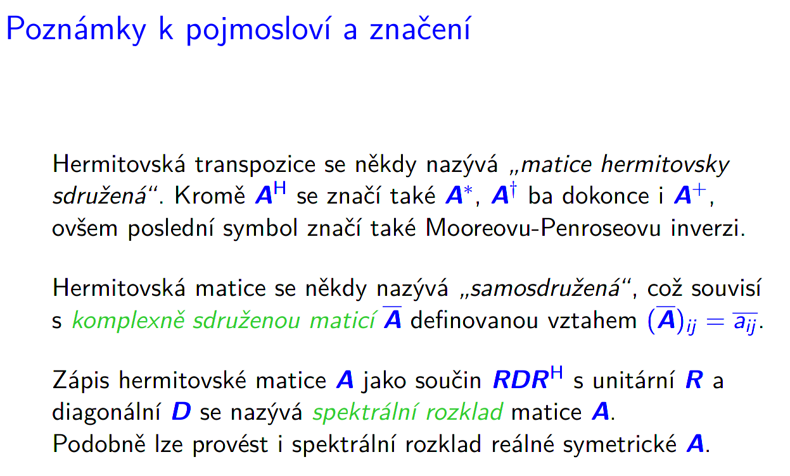

> Hermitovské matice nám mohou připadat poněkud umělé, ale budeme je potřebovat v následujících lekcích o skalárním součinu a o pozitivně definitních maticích. 
>
> I dnešní věta, která byla těžká a technická bude mít praktické a zajímavé důsledky.

## Jordanova normální forma

> Pokoušíme-li se diagonalizovat matici nad algebraicky uzavřeným tělesem, jako jsou př. komplexní čísla, máme zaručen dostatek vlastních čísel. 
>
> Navzdory tomu některé matice stále diagonalizovat nejde. Ukážeme si však, že je lze převést do téměř diagonálního tvaru.

> Nejprve si uvědomíme, že ne každá matice je diagonalizovatelná
>
>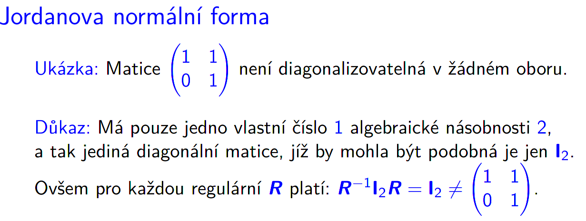

> Právě matice, které mají podobnou strukturu jako matice z naší ukázky, budou hlavními stavebními kameny Jordanovy normální formy, a proto si je pojmenujeme.

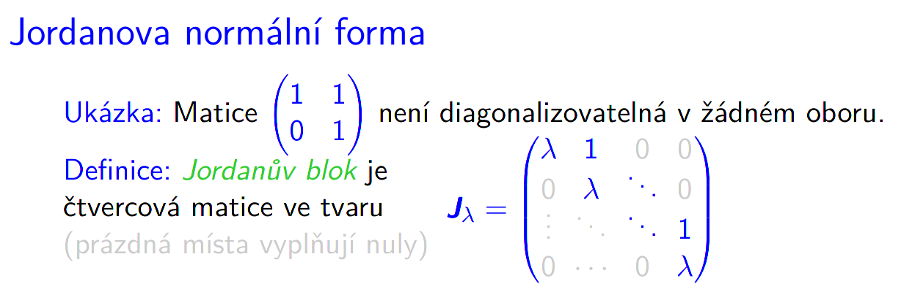
- na hlavní diagonále číslo $\lambda$
- nad tím, na horní sekundární diagonále, číslo $1$

### Každá čtvercová komplexní matice je podobná blokové matici v Jordanově normální formě

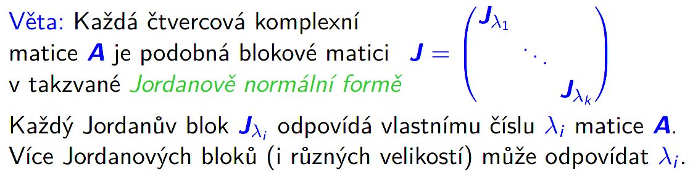
- blokové matici takové, že její bloky jsou právě Jordanovy bloky

> každému vlastnímu číslu odpovídá tolik Jordanových bloků, kolik je jeho geometrická násobnost

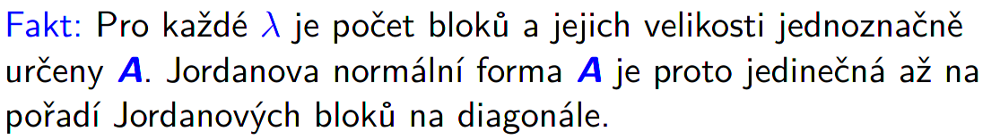
= až na permutaci Jordanových bloků na diagonále

> Pokud je matice diagonalizovatelná, pak její normální forma je diagonální matice, a Jordanovy bloky zde mají velikost $1 \times 1$. Jinými slovy nikdy nenajdeme $1$ na horní sekundární diagonále.

### Zobecněné vlastní vektory

- že jo $R$ je matice přechodu od báze vlastních vektorů, vzhledem ke které je vyjádřena matice $D$, k standardní bázi

$$R = [id]_{B,E} = \begin{pmatrix}
\vert & \vert \\
[\text{id}(\mathbf{b}_1)]_E & [\text{id}(\mathbf{b}_2)]_E \\
\vert & \vert
\end{pmatrix}$$

$$\underbrace{\mathbf A}_{\large [f]_{E,E}} \cdot \underbrace{\mathbf R}_{\large [id]_{B,E}} = \underbrace{\mathbf R}_{\large [id]_{B,E}} \cdot \underbrace{\mathbf D}_{\large [f]_{B,B}}$$

