## Kvadratické a bilneární formy, matice forem

> Skalární součin jsme zkoumali ve vektorových prostorech na realnými i komplexními čísly, a můžeme se ptát, jestli by mělo smysl zkoumat podobné zobrazení i ve vektorových prostorech nad obecnými tělesy.

> Dnes si předvedeme, že je to možné, nadefinujeme si analogii skalárního součinu i normy, a převedeme si, jaké tato zobrazení bude mít vlastnosti.

### Bilineární forma

- linearita vůči skalárnímu násobku v 1. i ve 2. složce

- linearita vůči sčítání v 1. i ve 2. složce

**bi**lineární = lineární v 1. i ve 2. složce

#### Symetrická bilineární forma

### Kvadratická forma

Mohli bychom napsat $g(\mathbf v) := f(\mathbf v, \mathbf v)$, kde $f(\mathbf v, \mathbf v)$ je nějaká bilineární forma. Nicméně takhle se to napsalo proto, že těch forem, které odpovídají stejné kvadratické formě může být víc.

Například pro kvadratickou formu 
$g(x_1, x_2) = x_1 x_2$ na 
$\mathbb{R}^2$ můžeme vzít:

$f_1(u, v) = u_1 v_2 \implies f_1(x, x) = x_1 x_2 = g(x)$

$f_2(u, v) = u_2 v_1 \implies f_2(x, x) = x_2 x_1 = g(x)$

$f_3(u, v) = \frac{1}{2}u_1 v_2 + \frac{1}{2}u_2 v_1 \implies f_3(x, x) = x_1 x_2 = g(x)$

To „pokud existuje“ říká, že aby byla funkce 
$g$ kvadratickou formou, musí jít zkonstruovat položením 
$g(v) = f(v, v)$ z alespoň jedné bilineární formy 
$f$.

Zde je definice z Wikipedie:

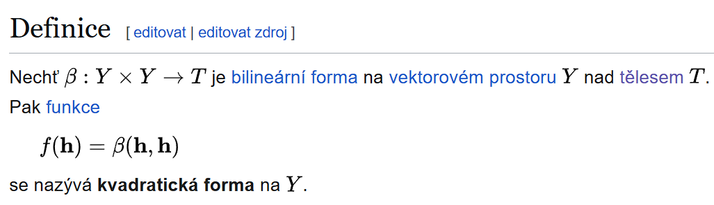

### Příklady forem

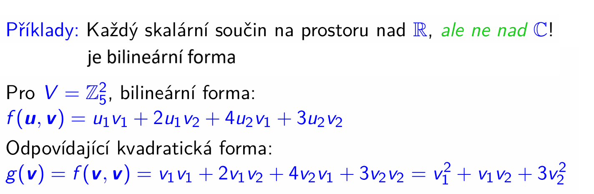

### Matice forem
> Jak bilineární, tak kvadratické formy můžeme popsat pomocí matic, a to v případě, že máme vektorový prostor konečné dimenze a v něm máme dánu nějakou bázi.
> #### Matice bilineární formy
> 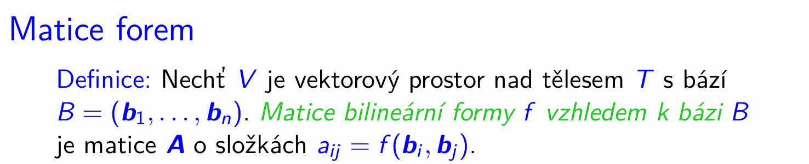

#### Matice kvadratické formy
> Jedné kvadratické formě $g$ může odpovídat více bilineárních forem $f$. Proto, aby byla matice kvadratické formy **jednoznačně** dána, bereme tu matici bilineární formy, která je symetrická.

> Ne vždy musí matice kvadratické formy existovat, protože ne vždy existuje symetrická bilineární forma, jak si záhy ukážeme.

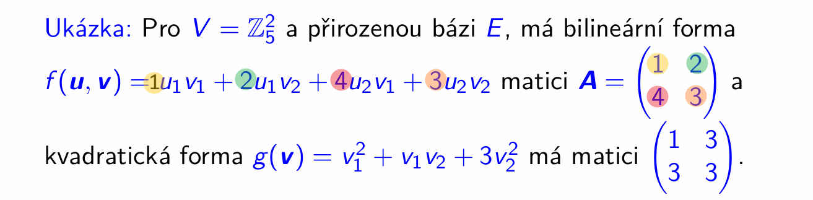
- převod mezi těmito oběma tvary (analytický tvar a matice) bude vysvětlen podrobněji později v tomto videu

> Ne vždy se nám musí podařit matici kvadratické formy najít
>
> 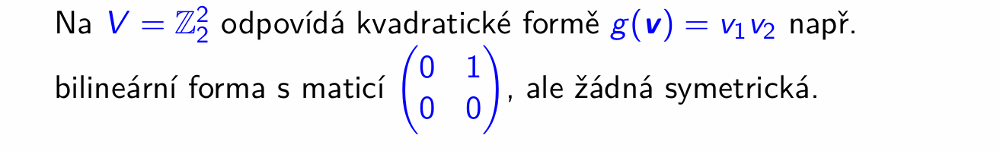
- jinde než na $\mathbb{Z}_2$, tedy na tělese s charakteristikou jinou než $2$ bude vždy existovat od každé bilineární formy její symetrická verze - viz dále: 

> Záhy si ukážeme, jak z předpisu pro kvadratickou formu můžeme sestavit symetrickou matici bilineární formy, a zároveň nám to dá odpověď na otázku, kdy matice kvadratické formy neexistuje.
>
> Nejprve si všimneme, že prvky matice $A$ jsou dány nejenom bilineární formou $f$, tak, že do ní dosadíme $i$-tý a $j$-tý vektor dané báze, ale také, že ji lze spočítat přímo z kvadratické formy tímto výrazem:
>
> 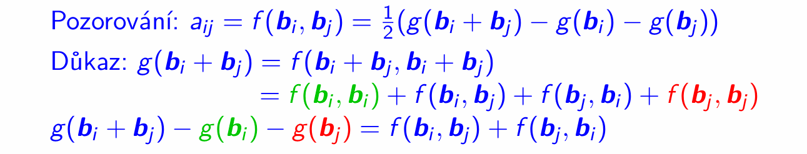

v důkazu:
- předpokládáme, že $g$ a $f$ existuje (což můžeme dokud není řeč o maticích, tak není na $f$ podmínka, aby byla symetrická => $f$ existuje vždy => $g$ existuje vždy) 
- $g$ existuje $\iff g(\mathbf v) = f(\mathbf v, \mathbf v)$ 
- linarita bilin. normy v 1. a 2. složce
- v posledním kroku máme na pravé straně $f(\mathbf b_i, \mathbf b_j) + f(\mathbf b_j, \mathbf b_i)$
	- > u kvadratické formy hledáme symetrickou matici, tzn, že hodnota formy $f$ má být stejná, ať už ty vektory dosadíme v jakémkoli pořadí
- tak tedy dostáváme $2f(\mathbf b_i, \mathbf b_j)$
- a pak obě strany rovnice vydělíme $2$
	- > nad tělesy, které mají charakteristiku $2$, dělit $2$ nelze, a proto v těchto případech nemusí vždy matice kvadratické formy existovat

		> v tělesech ostatních charakteristik má číslo $2$ vždy svůj inverzní prvek (zde $2$ bereme tak, že sečteme dvakrát neutrální prvek vzhledem k násobení)
		>
		> **proto v tělesech, které nemají charakteristiku 2, je vždy matice kvadratické formy dána jednoznačně** (a tedy definována, že)

#### Co si z toho odnést

Vždy, kdy v tělese existuje číslo $2$, můžeme vytvořit matici symetrické bilineární formy.
- a z té pak - viz (forward ref) analytické vyjádření - vytvořit polynom ("funkční předpis")

- že jo nějaká kvadratická forma k bilineární formě existuje vždy (není zde žádný požadavek na symetrii, jedné kvadratické formě může odpovídat víc bilineárních forem)
- a pak pomocí vzorce $a_{ij} = \frac 1 2 (g(\mathbf b_i + \mathbf b_j) - g(\mathbf b_i) - g(\mathbf b_j))$ si vytvořit symetrickou matici bilineární formy
	- a kdybychom chtěli polynom téhle bilin. formy, tak spočteme analytické vyjádření

Takže vlastně takhle trochu oklikou umíme "symetrizovat" bilineární formu.
- a z ní pak sestrojit i matici kvadratické formy ( protože že jo symetrická matice bilineární formy a matice kvadratické formy se liší jenom vstupy - jestli tam pošleme 2 stejné vektory nebo různé)

Proto se matice kvadratické formy definuje tak, že je to "ta symetrická", protože prakticky vždy jde sestrojit, a neztratíme tím žádné možnosti.

(kromě toho edge case, kdy bychom něměli číslo 2, viz $\mathbb{Z}_2$ - pak bychom se asi museli smířit s tím co máme, a netrvat na symetrii - stejně by symetrická a nesymetrická verze téže formy po dosazení vstupních vektorů měla dát stejné číslo)

##### Proč teda chceme symetrii

Spousta nástrojů v lineární algebře pracuje s symetrickými maticemi.
____

> Máme-li ať už bilineární nebo kvadratickou formu popsánu pomocí její matice, můžeme hodnotu této formy vyhodnotit pomocí maticového součinu.
>
> 

Důkaz:

$[\mathbf u]_B = (c_1, \dots, c_n)$

$[\mathbf v]_B = (d_1, \dots, d_n)$

- vyjádříme ty vektory pomocí lineární kombinace vektorů báze $B$
- ty koeficienty odpovídají prvkům vektorů souřadnic (viz definice vektoru souřadnic)
	- $[\mathbf u]_B = (c_1, \dots, c_n)$
	- $[\mathbf v]_B = (d_1, \dots, d_n)$

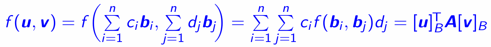
- dosadíme, díky linearitě vytkneme (to s dvojitou sumou funguje stejně jako u skal. součinu - kde jsem to rozebíral podrobněji - akorát tady už nemáme žádné komplexní sdružení)
- odpovídá to $[\mathbf u]_B^T A [\mathbf v]_B$, protože
	- $[\mathbf u]_B = (c_1, \dots, c_n)$
	- $[\mathbf v]_B = (d_1, \dots, d_n)$
	- $a_{ij} = f(\mathbf b_i, \mathbf b_j)$

### Jak se mění matice formy, když měníme bázi
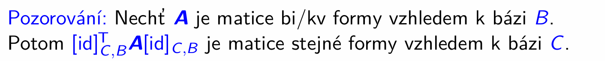
- pozor na tu transpozici
	- kde vznikne vidět z důkazu:

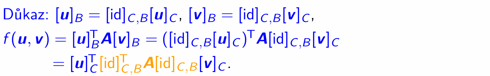

### Analytické vyjádření bilineární formy
> Ať už bilineární nebo kvadratické formy bývají často popisovýny pomocí polynomům tak, jak jsme je používali v našich ukázkách.
>
> Tyto popisy si zaslouží vlastní název:
>
> 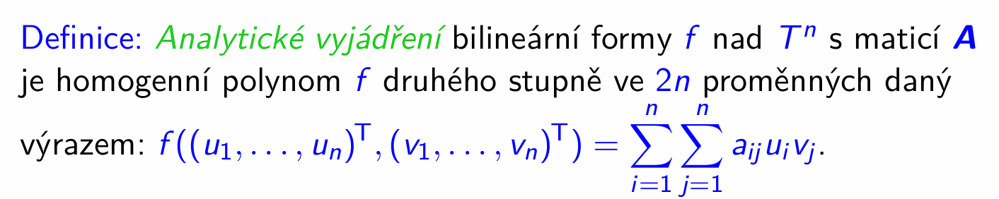
- co je **homogenní polynom**
	- polynom, který má v každém ze svých členů stejný součet (tomuto součtu, ač od různých proměnných, říkáme stejně stupeň) mocnin u proměnných - př. $x^3 + 2xy^2 + 3y^3$ je homogenní (všechny členy stupeň 3)

- $\displaystyle\sum_{i=1}^n \sum_{j=1}^n a_{ij} u_i v_j$ vzniklo z maticového součinu, že jo:
	- $\displaystyle\sum_{i=1}^n \sum_{j=1}^n u_i \cdot a_{ij} \cdot v_j$, což právě odpovídá součinu $\mathbf u^T A \mathbf v$

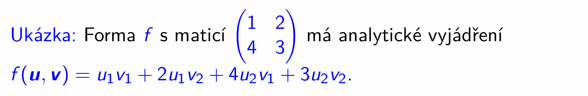
- na což jsme právě přišli pomocí

$$
\begin{pmatrix}
u_1 & u_2
\end{pmatrix}
\begin{pmatrix}
1 & 2 \\
4 & 3
\end{pmatrix}
\begin{pmatrix}
v_1 \\
v_2
\end{pmatrix}
$$

> Vidíme, že reprezentace bilineárních a kvadratických forem podstatně závisí na volbě báze. 
>
> Přiště si předvedeme, že některé báze mohou být pro tento účel vhodnější.