## Kvadratické a bilneární formy, matice forem

> Skalární součin jsme zkoumali ve vektorových prostorech na realnými i komplexními čísly, a můžeme se ptát, jestli by mělo smysl zkoumat podobné zobrazení i ve vektorových prostorech nad obecnými tělesy.

> Dnes si předvedeme, že je to možné, nadefinujeme si analogii skalárního součinu i normy, a převedeme si, jaké tato zobrazení bude mít vlastnosti.

### Bilineární forma

- linearita vůči skalárnímu násobku v 1. i ve 2. složce

- linearita vůči sčítání v 1. i ve 2. složce

**bi**lineární = lineární v 1. i ve 2. složce

#### Symetrická bilineární forma

### Kvadratická forma

Mohli bychom napsat $g(\mathbf v) := f(\mathbf v, \mathbf v)$, kde $f(\mathbf v, \mathbf v)$ je nějaká bilineární forma. Nicméně takhle se to napsalo proto, že těch forem, které odpovídají stejné kvadratické formě může být víc.

Například pro kvadratickou formu 
$g(x_1, x_2) = x_1 x_2$ na 
$\mathbb{R}^2$ můžeme vzít:

$f_1(u, v) = u_1 v_2 \implies f_1(x, x) = x_1 x_2 = g(x)$

$f_2(u, v) = u_2 v_1 \implies f_2(x, x) = x_2 x_1 = g(x)$

$f_3(u, v) = \frac{1}{2}u_1 v_2 + \frac{1}{2}u_2 v_1 \implies f_3(x, x) = x_1 x_2 = g(x)$

To „pokud existuje“ říká, že aby byla funkce 
$g$ kvadratickou formou, musí jít zkonstruovat položením 
$g(v) = f(v, v)$ z alespoň jedné bilineární formy 
$f$.

Zde je definice z Wikipedie:

### Příklady forem

### Matice forem
> Jak bilineární, tak kvadratické formy můžeme popsat pomocí matic, a to v případě, že máme vektorový prostor konečné dimenze a v něm máme dánu nějakou bázi.
> #### Matice bilineární formy
> 

#### Matice kvadratické formy
> Jedné kvadratické formě $g$ může odpovídat více bilineárních forem $f$. Proto, aby byla matice kvadratické formy **jednoznačně** dána, bereme tu matici bilineární formy, která je symetrická.

> Ne vždy musí matice kvadratické formy existovat, protože ne vždy existuje symetrická bilineární forma, jak si záhy ukážeme.

- převod mezi těmito oběma tvary (analytický tvar a matice) bude vysvětlen podrobněji později v tomto videu

> Ne vždy se nám musí podařit matici kvadratické formy najít
>
> 
- jinde než na $\mathbb{Z}_2$, tedy na tělese s charakteristikou jinou než $2$ bude vždy existovat od každé bilineární formy její symetrická verze - viz dále: 

> Záhy si ukážeme, jak z předpisu pro kvadratickou formu můžeme sestavit symetrickou matici bilineární formy, a zároveň nám to dá odpověď na otázku, kdy matice kvadratické formy neexistuje.
>
> Nejprve si všimneme, že prvky matice $A$ jsou dány nejenom bilineární formou $f$, tak, že do ní dosadíme $i$-tý a $j$-tý vektor dané báze, ale také, že ji lze spočítat přímo z kvadratické formy tímto výrazem:
>
> 

v důkazu:
- předpokládáme, že $g$ a $f$ existuje (což můžeme dokud není řeč o maticích, tak není na $f$ podmínka, aby byla symetrická => $f$ existuje vždy => $g$ existuje vždy) 
- $g$ existuje $\iff g(\mathbf v) = f(\mathbf v, \mathbf v)$ 
- linarita bilin. normy v 1. a 2. složce
- v posledním kroku máme na pravé straně $f(\mathbf b_i, \mathbf b_j) + f(\mathbf b_j, \mathbf b_i)$
	- > u kvadratické formy hledáme symetrickou matici, tzn, že hodnota formy $f$ má být stejná, ať už ty vektory dosadíme v jakémkoli pořadí
- tak tedy dostáváme $2f(\mathbf b_i, \mathbf b_j)$
- a pak obě strany rovnice vydělíme $2$
	- > nad tělesy, které mají charakteristiku $2$, dělit $2$ nelze, a proto v těchto případech nemusí vždy matice kvadratické formy existovat

		> v tělesech ostatních charakteristik má číslo $2$ vždy svůj inverzní prvek (zde $2$ bereme tak, že sečteme dvakrát neutrální prvek vzhledem k násobení)
		>
		> **proto v tělesech, které nemají charakteristiku 2, je vždy matice kvadratické formy dána jednoznačně** (a tedy definována, že)

#### Co si z toho odnést

Vždy, kdy v tělese existuje číslo $2$, můžeme vytvořit matici symetrické bilineární formy.
- a z té pak - viz (forward ref) analytické vyjádření - vytvořit polynom ("funkční předpis")

- že jo nějaká kvadratická forma k bilineární formě existuje vždy (není zde žádný požadavek na symetrii, jedné kvadratické formě může odpovídat víc bilineárních forem)
- a pak pomocí vzorce $a_{ij} = \frac 1 2 (g(\mathbf b_i + \mathbf b_j) - g(\mathbf b_i) - g(\mathbf b_j))$ si vytvořit symetrickou matici bilineární formy
	- a kdybychom chtěli polynom téhle bilin. formy, tak spočteme analytické vyjádření

Takže vlastně takhle trochu oklikou umíme "symetrizovat" bilineární formu.
- a z ní pak sestrojit i matici kvadratické formy ( protože že jo symetrická matice bilineární formy a matice kvadratické formy se liší jenom vstupy - jestli tam pošleme 2 stejné vektory nebo různé)

Proto se matice kvadratické formy definuje tak, že je to "ta symetrická", protože prakticky vždy jde sestrojit, a neztratíme tím žádné možnosti.

(kromě toho edge case, kdy bychom něměli číslo 2, viz $\mathbb{Z}_2$ - pak bychom se asi museli smířit s tím co máme, a netrvat na symetrii - stejně by symetrická a nesymetrická verze téže formy po dosazení vstupních vektorů měla dát stejné číslo)

##### Proč teda chceme symetrii

Spousta nástrojů v lineární algebře pracuje s symetrickými maticemi.
____

> Máme-li ať už bilineární nebo kvadratickou formu popsánu pomocí její matice, můžeme hodnotu této formy vyhodnotit pomocí maticového součinu.
>
> 

Důkaz:

$[\mathbf u]_B = (c_1, \dots, c_n)$

$[\mathbf v]_B = (d_1, \dots, d_n)$

- vyjádříme ty vektory pomocí lineární kombinace vektorů báze $B$
- ty koeficienty odpovídají prvkům vektorů souřadnic (viz definice vektoru souřadnic)
	- $[\mathbf u]_B = (c_1, \dots, c_n)$
	- $[\mathbf v]_B = (d_1, \dots, d_n)$

- dosadíme, díky linearitě vytkneme (to s dvojitou sumou funguje stejně jako u skal. součinu - kde jsem to rozebíral podrobněji - akorát tady už nemáme žádné komplexní sdružení)
- odpovídá to $[\mathbf u]_B^T A [\mathbf v]_B$, protože
	- $[\mathbf u]_B = (c_1, \dots, c_n)$
	- $[\mathbf v]_B = (d_1, \dots, d_n)$
	- $a_{ij} = f(\mathbf b_i, \mathbf b_j)$

### Jak se mění matice formy, když měníme bázi

- pozor na tu transpozici
	- kde vznikne vidět z důkazu:

### Analytické vyjádření bilineární formy
> Ať už bilineární nebo kvadratické formy bývají často popisovýny pomocí polynomům tak, jak jsme je používali v našich ukázkách.
>
> Tyto popisy si zaslouží vlastní název:
>
> 
- co je **homogenní polynom**
	- polynom, který má v každém ze svých členů stejný součet (tomuto součtu, ač od různých proměnných, říkáme stejně stupeň) mocnin u proměnných - př. $x^3 + 2xy^2 + 3y^3$ je homogenní (všechny členy stupeň 3)

- $\displaystyle\sum_{i=1}^n \sum_{j=1}^n a_{ij} u_i v_j$ vzniklo z maticového součinu, že jo:
	- $\displaystyle\sum_{i=1}^n \sum_{j=1}^n u_i \cdot a_{ij} \cdot v_j$, což právě odpovídá součinu $\mathbf u^T A \mathbf v$

- na což jsme právě přišli pomocí

$$
\begin{pmatrix}
u_1 & u_2
\end{pmatrix}
\begin{pmatrix}
1 & 2 \\
4 & 3
\end{pmatrix}
\begin{pmatrix}
v_1 \\
v_2
\end{pmatrix}
$$

> Vidíme, že reprezentace bilineárních a kvadratických forem podstatně závisí na volbě báze. 
>
> Přiště si předvedeme, že některé báze mohou být pro tento účel vhodnější.

## Diagonalizace matic forem, zákon setrvačnosti

> V dnešní lekci si předvedeme, jakmile lze v tělese dělit dvěma, lze také diagonalizovat matice forem. 
>
> Půjde o jinou diagonalizaci než je diagonalizace matic lineárních zobrazení. Přesto však důkaz bude velice podobný diagonalizaci hermitovských matic.

### Kvadratické formy nad tělesy charakteristiky 2
> U těles charakteristiky 2 je jednoduché najít diagonální matici kvadratické formy. Protože buďto vůbec neexistuje, jako např. u formy $g(\mathbf v) = v_1 v_2$. 
>
> A nebo v případě, že nějaká symetrická matic dané kvadratické formy existuje, potom zjistíme, že pokud počítáme analytické vyjádření této formy, tak se všechny smíšené členy navzájem odečtou:
>
> 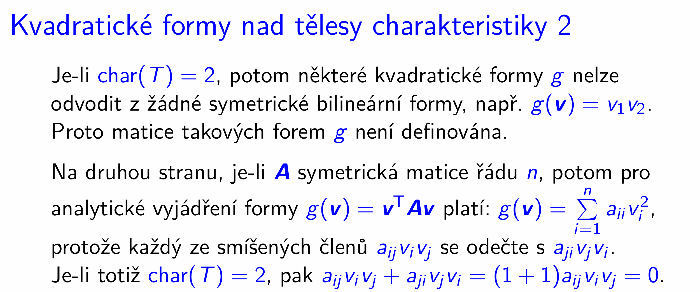

př. pro 2 složkové vektory $\mathbf u = (u_1, u_2)^T$ a $\mathbf v = (v_1, v_2)^T$ by bilineární forma nad $\mathbb{Z}_2$ (její analytické vyjádření) vypadala obecně takto:

$f(\mathbf u, \mathbf v) = a u_1 v_1 + b u_1 v_2 + c u_2 v_1 + d u_2 v_2$

Pro symetrickou bilin. formu platí platí, že $b = c \land u_1 v_2 = u_2 v_1$

$f(\mathbf u, \mathbf v) = a u_1 v_1 + b(u_1 v_2 + u_2 v_1) + d u_2 v_2$

$u_1 v_2 + u_2 v_1 = 2 u_1 v_2 = 0 u_1 v_2$

a $g(\mathbf v) = f(\mathbf v, \mathbf v)$ že jo

**Ukázka symetrické matice nad tělesem s char. 2**
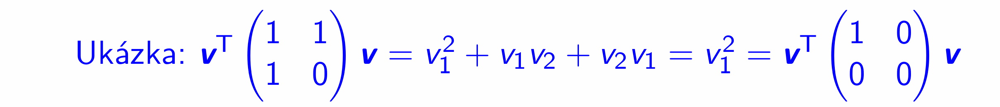
- jelikož analytické vyjádření rovno $\sum_{i=1}^n a_{ii}  v^2_i$, zde $v_1^2$, tak i matice napravo má stejné analytické vyjádření, a je diagonální

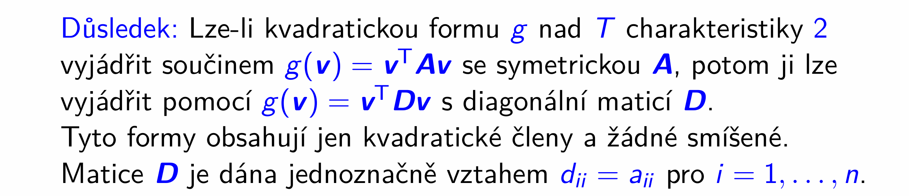

> U ostatních těles dá diagonalizace forem trochu více práce.
### Diagonalizace matic forem nad ostatními tělesy
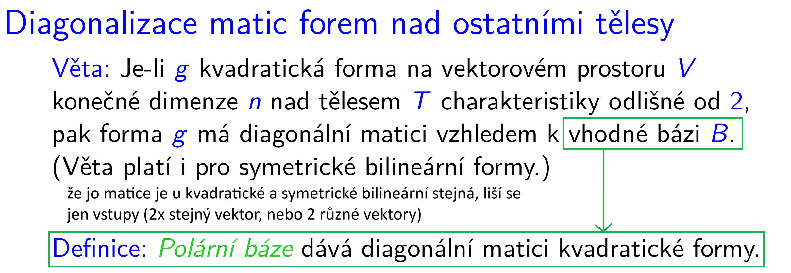
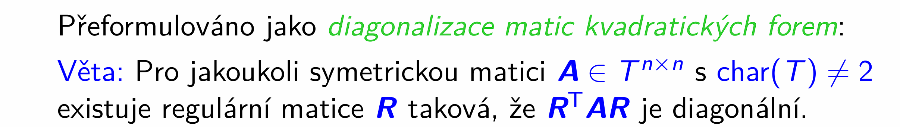
- $R$ je matice přechodu od nové báze k původní bázi, $[id]_{B, E}$
- $R^T A R$ je diagonální matice, vyjádření téže formy vůči nové polární bázi

- že jo viz:
	- 
	- 

- matice $R^T$ tak není matice přechodu v tradičním smyslu, protože je to $[id]_{B,E}^T$
	- nepřevádí tak nikam vektory v sloupcích, ale v řádcích
	- že jo na rozdíl od lineárních zobrazení, kdy vpravo od matice lin. zobrazení byl vstup, a vlevo od ní byl výstup, máme zde matici formy, kde vpravo je vstup, i vlevo je vstup, a výstup je vyhodnocení výrazu, tedy číslo.
		- btw that means we can't really "pipe" it za sebou, jak jsme to dělali u lin. zobrazení
	- takže jako důsledek, matice $R^T$ slouží na převod **levého** (který je řádkový, a vlevo od $R^T$, proto ta transpozice) vstupního vektoru z nové polární báze do původní báze

- na tohle jednou Fiala udělal forward ref v prezentaci `412-podobnost.pdf` (Podobné matice, diagonalizace):

	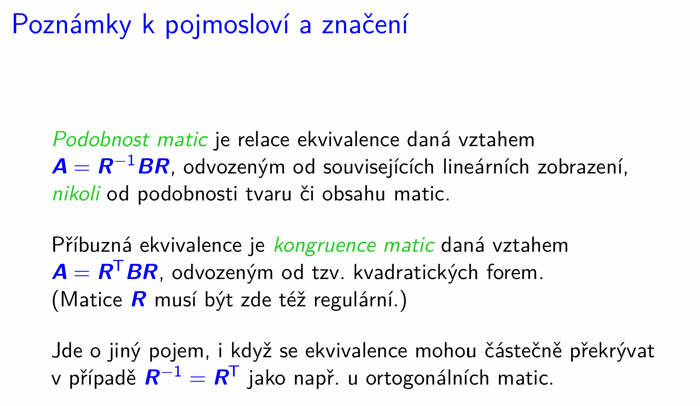

	- takže tomuhle našemu vztahu $D = R^T A R$, kde $A$ je matice formy, a $D$ je diagonální matice (=matice té formy vyjádřená k polární bázi) dá říkat kongruence matic

		- Dvě čtvercové matice $A, D \in T^{n \times n}$ jsou **kongruentní**, pokud existuje regulární matice $R$ taková, že $D = R^T A R$.

		- Zatímco relace **podobnosti** ($D = R^{-1} A R$) odpovídá hledání báze, kde je **matice lineárního zobrazení $A$ diagonální**
		-  Tak relace **kongruence** ($D = R^T A R$) odpovídá hledání polární báze, kde je **matice kvadratické (či symetrické bilineární) formy $A$ diagonální.**

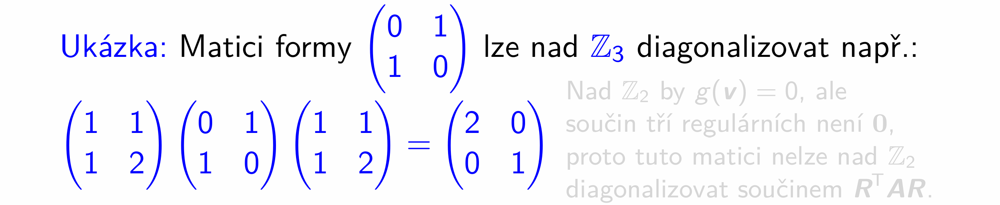

> Ještě si všimneme, že u realných matic věta platí již díky diagonalizaci symetrických matic lineárních zobrazení pomocí ortogonálních matic
>
> 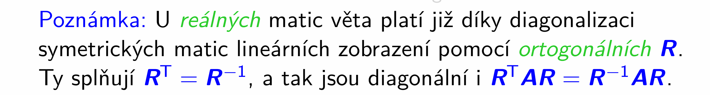

- pokud teda na chvilku $A$ = matici formy (že jo navržena na 2 vstupy, proto $R^TAR$) na chvilku "dezinterpetujeme" jako matici lineárního zobrazení (že jo navržena na 1 vstup, proto $R^{-1}AR$)

Pro obecné tělesa to, že tu kongruenci = diagonalizaci matice formy jde udělat,  budeme ještě dokazovat:

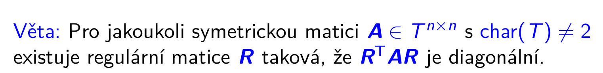
#### Důkaz:

Nejdřív uvedu hlavní myšlenku, pak na obrázcích podrobněji.

Indukcí, s tím, že indukční předpoklad vyslovíme pro $n-1$.

Aby se nám matice nepletly, tak ke každé připíšeme její řád do dolního indexu.

**Indukční předpoklad:** Pro jakoukoli symetrickou matici $A_{n-1} \in T^{(n -1) \times (n-1)}$ s $\text{char } T \neq 2$ existuje regulární matice $R_{n-1}$ taková, že $R_{n-1}^T A_{n-1} R_{n-1}$ je diagonální.

**Indukční krok**: Chceme s využitím indukčního předpokladu dokázat, že věta platí pro řád $n$, tedy že platí: Pro libovolnou symetrickou $A_n \in T^{n \times n}$, $\text{char } T \neq 2$ existuje regulární $R_n$ taková, že $R_n^T A_n R_n$ je diagonální.

Pro to potřebujeme nějak vyrobit
- $R_n$ tak, aby byla regulární a diagonální
- $A_n$, tak aby byla diagonální

Aby ten součin $R_n^T A_n R_n$ vyšel diagonální.

V průběhu ukážeme, že umíme vyjádřit výraz obsahující $A_n$ pomocí výrazu, který obsahuje $A_{n-1}$,

konkrétně půjde o ${\color{blue}P_n^T A_n P_n} = \def\arraystretch{1.2}\begin{array}{|c|c|}
\hline
\color{red}{a_{11}} & \color{blue}{\mathbf{0}^{\mathsf{T}}} \\
\hline
\color{blue}{\mathbf{0}} & \color{blue}{\mathbf{A}_{n-1}} \\
\hline
\end{array}$

Bez těch $P_n^T$ a $P_n$ to neumíme, to jsou matice elementárních úprav.

To nám vynucuje volbu regulární matice $R_n$

Která právě proto bude $R_n = P_n \cdot  \def\arraystretch{1.2}\begin{array}{|c|c|}
\hline
 1 & {\mathbf{0}^{\mathsf{T}}} \\
\hline
{\mathbf{0}} & {\mathbf{R}_{n-1}} \\
\hline
\end{array}$

Protože pak totiž po dosazení a transponování

$$R_n^T A_n R_n = \left(P_n \cdot  \def\arraystretch{1.2}\begin{array}{|c|c|}
\hline
 1 & {\mathbf{0}^{\mathsf{T}}} \\
\hline
{\mathbf{0}} & {\mathbf{R}_{n-1}} \\
\hline
\end{array} \ \right)^T \cdot A_n \cdot \left( P_n \cdot  \begin{array}{|c|c|}
\hline
 1 & {\mathbf{0}^{\mathsf{T}}} \\
\hline
{\mathbf{0}} & {\mathbf{R}_{n-1}} \\
\hline
\end{array} \ \right)$$

$$= \begin{array}{|c|c|}
\hline
 1 & {\mathbf{0}^{\mathsf{T}}} \\
\hline
{\mathbf{0}} & \mathbf{R}_{n-1}^T \\
\hline
\end{array} \cdot P_n^T A_n P_n \cdot\begin{array}{|c|c|}
\hline
 1 & {\mathbf{0}^{\mathsf{T}}} \\
\hline
{\mathbf{0}} & {\mathbf{R}_{n-1}} \\
\hline
\end{array}$$

dostáváme uprostřed $P_n^T A_n P_n$, což můžeme nahradit kýženým výrazem, který obsahuje $A_{n-1}$. Celý součin je tak výrazem, který obsahuje všechny tři matice z indukčního předpokladu:

$$= \begin{array}{|c|c|}
\hline
 1 & {\mathbf{0}^{\mathsf{T}}} \\
\hline
{\mathbf{0}} & \mathbf{R}_{n-1}^T \\
\hline
\end{array} \cdot {
\begin{array}{|c|c|}
\hline
\color{red}{a_{11}} & \color{blue}{\mathbf{0}^{\mathsf{T}}} \\
\hline
\color{blue}{\mathbf{0}} & \color{blue}{\mathbf{A}_{n-1}} \\
\hline
\end{array}
} \cdot\begin{array}{|c|c|}
\hline
 1 & {\mathbf{0}^{\mathsf{T}}} \\
\hline
{\mathbf{0}} & {\mathbf{R}_{n-1}} \\
\hline
\end{array}$$

Teď vyhodnotíme blokový součin, a dostaneme:

$${
\def\arraystretch{1.2}
\begin{array}{|c|c|}
\hline
\color{red}{a_{11}} & \color{blue}{\mathbf{0}^{\mathsf{T}}} \\
\hline
\color{blue}{\mathbf{0}} & \color{blue}{\mathbf{R}_{n-1}^T \mathbf{A}_{n-1}} \mathbf{R}_{n-1}\\
\hline
\end{array}
}$$

To je zajímavé proto, že můžeme snadno dokázat, že tento výraz je diagonální:
- $\mathbf{R}_{n-1}^T \mathbf{A}_{n-1} \mathbf{R}_{n-1}$ je diagonální z indukčního předpokladu
	- ten blok je umístěn tak, že je diagonální i celá bloková matice, protože zbytek 1. sloupce a zbytek 1. řádku tvoří nuly

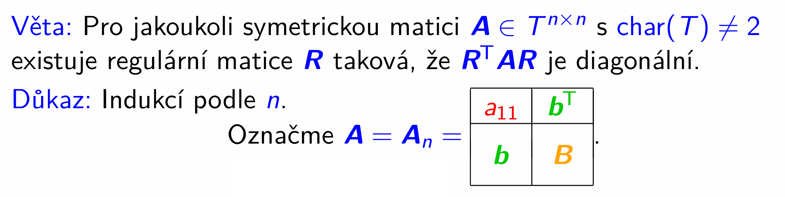

> Pokud je prvek v levém horním rohu $\neq 0$, můžeme s jeho pomocí řádkovými úpravami zeliminovat zbytek 1. sloupce (matice řádkových úprav $P_n^T$), a potom stejnými sloupcovými úpravami zeliminovat zbytek 1. řádku (matice sloupcových úprav $P_n$).
>
> 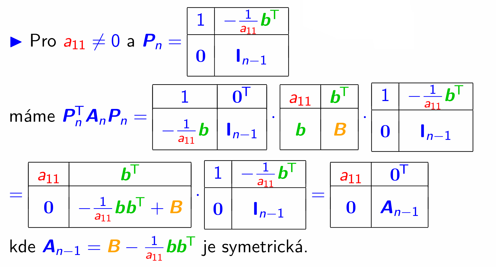

- matice, kterou si označíme $A_{n-1}$ je symetrická protože je rozdílem 2 symetrických matic:
	- $B$ je symetrická - jako podmatice symetrické $A_n$
	- Výraz $\mathbf{b}\mathbf{b}^T$ (vnější součin) je vždy symetrická matice
		- $(\mathbf{b}\mathbf{b}^T)^T = (\mathbf{b}^T)^T \mathbf{b}^T = \mathbf{b}\mathbf{b}^T$

A na symetrickou matici řádu $n-1$ už můžeme aplikovat indukční předpoklad.

> Dle indukčního přepokladu pro symetrickou matici  $A_{n-1}$ věta platí, tj. bude pro ni existovat regulární matice $R_{n-1}$. Tu doplníme na matici řádu $n$:
>
> 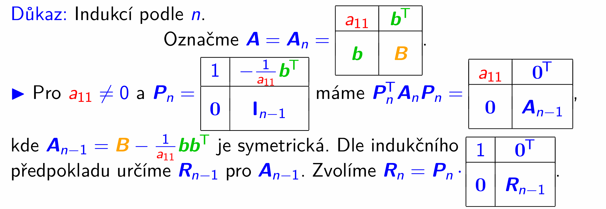

- proč $R_n$ určujeme zrovna takto jsem popsal výše v úvodu

Tato $R_n$ je regulární, protože je součinem regulárních matic:
- $P_n$ je regulární (že jo $1$ na celé diagonále)
- $\def\arraystretch{1.2}\begin{array}{|c|c|}
\hline
 1 & {\mathbf{0}^{\mathsf{T}}} \\
\hline
{\mathbf{0}} & {\mathbf{R}_{n-1}} \\
\hline
\end{array}$ je regulární (z indukčního předpokladu, protože $R_{n-1}$ je regulární)

> Lze ověřit, že součin $R_n^T A_n R_n$ nám dává diagonální matici
>
> 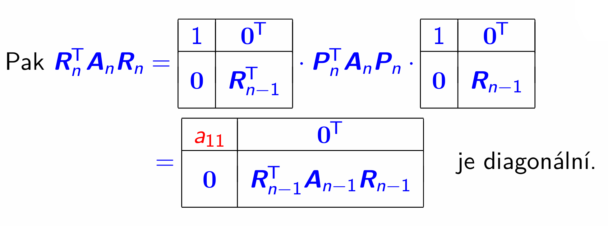

- protože  $R^T_{n-1}A_{n-1}R_{n-1}$ je diagonální z indukčního předpokladu

##### Ukázka použití věty k diagonalizaci matici 3x3 pomocí algoritmu z důkazu

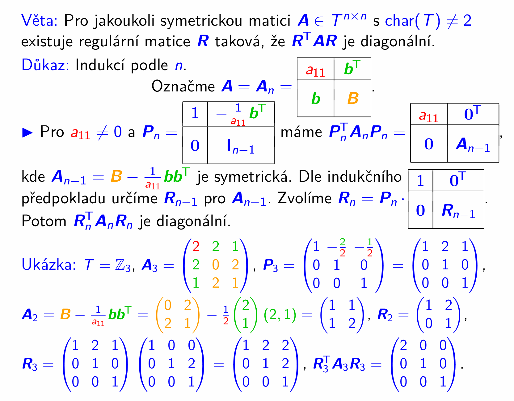

> Zbývá ošetřit případy kdy $a_{11} = 0$. 

(Kdy tedy musíme matici nějak upravit, abychom se dostali k nenulovému $a_{11}$, abychom mohli použit ten důkaz.)

> Nejprve se zaměříme na situaci, kdy $a_{11} = 0$ a vektor $\mathbf b$ je nenulový
>
> 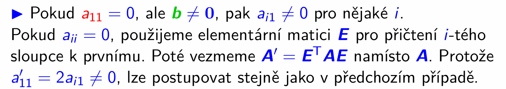

Zde přidám obrázek z videa (v prezentaci už nebyl), který to dobře ilustruje:

> 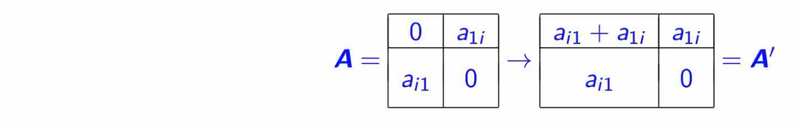
> k 1. řádku přičteme $i$-tý, a k 1. sloupci přičteme $i$-tý (což právě je to $E^T A E$)

- **můj podrobnější obrázek - s bloky co se změní** (na předchozím obrázku to není jenom nakresleno - výsledek bude symetrická matice), takto:

	$A = \begin{pmatrix} 
0 & a_{1i} & \mathbf{c}^T \\ \hline 
a_{i1} & a_{ii} & \mathbf{d}^T \\ \hline 
\mathbf{c} & \mathbf{d} & C 
\end{pmatrix}$

	$A' = \begin{pmatrix} 
a_{i1} + (a_{1i} + a_{ii}) & a_{1i} + a_{ii} & \mathbf{c}^T + \mathbf{d}^T \\ \hline 
a_{i1} + a_{ii} & a_{ii} & \mathbf{d}^T \\ \hline 
\mathbf{c} + \mathbf{d} & \mathbf{d} & C 
\end{pmatrix}$

	- $a_{ii} = 0$ 
	- $a_{i1} + a_{1i}= 2a_{i1}$, protože matice symetrická

Konkrétně ty součiny

Matici $A$ řádu $n$ rozdělíme na bloky odpovídající 1. složce, 
$i$-té složce a zbývajícím $n-2$ složkám:

$$A = \begin{pmatrix} 
0 & a_{1i} & \mathbf{c}^T \\ \hline 
a_{i1} & a_{ii} & \mathbf{d}^T \\ \hline 
\mathbf{c} & \mathbf{d} & C 
\end{pmatrix}$$
Matice $E$, která odpovídá přičtení $i$-tého sloupce k 1. sloupci, a její transpozice $E^T$ mají blokový tvar:

$$E = \begin{pmatrix} 
1 & 0 & \mathbf{0}^T \\ \hline 
1 & 1 & \mathbf{0}^T \\ \hline 
\mathbf{0} & \mathbf{0} & I_{n-2} 
\end{pmatrix}, \qquad 
E^T = \begin{pmatrix} 
1 & 1 & \mathbf{0}^T \\ \hline 
0 & 1 & \mathbf{0}^T \\ \hline 
\mathbf{0} & \mathbf{0} & I_{n-2} 
\end{pmatrix}$$

**1. Krok: Řádková úprava $E^T A$ (přičtení $i$-tého řádku k 1. řádku)**

$E^T A = \begin{pmatrix} 
1 & 1 & \mathbf{0}^T \\ \hline aA
0 & 1 & \mathbf{0}^T \\ \hline 
\mathbf{0} & \mathbf{0} & I_{n-2} 
\end{pmatrix} 
\begin{pmatrix} 
0 & a_{1i} & \mathbf{c}^T \\ \hline 
a_{i1} & a_{ii} & \mathbf{d}^T \\ \hline 
\mathbf{c} & \mathbf{d} & C 
\end{pmatrix} 
= \begin{pmatrix} 
a_{i1} & a_{1i} + a_{ii} & \mathbf{c}^T + \mathbf{d}^T \\ \hline 
a_{i1} & a_{ii} & \mathbf{d}^T \\ \hline 
\mathbf{c} & \mathbf{d} & C 
\end{pmatrix}$

**2. Krok: Sloupcová úprava $(E^T A) E$ (přičtení $i$-tého sloupce k 1. sloupci)**

$$A' = (E^T A) E = \begin{pmatrix} 
a_{i1} & a_{1i} + a_{ii} & \mathbf{c}^T + \mathbf{d}^T \\ \hline 
a_{i1} & a_{ii} & \mathbf{d}^T \\ \hline 
\mathbf{c} & \mathbf{d} & C 
\end{pmatrix} 
\begin{pmatrix} 
1 & 0 & \mathbf{0}^T \\ \hline 
1 & 1 & \mathbf{0}^T \\ \hline 
\mathbf{0} & \mathbf{0} & I_{n-2} 
\end{pmatrix}$$

$$A' = \begin{pmatrix} 
a_{i1} + (a_{1i} + a_{ii}) & a_{1i} + a_{ii} & \mathbf{c}^T + \mathbf{d}^T \\ \hline 
a_{i1} + a_{ii} & a_{ii} & \mathbf{d}^T \\ \hline 
\mathbf{c} + \mathbf{d} & \mathbf{d} & C 
\end{pmatrix}$$

> Dostáváme symetrickou matici, která má v levém horním rohu nenulové číslo, a můžeme ji tedy upravit stejným způsobem jako v předchozím případě, kdy $a_{ii} \neq 0$

> Pokud by $a_{11} = 0$ a  $a_{ii} \neq 0$, protom je situace o trochu jednodušší, protože stačí pouze prohodit 1. řádek s $i$-tým a také 1. slopec s $i$-tým.
>
> 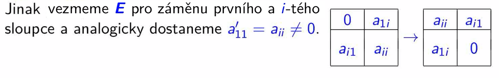
- což bude jiná matice $E$, protože tamto bylo přičtení, a zde máme jenom prohození.

$A = \begin{pmatrix} 
0 & a_{1i} & \mathbf{c}^T \\ \hline 
a_{i1} & a_{ii} & \mathbf{d}^T \\ \hline 
\mathbf{c} & \mathbf{d} & C 
\end{pmatrix}$

$E = E^T = \begin{pmatrix} 
0 & 1 & \mathbf{0}^T \\ \hline 
1 & 0 & \mathbf{0}^T \\ \hline 
\mathbf{0} & \mathbf{0} & I_{n-2} 
\end{pmatrix}$

$E^T A = \begin{pmatrix} 
0 & 1 & \mathbf{0}^T \\ \hline 
1 & 0 & \mathbf{0}^T \\ \hline 
\mathbf{0} & \mathbf{0} & I_{n-2} 
\end{pmatrix} 
\begin{pmatrix} 
0 & a_{1i} & \mathbf{c}^T \\ \hline 
a_{i1} & a_{ii} & \mathbf{d}^T \\ \hline 
\mathbf{c} & \mathbf{d} & C 
\end{pmatrix} 
= \begin{pmatrix} 
a_{i1} & a_{ii} & \mathbf{d}^T \\ \hline 
0 & a_{1i} & \mathbf{c}^T \\ \hline 
\mathbf{c} & \mathbf{d} & C 
\end{pmatrix}$

$$A' = (E^T A) E = \begin{pmatrix} 
a_{i1} & a_{ii} & \mathbf{d}^T \\ \hline 
0 & a_{1i} & \mathbf{c}^T \\ \hline 
\mathbf{c} & \mathbf{d} & C 
\end{pmatrix} 
\begin{pmatrix} 
0 & 1 & \mathbf{0}^T \\ \hline 
1 & 0 & \mathbf{0}^T \\ \hline 
\mathbf{0} & \mathbf{0} & I_{n-2} 
\end{pmatrix}$$

$$A' = \begin{pmatrix} 
a_{ii} & a_{i1} & \mathbf{d}^T \\ \hline 
a_{1i} & 0 & \mathbf{c}^T \\ \hline 
\mathbf{d} & \mathbf{c} & C 
\end{pmatrix}$$