# 2. Polynomy

## Polynomy, Vandermondova matice, Lagrangeova interpolace (23:39, 73M)

https://kam.mff.cuni.cz/~fiala/LA2/212-polynomy.pdf

> V této lekci bych vám rád připomněl pojem polynomu, jmenovitě polynomu v jedné proměnné nad obecným tělesem $T$.

> Zopakujme si, jaké operace můžeme s polynomy provádět, jaké mohou mít reprezentace, a jak lze mezi těmito reprezentacemi přecházet.

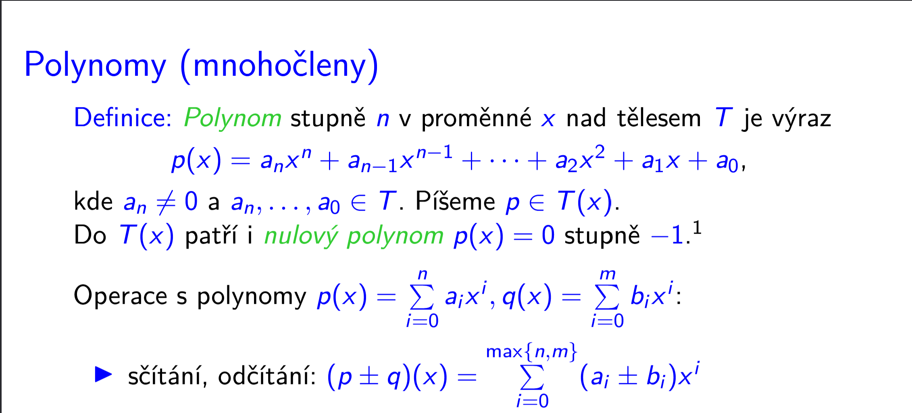
na IndexErrory se tady nehraje, neexistující prvky se doplní nulami, proto $\max\set{n,m}$ ok

Proč součin takhle funguje, ukázka:

$$(a_3x^3 + a_2x^2 + a_1x^1 + a_0) \cdot(b_3x^3 + b_2x^2 + b_1x^1 + b_0)$$

Jak získáme ve výsledku př. člen s koeficientem $x^3$?

Jde to víc způsoby (obyčejné roznásobení ze střední): 

$$a_3x^3 \cdot b_0 + a_2 x^2 \cdot b_1 x^1 + a_1 x^1 \cdot b_2 x^2 + a_0 \cdot b_3 x^3$$

Pak vytkneme ty koeficienty, a budeme mít $1$ člen $x^3$:

$$(a_3 b_0 + a_2 b_1 + a_1 b_2 + a_0 b_3)x^3$$

A to v závorce přesně delá to $c_i = \sum_{j=0}^i a_j b_{i-j}$

Vždycky číslo $i$ v $a_i$ a $b_i$ odpovídá mocnině u $x$, a jak můžeme složit $x^3$? => všechny možné součty, tj $3+0$, $2+1$, $1+2$, $0+3$, což nám to $a_j b_{i-j}$ přesně prokrokuje = protože u členu $a_j$ bude odpovídající $x^j$ a u členu $b_{i-j}$ bude odpovídající $x^{i-j}$, a $x^j \cdot x^{i-j} = x^{j + i - j} = x^i$
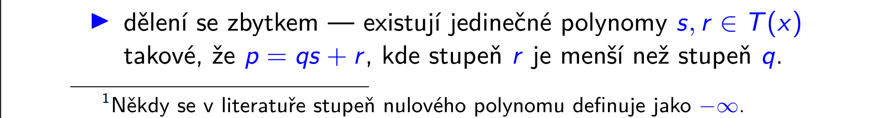
- $p$ = polynom, který chceme dělit
- $q$ = dělitel
- $s$ = podíl
- $r$ = zbytek
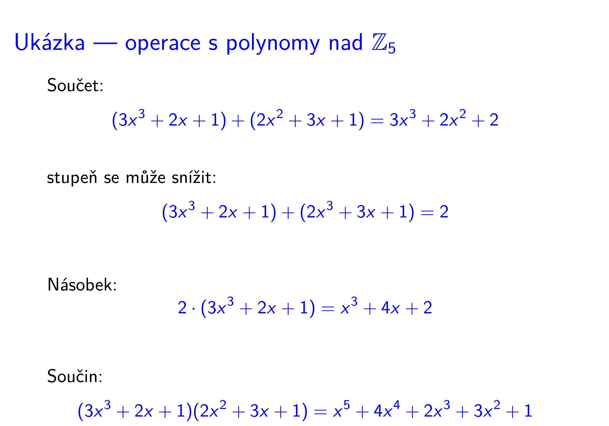
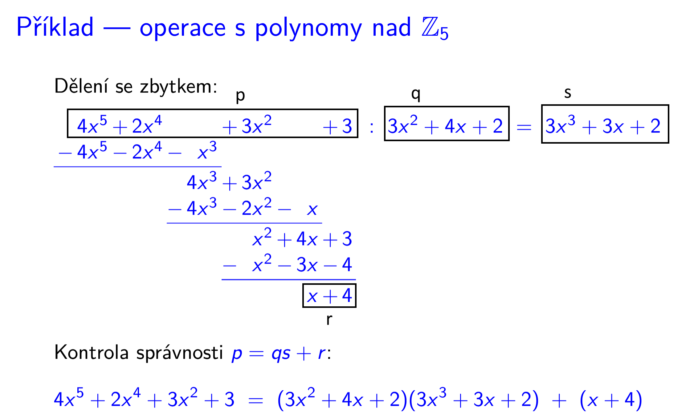

### Malá Fermatova věta (=připomenutí z LA1)

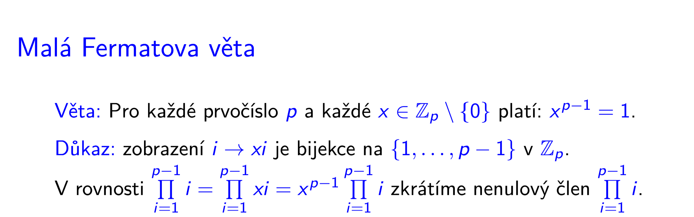

- v [LA1](https://kam.mff.cuni.cz/~fiala/LA1/441-telesa.pdf) to zobrazení označoval $f_a: \set{1, \dots, p-1} \to \set{1, \dots, p-1}$ t.ž. $f_a(x) = (ax)\mod p$ (slide "Tělesa z modulární aritmetiky", pak to zobrazení použil i u důkazu Malé Fermatovy věty o pár slidů později)
	- ještě proč je to bijekce: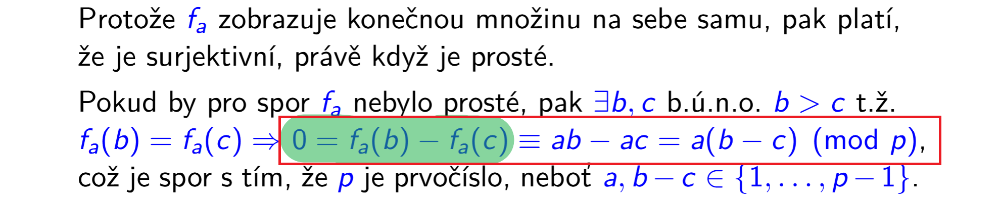
		- dokážeme $f_a$ je prostá
			- použijeme vlastnost $f_a$ je prostá $\implies$ $f_a$ je surjektivní
				- dále $f_a$ je prostá $\land$ $f_a$ je surjektivní $\implies$ $f_a$ je bijektivní

		**<u>Důkaz $f_a$ je prostá</u>**
		1. Definice prosté funkce:
		$$\forall b, c \in M: (b \neq c \implies f_a(b) \neq f_a(c))$$
		2. Důkaz sporem = tu definici, která je naším výrokem, negujeme. V téhle podobě je to pak definice "$f_a$ není prosté".
		$$\exists b, c \in M: (b \neq c \land f_a(b) = f_a(c))$$
		3. Takže máme:
		$$f_a \text{ není prosté} \iff \exists b, c \in M: (b \neq c \land f_a(b) = f_a(c))$$
		
		Opřeme se o to $f_a \text{ není prosté}$, z čehož vyplývá, že
		$b \neq  c$, a tedy př. $b > c$, a zároveň $f_a(b) = f_a(c)$

		4. $f_a(b) = f_a(c)$ můžeme rozepsat jako $f_a(b) - f_a(c) = 0$ (v obrázku zvýrazněno zeleně), pak (červený rámeček) rozepíšeme $f_a$ podle definice jako $(ax)\mod p$, akorát že tu $\mod p$ část schováme tím, že tam místo $=$ napíšeme $\equiv$ a napíšeme ji za celý výraz, z estetických důvodů až zcela napravo. Myšleno je to určitě tak, že se vztahuje k tomu $\equiv$ a ne k obyč. $=$. 

		5. Dostali jsme $0 = a(b-c)$, což nejde, protože jsme v $\mathbb{Z}_p$, kde $p$ je prvočíslo, tedy z nenulových členů jsme $0$ získat nemohli, a při tom nenulové určitě jsou. 
			- $a > 0$ z definice $f_a$
			- $b-c > 0$ protože $b > c$, což vyplynulo v 3. kroku důkazu
		6. Tzn. $0 = a(b-c)$ je spor
		7. Tedy neplatí "$f_a$ není prosté", tedy $f_a$ je prosté.

[Pokračování důkazu z LA1](https://kam.mff.cuni.cz/~fiala/LA1/441-telesa.pdf)
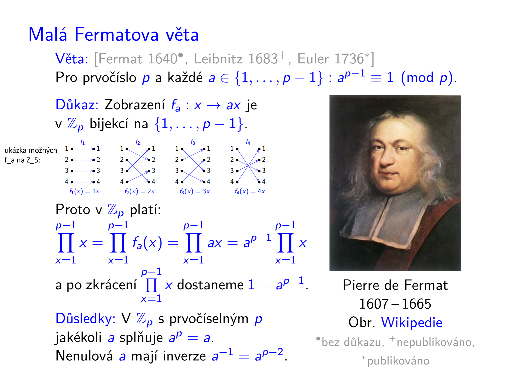
- před tím jsme dokázali, že $f_a$ je bijekce, teď díky tomu 
$$\prod_{x=1}^{p-1}x = \prod_{x=1}^{p-1} f_a(x)$$
protože $f_a(x)$ těmi členy součinu jenom zamíchá, ale každý z nich tam právě jednou bude, a součin je komutativní.

- zbytek důkazu pak budou algebraické úpravy
	1. dosadíme $f_a(x) = ax$
	2. dáme $a$ před produkt
	3. vydělíme rovnici $$\prod_{x=1}^{p-1}x = a^{p-1} \prod_{x=1}^{p-1}x$$ tím $\displaystyle\prod_{x=1}^{p-1}x$

Zpátky k LA2:

$x^{p-1} = 1 \implies x^{p-1}x^1 = 1x \implies x^p = x$ 

To má zajímavý důsledek pro polynomy nad $\mathbb{Z}_p$:

= pro každý polynom $q$ s koeficienty z tělesa $\mathbb{Z}_p$ libovolného stupně existuje polynom $r$ jehož stupeň je ovšem nejvýše $p-1$ takový, že oba dva polynomy, jak $q$, tak $r$, pokud jsou vyhodnoceny na prvcích tělesa $\mathbb{Z}_p$ dávají stejné hodnoty.

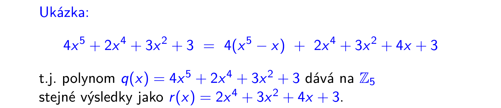
Původní polynom $q$ lze totiž vydělit $x^p - x$, což je v $\mathbb{Z}_5$ $x^5 -x$, a hledaný polynom $r$ je zbytek po tomto dělení.

To můžeme označit jako předtím u příkladu s dělením:
- $p$ = polynom, který chceme dělit
- $q$ = dělitel
- $s$ = podíl
- $r$ = zbytek
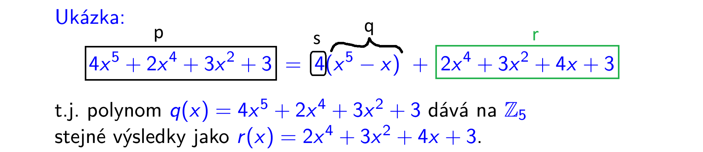

Jenom teda zajímavá otázka, proč nejdřív dělíme něčím co je $0$, a nevadí nám to, a pak v dalším kroku použijeme, že $x^5 -x$ je $0$

**Alternativní postup nalezení toho $r$**
(ze cvičení)

Můžeme použít Malou Fermatovu větu, ale trochu jinak. 
Ta nám říká $\forall x \in \mathbb{Z}_p: x^p - x = 0$

Tj. v $\mathbb{Z}_5$ platí $\forall x \in \mathbb{Z}_5: x^5 = x$

Tj.	 do toho původního polynomu za $x^5$ dosadíme $x$.

další ukázka nad $\mathbb{Z}_5$:

$$p(x) = x^6 + x^5 + x ^3 + 4x^2 + 1$$
$$x^6 = x \cdot x^5 = x \cdot x = x^2$$
$$r(x) = x^2 + x + x^3 + 4x^2 + 1 = x^3 +5x^2 + x + 1 = x^3 + x + 1$$

> U polynomů nás bude zajímat, které prvky tělesa mají tu vlastnost, že dosazením do plynomu získáme nulový prvek tělesa. Tyto prvky nazveme kořeny.

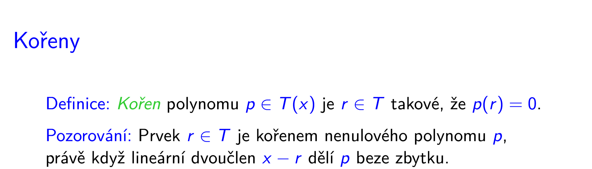
př. polynom $p(x)$ dělím $(x-x_r)$, kde $x_r$ = kořen toho polynomu, prostě nějaké číslo.

$\underbrace{p(x)}_{\text{dělenec}} = \underbrace{q(x)}_{\text{podíl}} \cdot \underbrace{(x - x_r)}_{\text{dělitel}} + \underbrace{c}_{\text{zbytek}}$

$x_r$ je kořen $p(x)$, tj. když do $p(x)$ dosadím $x_r$, dostanu $0$

Protože $p(x) = q(x)(x - x_r) + c$, musí platit $0$ i po dosazení do pravé strany, tj. $0 = q(x_r)(x_r - x_r) + c \implies c = 0$

Nulový zbytek $c$ znamená, že $x-x_r$ dělí $p$ beze zbytku.

Vlastně na tohle pozorování jsme intuitivně zvyklí:

př. $2$ je kořenem $x^2 - 2x$, protože můžeme udělat $(x-2)x$ a pak to vydělit $x-2$

To vlastně vysvětluje co říká na videu:

> Kdyby tento lineární dvoučlen polynom beze zbytku nědelil, pak by nenulový zbytek byl také hodnotou, kterou dostaneme, když $r$ dosadíme do polynomu.

> Existence kořenu je tedy podstatná proto, aby bylo možné polynom rozložit na jednodušší členy. 

> Víme, že pr. v $\reals$ toto nemusí být vždy možné. Polynom $x^2 + 1$ nelze rozložit na jednodušší členy, protože tento polynom nemá žádné realné kořeny.

> Na druhou stranu jsou tělesa, v nichž vždy každý polynom má alespoň $1$ kořen. Př. těleso komplexních čísel = $\mathbb{C}$.

> Základní větu algebry si dokazovat nebudeme, ale naznačíme na ukázce, proč by nějaký takový poznatek měl vlastně platit.
[Animace z videa](https://kam.mff.cuni.cz/~fiala/LA2/koreny.gif)

> Zpátky k naší prezentaci. Ze základní věty algebry vyplývá:

Jednoduše opakovaně aplikujeme pozorování:
1. Každý polynom $p \in \mathbb{C}(x)$ má alespoň $1$ kořen
2. Prvek $r \in T$ je kořenem polynomu $p$ $\iff$ lineární dvoučlen $x-r$ dělí $p$ **beze zbytku**

$$p(x) = r(x) \cdot (x-r)$$

Tedy dělíme to $r(x)$, výsledkem polynom nižšího stupně, do doby, než budou všechny ty polynomu v součinu $1.$ stupně = budeme mít součin lineárních faktorů

### Algebraicky uzavřené těleso

Př. těleso komplexních čísel ($\mathbb{C}$) je algebraicky uzavřené.

> Ve zbývající části této lekce se budeme zabývat otázkou jak lze polynom reprezentovat

### Reprezentace polynomů stupně $n$

1. 
- že jo $a_i$ je koeficient u $x^i$, je to to $a_n x^n + a_{n-1} x^{n-1} + \dots + a_1 x^1 + a_0$

	- v pozdějším videu toto zapisoval i jako $\sum_{i=0}^n b_i x^i$, tj. absolutní člen $b_0$ je roven $b_0 x^0$, definiční obor jsou ale všechny prvky tělesa, včetně $0$
		- $0^0$ je tedy v kontextu lineární algebry číslo $1$ (na rozdíl od matematické analýzy, kde se to považovalo za neurčitý výraz)

2. 
$a_n \cdot (x-r_1)(x-r_2) \dots (x-r_n)$
prostě ty kořeny dají ty závorky, které když roznásobíme, tak máme ten polynom jako v 1. reprezentaci

	těch závorek je $n$, tedy vidíme, že po roznásobení určitě budeme mít člen $x^n$, který vynásobíme $a_n$

	jinak před vyktnutím $a_n$ ty závorky mohly vypadat nějak takhle $(ax - c)(bx - d)$, my ale chceme u každé závorky u $x$ koeficient 1, tak vytkneme koeficient u něj, tj dostaneme  $ab(x-\frac c a)(x- \frac c b)$

3. 

> Přechody mezi nimi:

- $1. \to 3.$ prostě vyhodnotit
- $2. \to 1.$ "roznásobit" ty závorky (= vynásobit mezi sebou příslušné lin. dvojčleny) a pot provést skalární násobek koeficientem $a_n$

- přechod k $2.$ reprezentaci nemusí být vždy možný, protože ne všechna tělesa jsou algebraicky uzavřená (př. $\reals$ není, tak $x^2 + 1$ v něm nejde rozložit na součin lin. dvojčlenů)

> Ani v tělesech, která algebraicky uzavřená jsou tento proces nemusí být možné provést v plné obecnosti, a kupříkladu i nad komplexními čísly se používají pouze numerické metody

- v tuto chvíli zbývá pouze přechod $3. \to 1.$, tj. převod reprezentace hodnotami polynomu v $n+1$ různých bodech na reprezentaci koeficienty $a_0, \dots, a_n$, což lze přeformulovat jako:

= prostě najít polynom taokvý, který se "fitne" do každého takového bodu.

To uděláme soustavou:
#### Vandermondova matice
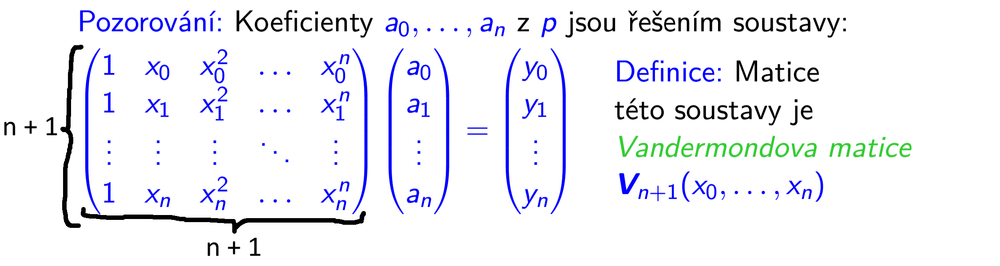
- side note - první sloupec je $x_i^0$ (což v lingebře $1$ i pro $0^0$)

Vandermondova matice řádu $n+1$ je dána parametry $x_0$ až $x_n$

Žejo $i$-tý řádek té matice je dosazení hodnot toho bodu do polynomu a pak se to vynásobí hledanými koeficienty $a_0, \dots, a_n$, a by se získal $y_i$

Koeficienty co nebudou potřeba budou že jo $0$.

Důkaz:

1. Vandermondova matice regulární $\implies$ $x_0, \dots, x_n$ navzájem různá

Obměnou: Kdyby nějaké 2 koeficienty byly stejné, měla by matice 2 stejné řádky a nebyla by tedy regulární

2. $x_0, \dots, x_n$ navzájem různá $\implies$ Vandermondova matice regulární

> Zpětnou (=tuto) implikaci dokážeme pomocí determinantu Vandermondovy matice

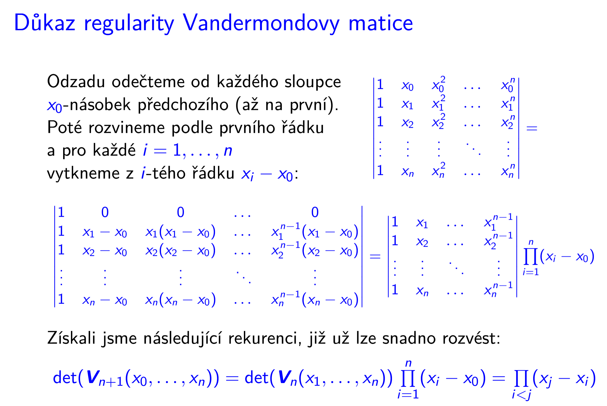
- slovo odzadu tam je jenom proto, aby to bylo "in-place" (ptal jsem se) - myšleno nejdřív zpočteme sloupec nejvíc vpravo, pak ten druhý zprava, apod.
	- Abychom tedy přepsali předchozí sloupec až potom, co jsme nastavili aktuální sloupec, abychom tedy nemuseli držet kopii matice před těmito úpravami
- pokud si pamatujeme matici před těmito změnami, je jedno v jakém pořadí tyto dílčí operace provedeme
	- v každém případě je myšleno, že od $i$-tého sloupce odečítáme $x_0$ násobek $(i-1)$-tého sloupce (1. sloupec je ten nejvíc vlevo)

**První rovnost, rozepsaná:**
$$
\begin{vmatrix}
1		& x_0	& x_0^2 & \dots & x_0^n \\
1 		& x_1	& x_1^2 & \dots & x_1^n \\
1 		& x_2	& x_2^2 & \dots & x_2^n \\
\vdots 	& \vdots& \vdots& \ddots& \vdots \\
1		& x_n	& x_n^2 & \dots & x_n^n
\end{vmatrix}
=
\begin{vmatrix}
1 		& x_0 - x_0 	& x_0^2 - x_0 \cdot x_0	& \dots & x_0^n - x_0 \cdot x_0^{n-1} \\
1 		& x_1 - x_0		& x_1^2 - x_0 \cdot x_1	& \dots & x_1^n - x_0 \cdot x_1^{n-1} \\
1 		& x_2 - x_0		& x_2^2 - x_0 \cdot x_2	& \dots & x_2^n - x_0 \cdot x_2^{n-1} \\
\vdots 	& \vdots		& \vdots				& \ddots& \vdots \\
1		& x_n - x_0		& x_n^2 - x_0 \cdot x_n	& \dots & x_n^n - x_0 \cdot x_n^{n-1}
\end{vmatrix}
$$
Vidíme, že z každého členu můžeme vytknout, a dost tak výraz pravé straně 1. rovnosti.

**Druhá rovnost, rozepsaná:**

Provedeme Laplaceův rozvoj podle 1. řádku

$$= 1 (-1)^{1+1} A^{1,1} = 

\begin{vmatrix} x_1 - x_0 & x_1(x_1 - x_0) & \dots & x_1^{n-1}(x_1 - x_0) \\ x_2 - x_0 & x_2(x_2 - x_0) & \dots & x_2^{n-1}(x_2 - x_0) \\ \vdots & \vdots & \ddots & \vdots \\ x_n - x_0 & x_n(x_n - x_0) & \dots & x_n^{n-1}(x_n - x_0) \end{vmatrix}
$$

Z každého řádku vytkneme $x_i - x_0$
___

Celý tento proces můžeme provádět víckrát.

Tedy na tento determinant aplikovat ty samé změny. Od každého sloupce odečteme $(x_1)$-násobek přeedchozího sloupce, poté provedeme Laplaceův rozvoj podle 1. řádku, dostaneme determinant matice o 1 menšího řádu, zase vytkneme z každého řádku.

$$\begin{vmatrix}
1 & x_1 & \cdots & x_1^{n-1} \\
1 & x_2 & \cdots & x_2^{n-1} \\
\vdots & \vdots & \ddots & \vdots \\
1 & x_n & \cdots & x_n^{n-1}
\end{vmatrix} \prod_{i=1}^{n} (x_i - x_0)$$

Atd. do základního případu této rekurze, což bude determinant matice $1 \times 1$.

To právě vyjadřuje ta rekurence:
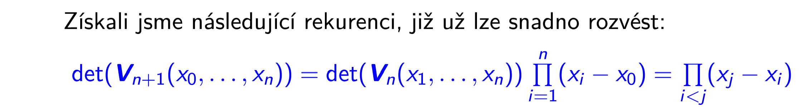

Poslední rovnost, která nahrazuje rekurenci produktem jde vidět na ukázce:

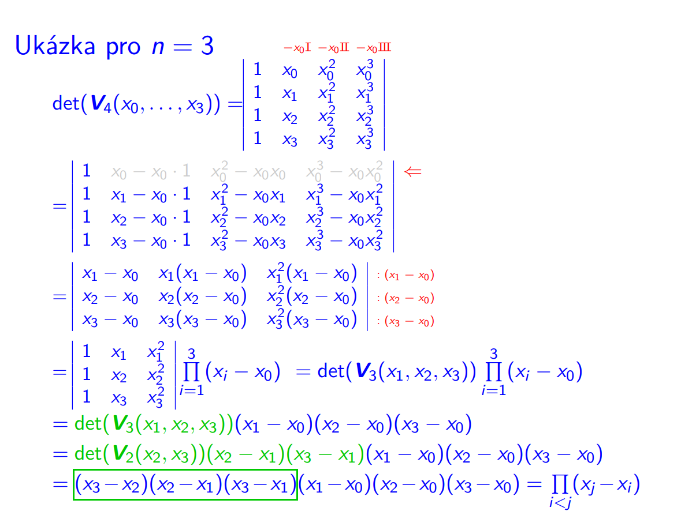

$$\det(V_2(x_2, x_3)) = 
\begin{vmatrix}
1 & x_2 \\
1 & x_3 \\
\end{vmatrix}

=

\begin{vmatrix}
1 & x_2 - x_2 \cdot 1 \\
1 & x_3 - x_2 \cdot 1 \\
\end{vmatrix}
=
\begin{vmatrix}
1 & 0			\\
1 & x_3 - x_2	\\
\end{vmatrix}
= 
1 (-1)^{1+1} 
\begin{vmatrix}
x_3 - x_2
\end{vmatrix}
= (x_3 - x_2) \cdot |1| = x_3 - x_2$$

Vidíme, že postupně odečítáme od $x$-ek s vyšším indexem všechny s nižším indexem, a pak vytýkáme, a to až po $x_n - x_{n-1}$.

Jsou-li $x_0, \dots, x_n$ různé prvky tělesa, dostáváme v součin různých prvků tělesa, jinými slovy součin nenulových prvků tělesa, a ten je v každém tělese vždy nenulový. Proto je Vandermondova matice regulární (její det. je nenulový)

#### Langrangeova interpolace
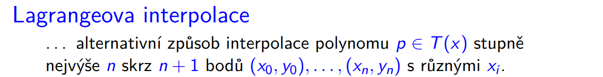

= alternativní způsob, jak proložit polynom stupně $n$ skrz $n+1$ bodů.

- tedy další způsob, jak udělat přechod $3. \to 1.$, tj. převod reprezentace hodnotami polynomu v $n+1$ různých bodech na reprezentaci koeficienty $a_0, \dots, a_n$

Metoda má 2 fáze:
##### 1.fáze
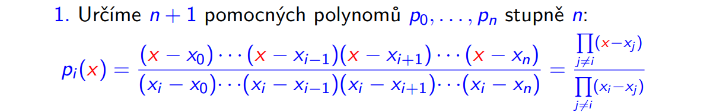
- modře vyznačená obyč čísla, xové souřadnice těch $n+1$ bodů
- v čitateli všechny lin. dvojčleny kromě $x - x_i$
- ve jmenovateli všechna čísla kromě $x_i - x_i$, protože to by $0$

- $p_i(x_i) = 1$, protože se pak prostě všechny členy vykrátí

- pro $i \neq j: p_i(x_j)=0$, protože jeden z rozdílů v čitateli pak $0$

Ukázka: 

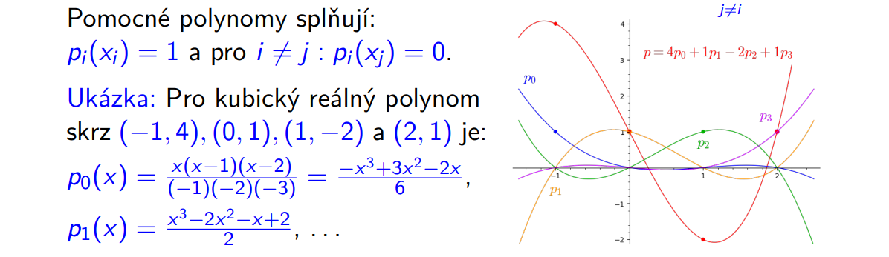

##### 2. fáze

> Hledaný polynom získáme jako lineární kombinaci těch pomocných polynomů, kde koeficienty jsou: jaké ypsilonové hodnoty má cílový polynom v tom bodě nabývat (=$y_i$)

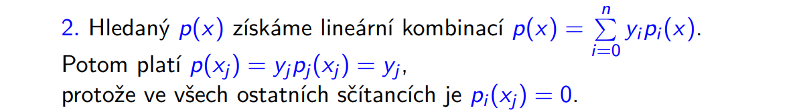
- že jo to $p_i(x)$ vždy dá $1$ v tom bodě $x_i$ a $0$ v ostatních $n$ zkoumaných bodech (těch $x_j$)
- pro jiné body $x$ se to teda taky nějak namíchá, ale už to tak hezky vidět není
	- vlastně **ve zbytku bodů co se děje nás nemusí zajímat, protože my jsme jenom měli zadaný body, kterýma to musí procházet**, a o zbytku nebylo řečeno nic
		- je ta interpolace jednoznačná?
			- **vlastně bude muset být, protože polynom stupně $n$, je jednoznačně určen $n+1$ body**

				- a taky btw, jako důsledek tohoto, výsledek musí odpovídat výsledku, který nám dá řešení soustavy rovnic s Vandermondovou maticí. A ta je, jak jsme si dokázali, regulární, a tedy má jednoznačné řešení (rank = počet sloupců, tj, žádné volné proměnné)

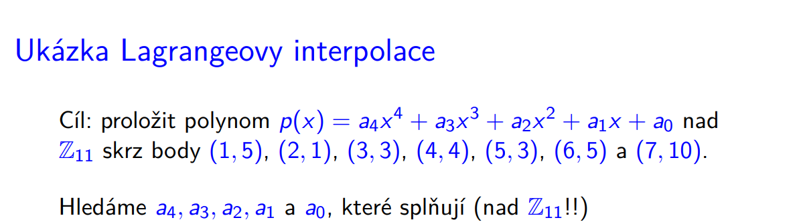

prostě dosadíme každý bod $(x_i, y_i)$ do $p(x_i) = y_i$ a dostaneme tyto rovnice:

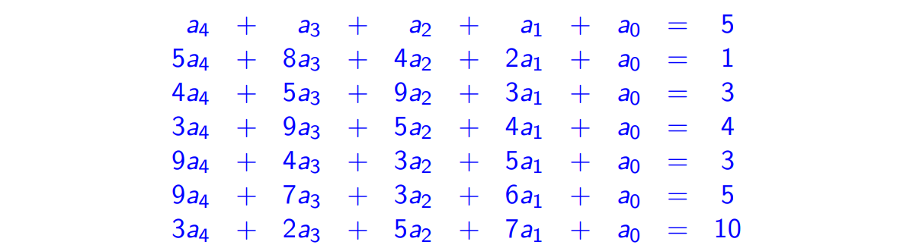

- protože hledaný polynom má stupeň $n=4$, a tedy těmi $n+1$ body je polynom jednoznačně určen.
(**forward ref REF3**: viz na to bude aplikace)

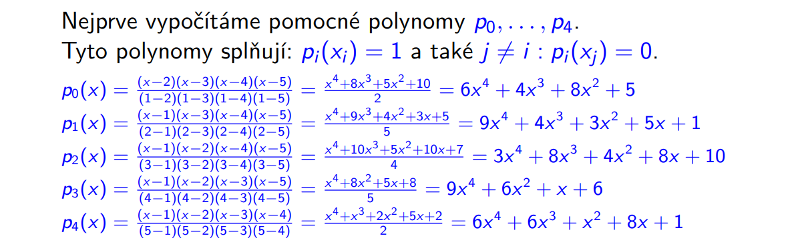
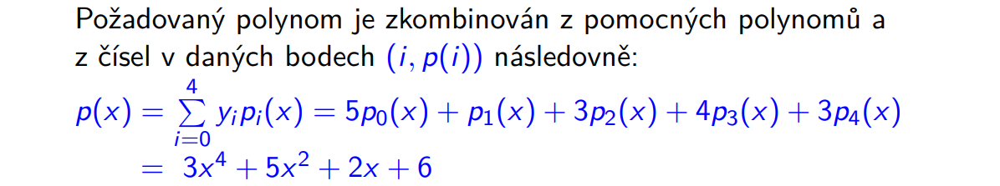
- to je ten požadovaný polynom stupně $4$ = kvartický, co prochází všemi těmi body
	- těmi $5$ co jsme použili ve výpočtu určitě, zbytek snadno ověříme

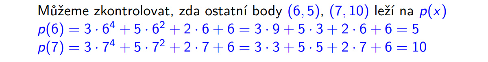
**(REF3) 1. aplikace** 
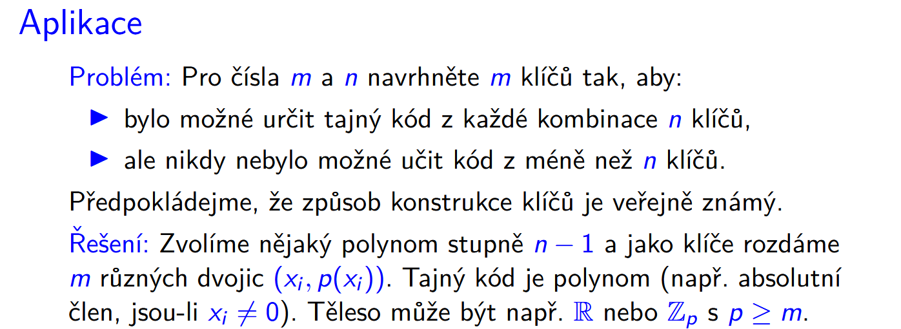
> Tajný kód je pak nějaká vlastnost daného polynomu, př. všechny jeho koeficienty nebo př. absolutní člen v případě, že nikdy nedáme dvojici, kde by 1. složka ($x_i$) byla 0

> Těleso pak může být libovolné, které má dostatečně mnoho hodnot, př. $\reals$ nebo $\mathbb{Z}_p$ s $p \ge m$

> Volba nějakého polynomu stupně $n-1$ má požadované vlastnosti, protože jej lze určit jednoznačně, právě když je k dispozici alespoň $n$ hodnot.

> Pokud je těch hodnot méně, potom takových polynomů může být více.
_________
2. aplikace:

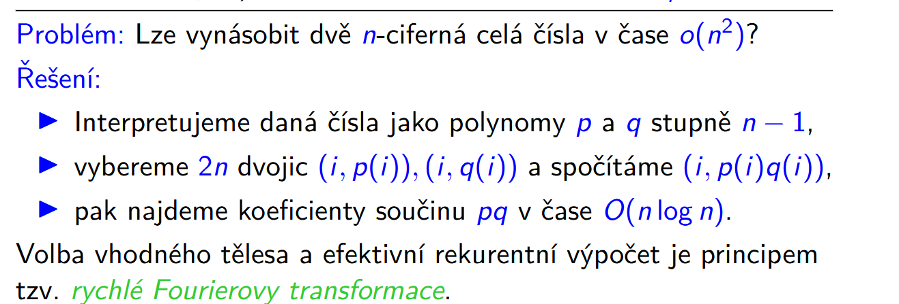

_______

> Od polynomů se nyní vrátíme ke tradičním konceptům lineární algebry, tzn. k maticím, vektorovým prostorům, a lineárním zobrazením.

> Polynomy nám přitom budou sloužit jako velice užitečný a klíčový nástroj. 