## Pozitivně definitní matice, Choleského rozklad

> Minule jsme si ukázali, že skalární součin lze nadefinovat také pomocí vhodně nadefinované matice.
- 
	-  $\mathbf v^T A^T$ je $(A\mathbf v)^T$, tj. $\langle \mathbf u | \mathbf v \rangle = (A\mathbf v)^T A \mathbf u$
> Těmto maticím se říká pozitivně definitní matice, a v dnešní lekci budeme podrobněji zkoumat jejich vlastnosti.

### Gramova matice


$$G = \begin{pmatrix}
\langle \mathbf b_1 \mid \mathbf b_1 \rangle & \langle \mathbf b_1 \mid \mathbf b_2 \rangle & \cdots & \langle \mathbf b_1 \mid \mathbf b_n \rangle \\
\langle \mathbf b_2 \mid \mathbf b_1 \rangle & \langle \mathbf b_2 \mid \mathbf b_2 \rangle & \cdots & \langle \mathbf b_2 \mid \mathbf b_n \rangle \\
\vdots & \vdots & \ddots & \vdots \\
\langle \mathbf b_n \mid \mathbf b_1 \rangle & \langle \mathbf b_n \mid \mathbf b_2 \rangle & \cdots & \langle \mathbf b_n \mid \mathbf b_n \rangle
\end{pmatrix}$$


Ta transpozice tam vzniká z tohoto důvodu:

Dosadíme do tvaru z obrázku $a_{ij} = \langle \mathbf b_i | \mathbf b_j \rangle$:

$$\sum_{j=1}^n \sum_{i=1}^n \overline{d_j} \cdot a_{ij} \cdot c_i$$

Aby ale výraz s dvojitou sumou odpovídal maticovému součinu, je potřeba jiné pořadí indexů $i,j$ v prostředním členu:

$$\sum_{j=1}^n \sum_{i=1}^n \overline{d_j} \cdot a_{ij} \cdot c_i = \sum_{j=1}^n \sum_{i=1}^n \overline{d_j} \cdot M_{ji} \cdot c_i$$
- aby podle definice maticového součinu mohl proběhnout ten součin, tak tam musí být $M_{ji}$ (že jo v maticovém součinu řádek krát sloupec)

- $M_{ji} = a_{ij}$ znamená, že $M = A^T$

Tohle už můžeme interpretovat jako maticový součin.

$$\sum_{j=1}^n \sum_{i=1}^n \overline{d_j} \cdot (A^T)_{ji} \cdot c_i$$

A sice:

$$[\mathbf v]_B^H A^T [\mathbf u]_B$$


- $\bar{d}_j$ jsou složky $\mathbf v$ vyjádřeného vzhledem k bázi $B$ a poté hermitovsky transponovaného
- $c_i$ jsou složky $\mathbf u$ vyjádřeného vzhledem k bázi $B$

Kdybychom si označili vektory $\mathbf u$ a $\mathbf v$ trochu jinak, tak bychom se mohli vyhnout úvaze o tom, jak náš výraz poupravit, aby odpovídal maticovému součinu:

$$\mathbf u = \sum_{j=1}^n c_j \mathbf b_j$$

$$\mathbf v = \sum_{i=1}^n d_i \mathbf b_i$$

Pak totiž by byla ta transpozice $A$ jednodušeji viditelná:

$$\langle \mathbf u | \mathbf v \rangle = \left\langle \sum_{j=1}^n c_j \mathbf b_j \middle| \sum_{i=1}^n d_i \mathbf b_i \right\rangle =  \sum_{j=1}^n \sum_{i=1}^n c_j \bar{d}_i \langle \mathbf b_j |\mathbf b_i \rangle$$

- výsledkem skal. součinu je jedno číslo, součet je komutativní, proto změna pořadí sum ničemu nevadí, projdeme stejné prvky, ale v jiném pořadí

$a_{i,j} := \langle \mathbf b_i |\mathbf b_j \rangle$, tj. $a_{j,i} := \langle \mathbf b_j |\mathbf b_i \rangle$, a $(A^{\mathrm{T}})_{i,j} = a_{j,i}$, součin v tělese komutativní:

$$\sum_{i=1}^n \sum_{j=1}^n c_j \bar{d}_i \langle \mathbf b_j |\mathbf b_i \rangle = \sum_{i=1}^n \sum_{j=1}^n \bar{d}_i \cdot (A^{\mathrm{T}})_{i,j} \cdot c_j $$

To už přímo vede na $[\mathbf v]_B^H A^T [\mathbf u]_B$
- $\bar{d}_i$ jsou složky $\mathbf v$ vyjádřeného vzhledem k bázi $B$ a poté hermitovsky transponovaného
- $c_j$ jsou složky $\mathbf u$ vyjádřeného vzhledem k bázi $B$

<details>
<summary>
úvahy o interpretaci maticového součinu (když už víme, jak má vypadat maticový součin dobrat se k tomu předchozímu výrazu s dvojitou sumou)
</summary>

To Gramova matice splňuje $\langle \mathbf u | \mathbf v \rangle = [ \mathbf v ]_B^H A^T [\mathbf u ]_B$ lze odvodit takto.

Odvoďme si nejdřív obecný vzorec pro tento maticový součin:

$$\text{(řádek délky $n$)} \times (\text{matice } n \times n) \times (\text{sloupec délky $n$})$$

Označme si:
- řádek délky $n$: $\mathbf d = (\bar{d}_1 \ \dots \ \bar{d}_n)$
- tu matici $n \times n$: $B$
- sloupec délky $n$: $\mathbf c = \begin{pmatrix} c_1 \\ \vdots \\ c_n \end{pmatrix}$

Součin


$$(\text{matice } n \times n) \times (\text{sloupec délky $n$})$$

výsledek $B \mathbf c$ je vektor, $i$-tá složka je:

$$(B \mathbf c)_{i} = \sum_{j=1}^n b_{i,j} \cdot c_j$$

Tedy:

$$B \mathbf c = \begin{pmatrix} (B \mathbf c)_1 \\ \vdots \\ (B \mathbf c)_n \end{pmatrix} = \begin{pmatrix} \displaystyle\sum_{j=1}^n b_{1,j} \cdot c_j \\ \vdots \\ \displaystyle\sum_{j=1}^n b_{n,j} \cdot c_j \end{pmatrix}$$

Součin
$$\text{(řádek délky $n$)} \times (\text{matice } n \times n) \times (\text{sloupec délky $n$})$$

$$(\bar{d}_1 \ \dots \ \bar{d}_n) \cdot 

\begin{pmatrix}
\displaystyle\sum_{j=1}^n b_{1,j} \cdot c_j \\
\vdots \\
\displaystyle\sum_{j=1}^n b_{n,j} \cdot c_j
\end{pmatrix}

= \bar{d}_1 \sum_{j=1}^n b_{1,j} \cdot c_j + \dots + \bar{d}_n \sum_{j=1}^n b_{n,j} \cdot c_j$$

$$\bar{d}_1 \sum_{j=1}^n b_{1,j} \cdot c_j  + \dots + \bar{d}_n \sum_{j=1}^n b_{n,j} \cdot c_j = \sum_{i=1}^n \left( \bar{d}_i \sum_{j=1}^n b_{i,j} \cdot c_j \right)$$

$$\sum_{i=1}^n \left( \bar{d}_i \sum_{j=1}^n b_{i,j} \cdot c_j \right) = \sum_{i=1}^n \left(  \sum_{j=1}^n \bar{d}_i b_{i,j} \cdot c_j \right)$$

$$\sum_{i=1}^n \left(  \sum_{j=1}^n \bar{d}_i b_{i,j} \cdot c_j \right)$$

A to už je velmi podobné výrazu na obrázku - akorát oproti němu mám prohozený význam proměnných $i$ a $j$,jelikož na obrázku je $\bar{d}_j$ a já mám $\bar{d}_i$, stejně tak na obrázku je $c_i$ a já mám $c_j$.

To můžu jednoduše změnit:

$$\sum_{j=1}^n \left(  \sum_{i=1}^n \bar{d}_j b_{j,i} \cdot c_i \right)$$

A nyní stačí jen prohodit vnější a vnitřní sumu - to můžeme udělat, i tak projdeme všechny prvky, ale v jiném pořadí, součet je komutativní, pohoda
- stejně jako dva vnořené `for` cykly můžeme prohodit a projde to stejné prvky, tj.

<!--  markdown tables dont support code blocks inside lol, so html it is... !-->
<table>
<tr>
<td>

```py
for i in range(n):
	for j in range(n):
		...
```
</td>
<td>

```py
for j in range(n):
	for i in range(n):
		...
```

</td>
</tr>
</table>

$$\sum_{i=1}^n \sum_{j=1}^n \bar{d}_j b_{j,i} \cdot c_i $$

Z toho už je vidět, proč je tam $A^T$ (že jo $A^T := a_{j,i}$)


</details>

#### Vlastnosti Gramovy matice

- to 1. je že jo axiom skalárního součinu
- to $\langle \mathbf v | \mathbf v \rangle > 0$ pro $\mathbf v \neq 0$ je též axiom skal. součinu
	- před chvílí jsme dokázali, že $\langle \mathbf u | \mathbf v \rangle = [\mathbf v]_B^H A^T [\mathbf u]_B$

> Maticím, které mají tyto $2$ vlastnosti dáme zvláštní jméno:
> ### Pozitivně definitní matice
> 
- přeznačili jsme $A^T$ na $A$, a platit to bude, protože $A^T$ je též hermitovská

> 
> - na první pohled ovšem není vidět, že by tato matice splňovala uvedenou podmínku pro všechny možné komplexní 2složkové vektory

> Ukážeme si však, že je možné efketivně rozhodnout, zda-li je matice pozitivně definitní.
>
> Než se k tomuto výpočtu dostaneme, ukážeme si některé základní vlastnosti pozitivně definitních matic.


- ukazujeme $\mathbf v^H (A + B) \mathbf v > 0$


$\mathbf v^H A \mathbf v > 0$


- $R$ regulární, tj. nemůže zobrazit netriviální vektor na triviální vektor

<details>
<summary>
Důkaz:
</summary>

Představme si, že máme nenulový vektor 
$\vec{x} \neq \vec{0}$.
Chceme ukázat, že jeho obraz 
$A\vec{x}$ nemůže být nulový vektor 
$\vec{0}$.


Předpokládejme pro spor, že by platilo:

$$A\vec{x} = \vec{0}$$


Protože je matice 
$A$ regulární, existuje její inverzní matice 
$A^{-1}$. Vynásobíme obě strany rovnice zleva maticí 
$A^{-1}$:

$$A^{-1}(A\vec{x}) = A^{-1}\vec{0}$$


Na levé straně se 
$A^{-1}A$ změní na jednotkovou matici 
$I$:

$$I\vec{x} = \vec{0}$$

$$\vec{x} = \vec{0}$$


To je ale spor s naším původním předpokladem, že 
$\vec{x}$ je netriviální (
$\vec{x} \neq \vec{0}$).


Proto 
$A\vec{x}$ nikdy nemůže být 
$\vec{0}$, pokud 
$\vec{x} \neq \vec{0}$.

Další pohled na věc je, že $A\vec{x} = \vec{0}$ s regulární $A$ je homogenní soustava rovnic. Ta má právě jedno řešení, $\vec{x} = \vec{0}$

</details>


Důkaz:

$A$ je pozitivně definitní $\implies$ $A$ je regulární

obměna:

$A$ je singulární $\implies$ $A$ není pozitivně definitní


- to je vlastnost singulární matice, že homogenní soustava s ní má netriviální řešení (protože že jo volné proměnné)
- aby $A$ pozitivně definitní byla, tak bychom chtěli $\mathbf v^H A \mathbf v > 0$

Důkaz $A$ pozitivně definitní $\implies$ $A^{-1}$ pozitivně definitní
> Jakmile víme, že $A$ regulární, můžeme ukázat, že její inverzní matice je taky hermitovská, tj. ukázat $A^{-1} = (A^{-1})^H$

postupně tedy upravíme $(A^{-1})^H$ tak, abychom dostali $A^{-1}$:


Takže máme to, že $A^{-1}$ je hermitovská, a že tedy vůbec může být kandidátem na to, aby byla pozitivně definitní. Ještě ale potřebujeme dokázat, že pro $A^{-1}$ platí $\forall \mathbf v \in \mathbb{C} \setminus \set{\mathbf 0}: \mathbf v^H A^{-1} \mathbf v > 0$

Máme na to předchozí pozorování:


- a ten tvar $(A^{-1})^H A A^{-1}$ je ten tvar $R^H A R$:
	1. $A$ je pozitivně definitní
	2. Tzn. $(A^{-1})^H A A^{-1}$ je pozitivně definitní
- a z rovnosti na tomhle obrázku vidíme, že i $A^{-1}$ je pozitivně definitní


Z té blokové matice si můžeme uvědomit, jaké tvary musí mít $A$ a $B$ = tu informaci nám dají ty bloky $0_{n,m}$ a $0_{m,n}$:
- $A \in \mathbb{C}^{n \times m}$ 
- $B \in \mathbb{C}^{m \times n}$

$\mathbf w^{\mathrm{H}} \begin{pmatrix} A & 0_{n,m} \\ 0_{m,n} & B \end{pmatrix} \mathbf w = \begin{pmatrix} \bar{v}_1 &\dots & \bar{v}_n & \bar{u}_1 & \dots & \bar{u}_m \end{pmatrix} \begin{pmatrix} A & 0_{n,m} \\ 0_{m,n} & B \end{pmatrix} \begin{pmatrix} v_1 \\ \vdots \\ v_n \\ u_1 \\ \vdots \\u_m  \end{pmatrix}$


Vyhodnotme si první část:

$$\begin{pmatrix} \bar{v}_1 &\dots & \bar{v}_n & \bar{u}_1 & \dots & \bar{u}_m \end{pmatrix} \begin{pmatrix} A & 0_{n,m} \\ 0_{m,n} & B \end{pmatrix} \\ =

\begin{pmatrix}

\begin{pmatrix} \bar{v}_1 &\dots & \bar{v}_n \end{pmatrix} A  + \begin{pmatrix} \bar{u}_1 & \dots & \bar{u}_m \end{pmatrix} 0_{m,n} 


& 

\begin{pmatrix} \bar{v}_1 &\dots & \bar{v}_n \end{pmatrix} 0_{n,m}  + \begin{pmatrix} \bar{u}_1 & \dots & \bar{u}_m \end{pmatrix} B 

\end{pmatrix}$$

A vyhodnoťme zbytek:
$$
\begin{pmatrix}
\ 
\boxed{\begin{pmatrix} \bar{v}_1 &\dots & \bar{v}_n \end{pmatrix} A  + \begin{pmatrix} \bar{u}_1 & \dots & \bar{u}_m \end{pmatrix} 0_{m,n}}


& 

\boxed{\begin{pmatrix} \bar{v}_1 &\dots & \bar{v}_n \end{pmatrix} 0_{n,m}  + \begin{pmatrix} \bar{u}_1 & \dots & \bar{u}_m \end{pmatrix} B} 

\end{pmatrix} 

\begin{pmatrix} 
\ 
\boxed{\begin{matrix} v_1 \\ \vdots \\ v_n \end{matrix}}  \ 

\\
\\

\boxed{\begin{matrix} u_1 \\ \vdots \\ u_m \end{matrix}}

\end{pmatrix}$$

Součiny s nulovou maticí ignorujme, a zde máme výsledek:

$$= \begin{pmatrix} \bar{v}_1 & \dots & \bar{v}_n \end{pmatrix} A \begin{pmatrix} v_1 \\ \vdots \\ v_n \end{pmatrix} + \begin{pmatrix} \bar{u}_1 & \dots & \bar{u}_m \end{pmatrix} B \begin{pmatrix} u_1 \\ \vdots \\ u_m \end{pmatrix}$$

A to přesně odpovídá výslednému výrazu:

$ = \mathbf v^H A \mathbf v + \mathbf u^H B \mathbf u$
___

Teď, když už máme tu rovnost

$\mathbf w^{\mathrm{H}} \begin{pmatrix} A & 0_{n,m} \\ 0_{m,n} & B \end{pmatrix} \mathbf w  = \mathbf v^H A \mathbf v + \mathbf u^H B \mathbf u$

tak můžeme začít uvažovat o tom, jestli to je $>0$

1. $A$ i $B$ jsou pozitivně definitní $\implies$ $\begin{pmatrix} A & 0_{n,m} \\ 0_{m,n} & B \end{pmatrix}$ je pozitivně definitní

	- nezáporné jsou proto, že $A$ je pozitivně definitní (= $\forall \mathbf v \in \mathbb{C}^n \setminus \set{\mathbf 0}: \mathbf v^H A \mathbf v > 0 $, a když dosadíme $\mathbf 0$, tak to ofc vyjde $0$), to stejné s $B$
		- je-li $\mathbf w$ netriviální, tak alespoň v jedné z těch částí $v_1, \dots, v_n$ nebo $b_1, \dots, b_n$ je alespoň jeden nenulový prvek, vyjde to kladné, jak vyžaduje levá strana k tomu, aby  $\begin{pmatrix} A & 0_{n,m} \\ 0_{m,n} & B \end{pmatrix}$ byla pozitivně definitní
		- kdyby triviální byl, tak to taky nevadí, vyjde $0 = 0$

2. $\begin{pmatrix} A & 0_{n,m} \\ 0_{m,n} & B \end{pmatrix}$ je pozitivně definitní $\implies$ $A$ i $B$ jsou pozitivně definitní

$\begin{pmatrix} A & 0_{n,m} \\ 0_{m,n} & B \end{pmatrix}$ je pozitivně definitní znamená $\forall \mathbf w \in \mathbb{C}^n \setminus \set{\mathbf 0}: \mathbf w^H \begin{pmatrix} A & 0_{n,m} \\ 0_{m,n} & B \end{pmatrix} \mathbf w > 0$

Když můžeme zvolit všechny a bude to platit, zvolme si $\mathbf w = (v_1, \dots, v_n, 0, \dots, 0)^T$, pak při dosazení do  $\mathbf v^H A \mathbf v + \mathbf u^H B \mathbf u$ dostaneme $\mathbf v^H A \mathbf v$

Takže:

$\forall \mathbf w \in \mathbb{C}^n \setminus \set{\mathbf 0}: \mathbf w^H \begin{pmatrix} A & 0_{n,m} \\ 0_{m,n} & B \end{pmatrix} \mathbf w > 0$ $\implies$ 

$\mathbf w = (v_1, \dots, v_n, 0, \dots, 0)^T: \quad \mathbf w^H \begin{pmatrix} A & 0_{n,m} \\ 0_{m,n} & B \end{pmatrix} \mathbf w > 0$ $\implies$

$\mathbf v^H A \mathbf v > 0$, a to je cíl, $A$ tedy je pozitivně definitní
- ta část $v_1, \dots, v_n$ v $\mathbf w$ je libovolná, tzn. tohle platí $\forall \mathbf v$, přesně jak má být

Tohle přesně říká kus prezentace:


- tzn taky volbou vhodného komplex. vektoru:
	- libovolný $\mathbf u \in \mathbb{C}^m \setminus \set{\mathbf 0}$ doplníme nulami na $\mathbf w = (0, \dots, 0, u_1, \dots, u_m)^T \in \mathbb{C}^{n+m}$, při dosazení do  $\mathbf v^H A \mathbf v + \mathbf u^H B \mathbf u$ dostaneme $\mathbf u^H B \mathbf u$

		$\forall \mathbf w \in \mathbb{C}^n \setminus \set{\mathbf 0}: \mathbf w^H \begin{pmatrix} A & 0_{n,m} \\ 0_{m,n} & B \end{pmatrix} \mathbf w > 0$ $\implies$ 

		$\mathbf w = (0, \dots, 0, u_1, \dots, u_m)^T: \quad \mathbf w^H \begin{pmatrix} A & 0_{n,m} \\ 0_{m,n} & B \end{pmatrix} \mathbf w > 0$ $\implies$

		$\mathbf u^H B \mathbf u > 0$, tzn. $B$ je pozitivně definitní

### Charakteristika pozitivně definitních matic
> Pozitivně definitní matice lze definovat i alternativními způsoby:
>
> 

> Tuto větu si dokážeme jako posloupnost 3 implikací.

1. Důkaz matice $A$ je pozitivně definitní $\implies$ $A$ má všechna vlastní čísla realná kladná

	pozitivně definitní matice je hermitovská matice, pro kterou navíc platí pro netriv. komplex. $\mathbf v: \quad \mathbf v^H A \mathbf v > 0$

	
	- abychom vůbec mohli uvažovat o kladnosti
	- to víme z  této věty (nadpis "Diagonalizace hermitovských matic" v části [Diagonalizace](Diagonalizace.md)):
	

	> Vezměme si libovolný netriviální vektor $\mathbf v$, který je příslušný některému z těch vl. čísel:
	>
	> 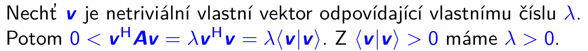
	- $\mathbf v^H A \mathbf v > 0$ protože předpoklad $A$ je pozit. def.
	- $A \mathbf v = \lambda \mathbf v$ definiční rovnost vl. vektoru
		- vytknutí $\lambda$ před maticový součin
	- maticový součin $\mathbf v^H \mathbf v$ odpovídá standardnímu maticovému součinu na $\mathbb{C}^n$ (máme ortonormální standardní bázi, vůči které jsou vektory vyjádřené by default)
	- $\langle \mathbf v | \mathbf v \rangle > 0$ je axiom skal. součinu
	- $\lambda \langle \mathbf v | \mathbf v \rangle > 0 \land \langle \mathbf v | \mathbf v \rangle > 0 \implies \lambda > 0$
		- odsud máme cíl, že libovolné vlastní číslo matice $A$ je nejen realné, ale i kladné

2. Důkaz $A$ má všechna vlastní čísla kladná $\implies$ existuje regulární matice $U$ taková, že $U^H U = A$

	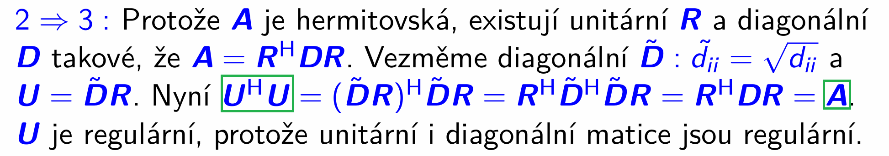

	zase:
	
	

	- na diagonále matice $D$ jsou kladná vlastní čísla - tzn. můžeme vzít další diagonální matici, kterou označíme $\tilde{D}$, definovanou tak, že prvky na diagonále odmocníme

	- nyní stačí vyhodnotit $U^H U$, použito:
		- substituce, $(XY)^H = Y^H X^H$, 
		
		- $\tilde D^H \tilde D = D$ = potká se řádek se sebou samým jako sloupcem, $\text{odmocnina}^2$
			- stačila by obyč. transpozice, ale hermitovská udělá stejnou věc, protože matice $\tilde D$ realná
	
	- $U= \tilde D R$ regulární protože
		- $\tilde D$ regulární = odvozena z $D$, která na hl. diag. z předpokladu kladná vl. č., tj. $\text{rank } \tilde D = n$
		- $R$ regulární protože je unitární = podle def. $R^H R = I$ $\implies$ existuje inverzní matice = $R^{-1}$ , taky jde říct, že všechny její sloupce LN, protože jsou na sebe kolmé (opět vztah $R^H R = I$ => že jo pro $i \neq j$: $\mathbf r_i^H \mathbf r_j = 0$ )

3. Důkaz existuje regulární matice $U taková, že $A = U^H U$ $\implies$ matice $A$ je pozitivně definitní

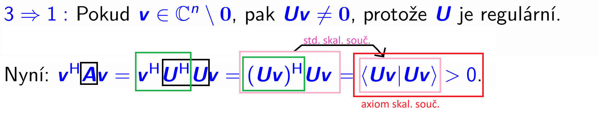
- $U \mathbf v \neq 0$ už jsem v tomto dokumentu vysvětloval

> Matice $U$, která se vyskystla v bodu 3. věty:
>
> 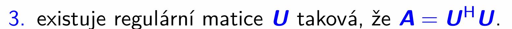
>
> není jednoznačně dána. 

> Ovšem v případě, že si stanovíme dodatečné podmínky, tak už jednoznačná je.
>
> Takovou dodatečnou podmínkou je, že ta matice má být horní trojúhelníková, a má mít také kladnou diagonálu.
>
> Taková matice vždy existuje a nazývá se **Choleského rozklad**

### Choleského rozklad

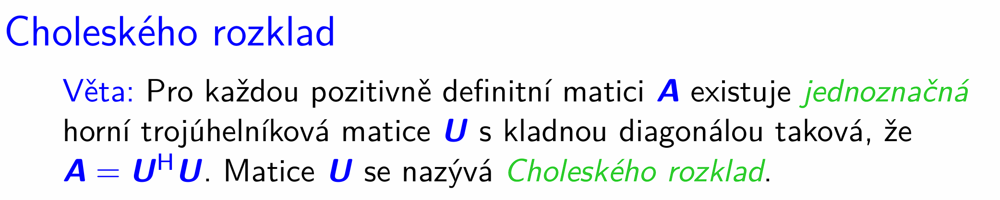

- $U$ spočteme pomocí následujícího algoritmu:

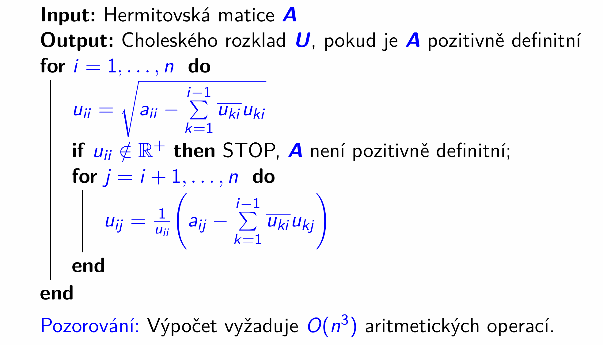
- $O(n^3)$ protože dvojitý `for` loop a uvnitř toho vnitřního $\sum$
- matice $U$, kterou počítáme je "zero initialised", tj jakoby máme 2D pole vyplněné nulami, do kterého postupně dopočítáváme hodnoty
	-  proto vypadá smyčka `for j = i + 1, ..., n` takhle, nevyplňuje nic vlevo od hlavní diagonály, tam nechá ty nuly

Ty operace jde snadno odvodit z $U^H U$ (důkaz bude následovat potom):

Matice 
$U$ je horní trojúhelníková, takže její hermitovská transpozice 
$U^H$ je dolní trojúhelníková s komplexně sdruženými prvky 
$\overline{u_{ij}}$.

Pro větší názornost obrázku jsem u $U^H$ nechal indexování z $U$.

$\underbrace{\begin{pmatrix}
\overline{u_{11}} & 0 & 0 & \dots & 0 \\
\overline{u_{12}} & \overline{u_{22}} & 0 & \dots & 0 \\
\overline{u_{13}} & \overline{u_{23}} & \overline{u_{33}} & \dots & 0 \\
\vdots & \vdots & \vdots & \ddots & \vdots \\
\overline{u_{1n}} & \overline{u_{2n}} & \overline{u_{3n}} & \dots & \overline{u_{nn}}
\end{pmatrix}}_{U^H}
\cdot
\underbrace{\begin{pmatrix}
u_{11} & u_{12} & u_{13} & \dots & u_{1n} \\
0 & u_{22} & u_{23} & \dots & u_{2n} \\
0 & 0 & u_{33} & \dots & u_{3n} \\
\vdots & \vdots & \vdots & \ddots & \vdots \\
0 & 0 & 0 & \dots & u_{nn}
\end{pmatrix}}_{U}
=\underbrace{\begin{pmatrix}
a_{11} & a_{12} & a_{13} & \dots & a_{1n} \\
a_{21} & a_{22} & a_{23} & \dots & a_{2n} \\
a_{31} & a_{32} & a_{33} & \dots & a_{3n} \\
\vdots & \vdots & \vdots & \ddots & \vdots \\
a_{n1} & a_{n2} & a_{n3} & \dots & a_{nn}
\end{pmatrix}}_{A}$

Odvoďmě si např. výpočet $u_{22}$:

Maticový součin z definice, pak algebraické úpravy.

$$
a_{22} = \begin{pmatrix}
\overline{u_{12}} & \overline{u_{22}} & 0 & \dots & 0
\end{pmatrix}
\begin{pmatrix}
u_{12} \\
u_{22} \\
0 \\
\vdots \\
0
\end{pmatrix} = \overline{u_{12}}u_{12} + \overline{u_{22}}u_{22}$$

$$\overline{u_{22}}u_{22} = a_{22} - \overline{u_{12}}u_{12}$$

$$|u_{22}|^2 = a_{22} - \overline{u_{12}}u_{12}$$

$$|u_{22}| = \sqrt{a_{22} - \overline{u_{12}}u_{12}}$$

$$u_{22} = \sqrt{a_{22} - \overline{u_{12}}u_{12}}$$

Obecně pak:

$$u_{ii} = \sqrt{a_{ii} - \sum_{k=1}^{i-1} \overline{u_{ki} } u_{ki}}$$

To $\overline{u_{ki}}$ zde představuje $i$-tý sloupec $U^H$, který ale "vyrobíme na místě" z matice $U$ - tedy zde bereme $i$-tý sloupec $U$ a na každý prvek aplikujeme komplexní sdružení.

Podobně si odvoďme např. $u_{34}$

$$a_{34} = 

\begin{pmatrix}
\overline{u_{13}} & \overline{u_{23}} & \overline{u_{33}} & \dots & 0 \\
\end{pmatrix}

\begin{pmatrix}
u_{14} \\
u_{24} \\
u_{34} \\
u_{44} \\
\vdots \\
0
\end{pmatrix} = \overline{u_{13}}u_{14} + \overline{u_{23}}u_{24} + \overline{u_{33}} u_{34}$$

$$\overline{u_{33}} u_{34} = a_{34} - \overline{u_{13}}u_{14} - \overline{u_{23}}u_{24}$$

$$u_{34} = \frac{1}{\overline{u_{33}}} (a_{34} - \overline{u_{13}}u_{14} - \overline{u_{23}}u_{24})$$

A protože znění věty říká, že $U$ má kladnou, to znamená realnou diagonálu, tak $\overline{u_{33}} = u_{33}$

$$u_{34} = \frac{1}{u_{33}} (a_{34} - \overline{u_{13}}u_{14} - \overline{u_{23}}u_{24})$$

Obecně pak:

$$u_{ij} = \frac{1}{u_{ii}} (a_{ij}- \sum_{k=1}^{i-1} \overline{u_{ki}}u_{kj})$$

To $\overline{u_{ki}}$ zde představuje $i$-tý sloupec $U^H$, který ale "vyrobíme na místě" z matice $U$ - tedy zde bereme $i$-tý sloupec $U$ a na každý prvek aplikujeme komplexní sdružení.

#### Ukázka 

Než jsem si rozepsal to nahoře, jak vznikly členy toho Choleského rozkladu tak mě to mátlo.

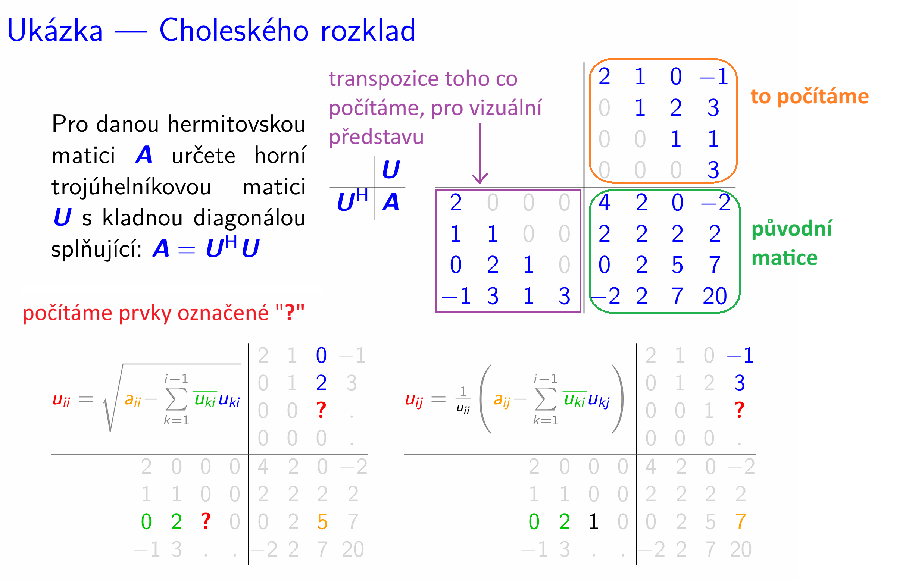

#### Správnost výpočtu Choleského rozkladu

Zde se vyrojí implikace, ač v původní větě nebyly:

> „Pro každou pozitivně definitní matici 
$A$ existuje jednoznačná horní trojúhelníková matice 
$U$ s kladnou diagonálou taková, že 
$A = U^H U$.“

Ale prof. Fiala formuluje algoritmus zároveň jako test pozitivní definitnosti:

- **Vstup:** Libovolná hermitovská matice $A$.
- **Výstup:** Choleského rozklad $U$, pokud je $A$ pozitivně definitní, jinak STOP (matice není pozitivně definitní).

To je tahle část obrázku (začátek popisu algoritmu):

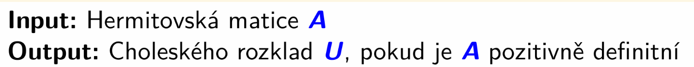

a tahle z průběhu algoritmu:
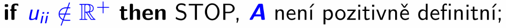

Tedy formálně:

$A$ pozitivně definitní $\iff$ existuje Choleského rozklad (algoritmus uspěl)

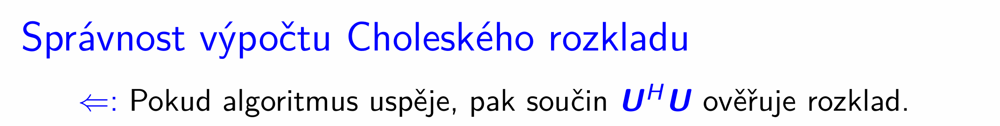
1. čili algoritmus uspěje $\implies$  $A$ je pozitivně definitní
	- že jo **algoritmus uspěl = našel horní trojúhelníkovou $U$ s kladnými realnými čísly na diagonále** (žádnou jinou najít nemůže = tak je algoritmus postaven = na hl. diagonálu umisťuje realný výsledek odmocniny (kdyby nebyl realný, tak by vyhodil výjimku, a neuspěl by), a vlevo od diagonály vždy nuly protože tak je napsán vnitřní `for` loop)

	- **tato $U$ je regulární**
		- protože determinant **horní trojúhelníkové** $U$ je $\det U = \displaystyle\prod_{i=1}^n u_{ii}$ a prvky na diagonále jsou kladné, je nenulový

			- a my víme, že $\det U \neq 0 \iff U \text{ je regulární}$

	- $U$ je regulární a $U^H U$ tvoří $A$ $\implies$ $A$ je hermitovská
		- viz charakteristika pozitivně definitních matic:

			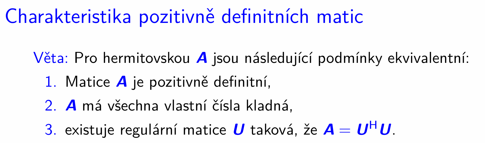
		
		- tato $A$ je stejná jako ta vstupní $A$ do algoritmu
			- to je vlastnost toho, jak jsme sestrojili ten algoritmus
				- viz to odvození nahoře, ve kterém je $A$ ta vstupní matice:

				$\underbrace{\begin{pmatrix}
\overline{u_{11}} & 0 & 0 & \dots & 0 \\
\overline{u_{12}} & \overline{u_{22}} & 0 & \dots & 0 \\
\overline{u_{13}} & \overline{u_{23}} & \overline{u_{33}} & \dots & 0 \\
\vdots & \vdots & \vdots & \ddots & \vdots \\
\overline{u_{1n}} & \overline{u_{2n}} & \overline{u_{3n}} & \dots & \overline{u_{nn}}
\end{pmatrix}}_{U^H}
\cdot
\underbrace{\begin{pmatrix}
u_{11} & u_{12} & u_{13} & \dots & u_{1n} \\
0 & u_{22} & u_{23} & \dots & u_{2n} \\
0 & 0 & u_{33} & \dots & u_{3n} \\
\vdots & \vdots & \vdots & \ddots & \vdots \\
0 & 0 & 0 & \dots & u_{nn}
\end{pmatrix}}_{U}
=\underbrace{\begin{pmatrix}
a_{11} & a_{12} & a_{13} & \dots & a_{1n} \\
a_{21} & a_{22} & a_{23} & \dots & a_{2n} \\
a_{31} & a_{32} & a_{33} & \dots & a_{3n} \\
\vdots & \vdots & \vdots & \ddots & \vdots \\
a_{n1} & a_{n2} & a_{n3} & \dots & a_{nn}
\end{pmatrix}}_{A}$

				tj. z tohoto součinu odvodíme pro algoritmus vzorečky pro výpočet prvků matice $U$, ale zároveň z nich můžeme vyjádřit prvky té původní matice $A$, když ji chceme spočítat, a naopak známe matici $U$:

				$$u_{ii} = \sqrt{a_{ii} - \sum_{k=1}^{i-1} \overline{u_{ki} } u_{ki}}$$

				$$u_{ij} = \frac{1}{u_{ii}} (a_{ij}- \sum_{k=1}^{i-1} \overline{u_{ki}}u_{kj})$$

				z těchto dvou rovnici si můžu hned odvodit $a_{ii}$, $a_{ij}$


2. algoritmus musí uspět pro každou pozitivně definitní matici, tj. 

	matice $A$ pozitivně definitní $\implies$ algoritmus uspěje

	Dokazovat budeme obměnu:

	algoritmus selže $\implies$ matice $A$ není pozitivně definitní

	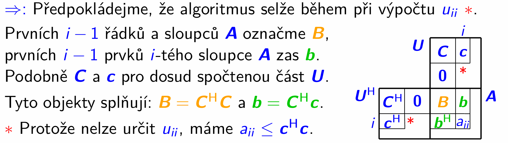
	- $u_{ii}$ nelze určit, protože algoritmus selhal (tj, ikdyž jsme tam podle pseudokódu nějakou hodnotu zapsal, tak to bereme tak, že když alg. selhal, tak tu hodnotu nebudeme nijak interpretovat)

	- $\mathbf 0$ na tomto obrázku značí nulové podmatice

	> - algoritmus selhal při výpočtu $i$-tého prvku na diagonále $U$, tzn. nepodařilo se nám získat kladnou odmocninu
	>
	> $$u_{ii} = \sqrt{a_{ii} - \underbrace{\sum_{k=1}^{i-1} \overline{u_{ki} } u_{ki}}_{\normalsize{\mathbf c^H \mathbf c}}}$$

	proto $a_{ii} < \mathbf c^H \mathbf c$

	> Nyní už sestavíme vektor $\mathbf v$, s jehož pomocí dokážeme, že matice $A$ není pozitivně definitní

	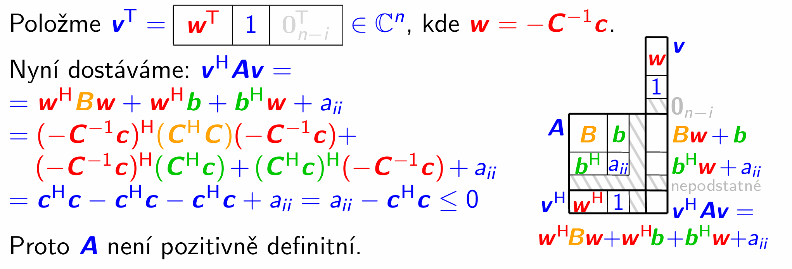

	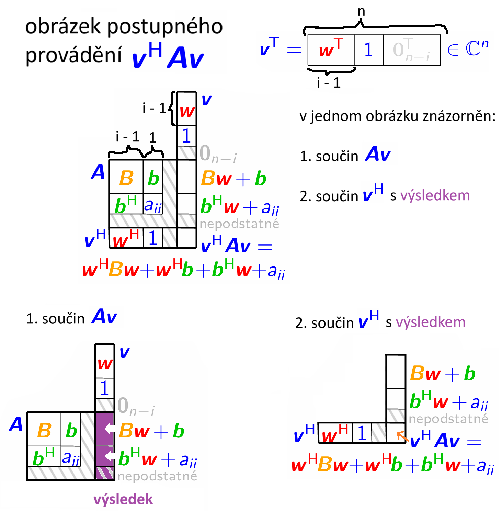
	- ješte k tomu blokovému násobení: je potřeba si uvědomit jaký mají tvar, a jaké prvky teda putují do jakých bloků
		- $\mathbf b \in \mathbb{C}^{(i-1) \times 1}$
		- $\mathbf b^H \in \mathbb{C}^{1 \times (i-1)}$
		- $B \in \mathbb{C}^{(i-1) \times (i-1)}$
		- $\mathbf w \in \mathbb{C}^{(i-1) \times 1}$ 
			- $B \mathbf w \in \mathbb{C}^{(i-1) \times 1}$ 
		- $\mathbf b^H \mathbf w \in \mathbb{C}$
		- v 1. součinu z řádku s $\mathbf b$ z toho vektoru jde vždy $1$ prvek, proto ok násobení se skalárem $1$ (= tam si to prostě představit po jednotlivých řádcích a sloupcích uvnitř bloků)
		- část nepodstatné je tam kvůli součinu s nulovým "podvektorem" uvnitř blokového vektoru $\mathbf v$

	> Substitujeme:
	>- $\mathbf w = -C^{-1} \mathbf c$
	>- $\mathbf b = C^H \mathbf c$
	>- $B = C^H C$
	>
	> 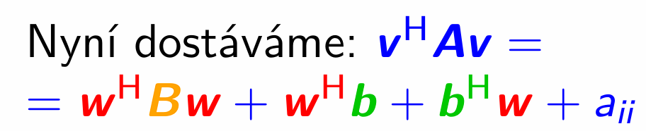

	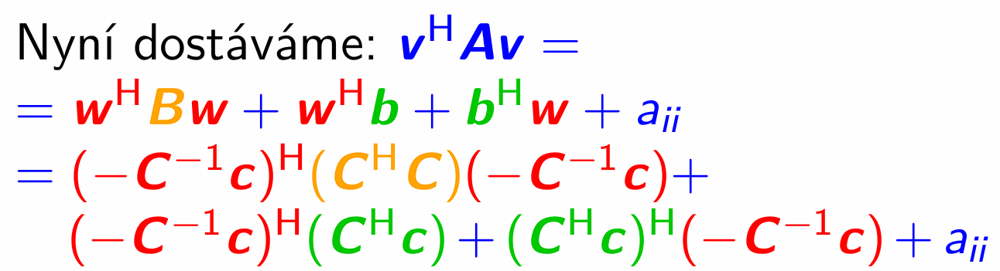

	$={\color{red} -\mathbf c^H (C^{-1})^H} \cdot {\color{gold} C^H C} \cdot {\color{red} - C^{-1} \mathbf c}+ {\color{red} -\mathbf c^H (C^{-1})^H} \cdot {\color{green} C^H \mathbf c}+ {\color{green} \mathbf c^H C} \cdot {\color{red} -C^{-1}\mathbf c} + {\color{blue} a_{ii}}$
	- pak $(C^{-1})^H C^H = (CC^{-1})^H = I^H = I$, všechny ty matice $C$ a jejich inverze se pokrátí:

	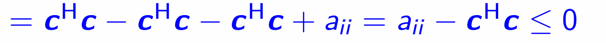

	- když si vzpomenem na začátek této řady rovností, tak vyšlo: $\mathbf v^H A \mathbf v \le 0$, skutečně znamená, 
	že matice není pozitivně definitní
____

> Choleského rozklad není jediný způsob, kterým lze zjistit, zdali je matice pozitivně definitní.
>
> Jaké jsou alternativní možnosti, si předvedeme příště.