## Pozitivně definitní matice, Choleského rozklad

> Minule jsme si ukázali, že skalární součin lze nadefinovat také pomocí vhodně nadefinované matice.
- 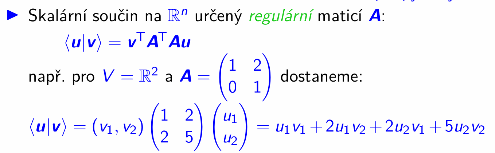
	-  $\mathbf v^T A^T$ je $(A\mathbf v)^T$, tj. $\langle \mathbf u | \mathbf v \rangle = (A\mathbf v)^T A \mathbf u$
> Těmto maticím se říká pozitivně definitní matice, a v dnešní lekci budeme podrobněji zkoumat jejich vlastnosti.

### Gramova matice
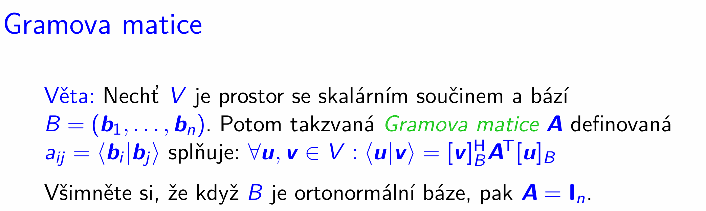

$$G = \begin{pmatrix}
\langle \mathbf b_1 \mid \mathbf b_1 \rangle & \langle \mathbf b_1 \mid \mathbf b_2 \rangle & \cdots & \langle \mathbf b_1 \mid \mathbf b_n \rangle \\
\langle \mathbf b_2 \mid \mathbf b_1 \rangle & \langle \mathbf b_2 \mid \mathbf b_2 \rangle & \cdots & \langle \mathbf b_2 \mid \mathbf b_n \rangle \\
\vdots & \vdots & \ddots & \vdots \\
\langle \mathbf b_n \mid \mathbf b_1 \rangle & \langle \mathbf b_n \mid \mathbf b_2 \rangle & \cdots & \langle \mathbf b_n \mid \mathbf b_n \rangle
\end{pmatrix}$$

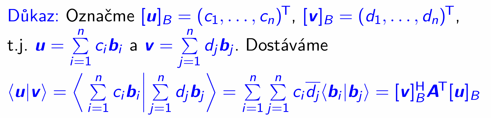

Ta transpozice tam vzniká z tohoto důvodu:

Dosadíme do tvaru z obrázku $a_{ij} = \langle \mathbf b_i | \mathbf b_j \rangle$:

$$\sum_{j=1}^n \sum_{i=1}^n \overline{d_j} \cdot a_{ij} \cdot c_i$$

Aby ale výraz s dvojitou sumou odpovídal maticovému součinu, je potřeba jiné pořadí indexů $i,j$ v prostředním členu:

$$\sum_{j=1}^n \sum_{i=1}^n \overline{d_j} \cdot a_{ij} \cdot c_i = \sum_{j=1}^n \sum_{i=1}^n \overline{d_j} \cdot M_{ji} \cdot c_i$$
- aby podle definice maticového součinu mohl proběhnout ten součin, tak tam musí být $M_{ji}$ (že jo v maticovém součinu řádek krát sloupec)

- $M_{ji} = a_{ij}$ znamená, že $M = A^T$

Tohle už můžeme interpretovat jako maticový součin.

$$\sum_{j=1}^n \sum_{i=1}^n \overline{d_j} \cdot (A^T)_{ji} \cdot c_i$$

A sice:

$$[\mathbf v]_B^H A^T [\mathbf u]_B$$


- $\bar{d}_j$ jsou složky $\mathbf v$ vyjádřeného vzhledem k bázi $B$ a poté hermitovsky transponovaného
- $c_i$ jsou složky $\mathbf u$ vyjádřeného vzhledem k bázi $B$

Kdybychom si označili vektory $\mathbf u$ a $\mathbf v$ trochu jinak, tak bychom se mohli vyhnout úvaze o tom, jak náš výraz poupravit, aby odpovídal maticovému součinu:

$$\mathbf u = \sum_{j=1}^n c_j \mathbf b_j$$

$$\mathbf v = \sum_{i=1}^n d_i \mathbf b_i$$

Pak totiž by byla ta transpozice $A$ jednodušeji viditelná:

$$\langle \mathbf u | \mathbf v \rangle = \left\langle \sum_{j=1}^n c_j \mathbf b_j \middle| \sum_{i=1}^n d_i \mathbf b_i \right\rangle =  \sum_{j=1}^n \sum_{i=1}^n c_j \bar{d}_i \langle \mathbf b_j |\mathbf b_i \rangle$$

- výsledkem skal. součinu je jedno číslo, součet je komutativní, proto změna pořadí sum ničemu nevadí, projdeme stejné prvky, ale v jiném pořadí

$a_{i,j} := \langle \mathbf b_i |\mathbf b_j \rangle$, tj. $a_{j,i} := \langle \mathbf b_j |\mathbf b_i \rangle$, a $(A^{\mathrm{T}})_{i,j} = a_{j,i}$, součin v tělese komutativní:

$$\sum_{i=1}^n \sum_{j=1}^n c_j \bar{d}_i \langle \mathbf b_j |\mathbf b_i \rangle = \sum_{i=1}^n \sum_{j=1}^n \bar{d}_i \cdot (A^{\mathrm{T}})_{i,j} \cdot c_j $$

To už přímo vede na $[\mathbf v]_B^H A^T [\mathbf u]_B$
- $\bar{d}_i$ jsou složky $\mathbf v$ vyjádřeného vzhledem k bázi $B$ a poté hermitovsky transponovaného
- $c_j$ jsou složky $\mathbf u$ vyjádřeného vzhledem k bázi $B$

<details>
<summary>
úvahy o interpretaci maticového součinu (když už víme, jak má vypadat maticový součin dobrat se k tomu předchozímu výrazu s dvojitou sumou)
</summary>

To Gramova matice splňuje $\langle \mathbf u | \mathbf v \rangle = [ \mathbf v ]_B^H A^T [\mathbf u ]_B$ lze odvodit takto.

Odvoďme si nejdřív obecný vzorec pro tento maticový součin:

$$\text{(řádek délky $n$)} \times (\text{matice } n \times n) \times (\text{sloupec délky $n$})$$

Označme si:
- řádek délky $n$: $\mathbf d = (\bar{d}_1 \ \dots \ \bar{d}_n)$
- tu matici $n \times n$: $B$
- sloupec délky $n$: $\mathbf c = \begin{pmatrix} c_1 \\ \vdots \\ c_n \end{pmatrix}$

Součin


$$(\text{matice } n \times n) \times (\text{sloupec délky $n$})$$

výsledek $B \mathbf c$ je vektor, $i$-tá složka je:

$$(B \mathbf c)_{i} = \sum_{j=1}^n b_{i,j} \cdot c_j$$

Tedy:

$$B \mathbf c = \begin{pmatrix} (B \mathbf c)_1 \\ \vdots \\ (B \mathbf c)_n \end{pmatrix} = \begin{pmatrix} \displaystyle\sum_{j=1}^n b_{1,j} \cdot c_j \\ \vdots \\ \displaystyle\sum_{j=1}^n b_{n,j} \cdot c_j \end{pmatrix}$$

Součin
$$\text{(řádek délky $n$)} \times (\text{matice } n \times n) \times (\text{sloupec délky $n$})$$

$$(\bar{d}_1 \ \dots \ \bar{d}_n) \cdot 

\begin{pmatrix}
\displaystyle\sum_{j=1}^n b_{1,j} \cdot c_j \\
\vdots \\
\displaystyle\sum_{j=1}^n b_{n,j} \cdot c_j
\end{pmatrix}

= \bar{d}_1 \sum_{j=1}^n b_{1,j} \cdot c_j + \dots + \bar{d}_n \sum_{j=1}^n b_{n,j} \cdot c_j$$

$$\bar{d}_1 \sum_{j=1}^n b_{1,j} \cdot c_j  + \dots + \bar{d}_n \sum_{j=1}^n b_{n,j} \cdot c_j = \sum_{i=1}^n \left( \bar{d}_i \sum_{j=1}^n b_{i,j} \cdot c_j \right)$$

$$\sum_{i=1}^n \left( \bar{d}_i \sum_{j=1}^n b_{i,j} \cdot c_j \right) = \sum_{i=1}^n \left(  \sum_{j=1}^n \bar{d}_i b_{i,j} \cdot c_j \right)$$

$$\sum_{i=1}^n \left(  \sum_{j=1}^n \bar{d}_i b_{i,j} \cdot c_j \right)$$

A to už je velmi podobné výrazu na obrázku - akorát oproti němu mám prohozený význam proměnných $i$ a $j$,jelikož na obrázku je $\bar{d}_j$ a já mám $\bar{d}_i$, stejně tak na obrázku je $c_i$ a já mám $c_j$.

To můžu jednoduše změnit:

$$\sum_{j=1}^n \left(  \sum_{i=1}^n \bar{d}_j b_{j,i} \cdot c_i \right)$$

A nyní stačí jen prohodit vnější a vnitřní sumu - to můžeme udělat, i tak projdeme všechny prvky, ale v jiném pořadí, součet je komutativní, pohoda
- stejně jako dva vnořené `for` cykly můžeme prohodit a projde to stejné prvky, tj.

<!--  markdown tables dont support code blocks inside lol, so html it is... !-->
<table>
<tr>
<td>

```py
for i in range(n):
	for j in range(n):
		...
```
</td>
<td>

```py
for j in range(n):
	for i in range(n):
		...
```

</td>
</tr>
</table>

$$\sum_{i=1}^n \sum_{j=1}^n \bar{d}_j b_{j,i} \cdot c_i $$

Z toho už je vidět, proč je tam $A^T$ (že jo $A^T := a_{j,i}$)


</details>

#### Vlastnosti Gramovy matice
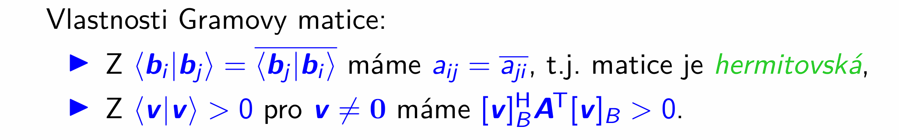
- to 1. je že jo axiom skalárního součinu
- to $\langle \mathbf v | \mathbf v \rangle > 0$ pro $\mathbf v \neq 0$ je též axiom skal. součinu
	- před chvílí jsme dokázali, že $\langle \mathbf u | \mathbf v \rangle = [\mathbf v]_B^H A^T [\mathbf u]_B$

> Maticím, které mají tyto $2$ vlastnosti dáme zvláštní jméno:
> ### Pozitivně definitní matice
> 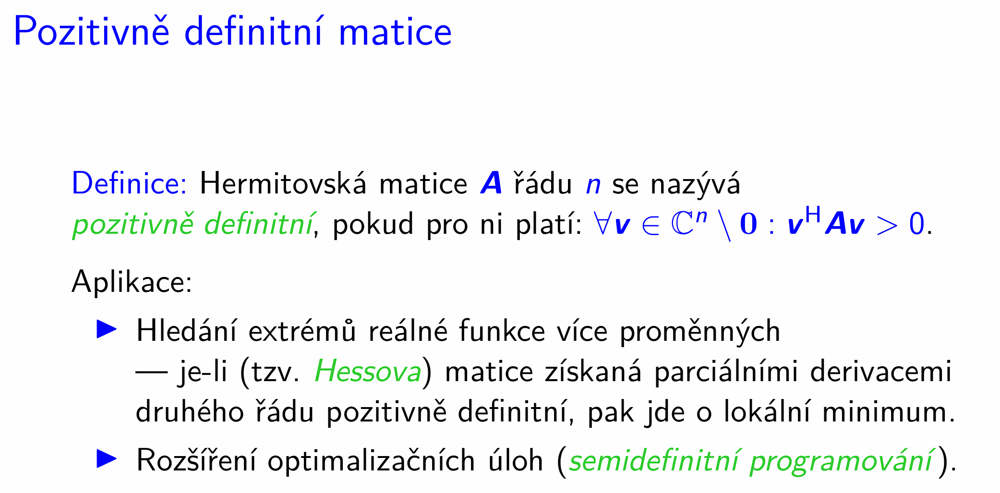
- přeznačili jsme $A^T$ na $A$, a platit to bude, protože $A^T$ je též hermitovská

> 
> - na první pohled ovšem není vidět, že by tato matice splňovala uvedenou podmínku pro všechny možné komplexní 2složkové vektory

> Ukážeme si však, že je možné efketivně rozhodnout, zda-li je matice pozitivně definitní.
>
> Než se k tomuto výpočtu dostaneme, ukážeme si některé základní vlastnosti pozitivně definitních matic.

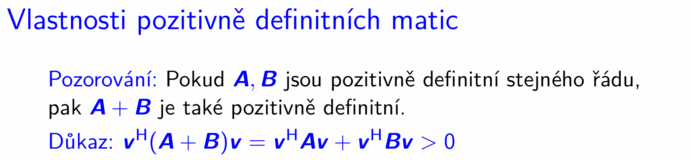
- ukazujeme $\mathbf v^H (A + B) \mathbf v > 0$


$\mathbf v^H A \mathbf v > 0$


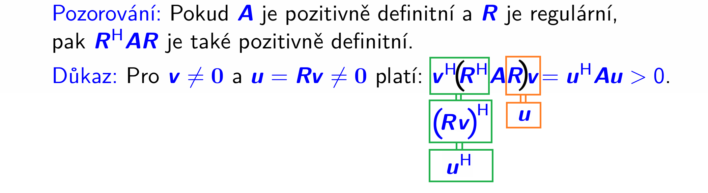
- $R$ regulární, tj. nemůže zobrazit netriviální vektor na triviální vektor

<details>
<summary>
Důkaz:
</summary>

Představme si, že máme nenulový vektor 
$\vec{x} \neq \vec{0}$.
Chceme ukázat, že jeho obraz 
$A\vec{x}$ nemůže být nulový vektor 
$\vec{0}$.


Předpokládejme pro spor, že by platilo:

$$A\vec{x} = \vec{0}$$


Protože je matice 
$A$ regulární, existuje její inverzní matice 
$A^{-1}$. Vynásobíme obě strany rovnice zleva maticí 
$A^{-1}$:

$$A^{-1}(A\vec{x}) = A^{-1}\vec{0}$$


Na levé straně se 
$A^{-1}A$ změní na jednotkovou matici 
$I$:

$$I\vec{x} = \vec{0}$$

$$\vec{x} = \vec{0}$$


To je ale spor s naším původním předpokladem, že 
$\vec{x}$ je netriviální (
$\vec{x} \neq \vec{0}$).


Proto 
$A\vec{x}$ nikdy nemůže být 
$\vec{0}$, pokud 
$\vec{x} \neq \vec{0}$.

Další pohled na věc je, že $A\vec{x} = \vec{0}$ s regulární $A$ je homogenní soustava rovnic. Ta má právě jedno řešení, $\vec{x} = \vec{0}$

</details>


Důkaz:

$A$ je pozitivně definitní $\implies$ $A$ je regulární

obměna:

$A$ je singulární $\implies$ $A$ není pozitivně definitní


- to je vlastnost singulární matice, že homogenní soustava s ní má netriviální řešení (protože že jo volné proměnné)
- aby $A$ pozitivně definitní byla, tak bychom chtěli $\mathbf v^H A \mathbf v > 0$

Důkaz $A$ pozitivně definitní $\implies$ $A^{-1}$ pozitivně definitní
> Jakmile víme, že $A$ regulární, můžeme ukázat, že její inverzní matice je taky hermitovská, tj. ukázat $A^{-1} = (A^{-1})^H$

postupně tedy upravíme $(A^{-1})^H$ tak, abychom dostali $A^{-1}$:

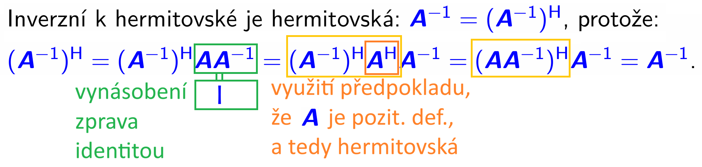

Takže máme to, že $A^{-1}$ je hermitovská, a že tedy vůbec může být kandidátem na to, aby byla pozitivně definitní. Ještě ale potřebujeme dokázat, že pro $A^{-1}$ platí $\forall \mathbf v \in \mathbb{C} \setminus \set{\mathbf 0}: \mathbf v^H A^{-1} \mathbf v > 0$

Máme na to předchozí pozorování:


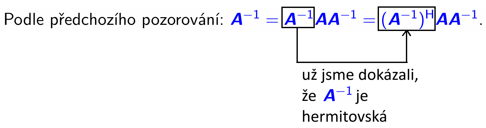
- a ten tvar $(A^{-1})^H A A^{-1}$ je ten tvar $R^H A R$:
	1. $A$ je pozitivně definitní
	2. Tzn. $(A^{-1})^H A A^{-1}$ je pozitivně definitní
- a z rovnosti na tomhle obrázku vidíme, že i $A^{-1}$ je pozitivně definitní

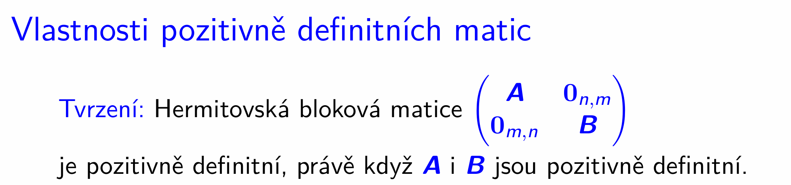
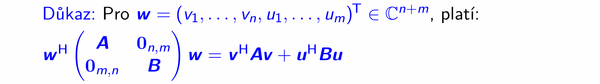

Z té blokové matice si můžeme uvědomit, jaké tvary musí mít $A$ a $B$ = tu informaci nám dají ty bloky $0_{n,m}$ a $0_{m,n}$:
- $A \in \mathbb{C}^{n \times m}$ 
- $B \in \mathbb{C}^{m \times n}$

$\mathbf w^{\mathrm{H}} \begin{pmatrix} A & 0_{n,m} \\ 0_{m,n} & B \end{pmatrix} \mathbf w = \begin{pmatrix} \bar{v}_1 &\dots & \bar{v}_n & \bar{u}_1 & \dots & \bar{u}_m \end{pmatrix} \begin{pmatrix} A & 0_{n,m} \\ 0_{m,n} & B \end{pmatrix} \begin{pmatrix} v_1 \\ \vdots \\ v_n \\ u_1 \\ \vdots \\u_m  \end{pmatrix}$


Vyhodnotme si první část:

$$\begin{pmatrix} \bar{v}_1 &\dots & \bar{v}_n & \bar{u}_1 & \dots & \bar{u}_m \end{pmatrix} \begin{pmatrix} A & 0_{n,m} \\ 0_{m,n} & B \end{pmatrix} \\ =

\begin{pmatrix}

\begin{pmatrix} \bar{v}_1 &\dots & \bar{v}_n \end{pmatrix} A  + \begin{pmatrix} \bar{u}_1 & \dots & \bar{u}_m \end{pmatrix} 0_{m,n} 


& 

\begin{pmatrix} \bar{v}_1 &\dots & \bar{v}_n \end{pmatrix} 0_{n,m}  + \begin{pmatrix} \bar{u}_1 & \dots & \bar{u}_m \end{pmatrix} B 

\end{pmatrix}$$

A vyhodnoťme zbytek:
$$
\begin{pmatrix}
\ 
\boxed{\begin{pmatrix} \bar{v}_1 &\dots & \bar{v}_n \end{pmatrix} A  + \begin{pmatrix} \bar{u}_1 & \dots & \bar{u}_m \end{pmatrix} 0_{m,n}}


& 

\boxed{\begin{pmatrix} \bar{v}_1 &\dots & \bar{v}_n \end{pmatrix} 0_{n,m}  + \begin{pmatrix} \bar{u}_1 & \dots & \bar{u}_m \end{pmatrix} B} 

\end{pmatrix} 

\begin{pmatrix} 
\ 
\boxed{\begin{matrix} v_1 \\ \vdots \\ v_n \end{matrix}}  \ 

\\
\\

\boxed{\begin{matrix} u_1 \\ \vdots \\ u_m \end{matrix}}

\end{pmatrix}$$

Součiny s nulovou maticí ignorujme, a zde máme výsledek:

$$= \begin{pmatrix} \bar{v}_1 & \dots & \bar{v}_n \end{pmatrix} A \begin{pmatrix} v_1 \\ \vdots \\ v_n \end{pmatrix} + \begin{pmatrix} \bar{u}_1 & \dots & \bar{u}_m \end{pmatrix} B \begin{pmatrix} u_1 \\ \vdots \\ u_m \end{pmatrix}$$

A to přesně odpovídá výslednému výrazu:

$ = \mathbf v^H A \mathbf v + \mathbf u^H B \mathbf u$
___

Teď, když už máme tu rovnost

$\mathbf w^{\mathrm{H}} \begin{pmatrix} A & 0_{n,m} \\ 0_{m,n} & B \end{pmatrix} \mathbf w  = \mathbf v^H A \mathbf v + \mathbf u^H B \mathbf u$

tak můžeme začít uvažovat o tom, jestli to je $>0$

1. $A$ i $B$ jsou pozitivně definitní $\implies$ $\begin{pmatrix} A & 0_{n,m} \\ 0_{m,n} & B \end{pmatrix}$ je pozitivně definitní
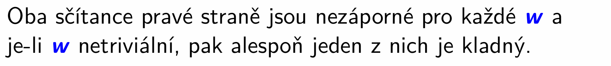
	- nezáporné jsou proto, že $A$ je pozitivně definitní (= $\forall \mathbf v \in \mathbb{C}^n \setminus \set{\mathbf 0}: \mathbf v^H A \mathbf v > 0 $, a když dosadíme $\mathbf 0$, tak to ofc vyjde $0$), to stejné s $B$
		- je-li $\mathbf w$ netriviální, tak alespoň v jedné z těch částí $v_1, \dots, v_n$ nebo $b_1, \dots, b_n$ je alespoň jeden nenulový prvek, vyjde to kladné, jak vyžaduje levá strana k tomu, aby  $\begin{pmatrix} A & 0_{n,m} \\ 0_{m,n} & B \end{pmatrix}$ byla pozitivně definitní
		- kdyby triviální byl, tak to taky nevadí, vyjde $0 = 0$

2. $\begin{pmatrix} A & 0_{n,m} \\ 0_{m,n} & B \end{pmatrix}$ je pozitivně definitní $\implies$ $A$ i $B$ jsou pozitivně definitní

$\begin{pmatrix} A & 0_{n,m} \\ 0_{m,n} & B \end{pmatrix}$ je pozitivně definitní znamená $\forall \mathbf w \in \mathbb{C}^n \setminus \set{\mathbf 0}: \mathbf w^H \begin{pmatrix} A & 0_{n,m} \\ 0_{m,n} & B \end{pmatrix} \mathbf w > 0$

Když můžeme zvolit všechny a bude to platit, zvolme si $\mathbf w = (v_1, \dots, v_n, 0, \dots, 0)^T$, pak při dosazení do  $\mathbf v^H A \mathbf v + \mathbf u^H B \mathbf u$ dostaneme $\mathbf v^H A \mathbf v$

Takže:

$\forall \mathbf w \in \mathbb{C}^n \setminus \set{\mathbf 0}: \mathbf w^H \begin{pmatrix} A & 0_{n,m} \\ 0_{m,n} & B \end{pmatrix} \mathbf w > 0$ $\implies$ 

$\mathbf w = (v_1, \dots, v_n, 0, \dots, 0)^T: \quad \mathbf w^H \begin{pmatrix} A & 0_{n,m} \\ 0_{m,n} & B \end{pmatrix} \mathbf w > 0$ $\implies$

$\mathbf v^H A \mathbf v > 0$, a to je cíl, $A$ tedy je pozitivně definitní
- ta část $v_1, \dots, v_n$ v $\mathbf w$ je libovolná, tzn. tohle platí $\forall \mathbf v$, přesně jak má být

Tohle přesně říká kus prezentace:

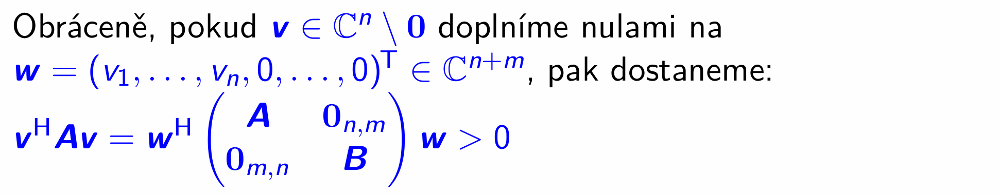


- tzn taky volbou vhodného komplex. vektoru:
	- libovolný $\mathbf u \in \mathbb{C}^m \setminus \set{\mathbf 0}$ doplníme nulami na $\mathbf w = (0, \dots, 0, u_1, \dots, u_m)^T \in \mathbb{C}^{n+m}$, při dosazení do  $\mathbf v^H A \mathbf v + \mathbf u^H B \mathbf u$ dostaneme $\mathbf u^H B \mathbf u$

		$\forall \mathbf w \in \mathbb{C}^n \setminus \set{\mathbf 0}: \mathbf w^H \begin{pmatrix} A & 0_{n,m} \\ 0_{m,n} & B \end{pmatrix} \mathbf w > 0$ $\implies$ 

		$\mathbf w = (0, \dots, 0, u_1, \dots, u_m)^T: \quad \mathbf w^H \begin{pmatrix} A & 0_{n,m} \\ 0_{m,n} & B \end{pmatrix} \mathbf w > 0$ $\implies$

		$\mathbf u^H B \mathbf u > 0$, tzn. $B$ je pozitivně definitní