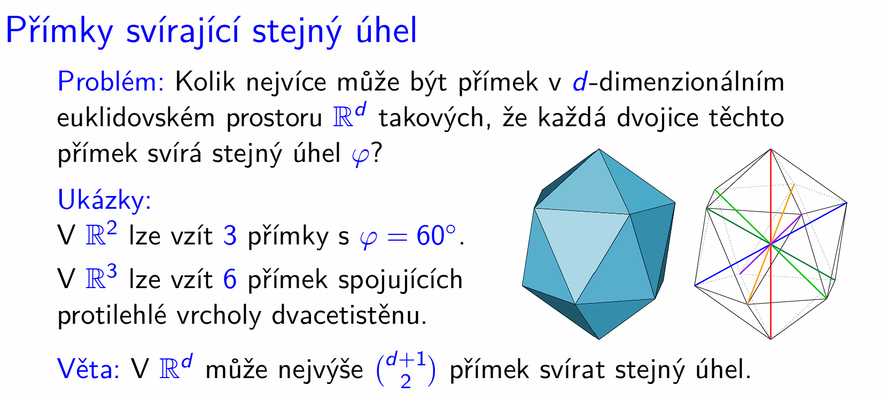
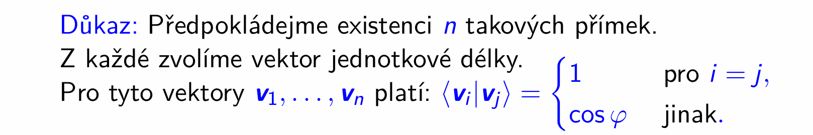
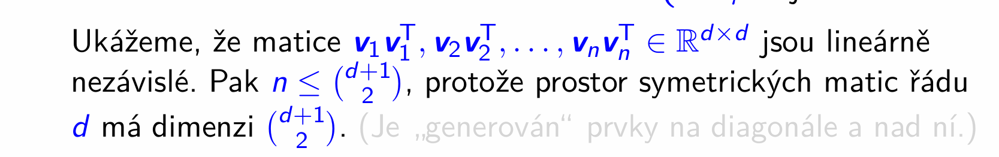
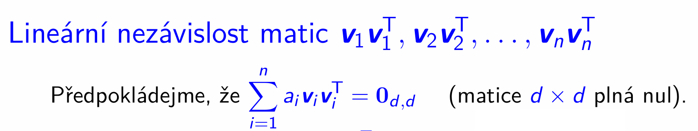
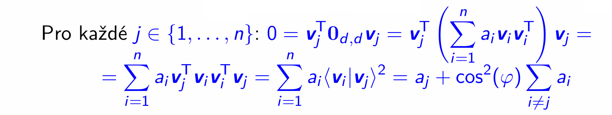
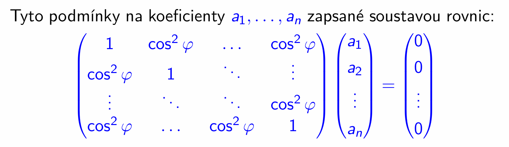

# Přímky svírající stejný úhel
> Lineární algebra úzce souvisí s geometrií, a proto se nyní zaměříme na problém, který je formulován zcela geometricky. Půjde o to, že se budeme snažit ve mnoharozměrném Euklidovském prostoru nalézt co největší počet přímek takových, že každé 2 svírají stejný úhel. 
>
> I když tato otázka vypadá na 1. pohled geometricky nebo spíše kombinatoricky, předvedeme si, že koncepty z lineární algebry nám ji pomohou uspokojivě vyřešit.

- > věta bude pouze omezovat počet těchto přímek, čili nedokážeme zjistit, zda-li skutečně existují.
- > představme si však, že nějakých takových $n$ přímek máme:

- Cílová rovinka je $n \le {d+1 \choose 2}$
	-  $\text{dimenze podprostoru} \le \text{dimenze prostoru}$
	- prostor je prostor symetrických matic
	- jeho podprostor je generovaný symetrickými maticemi $\mathbf v_1 \mathbf v_1^T, \dots, \mathbf v_n \mathbf v_n^T$
		- těchto matic je $n$ a jsou LN $\implies \dim = n$

1. Proč prostor symetrických matic má dimenzi ${d+1 \choose 2}$
	- symetrickou matici můžeme určit prvky na diagonále a nad ní (ty pod ní jsou jednoznačně určeny těmi nad ní)
	- v $1.$ sloupci $1$ prvek, v $2.$ sloupci $2$ prvky, v $d$-tém sloupci $d$ prvků
		- $1 + \dots + d = \frac{d(d+1)}{2}$
		- ${d+1 \choose 2} = \frac{(d+1)!}{2! (d+1-2)!} = \frac{d(d+1)}{2}$

2. Proč jsou matice $\mathbf v_1 \mathbf v_1^T, \dots, \mathbf v_n \mathbf v_n^T$ lineárně nezávislé

Předpokládejme, že jsou závislé (že jde jedna vyjádřit pomocí ostatních):

Pak ukážeme, že tomu tak není, že koeficienty této lineární kombinace budou nulové.

(rovnost, kde postupně dojdeme o levé strany k pravé)

- 0 = součin s nulovou maticí uprosted
- dosadíme za nulovou matici sumu
- roznásobíme závorku a výsl. $n$ členů zapíšeme znovu sumou
- $\mathbf v_j^T \mathbf v_i = \langle \mathbf v_j | \mathbf v_i \rangle$
- $\mathbf v_i^T \mathbf v_j = \langle \mathbf v_i | \mathbf v_j \rangle$
- jsme na realných číslech, $\langle \mathbf v_j | \mathbf v_i \rangle = \langle \mathbf v_i | \mathbf v_j \rangle$
- $\langle \mathbf v_i | \mathbf v_j \rangle = \begin{cases} 1 & \text{pro } i = j \\ \cos\varphi & \text{jinak}\end{cases}$
____

Pro každé $j \in \set{1, \dots, n}:$

$$ 0 = a_j + \cos^2 (\varphi) \sum_{i \neq j} a_i$$

Znamená, že máme $n$ lineárních rovnic, kde hledáme řešení koeficientů $a_1, \dots a_n$:

> Lze ukázat, že matice této soustavy je regulární, právě když $\cos \varphi \neq \pm 1$, tj. $\varphi \neq 0^\circ$ a $\varphi \neq 180^\circ$
>
> Mají-li tyto přímky svírat nějaký netriviální úhel, je matice regulární.
> Soustava má tedy pouze triviální řešení.

- pro triviální úhly  $\varphi \neq 0^\circ$ a $\varphi \neq 180^\circ$ věta:

	V $\reals^d$ může nejvýše ${d+1 \choose 2}$ přímek svírat stejný úhel

	platí triviálně, protože přímky svírající stejný úhel jsou totožné = je to jedna přímka
		= ta může ležet v prostoru dimenze $d \ge 1$.
	
	takže skutečně vychází

	pro $\reals^1$ nejvýše ${2 \choose 2} = 1$