# 1. Determinanty

## Determinanty, základní vlastnosti (15:16, 59M)
prezentace [https://kam.mff.cuni.cz/~fiala/LA2/113-determinanty.pdf](https://kam.mff.cuni.cz/~fiala/LA2/113-determinanty.pdf)

Determinant je číslo, které je přiřazeno ke čtvercové matici.

Byl objeven, když se lidé snažili získat formulku, která by jim umožnila řešit soustavy s regulární maticí.
Hned vám ukážu, o jak složitý výraz jde a jaké má vlastnosti.

Máme-li soustavu 2 lineárních rovnic o 2 neznámých s regulární maticí A, pak víme, že tato soustava má jednoznačné řešení.

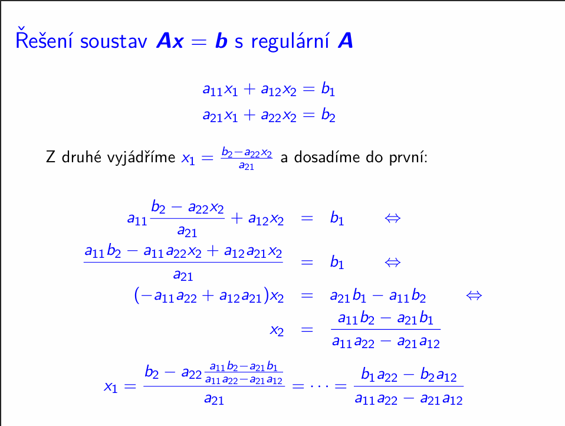

Když tento podíl $\frac{a_{11} b_{2} - a_{21} b_{1}}{a_{11} a_{22} - a_{21} a_{12}}$ dosadíme do vyjádření $x_1$, zjistíme, že podobným podílem můžeme vyjádřit i $x_1$.

Čeho si můžeme všimnout je, že jmenovatelé v obou podílech jsou shodné. V každém se vyskytují koeficienty matice $A$.
A v čitateli se vyskytují koeficienty vektoru pravých stran.

Stejným způsobem, tzn vyjadřováním neznámých a dosazováním do ostatních rovnic můžeme vyřešit i soustavu 3 lineárních rovnic o 3 neznámých s regulární maticí a získat tyto výrazy pro neznámé $x_1$, $x_2$, $x_3$:

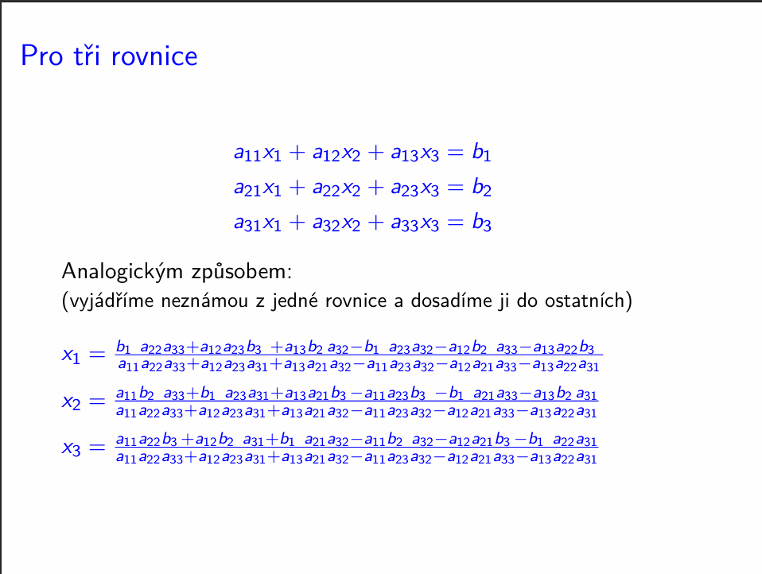

Opět si všimneme, že jmenovatelé jsou stejné, v čitatelích jsou výrazy, kde se vyskytují koeficienty z vektoru pravých stran.

Každý jmenovatel je dán součtem několika součinů, přičemž členy, které v těchto součinech jsou vždy vybírají koeficienty tak, že z každého řádku a každého sloupce vybírám pouze 1 člen (tj koeficienty jednoho součinu jsou všechny v různých sloupcích a různých řádcích)

Můžeme si také všimnout, že u některých členů je znaménko kladné, a u některých záporné.

Tyto vlastnosti bude mít i formální definice determinantu.

Než si determinant zadefinujeme, připomeneme si, že symbolem $S_n$ značíme grupu permutací na množině přirozených čísel od $1$ do $n$, a že znaménko permutace odpovídá paritě (=sudost/lichost) počtu inverzí.
Čili máme permutace, které mají kladné znaménko, a permutace, které mají záporné.

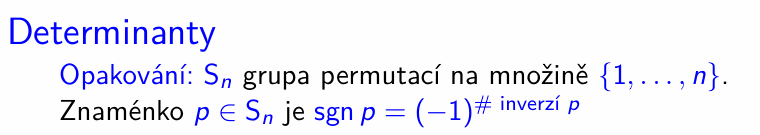

Determinant spočteme tak, že:
- probereme všechny možné permutace s grupy permutací na $n$ prvcích
- pro každou z těchto permutací určíme její znaménko, a toto znaménko vynásobíme tím součinem (=co se zmiňoval výše)
	- = součinem, kde postupně vybíráme všechny řádky matice, tím $i$, a na každém řádku vybereme $p(i)$-tý prvek (prvek, který je dán obrazem indexu řádku v rámci permutaci $p$).
- součin společně se znaménkem nám dá 1 sčítanec ve velkém součtu, ve kterém sčítáme přes všechny možné permutace 

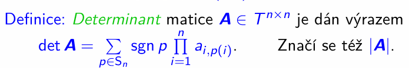

Výpočet deteminantu pro matici řádu 2:

Na 2 prvcích máme pouze 2 permutace:
- identickou permutaci (=identitu)
- permutaci, která odpovídá transpozici prvků 2 a 1

identita má kladné znaménko, tranpozice má záporné znaménko

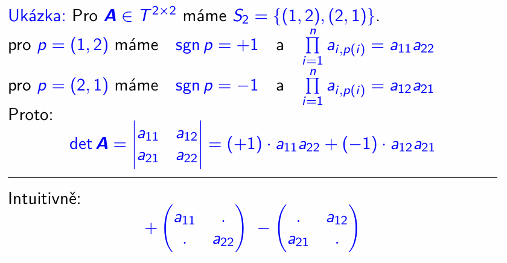

Pro výpočet determinantu matice řádu 3 máme 6 permutací, z toho 3 kladné znaménko, 3 záporné znaménko

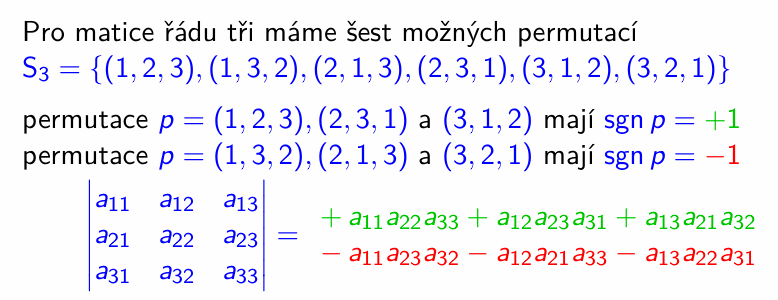

Tento výraz odpovídá jmenovateli, který jsme viděli v řešení soustavy 3 lineárních rovnic o 3 neznámých.

Pro zapamatování, které členy mají mít kladné a které záporné znaménko se používá tzv. **Sarrusovo pravidlo** (to je btw fakt dobrý výpočetní trik)

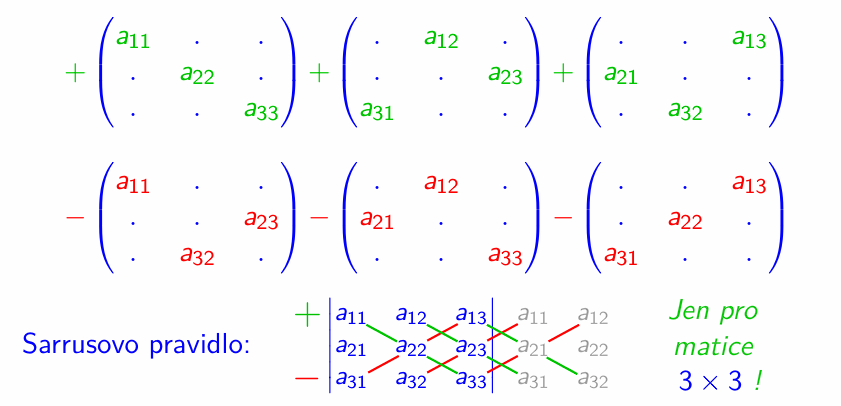

$a_{11} \cdot a_{22} \cdot a_{33} + a_{12} \cdot a_{23} \cdot a_{31} + a_{13} \cdot a_{21} \cdot a_{32} - a_{31} \cdot a_{22} \cdot a_{13} - a_{32} \cdot a_{23} \cdot a_{11} - a_{33} \cdot a_{21} \cdot a_{12}$

Btw: Existuje i varianta, kde se píšou další 2 řádky (ne sloupce):
(vyjde to nastejno):

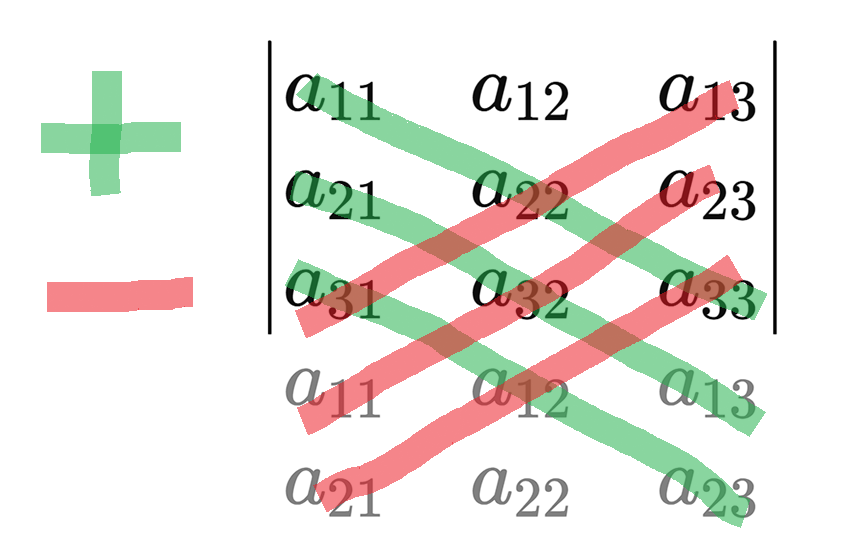

(funguje jenom pro matice 3x3)

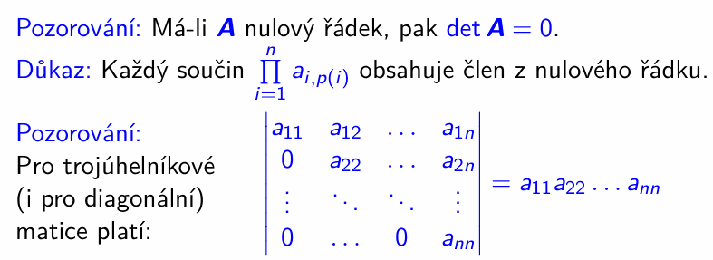

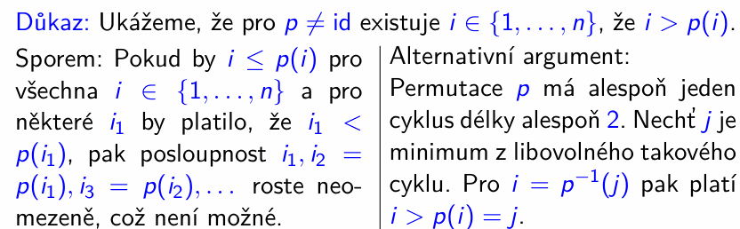

(starší verze důkazu sporem z videa:

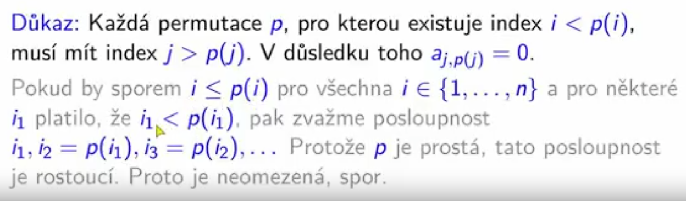
)

**Ten důkaz sporem, podrobněji:**

>Pokud by $\forall i \in \set{1, \dots, n} :i \le p(i)$
___________________________

(tj. pro každou dvojici $(i, p(i))$ by odpovídající prvek $a_{i, p(i)}$ byl v tom horním trojúhelníku: 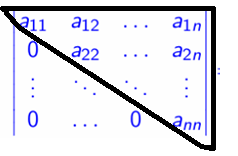)
________________
> A pro některé $i_1$ by platilo, že $i_1 < p(i_1)$, pak posloupnost $i_1, i_2 = p(i_1), i_3 = p(i_2), \dots$ roste neomezeně, což není možné.
_____
K pochopení mi pomohlo nakreslit si obrázek:

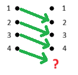

levý sloupec je $i$, pravý sloupec je $p(i)$

Předtím jsme řekli, že $\forall i \in \set{1, \dots, n} :i \le p(i)$. A pak, že pro nějaký prvek platí dokonce $i < p(i)$. To znamená, že ta posloupnost je rostoucí. 
Proč rostoucí, a ne jen neklesající? Protože zobrazení $p(i)$ je permutace, tedy je bijektivní, tj. surjektivní a **prosté** = nemůžou se zobrazit 2 prvky na stejný prvek. 

=> A to teda znamená, že ten prvek, pro který platí $i < p(i)$, na obrázku ta $1$, si vynucuje, aby se další prvek, na obrázku $2$, zobrazil na nějaké vyšší číslo. (Kdyby se $2$ zobrazila na $2$, tak by se dva prvky zobrazily na stejný prvek. To nejde.)

Prvek $2$ tak pro změnu donutí prvek $3$, a tak to prokaskáduje až na konec, na obrázku prvek $4$. Jenže kam se má zobrazit ten?

A zde narážíme na spor = "pak posloupnost $i_1, i_2 = p(i_1), i_3 = p(i_2), \dots$ roste neomezeně, což není možné."

Obor hodnot je omezen, je to jen $\set{1, \dots, n}$
=> spor s tím neomezeně v tom růstu (= ten obor hodnot je pro permutaci daná věc, takže rostoucí na celém def. oboru být nemůže)

Pokud bychom přece chtěli někam prvek $4$ zobrazit, tak nám zbývá akorát $1$ => a to by teda byl spor s tím "rostoucí"

To jest, rozbíjí se to, odhalili jsme spor.

Jinými slovy opravdu platí, že:

> pro $p \neq \text{id}$ existuje $i \in \set{1, \dots, n}$, takový, že $i > p(i)$

(tedy ten "klesající")

=> tedy ten prvek mimo horní trojúhelník

, tedy v oblasti kde jsou $0$

=> každá permutace, která má nějaký člen nad hlavní diagonálou, má i nějaký člen pod ní, který je $0$, proto se do výsledku nezapočítá

=> dá se na to pohlížet i geometricky = tak, že každý součin $\prod_{i=1}^n a_{i, p(i)}$ má $n$ členů, a díky tomu, jak musí být rozmístěny - žádné 2 se nemohou shodovat ani v řádku, ani v sloupci - tak pokud se chceme vyhnout oblasti pod hlavní diagonálou, tak je můžeme naskládat jenom na hlavní diagonálu.
	
=> skutečně, jenom ta permutace nás zajímá, úvodní vztah platí:

$\begin{vmatrix}
a_{11} & a_{12} & \dots & a_{1n} \\
0 & a_{22} & \dots & a_{2n} \\
\vdots & \ddots & \ddots & \vdots \\
0 & \dots & 0 & a_{nn}
\end{vmatrix} = a_{11} a_{22} \dots a_{nn}$

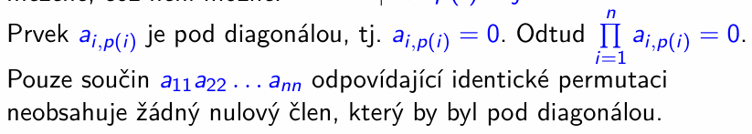

### Vlastnosti determinantu

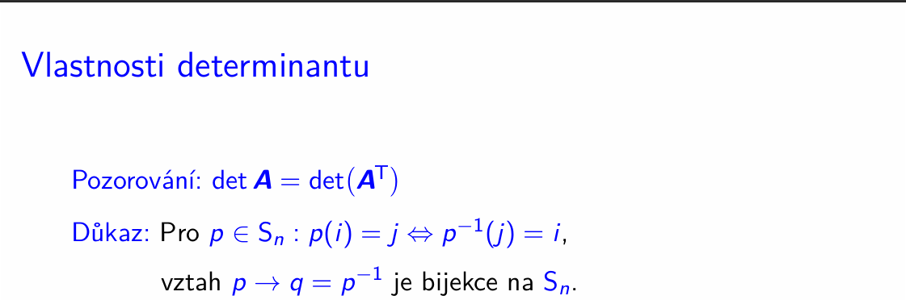
Vztah mezi permutací a její inverzí je bijekce.

(tím $p \to q = p^{-1}$ "zkomprimoval" 2 věci dohromady:
$p \to p^{-1}$ a přeznačení $q = p^{-1}$ pro přehlednost ve zbytku důkazu.)

(a pokud bychom chtěli být formální, tak řekl "bijekce **mezi**", což znamená obojsměrný vztah (bijektivní zobrazení z A do B a jemu inverzní bijektivní zobrazení z B do A), a $\to$ je vztah jednosměrný (bijektivní zobrazení z A do B)
=> asi když se množiny A, B rovnají, tak je to asi jedno

=> mohli bychom ale napsat $p \leftrightarrow p^{-1}$, pro naprostou zřejmost, ne?
)

 

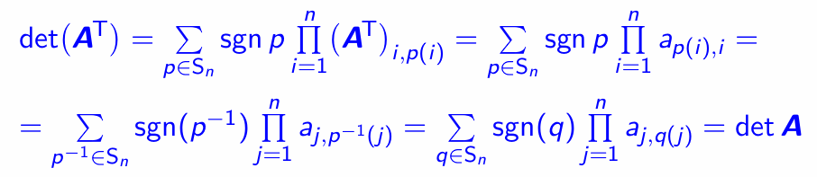
použito (co odrážka to rovnítko):
- definice determinantu
- definice transpozice matice
- substituce $p^{-1}(j)$ za $i$ a substituce $j$ za $p(i)$, a aby to sedělo, aby se mělo kde vzít $p^{-1}$, tak v sumě změna z $p$ na $p^{-1}$ (viz další odstavec), využití, že $p$ a $p^{-1}$ má stejné znaménko
- substituce $q$ za $p^{-1}$ - I assume aby nás nemátl ten exponent, prostě další písmenko
- s tím $q$ to zcela jasně odpovídá definici $\det A$ 

Ano, tím $p^{-1} \in S_n$ probereme ve finále stejné permutace jako tím $p \in S_n$, protože v grupě každý prvek má inverzní prvek = každá permutace je k nějaké permutaci inverzní.

=> nutno říct, že ve výrazy $\sum_{p \in S_n}$ a $\sum_{p^{-1} \in S_n}$ bychom neměli brát jako for loopy, které probírají prvky ve stejném pořadí (samozřejmě, $p$ na "i-té pozici" se nutně nerovná $p^{-1}$ (to ostatně platí jenom pro identitu)) => prostě ale v nějakém pořadí se to projde, v grupě je všechno, a sčítání je komutativní, pohoda

(v tom je ta změna $p$ na $p^{-1}$ trochu jiná no, není to substituce v tradičním slova smyslu, kde se ty výrazy rovnají)

Permutace $p$ a její inverze mají stejné znaménko (= že jo logické, protože # inverzí je počet křížení když si permutaci nakreslíme jako graf => pro inverzní permutaci akorát otočíme směř šipek, ale samotné úsečky šipek tam zůstanou => kříží se ve stejných místech, stejný počet křížení => stejný počet inverzí => stejné znaménko (= $-1^{\text{počet inverzí}}$))

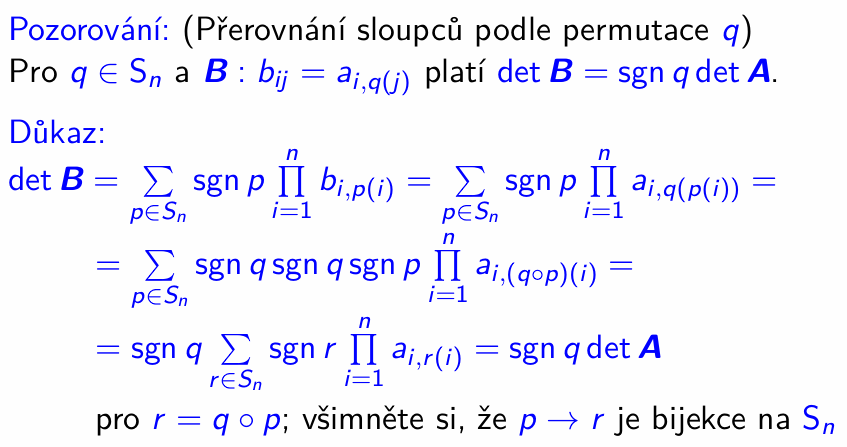

použito:
- def. determinantu
- když $j=p(i)$, tak $b_{i, p(i)} = a_{i, q( p(i) )}$
- každý člen sumy vynásobíme $1$, tj. $\text{sgn } (q) \cdot \text{sgn } (q) = 1$
- $q(p(i))$ buď můžeme brát jako postupnou aplikaci permutací: nejdřív aplikujeme $p$, pak $q$, NEBO jako složenou permutaci (tj. aplikujeme jednou tu složenou permutaci $r := q \circ p$, a máme výsledek)
	- abychom mohli udělat tohle, tak je třeba určit znaménko $q \circ p$, což je  $\text{sgn } r =  \text{sgn } (q) \cdot \text{sgn } (p)$
- vytknutí $1 = \text{sgn } q$ před sumu, změna sumy na $r \in S_n$, protože teď pravujeme s tou složenou permutací $r$ (můžeme udělat, protože $S_n$ je grupa permutací = je uzavřena na skládání permutací (a zároveň asi bude platit, že mezi $p \in S_n$ a $q \circ p$ je bijekce)

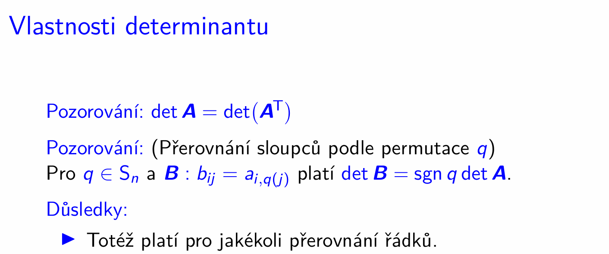

(protože výměna 2 řádků = ta permutace je transpozice = záporné znaménko ($-1^{\operatorname{\# inverzí}} = -1^1$)) => ? je to 1, nebo jak to je přesně s tím grafem? nekříží to víc po cestě?

> Pak by výměna těchto 2 řádků měla změnit znaménko determinantu (viz bod výše). Ovšem po výměně 2 stejných řádků se nám matice nezmění = čili by měl determinant zůstat stejný.

$d$ je tady myšleno $\det A$:

$\det A = -\det A \implies \det A = 0$

> Ovšem nad tělesy, které mají charakteristiku různou od 2,  se prvek rovná svému inverznímu prvku (ke sčítání = opačnému prvku) pouze tehdy, když je nulový.

(a u tělesa s charakteristikou 2, př $\mathbb{Z}_2$ to neplatí:

Z definice grupy $G$: existence inverzního prvku: 
$\forall a \in G \ \exists b \in G:  a \circ b = e$ 

$\circ$ je obecná operace (tady sčítání, zajímá nás z tělesa ta aditivní grupa)

$e$ je neutrální prvek, k operaci sčítání je to $0$

takže $a + b = 0$

Když do $a$ dosadíme $1$: 

$1 + b = 0$, jsme v $\mathbb{Z}_2$, takže $1 + 1 = 0$

=> inverzní prvek k $1$ je $1$ => máme nenulový prvek, který se rovná svému opačném prvku)

)

> ve skutečnosti toto pozorování platí nejenom u těles $\text{char} \neq 2$, platí obecně

**Forward ref: (REF1)** ano, ale potřeba věta z videa Linearita, Laplaceův rozvoj: "Determinant matice závisí lineárně na každém jejím řádku a sloupci.", která má důsledek: "přičtením skalárního násobku řádku k jinému se determinant nezmění (analogicky pro sloupce)"

S důsledkem téhle věty už si dokážeme trochu silnější pozorování.
Předtím: matice $A$ má 2 **stejné** řádky $\implies$ $\det A = 0$

Teď můžem: matice $A$ má $\ge$ 2 **lineárně závislé** řádky (=je singulární) $\implies$ $\det A = 0$

Když má matice 2 stejné řádky, tak odečteme jeden od druhého, tím vytvoříme jeden nulový => a už víme, že matice s nulovým řádkem má nulový determinant.

Když má 2 stejné sloupce, tak ji nejdřív transponujeme, tím determinant nezměníme. Pak znovu získáme nulový řádek =>  a už víme, že matice s nulovým řádkem má nulový determinant.

=> no přepokládal jsem bez důkazu, že ty operace můžeme takhle provádět a determinant se tím nezmění (což teda můžeme)

> tak teda Fialova obecná verze
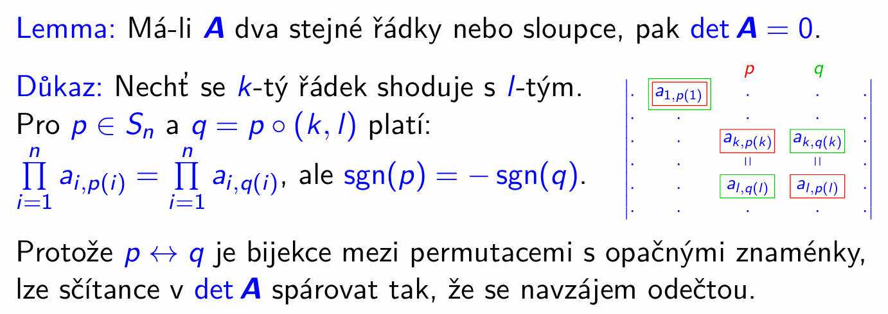
Nechť se $k$-tý řádek shoduje s $l$-tým. Pak můžeme zavést bijekci, a to tak, že permutaci $p$ přiřadíme permutaci $q$, která vznikne složením permutace $p$ s transpozicí k,l. Mimo $k$-tý a $l$-tý řádek vybírají permutace $p$ a $q$ prvky se stejnými sloupcovými indexy. Ovšem to, co permutace $p$ vybere v $k$-tém řádku, vybere permutace $q$ v $l$-tém řádku, a naopak to, co vybere $p$ v $l$-tém řádku, vybere $q$ v $k$-tém řádku.

Tj. Pro $p \in S_n$ a $q = p \circ (k, l)$ platí:

oba ty součiny se pro permutace $p$ a $q$ shodují
$$\prod_ {i=1}^n a_{i, p(i)} = \prod_ {i=1}^n a_{i, q(i)}$$

permutace $p$ a$q$ mají ovšem opačná znaménka, a proto lze členy, které jsou v definici determinantu, spárovat navzájem do dovjic ak, že se odečtou. = protože $p \leftrightarrow q$ je bijekce mezi permutacemi s opačným znaménky, lze sčítance v $\det A$ spárovat tak, že se navzájem odečtou.

#### Outro:
Seznámili jsme se s determinanty, a s jejich základními vlastnostmi. Zatím ještě neumíme determinanty snadno spočítat, protože mají tolik sčítanců, kolik je permutací, a počet permutací roste exponenciálně s řádem matice.

Příště si ukážeme, že i navzdory tomu lze determinanty snadno spočítat.
Ovšem bude to jinak, než podle definice.

## Linearita, Laplaceův rozvoj (15:09, 48M)
https://kam.mff.cuni.cz/~fiala/LA2/121-linearita.mp4

prezentace: https://kam.mff.cuni.cz/~fiala/LA2/121-linearita.pdf

> Počítat determinant podle definice je snadné pro matice malých řádů, jako př. 2 nebo 3. Dnes si ukážeme postup, který je podobný Gaussově eliminaci, který je možno použít i na matice vyšších řádů. 

> K tomu nejprve budeme muset prozkoumat vlastnost determinantu, které se říká linearita

### Linearita determinantu
> Věta: Determinant matice je lineárně závislý (= myšleno závisí lineárně, není to myšleno jako s vektory) na každém jejím řádku a sloupci, tj, vzhledem ke skalárnímu násobku řádku:

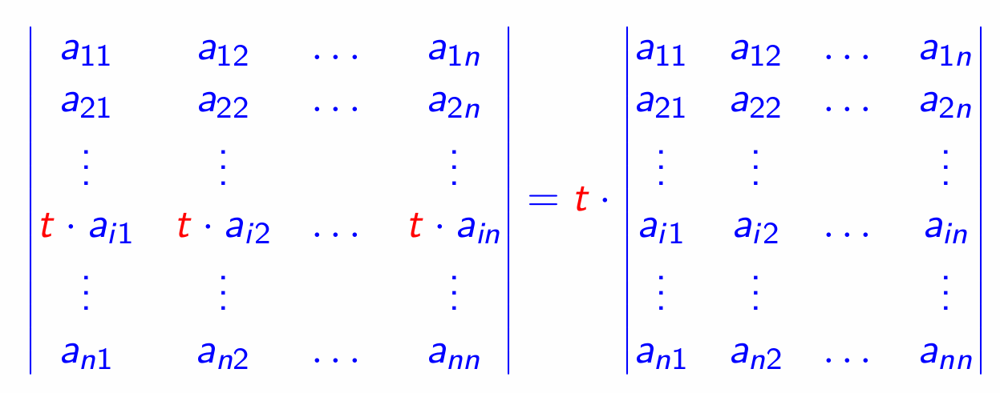
= hodnota determinantu $t$-krát vzroste, pokud některý řádek dané matice vynásobíme celý skalárem $t$

> tj. vzhledem ke sčítání řádků

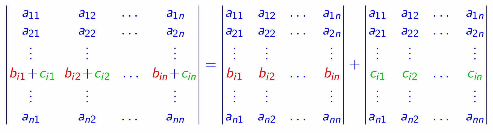
= dostaneme součet 2 determinantů v případě, že některý řádek dostaneme na součet 2 řádků
#### Důkaz pro linearitu vůči skalárnímu násobku 
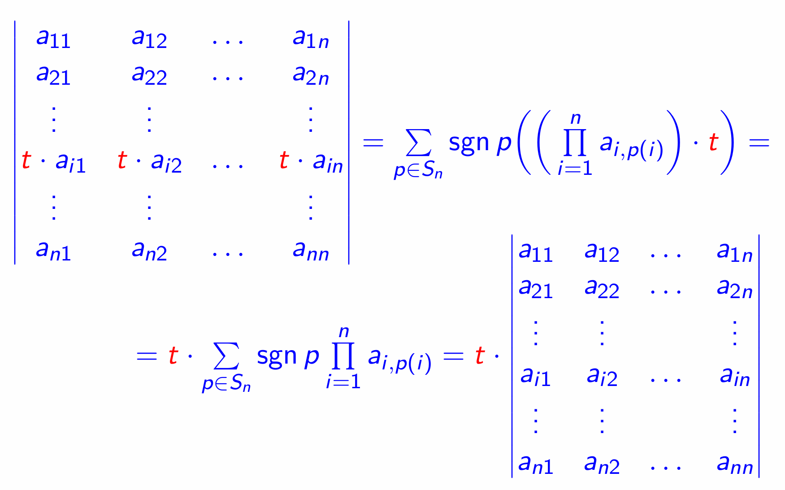
- pro každou permutaci vybíráme z matice vždy $n$ prvků, z každého řádku 1 prvek => tj. v každé permutaci právě 1 člen z $i$-tého řádku = ten člen má u sebe $t \cdot$
- a když je $t \cdot \text{něco}$ v každém členu sumy, můžeme to $t$ vytknout
- takže máme $t$ $\cdot \ \text{definice determinantu}$
#### Ukázka pro linearitu vůči součtu 
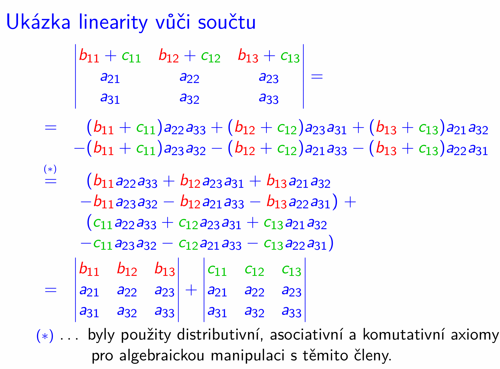
- ty členy na druhém řádku jsme získali Sarrusovým pravidlem
- algebraické úpravy
- Sarrusovo pravidlo ale opačným směrem, uvědomili jsme si, že máme 2 šestice členů, z nichž každá odpovídá jednomu determinantu:
	- 1 z nich obsahuje $\color{red}{\text{béčka}}$
	- 1 z nich obsahuje $\color{lightgreen}{\text{céčka}}$
#### Důkaz pro linearitu vůči součtu
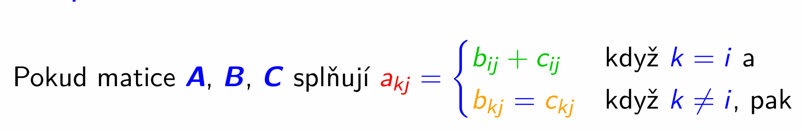
tj. $A$ vytvoříme z $B$ a $C$

$a_{k,j} = \begin{cases} 
b_{ij} + c_{ij} & \text{když} & k = i \\
b_{kj} & \text{když} & k \neq i
\end{cases}$

ten výraz $b_{kj} = c_{kj}$ je tam jenom nepořádná notace, chtěl zároveň říct že se rovnají když $k \neq i$ (proto v té větě je "splňují"), není myšlena návratová hodnota porovnání nebo tak něco:

Tj splňují:  
- $A$ je definována pomocí $a_{kj} := ... \text{(viz výše)}$ a
- $k \neq i \iff b_{kj} = c_{kj}$ 

jinými slovy kromě $i$-tého řádku, které mají matice $B$ a $C$ jiný, tak se matice $B$ a $C$ shodují (a ten i-tý řádek bude ten, který jsme v předchozí ukázace obarvovali červeně a zeleně)

1. vyčleníme z produktu $a_{i, p(i)}$:
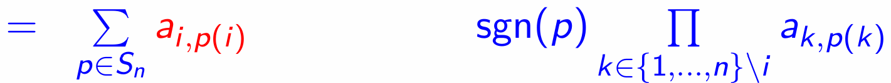
2. substitujeme (viz definiční výraz matice $A$):
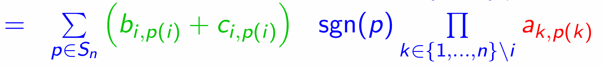
3. mezikrok, roznásobíme, substitujeme + distributivita sumy, na 2 členy, jeden s béčky, jeden s céčky
$$\sum_{p \in S_n} b_{i, p(i)} \ \text{sgn}(p) \prod_{k \in \set{1, \dots, n} \setminus \set{i}} a_{k, p(k)} \\  + \ c_{i, p(i)} \ \text{sgn}(p) \prod_{k \in \set{1, \dots, n} \setminus \set{i}} a_{k, p(k)}$$
distributivita sumy ($\sum (X + Y) = \sum X + \sum Y$):
$$\sum_{p \in S_n} b_{i, p(i)} \ \text{sgn}(p) \prod_{k \in \set{1, \dots, n} \setminus \set{i}} a_{k, p(k)}\\ + \sum_{p \in S_n} c_{i, p(i)} \ \text{sgn}(p) \prod_{k \in \set{1, \dots, n} \setminus \set{i}} a_{k, p(k)}$$
a pak substitujeme:
$$\sum_{p \in S_n} b_{i, p(i)} \ \text{sgn}(p) \prod_{k \in \set{1, \dots, n} \setminus \set{i}} b_{k, p(k)}\\ + \sum_{p \in S_n} c_{i, p(i)} \ \text{sgn}(p) \prod_{k \in \set{1, \dots, n} \setminus \set{i}} c_{k, p(k)}$$
přesně toto je zde vyjádřeno v jednom kroku:
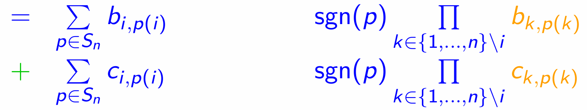
4. dáme členy mimo produkty zpátky do nich:
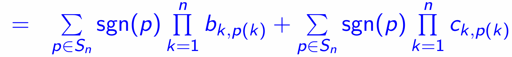
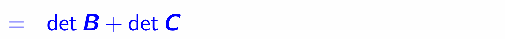
TLDR: Pro trojici matic, kde $i$-tý řádek v $A$ je součtem $i$-tého řádku $B$ a $i$-tého řádku $C$ , a zbytek je stejný ve všech třech, platí $\det A = \det B + \det C$
> zřejmě to zmátlo víc lidí, pak Fiala vyrobil nový slide :)
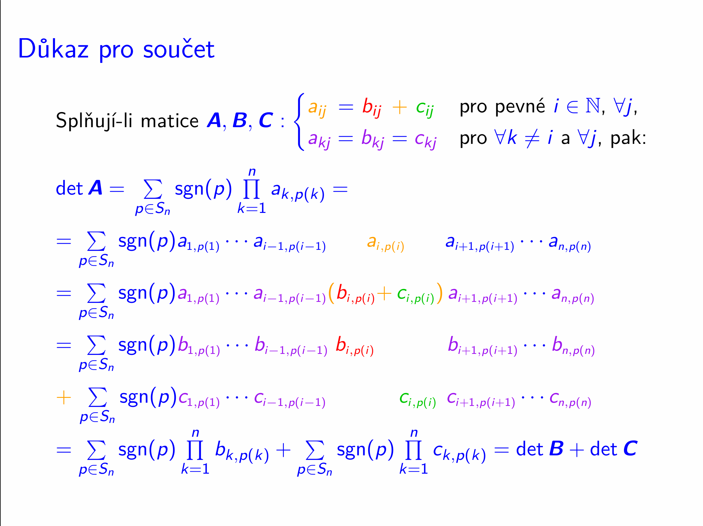

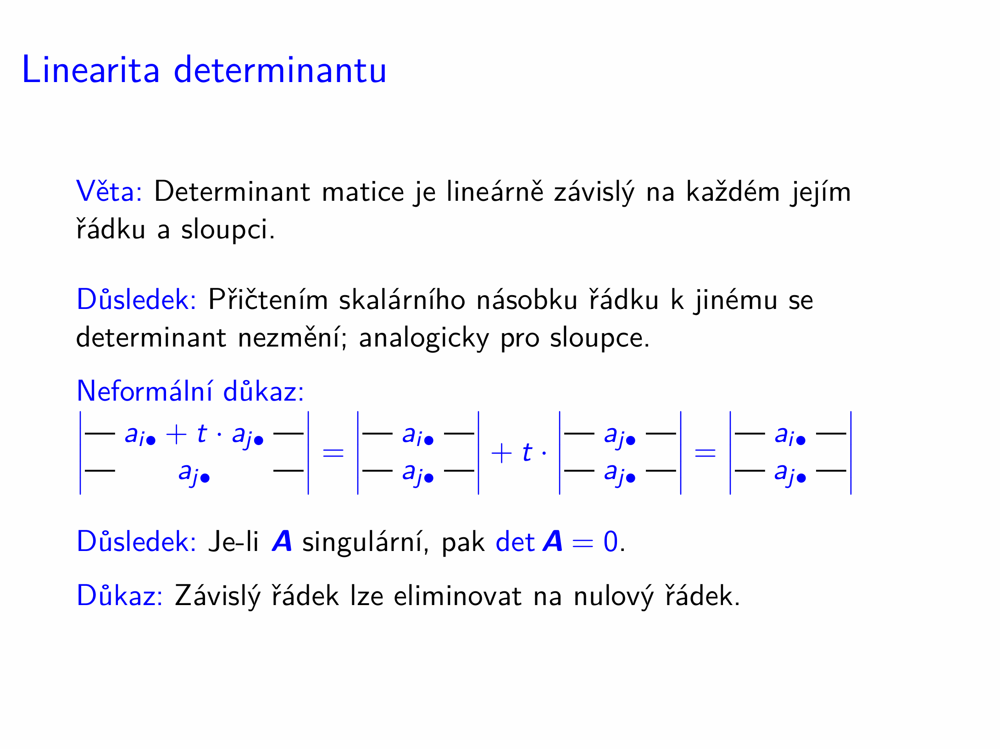
- k důkazu  1. důsledku - už víme, že matice s 2 stejnými řádky má nulový determinant, viz předchozí video Determinanty, základní vlastnosti
- k 2. důsledku, viz (REF1)
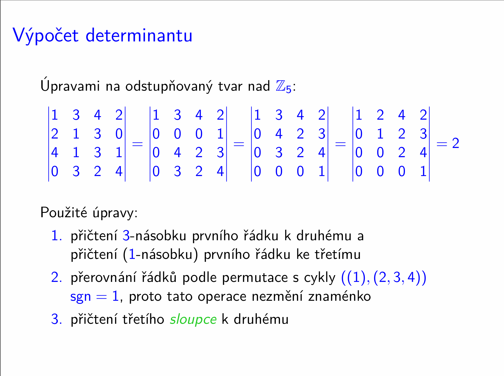
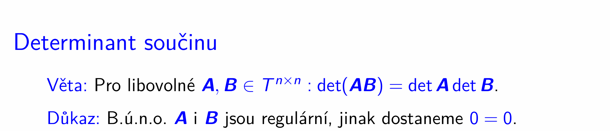
(V případě, že alespoň 1 z nich singulární, pak bude singulární i jejich součin, a det. singulární maice = 0, tedy dostaneme $0=0$)

Hlavním nástrojem zde budou elementární matice. Abychom se přesvědčili, že už pro ně platí $\det(EB)= \det E \det B$, musíme rozebrat jednotlivé typy elementárních operací a jejich matice.
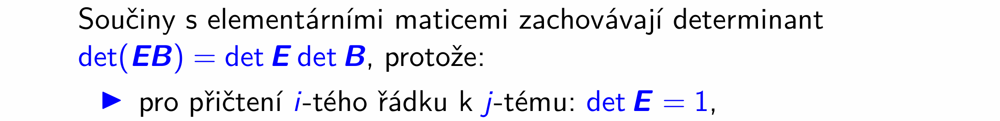
př. tato matice přičte k 2. řádku 3. řádek $$E = \begin{pmatrix}
 1 & 0 & 0  \\
 0 & 1 & 1 \\
 0 & 0 & 1
\end{pmatrix}$$
(
$$E \cdot B = EB$$
$$
\begin{pmatrix}
 1 & 0 & 0  \\
 0 & 1 & 1 \\
 0 & 0 & 1
\end{pmatrix} \cdot 
\begin{pmatrix}
 1 & 2 & 3  \\
 4 & 5 & 6 \\
 7 & 8 & 9
\end{pmatrix} = \begin{pmatrix}
 1 & 2 & 3  \\
 4+7 & 5+8 & 6+9 \\
 7 & 8 & 9
\end{pmatrix}$$
)

Pak tedy $$\det EB = \det E \cdot \det B = 1 \cdot \det B$$ platí, protože $EB$ je matice, která vznikla přičtením 1 násobku $i$-tého řádku k $j$-tému, a už jsme si ukázali, že tahle úprava determinant nemění.

př. $$E = \begin{pmatrix}
 1 & 0 & 0  \\
 0 & t & 0 \\
 0 & 0 & 1
\end{pmatrix}$$

($$\begin{pmatrix}
 1 & 0 & 0  \\
 0 & t & 0 \\
 0 & 0 & 1
\end{pmatrix}  \cdot 
\begin{pmatrix}
 1 & 2 & 3  \\
 4 & 5 & 6 \\
 7 & 8 & 9
\end{pmatrix} = \begin{pmatrix}
 1 & 2 & 3  \\
 t \cdot 4 & t \cdot 5 & t \cdot6 \\
 7 & 8 & 9
\end{pmatrix}$$)

$$\det(EB) = \det E \cdot \det B = t \cdot \det B$$

platí, protože

$$\begin{vmatrix}
 1 & 2 & 3  \\
 t \cdot 4 & t \cdot 5 & t \cdot6 \\
 7 & 8 & 9
\end{vmatrix} = t\cdot \begin{vmatrix}
 1 & 2 & 3  \\
 4 & 5 & 6 \\
 7 & 8 & 9
\end{vmatrix}$$

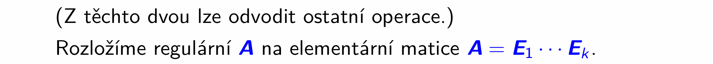

(v tom $A = E_1 \dots E_k$ si to $E_1 \dots E_k$ bežně představujeme jako posloupnost operací, které z nějaké matice vyrobí nějakou jinou matici - tady ta matice není napsaná, můžet to tedy být jedině $I$ (že jo jednotková matice je neutrální prvek k maticovému součinu), tedy $A = E_1 \dots E_k \cdot I$, posloupnost operací vyrobí z jednotkové matice matici $A$)
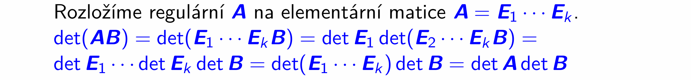
- $k$-krát použijeme pravidlo $\det(EC) = \det E \cdot \det C$
	- tím z $\det(E_1 \dots E_k B)$ dostaneme $\det(E_1) \dots \det(E_k) \det(B)$
- $k$-krát použijeme $\det E \cdot \det C = \det(EC)$
	- tím z $\det(E_1) \dots \det(E_k)$ dostaneme $\det(E_1 \dots E_k)$

**TLDR: toho důkazu:** Každá matice se dá rozložit na součin elementárních matic, takže násobení matic není vlastně nic jiného, než že na $B$ aplikuješ postupně kroky, kterými bys dostal matici $A$ z jednotkové matice (akorát teda v obráceném pořadí, ale to je jedno). Takže když ukážeš, že elementární úprava (=násobení elementární maticí) splňuje to pravidlo o součinu determinantů, tak jsi už vyhrál = zbývá to jenom formálně umlátit

$$\det(A^{-1})= \frac{1}{\det(A)}$$

protože jsme si právě dokázali, že pro jakékoli obecné matice $A, B$ platí $\det(AB) = \det(A) \det(B)$

1. $A$ regulární $\implies \det A \neq 0$:

	$A$ regulární $\implies$ existuje $A^{-1}$ $\implies$ použíjeme předchozí větu $\det(AB) = \det(A) \det(B)$, kde $B$ bude $A^{-1}$:
	
	 $\det(AA^{-1}) = \det(A) \det(A^{-1})$
	
	 $\det(I) = \det(A) \det(A^{-1})$

	$1 = \det(A) \det(A^{-1})$

	$\implies$ ani jeden z činitel nemůže být $0$, aby rovnost byla splněna $\implies$ $\det A \neq 0$

2. $\det A \neq 0 \implies$ $A$ regulární:

 	$\det A \neq 0 \implies$ $\frac{1}{\det(A)}$ je definováno, rovná se to tedy $\det(A^{-1})$ $\implies$ když je definován $\det(A^{-1})$, tak to znamená, že existuje $A^{-1}$ $\implies$ $A$ regulární
### Laplaceův rozvoj
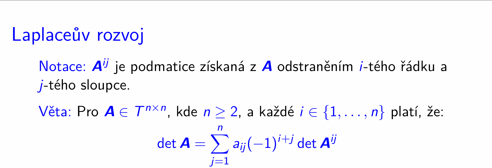
Pro jakýkoli řádkový index $i$ platí, že determinant $A$ lze rozložit jako součet dílčích determinantů matic $A^{ij}$, kde indexem $j$ probíráme sloupce od prvního k poslednímu a vždy bereme součin prvku v $i$-tém řádku a v $j$-tém sloupci, vynásobíme znaménkem $(-1)^{i+j}$ a poté determinantem matice o $1$ menšího řádu = $\det A^{ij}$ = ten můžeme spočítat třeba rekuretně, aplikovánáním tohoto pravidla znovu (základní případ rekurze determinant matice 1x1 (což je prostě 1 skalár), což je přímo to číslo, co tam je). Te výpočet by byl neefektivní, protože exponenciálně mnoho členů. 

(**forward ref REF2**: proto se tahle metoda prakticky hlavně používá, když je na nějakém řádku hodně nul, část práce jde skipnout)

#### Důkaz Laplaceova rozvoje
Využívá linearity - tak, že $i$-tý řádek si rozložíme jako lineární kombinace vektorů standardní báze (transponovaných do řádků), které jsou vynásobeny postupně koeficienty, které se v tomto $i$-tém řádku vyskytují.

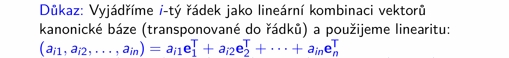
($\mathbf{e_1^T} = (1, 0, \dots,0)^T$, $\mathbf{e_2^T} = (0, 1, 0, \dots,0)^T$, ..., $\mathbf{e_n^T} = (0, 0, 0, \dots,0, 1)^T$)

Nyní můžeme schematicky zapsat determinant původní matice jako lineární kombinaci determinantů, v nichž je $i$-tý řádek nahrazen vektorem standardní báze. A zde využijeme i linearitu vůči skalárnímu násobku, protože příslušné koeficienty vytkneme před determinanty:

(řádky stvořené čistě z teček se nemění, stejné jako v původní matici = viz. linearita determinantu vůči součtu)

(linearita vůči skalárnímu násobku = ty jednotlivé členy

linearita vůči součtu, že to můžu takhle rozdělit na víc členů)

Nyní stačí ukázat, že každý z těchto dílčích determinantů, který jako $i$-tý řádek obsahuje některý z vektorů standardní báze, je roven determinantu podmatice $A^{ij}$ vynásobeným příslušným znaménkem. 

Když se podíváme na jeden z těchto členů, ku příkladu na $j$-tý člen, tak ten má $1$ v $j$-tém sloupci:
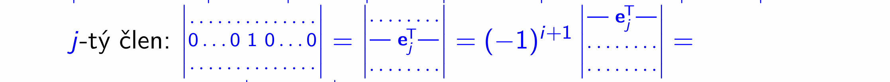
- použijeme pravidlo o přerovnání řádků, a tento řádek si dáme jako první
	- na to jsme použili permutaci, která má cyklus délky $i$, protože jsme přerovnali prvních $i$ řádků (= předtím to byl $i$-tý řádek), čili hodnota determinantu se nám změní o znaménko, které se rovná $(-1)^{i+1}$ (pokud bychom se dívali striktně na ten exponent jako na počet inverzí v permutaci, tak v této permutaci je inverzí $i-1$ => $(-1)^{i-1} = (-1)^{i+1}$, on tady napsal tu druhou variantu z "**estetických důvodů**")
		- ptal jsem se ho: 
			> znaménko jsem neodvozoval podle počtu inverzí, ale podle pravidla, že liché cykly mají kladné znaménko a sudé záporné, nic složitějšího za tím nehledejte.

			> Z tohoto podhledu je jedno, jestli změnu parity vyjádříme pomocí +1 nebo-1, jak jste sám správně poznamenal.

			Vysvětlení, že jo throwback k LA1:
			
			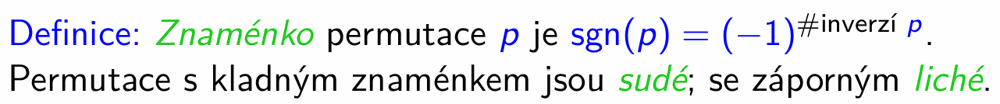

			Akorát, že tady na to nešel přes $\text{\# inverzí p}$, ale přes délku cyklu té permutace (tahle permutace má 1 cyklus, je to že jo ten "pointer chase")	

			> Permutace s **kladným znaménkem jsou sudé**:
			$$+1 = (-1)^{\operatorname{\# inverzí}} = (-1)^{i-1} \implies i -1 \text{ je sudé} \implies i \text{ je liché} \implies \text{ délka cyklu $i$ je lichá, tj. lichý cyklus}$$

			> Permutace s **záporným znaménkem jsou liché**
			$$-1 = (-1)^{\operatorname{\# inverzí}} = (-1)^{i-1} \implies i -1 \text{ je liché} \implies i \text{ je sudé} \implies \text{ délka cyklu $i$ je sudá, tj. sudý cyklus} $$

			**<u>Takže jsem odvodil to, podle čeho to napsal on:</u>**

			- Liché cykly mají kladné znaménko ($+$) a sudé cykly záporné ($-$).

			- Lichý cyklus (délka $k$ je liché číslo): Znaménko je $+1$. $\implies$ exponent té $-1$, do kterého dáváme $k$, musíme upravit na sudé číslo $\implies$ přičíst nebo odečíst $1$

			- Sudý cyklus (délka $k$ je sudé číslo): Znaménko je $-1$. $\implies$ exponent té $-1$, do kterého dáváme $k$, musíme upravit na liché číslo $\implies$ přičíst nebo odečíst $1$

			**<u>Alternativní odvození:</u>**
			- Cyklus o délce $k$ se dá rozložit na $(k-1)$ transpozic (výměn dvou prvků). Transpozice má znaménko $-$
				- zde to znamená $k$-tý řádek transpozicemi dostaneme až na první, každá transpozice mění znaménko
			- To znamená, že cyklus s lichým počtem prvků $k$ (lichý cyklus) je sudá permutace (znaménko $+$).
			- A cyklus se sudým počtem prvků (sudý cyklus) je lichá permutace (znaménko $-$).
		------

V dalším kroku přerovnáme sloupce, z $\mathbf{e_j^T}$ ($1$ na $j$-té pozici) uděláme $\mathbf{e_1^T}$ ($1$ na 1. pozici):
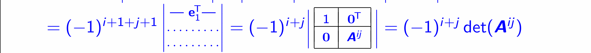
- tato permutace zase má  $j-1$ transpozicí (tady zase $(-1)^{j-1} = (-1)^{j+1}$).

vyšlo by to i takto:

$(-1)^{i-1+j-1} = (-1)^{i+j}$

V tom kroku z 
$\begin{vmatrix}- & \mathbf{e}_1^T & - \\
\dots & \dots & \dots \\
\dots & \dots & \dots
\end{vmatrix}$ na $\left| \ \begin{array}{|c|c|}
\hline
1 & \mathbf{0}^T \\
\hline
\mathbf{0} & \mathbf{A}^{ij} \\
\hline
\end{array} \ \right|$ jsme si převedli matici na sort of "odstupňovaný" tvar a rozdělili na 4 bloky (=4 podmatice):
- víme, že první řádek je $(1, 0, \dots, 0)^T$
	- protože má $1$ na 1. pozici, tak jím můžeme vyeleminovat všechny prvky pod v 1. sloupci

- vpravo dole je $A^{ij}$, protože obsahuje všechny prvky matice $A$ kromě toho 1. sloupce

> Matice, kterou jsme získali, vypadá tak, že má v levém horním rohu 1, a poté následují samé 0.

> A dostáváme determinant blokové matice, ovšem ten je roven determinantu $A^{ij}$, protože pouze permutace, které mají $1$ jako pevný bod (tj. $1 \to 1$ = zobrazí $1$ na $1$) mohou přispět do determinantu matice nějakým nenulovým příspěvkem.

(a počet těchto permutací je stejný jako počet permutací pro $A^{ij}$, protože tu $1 \to 1$ si dáme stranou, a pak vybíráme pro $n - 1$ prvků $n-1$ míst, kam se můžou zobrazit, přesněji počet různých bijekcí)

(a to, $1 \cdot$ výsledek neovlivní)

### Ukázka Laplaceova rozvoje

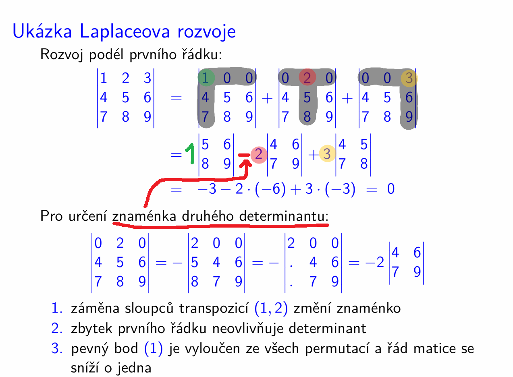

Rozvoj podle $i$-tého řádku:
$$\det A = \sum_{j=1}^n a_{ij} \cdot (-1)^{i+j} \cdot \det A^{ij}$$

Zde $i=1$, takže

$$
\begin{vmatrix}
1 & 2 & 3 \\
4 & 5 & 6 \\
7 & 8 & 9 
\end{vmatrix}

= a_{1,1} \cdot (-1)^{1+1} \cdot \det A^{1,1} + a_{1,2} \cdot (-1)^{1+2} \cdot \det A^{1,2} + a_{1,3} \cdot (-1)^{1+3} \cdot \det A^{1,3}
$$
(REF2) Když to takhle hezky rozepíšeme, tak na tom je vidět výhoda,  proč to někdy používáme.
Pokud je v tom řádku, podle kterého děláme rozvoj, hodně nul, tak spoustu členů nemusíme vůběc počítat, do výsledku ničím nepřispějí.

Taky prakticky nemusíme jít až na base case determinantů velikosti $1 \times 1$, můžeme jít na $2 \times 2$, kde to spočítáme 2 součiny, nebo $3 \times 3$, kde to snadno spočítáme Sarrusovým pravidlem.

## Adjungovaná matice, Cramerovo pravidlo (17:08, 55M)
https://kam.mff.cuni.cz/~fiala/LA2/131-adjungovana.pdf

> V této lekci si převedeme, že determinant může být použiz k řešení soustav lineárních rovnic (což také vedlo k jeho objevu), ale mimochodem také souvisí s dalšími vlastnostmi matic i lineárních zobrazení.

> V minulé lekci jsme si zavedli Laplaceův rozvoj determinantu podle $i$-tého řádku, který je dán vzorcem:

> Pro $A \in T^{n \times n}$ a každý řádkový index $i \in \set{1, \dots, n}$ platí:
$$\det(A) = \sum_{j=1}^n a_{ij} (-1)^{i+j} \det(A^{ij})$$
kde $A^{ij}$ je podmatice získaná z $A$ odstraněním $i$-tého řádku a $j$-tého sloupce.

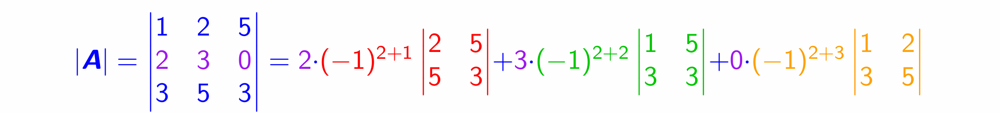
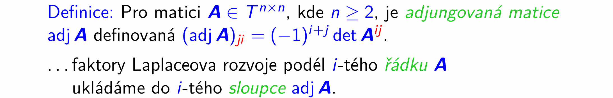
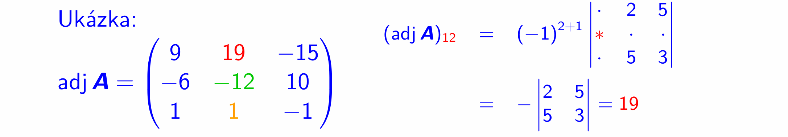
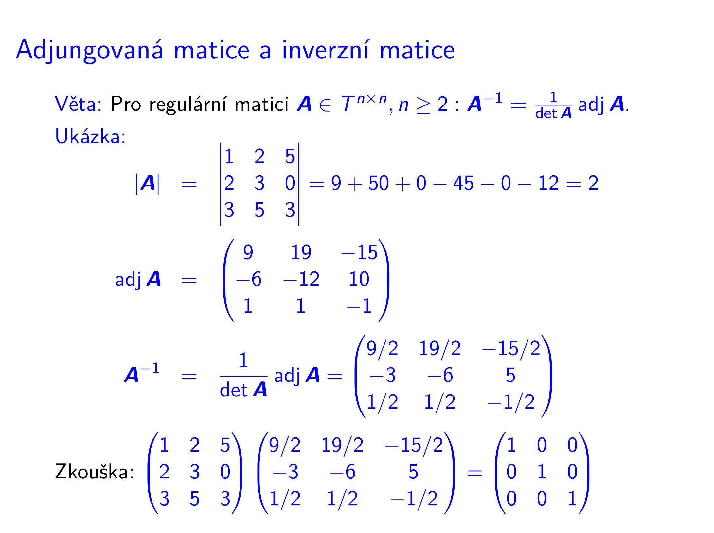
### Věta $A^{-1} = \frac{1}{\det A} \ \text{adj} \ A$
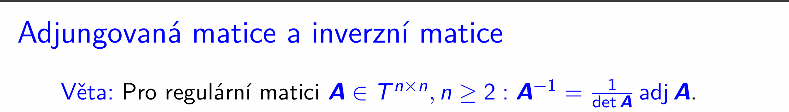

#### Důkaz věty

Nejpve sem dám ten slide celý, a pak ho okomentuju, v srozumitelnějším pořadí.

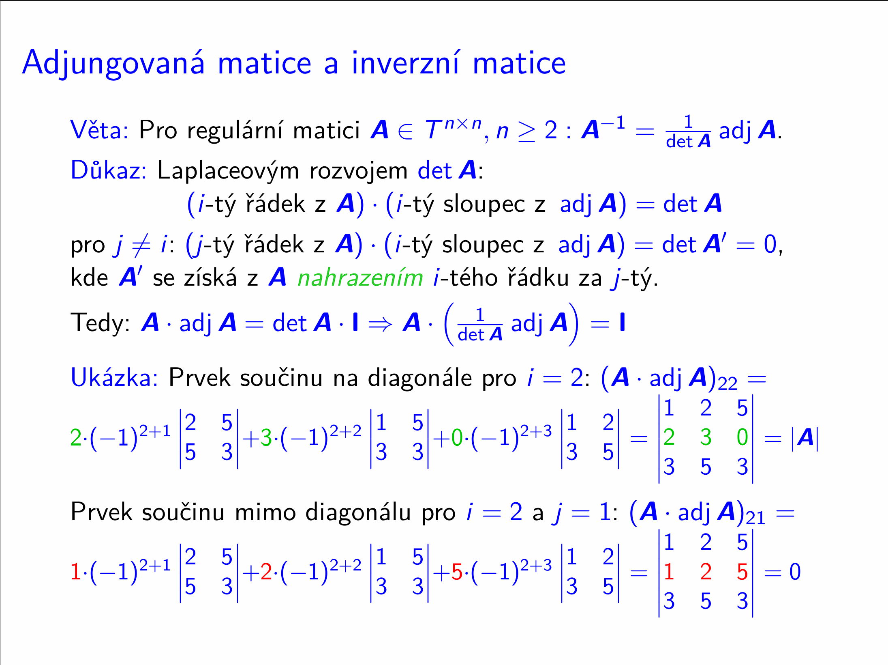

> Důkaz vyplývá z Laplaceova rozvoje. Nejprve zjistíme, co získáme, když vynásobíme matici $A$ se svou adjungovanou maticí.

$A \cdot \operatorname{adj} A$

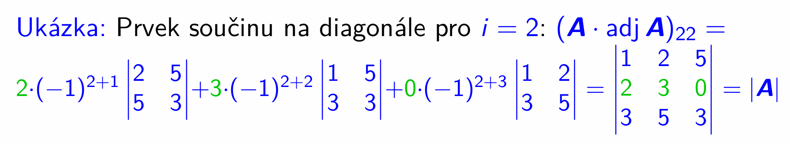
$(A \cdot \operatorname{adj} A)_{2,2}$ je skalární součin $\color{green}{\text{2. řádku } A}$ s $\color{blue}{\text{2. sloupcem } \operatorname{adj} A}$

V 2. sloupci $\operatorname{adj} A$ najdeme části členů (=znaménko $\cdot$ determinant) Laplaceova rozvoje podle 2. řádku.

Když provádíme takto ten skalární součin s 2. řádkem $A$, tak tím tomu přidáme ty členy $a_{ij}$.

Uvědomme si, že teď levá strana zcela odpovídá definici Laplaceova rozvoje podle 2. řádku, který nám tedy dává determinant $A$.

Toto platí pro všechny členy na hlavní diagonále nové matice vzniklé součinem $A \cdot \operatorname{adj} A$  , jak dokládá tato část slajdu:

(že jo vždycky sedí řádek, tedy část $a_{ij}$ s částí, kterého řádku to je rozvoj $(-1)^{i+j} \det A^{ij}$)

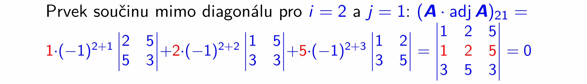
- je tam drobná chybka v indexování
 
	-	(mělo by tam být $(A \cdot \operatorname{adj} A)_{12}$, protože touto částí slidu 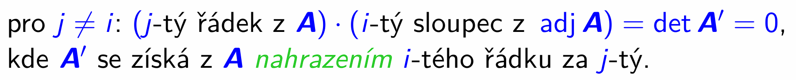 mimoděk předělal indexování z $C_{ij}$ na $C_{ji}$,

		ptal jsem se, hlubší význam toto předělání nemá, čistě jde o to, zvýrazni, že v obou případech je tam stejný sloupec z $\operatorname{adj} A$ (oranžově) a v prvním případě stejné číslo u řádku a sloupce (červeně)
		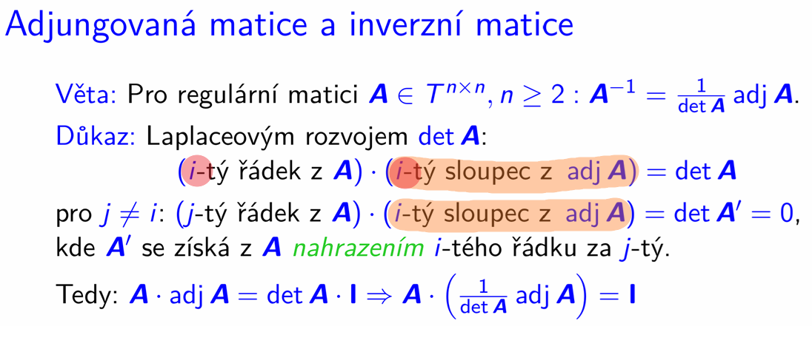
		šlo by to vyřešit i takto:
		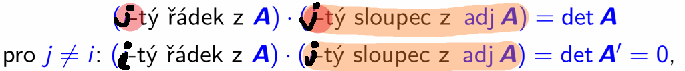, ale (ptal jsem se)
		> musel jsem si vybrat, jestli zachovat obvyklé indexování i-tý řádek a
		j-tý sloupec, o němž píšete,
		nebo jestli zachovat úzus z elementárních úprav, kde upravovaný řádek
		bývá i-tý.
		Přišlo mi názornější to druhé, i když, samozřejmě, to už je jen věc
		vkusu.

	)

To je skalární součin $\color{red}{\text{1. řádku } A}$ s $\color{blue}{\text{2. sloupcem } \operatorname{adj} A}$. Tady to "nesedí", červené členy jsou od jiného řádku než modré členy. To znamená, že stále počítáme determinant nějaké matice, ale už to nebude matice $A$.

Modré členy jsou část Laplaceova rozvoje podle 2. řádku, bez koeficientů $a_{ij}$ 2. řádku. Když ty koeficienty vyměníme, tak jako kdybychom vyměnili 2. řádek matice $A$ za jiný. (že jo, ty podmatice $A^{ij}$ ten řádek neobsahují, ty to neovlivní.) - a my jsme je tady vyměnili tak, aby to byly koeficienty nějakého dalšího řádku. Takže máme teď 2 stejné řádky v matici, a tzn. je singulární, tzn. její determinant je $0$.

To je myšleno touto částí slidu:

Celkově tedy: 

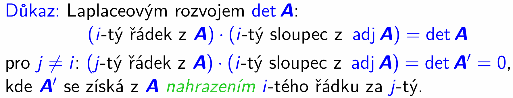

$$

A \cdot \operatorname{adj} A =
\begin{pmatrix}

\det A & 0 & \dots & 0 \\
0 & \ddots &\ddots  & \vdots   \\
\vdots & \ddots & \ddots &0 \\
0 & \dots & 0 & \det A

\end{pmatrix}

= 
\det(A)
\begin{pmatrix}

1 & 0 & \dots & 0 \\
0 & \ddots &\ddots  & \vdots   \\
\vdots & \ddots & \ddots &0 \\
0 & \dots & 0 & 1

\end{pmatrix}
= \det(A) \cdot I
$$

Dále pak algebraickými úpravami:

$$
\begin{align*}
A \cdot \operatorname{adj} A &= \det(A) \cdot I \quad /:\det A \\
\frac{1}{\det A} \cdot A \cdot \operatorname{adj} A &= I \quad / \ \text{komutativita} \\
A \cdot \frac{1}{\det A} \cdot \operatorname{adj} A &= I \quad / \ \text{asociativita} \\
A \cdot \underbrace{\left( \frac{1}{\det A} \cdot \operatorname{adj} A \right)}_{\mathbf{A^{-1}}}&= I \\
A^{-1} &= \frac{1}{\det A} \cdot \operatorname{adj} A
\end{align*}
$$

### Cramerovo pravidlo

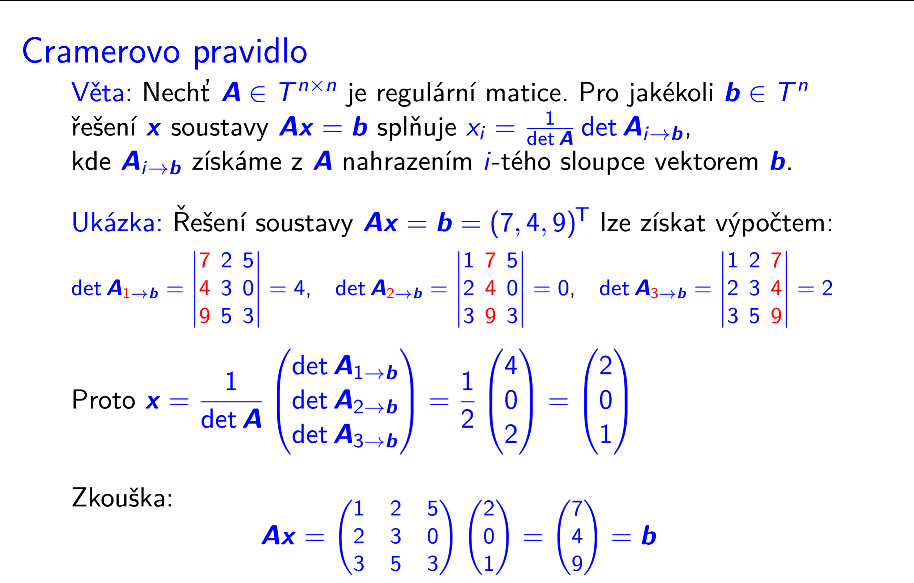

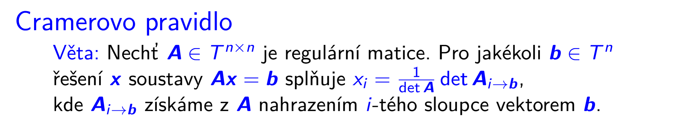
Nechť $A \in T^{n \times n}$ je **regulární** matice a máme s ní soustavu lin. rovnic ($A\vec{x} = \vec{b}$). Potom víme, že řešení této soustavy je jednoznačné a Cramerovo pravidlo udává vzorec pro řešení této soustavy:
$i$-tá složka řešení je dána: $x_i = \frac 1 {\det A} \cdot \det(A_{i \to \vec{b}})$

#### Důkaz 1

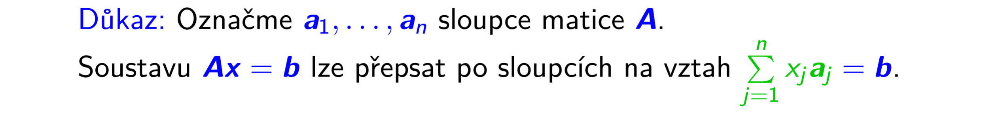
(že jo lineární kombinace sloupců)
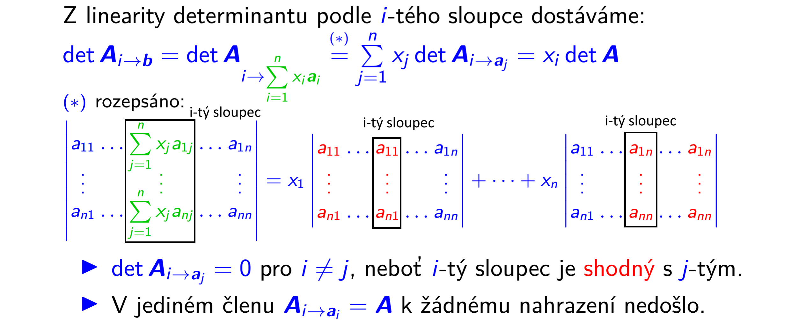
(že jo bylo potřeba zapsat $\color{green}{\sum_{j=1}^n x_j \vec{a_j}}$ do té matice po složkách, $\vec{a_j}$ je tvořen prvky $\begin{pmatrix} a_{1,j} \\ \vdots \\ a_{n, j}\end{pmatrix}$)

(pak bylo třeba rozložit to na těch víc determinantů, pomocí linearity:

$$

\left| \begin{array}{cc|c|cc}
a_{11} & \dots & \color{green}{\sum_{j=1}^{n} x_j a_{1j}} & \dots & a_{1n} \\
\vdots &       & \color{green}{\vdots}                    &       & \vdots \\
a_{n1} & \dots & \color{green}{\sum_{j=1}^{n} x_j a_{nj}} & \dots & a_{nn}
\end{array} \right|

=
\left| \begin{array}{cc|c|cc}
a_{11} & \dots & \color{green}{x_1 a_{11}+ \dots +x_n a_{1n}} & \dots & a_{1n} \\
\vdots &       & \color{green}{\vdots}                        &       & \vdots \\
a_{n1} & \dots & \color{green}{x_1 a_{n1}+ \dots +x_n a_{nn}} & \dots & a_{nn}
\end{array} \right| $$

$$
=
\underbrace{\left| \begin{array}{cc|c|cc}
a_{11} & \dots & \color{green}{x_1 a_{11}} & \dots & a_{1n} \\
\vdots &       & \color{green}{\vdots}     &       & \vdots \\
a_{n1} & \dots & \color{green}{x_1 a_{n1}} & \dots & a_{nn}
\end{array} \right|
+ \dots +

\left| \begin{array}{cc|c|cc}
a_{11} & \dots & \color{green}{x_n a_{1n}} & \dots & a_{1n} \\
\vdots &       & \color{green}{\vdots}     &       & \vdots \\
a_{n1} & \dots & \color{green}{x_n a_{nn}} & \dots & a_{nn}
\end{array} \right|
}_n
$$

$$
=
\underbrace{x_1 \left| \begin{array}{cc|c|cc}
a_{11} & \dots & \color{green}{a_{11}} & \dots & a_{1n} \\
\vdots &       & \color{green}{\vdots} &       & \vdots \\
a_{n1} & \dots & \color{green}{a_{n1}} & \dots & a_{nn}
\end{array} \right|
+ \dots +

x_n \left| \begin{array}{cc|c|cc}
a_{11} & \dots & \color{green}{a_{1n}} & \dots & a_{1n} \\
\vdots &       & \color{green}{\vdots} &       & \vdots \\
a_{n1} & \dots & \color{green}{a_{nn}} & \dots & a_{nn}
\end{array} \right|
}_n
$$
(Katex neumí obdelník kolem toho sloupce, tak jsem ten $i$-tý sloupec zvýraznil pomocí svislých čar)

A teda v $1$ členu se stane 
$$x_i \left| \begin{array}{cc|c|cc}
a_{11} & \dots & \color{green}{a_{1i}} & \dots & a_{1n} \\
\vdots &       & \color{green}{\vdots} &       & \vdots \\
a_{n1} & \dots & \color{green}{a_{ni}} & \dots & a_{nn}
\end{array} \right| = x_i \det(A_{i \to \mathbf{a_i}})= x_i \det(A)$$
)

### Různé druhy obalu množiny v Euklidovském prostoru

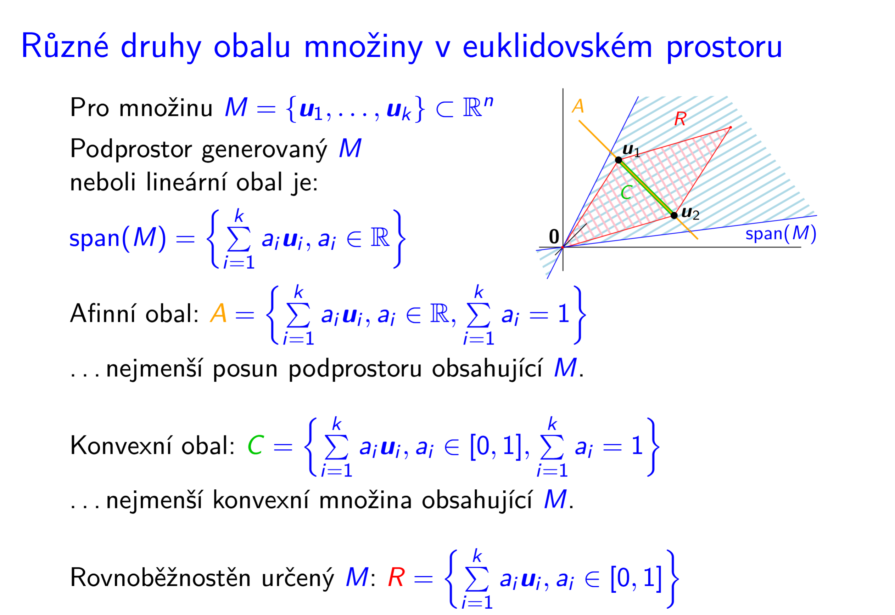

### Geometrický význam determinantu
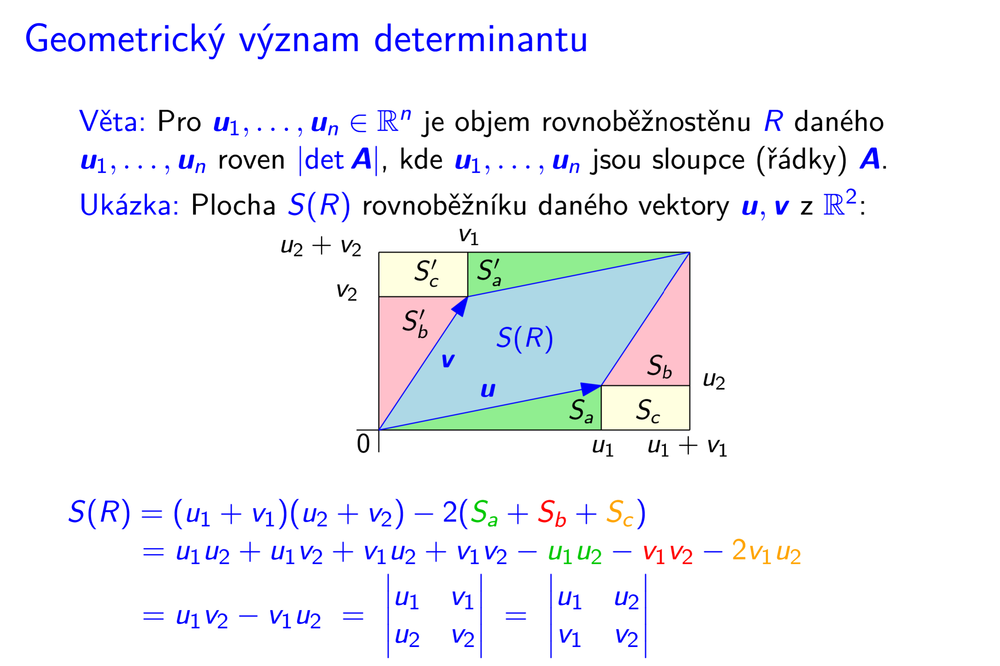
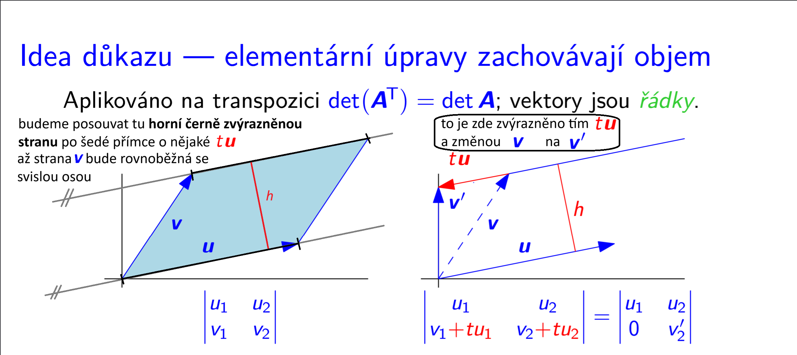
- myšlenka tohoto je, že máme dvě rovnobežky, na kterých jsou úsečky strany. Ty můžeme po těch rovnoběžkách posouvat jak chceme, ale obsah se nezmění. Obsah rovnoběžníku (=kosodélníku) je že jo $S = a \cdot v_a$, kde $a$ je délka té úsečky, a $v_a$ je výška = vzdálenost těch rovnoběžek.
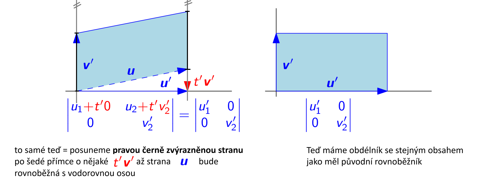
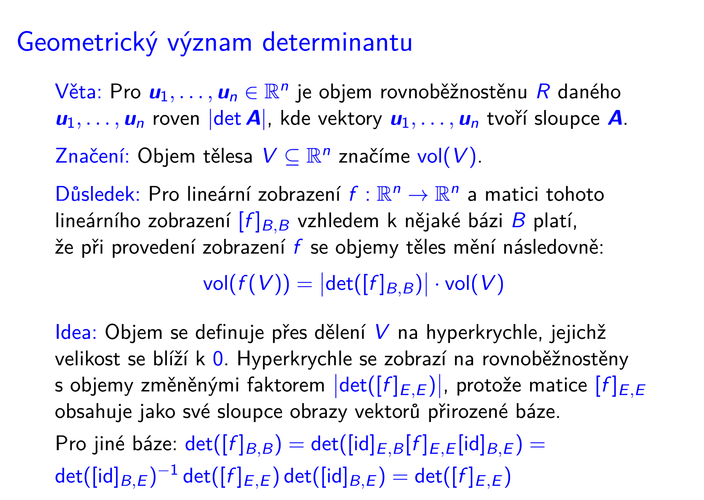