## Skalární součin, norma, Cauchyova-Schwarzova nerovnost (14:36, 90M)

> V poslední lekci jsme měli situaci, kdy bylo třeba mezi sebou vynásobit 2 aritmetické vektory maticovým součinem, a výsledkem byl 1 prvek tělesa = skalár

> **Připomínám, že v obecném vektorovém prostoru součin $2$ vektorů není možný** (pokud jeden z nich že jo netransponujeme a neuděláme maticový součin) **- pouze je dovoleno 2 vektory spolu sečíst, a nebo provést skalární násobek vektoru**

> Doba však dozrála k tomu, abychom si pojem vektorového prostoru rozšířili i o součin 2 vektorů. Bude to tzv. skalární součin.

> Podotýkám však, že se nejprve omezíme na vektorové prostory nad realnými a nad komplexními čísly.

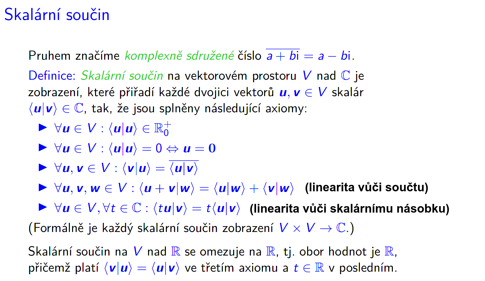
- čili na $\reals$ dá se říct komutativita
- zobrazení z $V \times V$ = kartézský součin $V$ se sebou samým $V$ = libovolná dvojice vektorů z $V$
- linearita vůči součtu bude i vzhledem k 2. složce, ale to si odvodíme z ostatních axiomů (forward ref):

	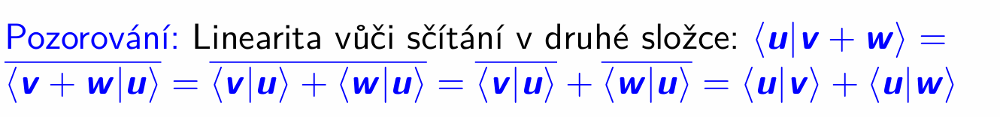
### Ukázky, mj. Standardní skalární součin
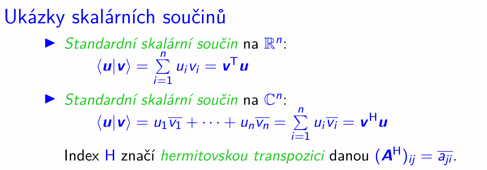
- šlo by i $\mathbf u^T (\mathbf v^H)^T$, což odpovídá pořadí $u_i \overline{v_i}$
	- jde to protože výsledkem tohoto maticového součinu je skalár, což je jako matice o $1$ prvku = je symetrická, platí pro ni $A = A^T$
- ze stejného důvodu u skal. součinu na $\reals^n$ by šlo: $\mathbf u^T \mathbf v$

#### Skalární součin na $\reals^n$ určený regulární maticí $A$
> skal. součin 2 vektorů můžeme definovat pomocí maticového součinu,  tak že doprostřed součinu $\mathbf v^T \mathbf u$ ještě vložíme součin matice s její transpozicí 
>
> 
> vidíme, že kromě $u_i v_i$ zde máme i smíšené součiny
> je třeba ukázat, že i tento skalární součin všech 5 axiomů z definice
- nebo se na to dívat tak, že $\mathbf v^T A^T$ je $(A\mathbf v)^T$, tj. $\langle \mathbf u | \mathbf v \rangle = (A\mathbf v)^T A \mathbf u$
	- tj. že na oba operandy provedeme lineární zobrazení $A$ (zobrazení dané regulární $A$ určitě je lineární, dokonce je to izomorfismus), a pak na ně provedeme standardní skalární součin

> lze ukázat, že i takto definovaný součet splňuje všechny axiomy
>
> 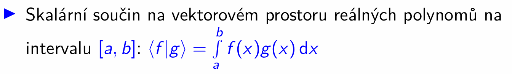
- pokud bychom si namísto aritmetických vektorů vzali spojité objekty, tzn. 2 funkce, taky je můžeme mezi sebou vynásobit ve všech bodech a potom vše dohromady sečíst, ovšem pomocí integrálů.

### Vlastnosti skalárního součinu
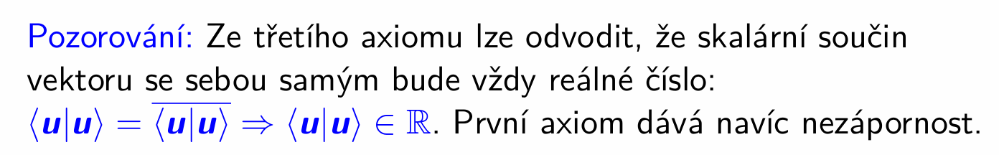
- číslo a k němu komplexně sdružené se rovná právě když je realné, že jo $a + bi = a - bi$, když $b = 0$
#### Linearita vůči součtu v druhé složce

- použita vlastnost komplexního sdružení, že součet, nad kterým provedeme komplexní sdružení, je stejný, jako když komplexní sdružení provedeme na jednotlivých sčítancích (to afaik se nikde neodvozovalo, ale dává to smysl)
- použit 3. axiom, o záměně pořadí vektorů

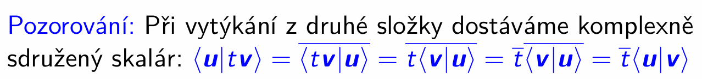

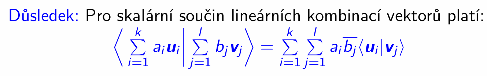
$$\left\langle \sum_{i=1}^k a_i \mathbf u_i  \middle| \sum_{i=1}^l b_j \mathbf v_j  \right\rangle$$

$$\left\langle  a_1 \mathbf u_1 + \dots + a_k \mathbf u_k  \middle| \sum_{i=1}^l b_j \mathbf v_j  \right\rangle$$

$$\left\langle  a_1 \mathbf u_1 \middle| \sum_{i=1}^l b_j \mathbf v_j  \right\rangle + \dots + \left\langle  a_k \mathbf u_k \middle| \sum_{i=1}^l b_j \mathbf v_j  \right\rangle$$

$$a_1\left\langle \mathbf u_1 \middle| \sum_{i=1}^l b_j \mathbf v_j  \right\rangle + \dots +  a_k \left\langle \mathbf u_k \middle| \sum_{i=1}^l b_j \mathbf v_j  \right\rangle$$

Rozepišme si 1. sčítanec:

$$a_1\left\langle \mathbf u_1 \middle| \sum_{i=1}^l b_j \mathbf v_j  \right\rangle$$

$$a_1\left\langle \mathbf u_1 \middle| b_1 \mathbf v_1 + \dots + b_l \mathbf v_l \right\rangle$$

$$a_1\left\langle \mathbf u_1 \middle| b_1 \mathbf v_1 \right\rangle + \dots + a_1\left\langle \mathbf u_1 \middle| b_l \mathbf v_l \right\rangle$$

$$a_1\overline{b_1} \left\langle \mathbf u_1 \middle| \mathbf v_1 \right\rangle + \dots + a_1 \overline{b_l} \left\langle \mathbf u_1 \middle| \mathbf v_l \right\rangle$$

Takto tedy vypadá rozepsaný 1. sčítanec.

$$\sum_{j=1}^l a_1 \overline{b_j} \left\langle \mathbf u_1 \middle| \mathbf v_j \right\rangle$$

My jich máme ale celkově $k$:

$$\sum_{j=1}^l a_1 \overline{b_j} \left\langle \mathbf u_1 \middle| \mathbf v_j \right\rangle + \dots + \sum_{j=1}^l a_i \overline{b_j} \left\langle \mathbf u_i \middle| \mathbf v_j \right\rangle + \dots + \sum_{j=1}^l a_k \overline{b_j} \left\langle \mathbf u_k \middle| \mathbf v_j \right\rangle$$

Tedy je to součet $k$ sčítanců, z nichž každý je vyjádřen sumou $\sum_{j=1}^l$.

$$\sum_{i=1}^k \left( \sum_{j=1}^l a_i \overline{b_j} \left\langle \mathbf u_i \middle| \mathbf v_j \right\rangle \right)$$

V podstatě jako nested `for`, kde $\sum_{j=1}^l$ je ta vnitrřní smyčka a $\sum_{i=1}^k$ ta vnější.

On tam akorát nenapsal tu závorku.
___
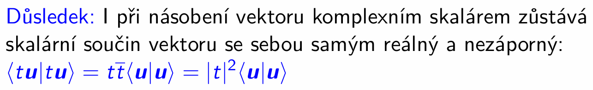
$t \overline{t} = (a+bi)(a-bi) = a^2 - b^2 i^2= a^2+b^2$

absolutní hodnota komplexního čísla je $\sqrt{a^2+b^2}$

> Nyní už máme skalární součin nadefinovaný a známe také jeho některé podoby. Připomínám, že byl motivován geometricky, a proto si na Euklidovských prostorech aukážeme, jak souvisí s úhly a délkami úseček.

> Poté také odvodíme některá známá fakta, jako např. trojúhelníkovou nerovnost nebo Cauchyho-Schwarzovu nerovnost.

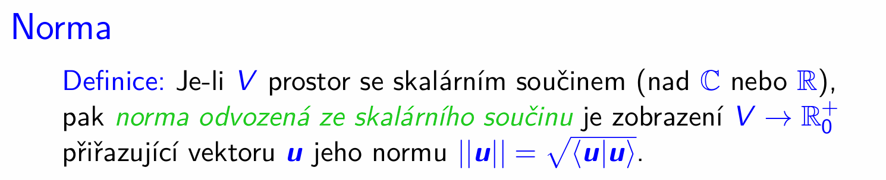
$$||\mathbf u|| = \sqrt{\langle \mathbf u | \mathbf u \rangle} = \sqrt{\sum_{i=1}^n u_i \overline{u_i}} = \sqrt{|u_1|^2 + \dots +|u_n|^2}$$
- btw. v podstatě jako abs. hodnota komplexního čísla, ale pro vektory (že jo komplexní čísla bychom samy o sobě mohli vnímat jako vektory o $2$ složkách)

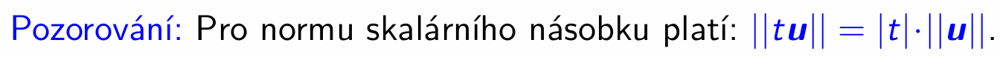
$$||t\mathbf u|| := \sqrt{\langle t \mathbf u | t \mathbf u \rangle} = \sqrt{t \overline{t} \langle \mathbf u | \mathbf u \rangle} = \sqrt{|t|^2\langle \mathbf u | \mathbf u \rangle} = \sqrt{|t|^2} \sqrt{\langle \mathbf u | \mathbf u \rangle} = |t| \cdot ||\mathbf u||$$

#### Geometrická interpretace normy
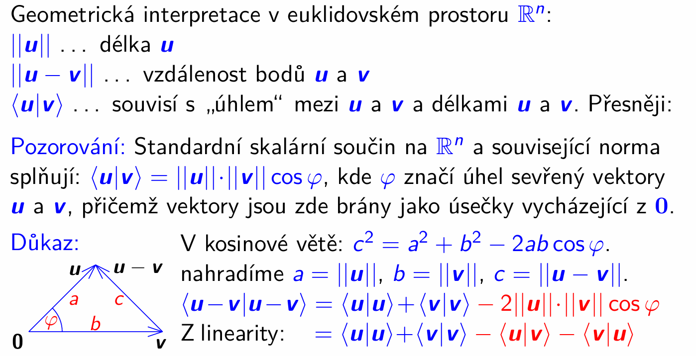

$$-2 \| \mathbf{u} \| \cdot \| \mathbf{v} \| \cos \varphi =
- \langle \mathbf u | \mathbf v \rangle - \langle \mathbf v | \mathbf u \rangle$$
Jsme na $\reals^n$, komplexně sdružené číslo k realnému číslu je realné číslo, tj. máme komutativitu:
$- \langle \mathbf u | \mathbf v \rangle - \langle \mathbf v | \mathbf u \rangle = -2 \langle \mathbf u | \mathbf v \rangle$
### Cauchyho-Schwarzova nerovnost
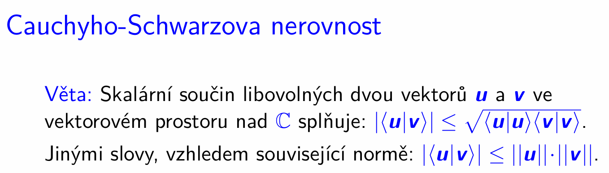
- protože
$\sqrt{\langle \mathbf u | \mathbf u \rangle \langle \mathbf v | \mathbf v \rangle} = \sqrt{\langle \mathbf u | \mathbf u \rangle}\sqrt{\langle \mathbf v | \mathbf v \rangle}$

- ta absolutní hodnota je tam proto, aby tam lvelo bylo vždy realné č. (abychom neporovnávali komplexní $\le$ realné, to nejde)

> Pro důkaz nerovnosti v ostatních případech nejprve prozkoumáme, jak vypadá 2. mocnina normy lin. kombinace, kde k $\mathbf u$ přičteme vhodný skalární násobek $\mathbf v$ (jaký vzít si ukážeme za chvíli)

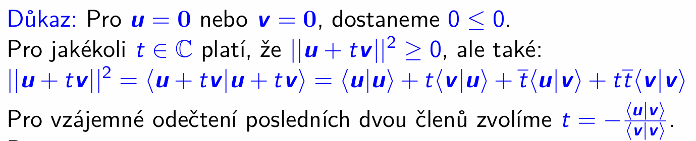
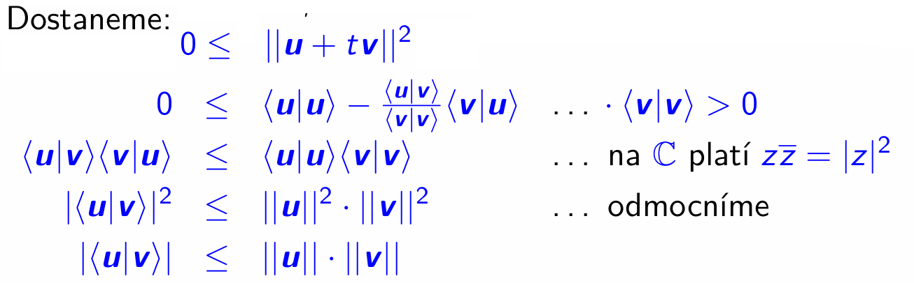

### Důsledky Cauchyho-Schwarzovy nerovnosti

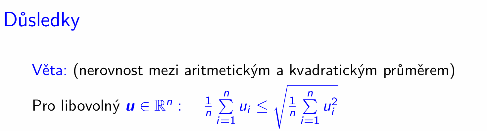
Btw **Definice: kvadratický průměr**
$$=\sqrt {{1 \over n} \sum_{i=1}^{n} u_i^2} = \sqrt {{u_1^2 + u_2^2 + \cdots + u_n^2} \over n}$$
= odmocnina z aritmetického průměru druhých mocnin složek toho vektoru

Tím jak ten vektor je realný, tak v tom vzorci nemusí na složky $u_i$ nemusí být absolutní hodnota.
- že jo na komplexní čísla by nefungovala pořadně odmocnina = 2 výsledky - s tím by si afaik nevědělo rady $\le$
- také $\le$ ostatně funguje jenom pro realná čísla (která mají lineární uspořádání)

Obecná verze vzorce (pro komplexní vektor) by btw afaik vypadala takto:
$$\left| \sum_{i=1}^{n} u_{i} \right| \leq \sqrt{\sum_{i=1}^{n} |u_{i}|^{2}} \cdot \sqrt{n}$$
(a dokázalo by se to stejně)
(
$\langle \boldsymbol{u} \mid \boldsymbol{u} \rangle = \sum u_i \overline{u_i} = \sum |u_i|^2$
)
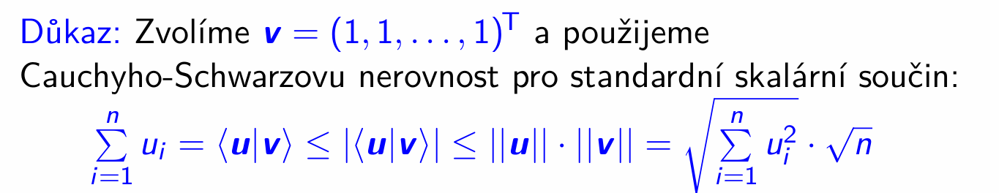

Detour, jak by to bylo u komplexních čísel

(pro komplexní by std. součin byl $\langle \boldsymbol{u} \mid \boldsymbol{v} \rangle = \sum u_i \overline{v_i}$,

U standardního skalárního součinu (i v komplexním oboru) počítáme 
$\sum u_i \cdot \overline{v_i}$. Protože 
$v_i = 1$, tak 
$\overline{1} = 1$.

$$\langle \boldsymbol{u} \mid \boldsymbol{v}\rangle = u_1 \cdot 1 + u_2 \cdot 1 + \dots + u_n \cdot 1 = \sum_{i=1}^n u_i$$
Když na to aplikujeme tu absolutní hodnotu z, máme levou stranu:

$$\left| \sum_{i=1}^n u_i \right| = |\langle \boldsymbol{u} \mid \boldsymbol{v} \rangle |$$

Pak aplikujeme Cauchyho-Schwarzovu větu.

A zbytek dokončíme stejně, akorát na tu abs. hodnotu u $u_i$ pod odmocninou.

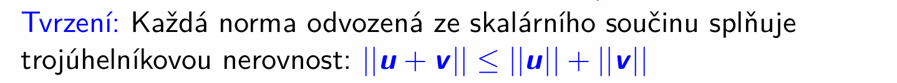
- makes sense, to nalevo by se to mohlo od sebe odečíst

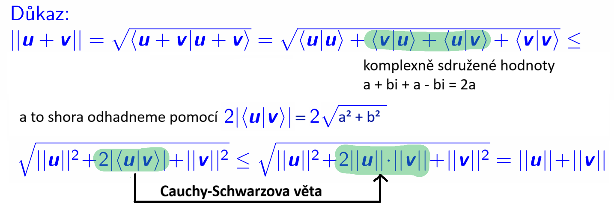

> Předvedli jsme si, že v Euklidovských prostorech (= ty $\reals^n$) odpovídá skalární součin úhlu mezi $2$ vektory. V realném životě se však $1$ z úhlů vyskytuje častěji než jiný = pravý úhel. Kolmost prozkoumáme v příštích lekcích podrobněji.

## Kolmost, ortonormální báze, Fourierovy koeficienty, isometrie (19:38, 117M)

> Minule jsme zjistili, že v Euklidovských prostorech (= $\reals^n$) odpovídá skalární součin kosinu úhlu sevřeneho 2 vektory (přesněji řečeno $\langle \mathbf u | \mathbf v \rangle = ||\mathbf u || \cdot || \mathbf v || \cdot \cos \varphi$)

> Kosinus pravého úhlu je 0, a proto definice kolmých vektorů bude velice jednoduchá:

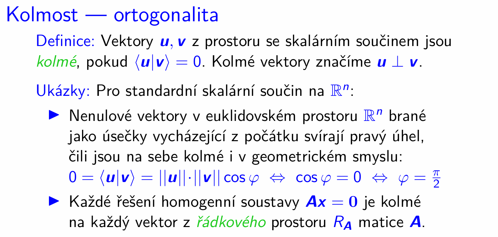

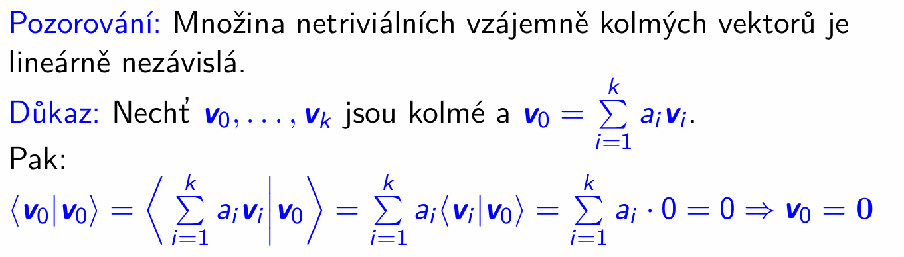
- tedy $\mathbf v_0$ nepatří do množiny netriválních vektorů, což je spor

> Už dobře víme, že standardní skalární součin se počítá tak, že 2 vektory postupně procházíme po složkách, ty mezi sebou násobíme a všechny dílčí součty pak dohromady sečteme.
>
> Pokud bycho si namísto aritmetických vektorů vzali spojité objekty, tzn. 2 funkce, taky je můžeme mezi sebou vynásobit ve všech bodech a potom vše dohromady sečíst, ovšem pomocí integrálů. To je standardní skalární součin na množině funkcí, tak, jak jsme si jej zavedli minule.

### Ortonormální báze
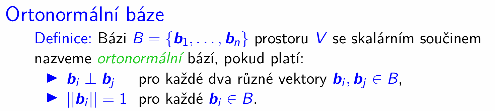
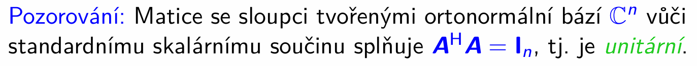
$$A = \begin{pmatrix}
| & | & & | \\
\mathbf e_1  & \mathbf e_2  & \dots & \mathbf e_n \\
| & | & & |
\end{pmatrix}$$

$$A^H = \begin{pmatrix}
\text{---} & \mathbf e_1^H & \text{---} \\
\text{---} & \mathbf e_2^H & \text{---} \\
& \vdots  &\\
\text{---} & \mathbf e_n^H &\text{---} \\
\end{pmatrix}$$

Viz unitární matice splňuje $\mathbf v_i^H \mathbf v_i = 1$ a pro $i \neq j: \mathbf v_i^H \mathbf v_j = 0$

S vektory standardní báze jako sloupce to je vidět hned, ale platí to pro jakoukoli ortonormální bázi, viz její definice. 

- $|| \mathbf b_i || = 1$, tedy $\sqrt{|b_1|^2 + \dots + |b_n|^2} = \sqrt{\langle \mathbf b_i | \mathbf b_i \rangle} = 1$, tj. $\langle \mathbf b_i | \mathbf b_i \rangle = 1$ 
- $\boldsymbol{b}_i \perp \boldsymbol{b}_j \iff \langle \mathbf b_i | \mathbf b_j \rangle = 0$

### Ukázky
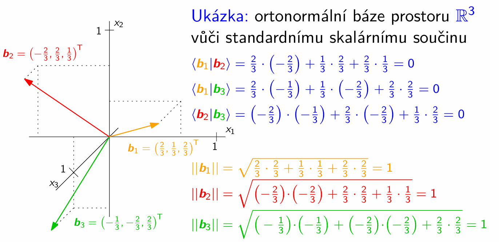
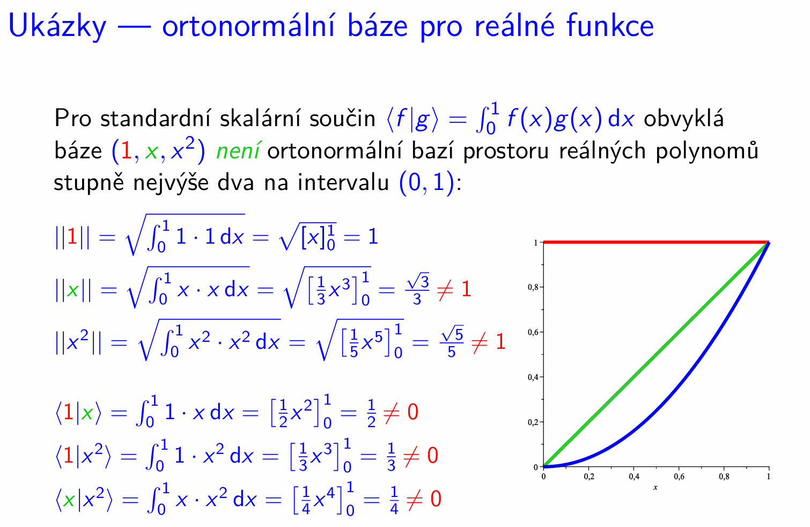
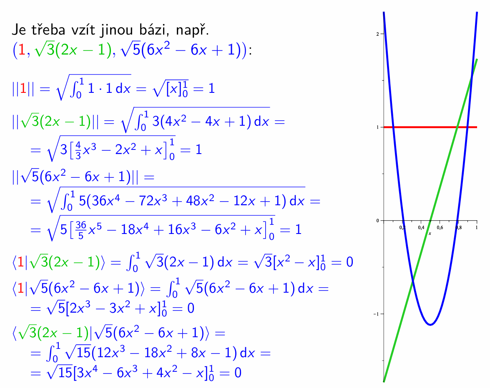
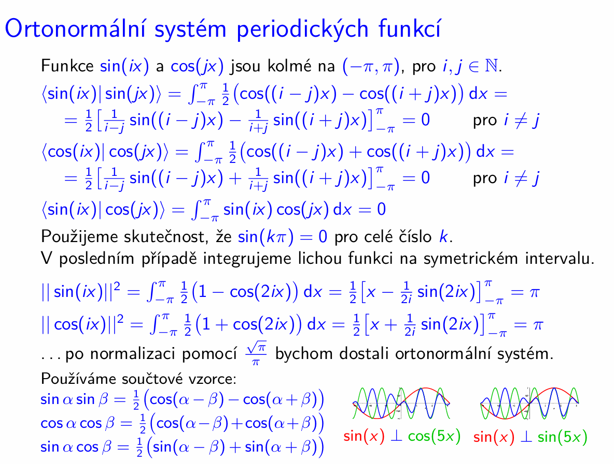

### Vlastnosti ortonormální báze: Fourierovy koeficienty

- pro ty vektory jsou kolmé, pro $i \neq j$ je skal. součin $0$, jenom pro $i=j$ to je $1$

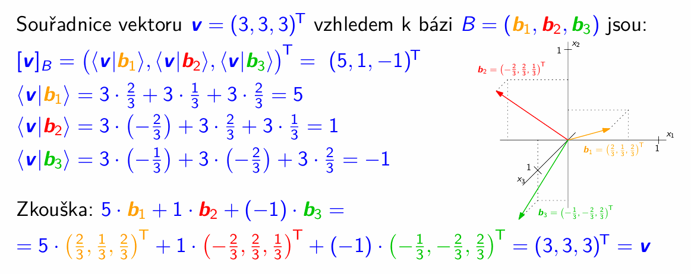

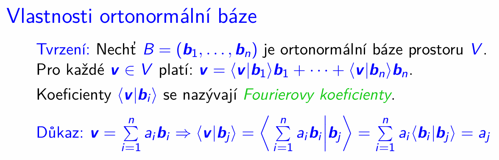
- této věty jsme už využili, když jsme definovali standardní skalární součin na $\reals^n$ a $\mathbb{C}^n$ (ty že jo mají by default standardní bázi, která je ortonormální)
	- 
		- pokud bychom si v $\mathbb{C}^n$ nebo $\reals^n$ vzali jinou než ortonormální bázi, tak by v skalárním součinu byly **smíšené členy**, viz část 
 

		"Skalární součin na $\reals^n$ určený regulární maticí $A$"

		
		zde ty smíšené členy jsou $2u_1 v_2$ a $2u_2 v_1$ 
			

			- potřeba se na to dívat tak, že $\mathbf v^T A^T$ je $(A\mathbf v)^T$, tj. $\langle \mathbf u | \mathbf v \rangle = (A\mathbf v)^T A \mathbf u$
			- tj. že na oba operandy provedeme lineární zobrazení $A$, zde **matice přechodu od původní báze k nějaké ortogonální bázi**, a pak na ně provedeme standardní skalární součin

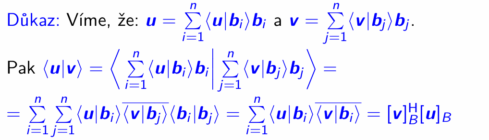
- vnitřní sumu můžeme odstranit tím, že si uvědomíme, že člen  $\langle \mathbf b_i | \mathbf b_j \rangle$ bude $0$ kromě případu $j=i$, kdy bude $1$.
- $n$ složek $\langle \mathbf u | \mathbf b_i \rangle$ odpovídá $[\mathbf u]_B$ (=Fourierovy koeficienty)
- $n$ složek $\overline{\langle \mathbf v | \mathbf b_i \rangle}$ odpovídá $[\mathbf v]^H_B$ (=Fourierovy koeficienty)
- součin skalárů je v tělese vždy komutativní, proto můžeme činitele v součinu v sumě prohodit

### Lineární zobrazení, která zachovávají skalární součin (=isometrie)
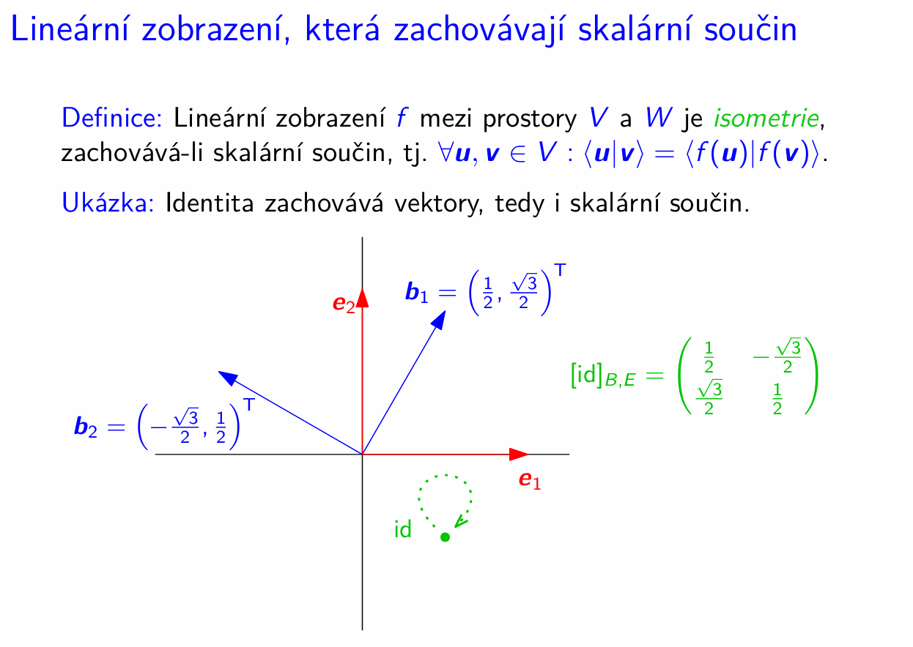
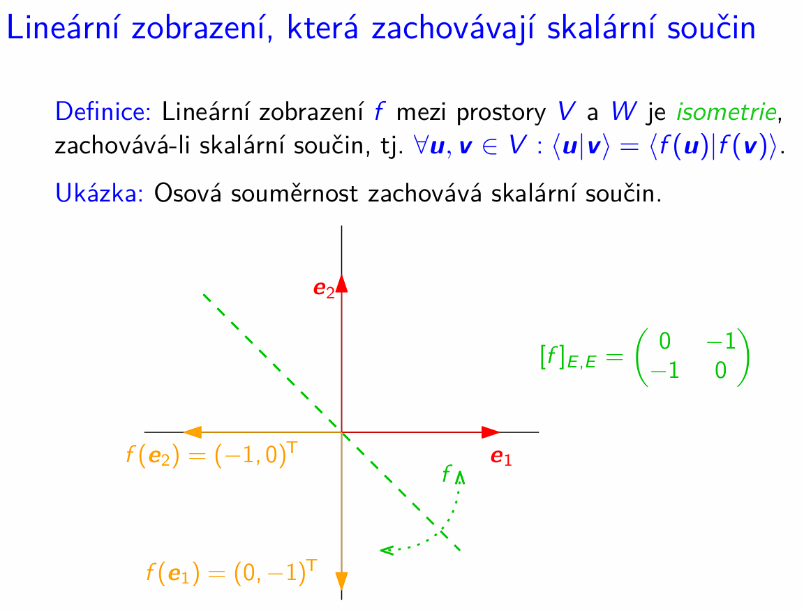

> Ukážeme si větu, díky níž už nemusíme kontrolovat skalární součin všech možných dvojic vektorů, stačí zkontrolovat, že se zachovává skalární součin každého vektoru se sebou samým. Jinými slovy, tato podmínka je jednodušší než ta, kterou je isometrie definována.
>
> 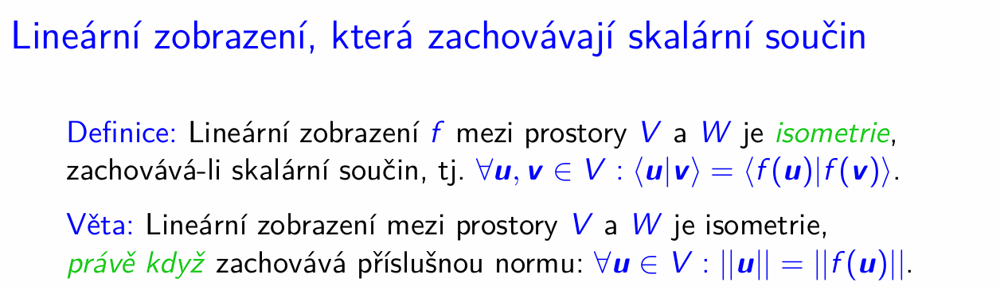

isometrie, tj. zachovává skalární součin $\implies$ zachovává normu

norma je definována odmocninou ze skalárního součinu $2$ stejných vektorů

$\forall \mathbf u, \mathbf v \in V:  \langle \mathbf u | \mathbf v \rangle =  \langle f(\mathbf u) | f(\mathbf v) \rangle \implies \forall \mathbf u \in V: \langle \mathbf u | \mathbf u \rangle =  \langle f(\mathbf u) | f(\mathbf u) \rangle \implies ||\mathbf u||= \sqrt{\langle \mathbf u | \mathbf u \rangle} = \sqrt{\langle f(\mathbf u) | f(\mathbf u) \rangle} = || f(\mathbf u) ||$
_______

zachovává normu $\implies$ isometrie, tj. zachovává skalární součin

podívejme se, jakou hodnotu nabývá $|| \mathbf u + t \mathbf v ||^2$ = lin. kombinace $\mathbf u$ a $t \mathbf v$, přičemž hodnotu toho skal. násobku si určíme za chvilku

Stejně, tak, když zachovává normu (=předpoklad), tak se norma této lin. kombinace rovná normě svého obrazu. 

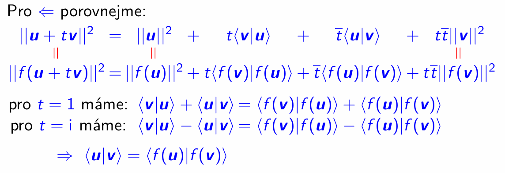
- červeně tedy máme členy, které se díky předpokladu rovnají
	- tzn. součty zbytků se rovnájí

- je to komplexní rovnice, tj. číslo na levé i na pravé části má reálnou a imaginární část.

TODO: zamyslet se 
Naše rovnice vypadá v podstatě takto:

$t \bar{A} + \bar{t} A = t \bar{B} + \bar{t} B$

my chceme zjistit, čemu se rovná realná a čemu imaginární část.

Pokud zvolíme pouze jednu hodnotu, například 
$t = 1$:

$$\bar{A} + A = \bar{B} + B$$
Protože 
$A + \bar{A} = 2\operatorname{Re}(A)$, tato rovnice nám říká pouze to, že:

$$\operatorname{Re}(\langle\boldsymbol{u}\mid\boldsymbol{v}\rangle) = \operatorname{Re}(\langle f(\boldsymbol{u})\mid f(\boldsymbol{v})\rangle)$$
To znamená: reálné části se rovnají, ale o imaginárních částech nevíme vůbec nic. (Například čísla 
$2 + 5\mathrm{i}$ a 
$2 - 3\mathrm{i}$ mají stejnou reálnou část, ale nejsou stejná).

Proč potřebujeme i druhou hodnotu (
$t = \mathrm{i}$)?
Abychom zjistili, co se děje s imaginární částí, potřebujeme druhou nezávislou rovnici. Proto dosadíme 
$t = \mathrm{i}$:

$$\bar{A} - A = \bar{B} - B$$
Tato druhá rovnice nám dává informaci o imaginární části:

$$\operatorname{Im}(\langle\boldsymbol{u}\mid\boldsymbol{v}\rangle) = \operatorname{Im}(\langle f(\boldsymbol{u})\mid f(\boldsymbol{v})\rangle)$$

TODO: pak teda dobrá otázka, co s tím t=1 a t=i

- když odečteme druhou rovnici od první, máme výsledek

### Maticová charakterizace bijektivních isometrií
> v ukázkách **isometrií** jsem záměrně uváděl jejich matice, protože matice zobrazení lze hezky využít při charakterizaci bijektivních isometrií. To je shrnuto v této větě:
>
> 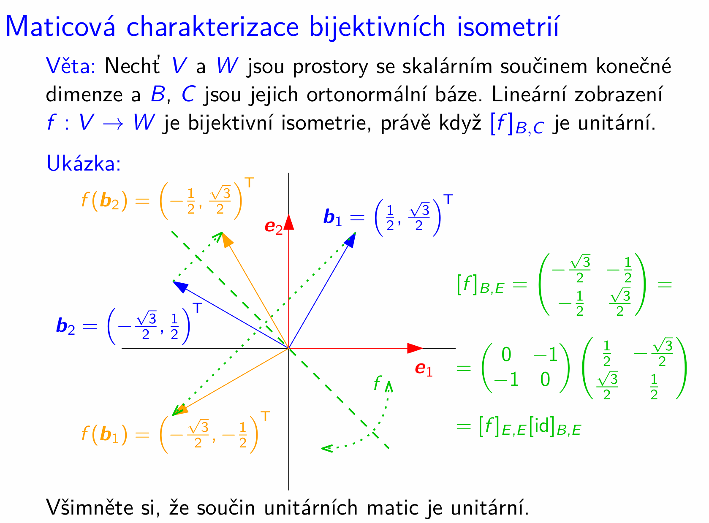

#### Důkaz 
> Již dříve jsme si ukázali, že lin. zobrazení je bijekcí (=isomorfismem) právě když matice tohoto zobrazení je regulární.
>
> 

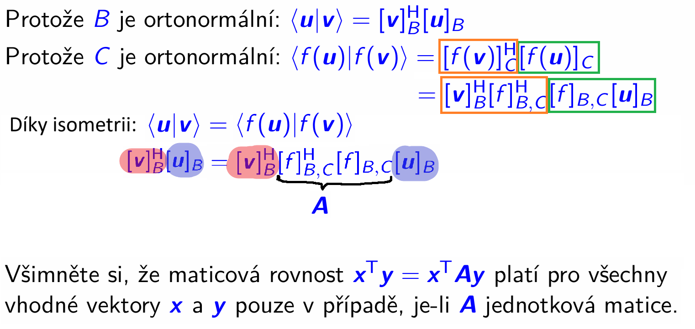
- to jedna implikace (použit předpoklad "díky isometrii")

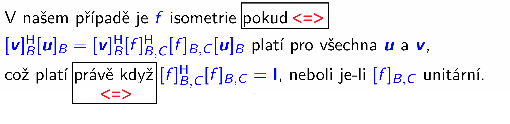
- v tomhle je schovaná i ta druhá, je tam psáno "pokud", ale to jistě $\iff$, protože ta rovnost je definiční rovnost isometrie, a isometrie je definována pomocí ekvivalence:
	- 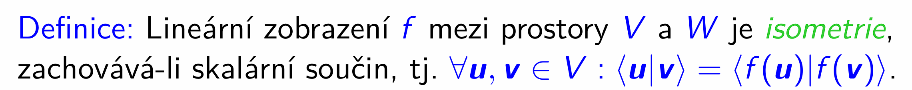

> Zjistili jsme, že ortonormální báze mají řadu pěkných vlastností, které umožní zjednodušit řadu výpočtů.
>
> Ovšem nevíme, jak takové ortonormální báze nalézt. To se dozvíme příště.

## Kolmá projekce, Gramova-Schmidtova ortonormalizace

> Cílem této lekce je konstrukce ortonormální báze. K tomu budeme potřebovat kolmou projekci, kterou znáte z deskriptivní geometrie, a která se často využívá v inženýrství, v architektuře, leckde jinde.
>
> My si ji však nadefinujeme obecněji, totiž v rámci libovolného vektorového prostoru se skalárním součinem.

### Ortogonální projekce

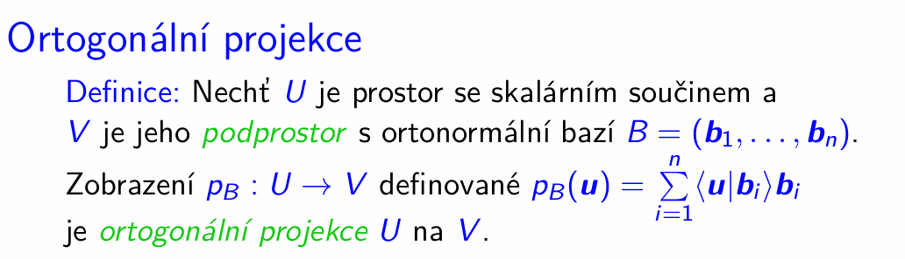
- takže skutečně se pokusíme spočítat lineární kombinaci vektoru $\boldsymbol u \in U$ pomocí vektorů z $V$, kterých je typicky míň než v $U$
	- tím získáme jakousi "aproximaci" původního vektoru, které právě říkáme **ortogonální projekce**
	- a koeficienty budou Fourierovy koeficienty, protože se jedná o ortonormální bázi

- prostě ověříme linearitu vůči skalárnímu násobku a vůči součtu

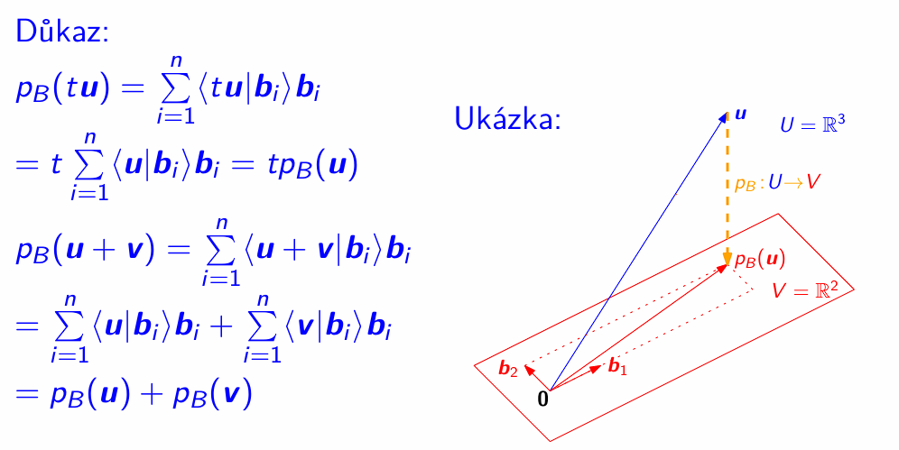
- použili jsme linearitu skalárního součinu k součtu a skal. násobku, a také definici ortogonální projekce

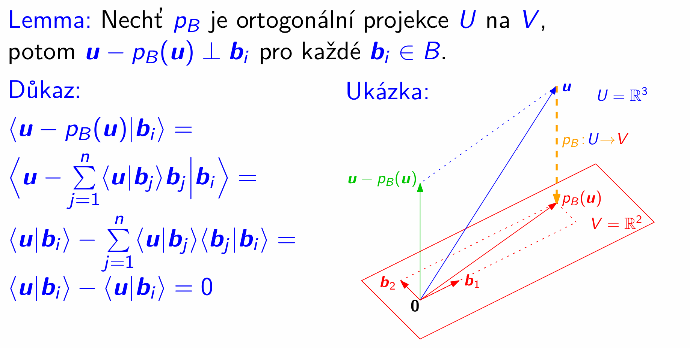
- použiza linarita skal. součinu vůči součtu a skal. součinu (=tj. vytýkáme mj. skal. součin, jehož výsledek je že jo skalár)

- pak vlastnosti ortonormální báze, kde $\langle \mathbf b_j | \mathbf b_i \rangle$ není $0$, ale $1$ právě když $i=j$.
- dostali jsme, že skal. součin je $0$, tj. ten vektor je kolmý na jakékoli $\mathbf b_i$, je tedy kolmý na všechny vektory z $B$.

### Projekce vektoru je jemu nejbližší vektor z podprostoru
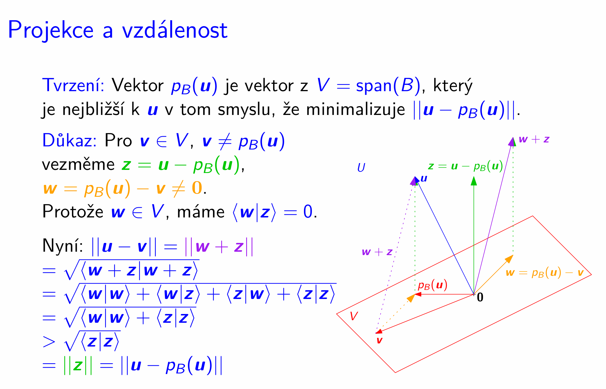
- vezmeme nějaký jiný $\mathbf v$ z $V$ než tu projekci vektoru $\mathbf u$ a dokážeme, že je vzdálenost vždy vyšší, tj. $|| \mathbf u - \mathbf v || > || \mathbf u - p_B(\mathbf u) ||$

- to $|| \mathbf u - \mathbf v || = || \mathbf w + \mathbf z ||$ jde vidět z obrázku, kdyý ty vektory vnímáme jako body = vzdálenost mezi koncovým bodem $\mathbf u$ a $\mathbf v$ je $|| \mathbf u - \mathbf v ||$
	- pak se podíváme na trojúhelníky, najdeme dva pravoúhlé, které jsou podobné podle věty SUS (strana úhel strana): žlutá a zelená odvěsna jsou stejné, takže i přepona musí být stejná:

	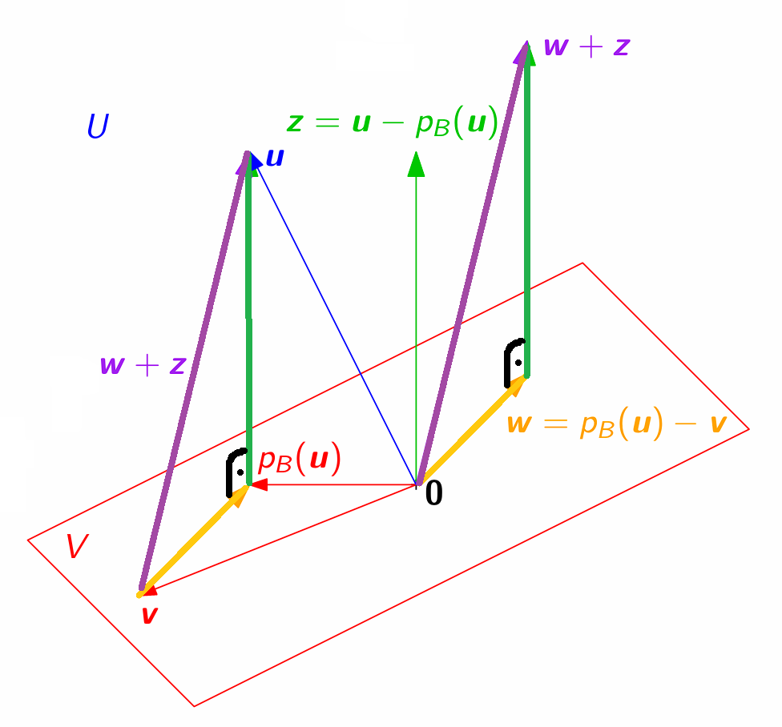

	- tahle úvaha ale funguje jenom v $\reals^3$

- ve skutečnosti platí obecně (v libovolném prostoru se skal. součinem), vyjádříme si $\mathbf u$ z $\mathbf z$, a $\mathbf v$ z $\mathbf w$:
	- $\mathbf u	 = \mathbf z + p_B(\mathbf u)$
	- $\mathbf v = p_B(\mathbf u) - \mathbf w$
	- $|| \mathbf u - \mathbf v || = ||\mathbf z + p_B(\mathbf u) - p_B(\mathbf u) + \mathbf w||$

- skal. součin  $\langle \mathbf w | \mathbf w \rangle$ je $ > 0$, protože $\mathbf w$ je netriviální vektor, protože lib. námi zvolený $\mathbf v$ je jiný než $p_B(\mathbf v)$

> 
>
> Pokud bychom si v prostoru $V$ vzali jinou ortonormální bázi, dostali bychom stejnou ortogonální projekci.
>
> Jinými slovy ortogonální projekci by šlo zadefinovat tak, že jde o vektor z daného podprostoru, který minimalizuje normu rozdílu od vektoru, který promítáme.

### Metoda nejmenších čtverců
> Kolmou projekci lze využít při řešení soustav, a to v tom případě, že máme soustavu, která sice nemá řešení, ale naším cílem je nějaké přibližné řešení, které minimalizuje chybu. (Čili najít nejbližší vektor pravých stran, se kterým už soustava řešení má)
>
> Pokud daná soustava nemá řešení, tzn. vektor pravých stran nenáleží do sloupcového prostoru matice $A$, tak naším cílem bude vektor pravých stran pozměnit co nejméně (=minimalizovat normu rozdílu těchto $2$ vektorů), aby nyní soustava řešení měla.
> 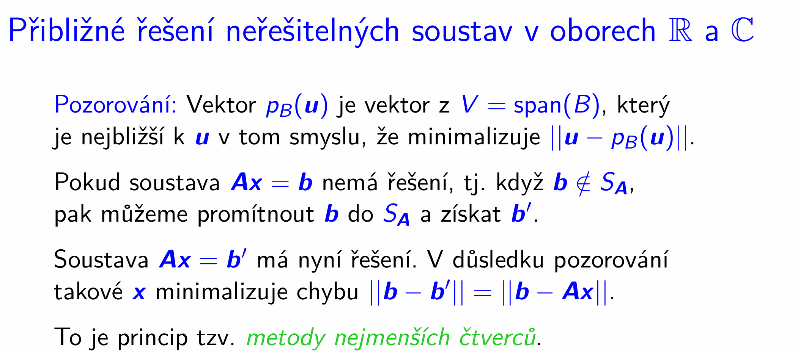

- $\mathbf b \notin S_A$, (kde $S_A$ = sloupcový prostor), znamená, že $\mathbf b$ nepatří do množiny vektorů, které lze vygenerovat lineární kombinací sloupců = neexistuje $\mathbf x$, které by obsahovalo koeficienty té lin. kombinace

- promítnutí $\mathbf b$ do $S_A$:
	- **Pozorování:** vektor $\mathbf b' := p_{S_A}(\mathbf b)$ je vektor z $S_A = \text{span}(\text{sloupců})$, který je nejbližší k $\mathbf b$ v tom smyslu, že minimalizuje $||\mathbf b - \underbrace{p_{S_A}(\mathbf b)}_{\large\mathbf b'}||$
- "čtverců", protože norma určená standardním skalárním součinem na $\reals^n$ nebo $\mathbb{C}^n$ je součet druhých mocnin = "čtverců"	

> Princip metody nejmenších čtverců lze implementovat 2 způsoby
>
> 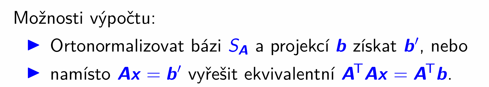
- skutečně tady u té rovnosti čárka $'$ nechybí, viz důkaz:

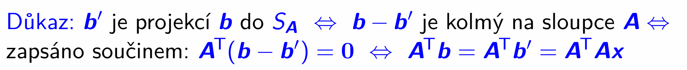
- $A^T(\mathbf b' - \mathbf b) = \mathbf 0$ jsou ty skal. součiny zapsané maticovým součinem (každý řádek z $A^T$ krát vektor $\mathbf b' - \mathbf b$ je $0$)

> S pomocí kolmé projekce už bude Gramova-Schmidtova ortonormalizace jednoduchá. Postupně probírám vektory libobolné báze jeden po druhém, nejprve kolmou projekcí zjistíme vektor, který je kolmý na všechny doposud zpracované vektory, a potom stačí už jen upravit jeho normu.

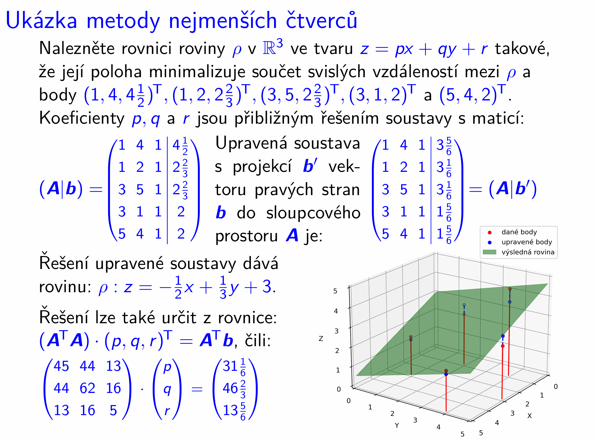
- původní dané body (červeně) neležely v jedné rovině, ty nové (modře) už v jedné rovině leží = soustava řešitelná je

### Gramova-Schmidtova ortonormalizace
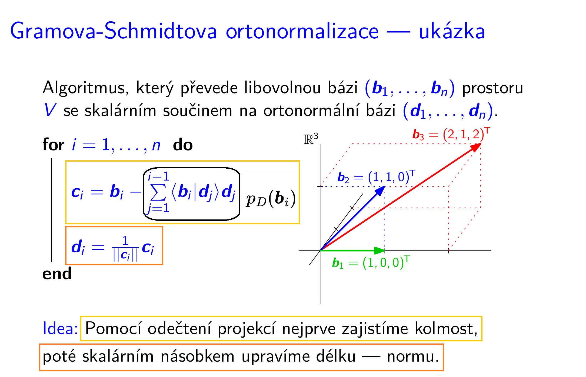
- Začínáme s prázdnou bazí $D$ (ve které není žádný vektor), a v každé iteraci smyčky do $D$ jeden vektor (kolmý na všechny dosavadní vektory v $D$) přidáváme
 - tedy v každém dalším opakování smyčky má $D$ větší velikost, to $\mathbf d_i =$ je v podstatě `.append` z Pythonu

To jest:

V každém kroku děláme projekci do jiného podprostoru = v každé další iteraci projekce s o $1$ větším počtem vektorů, s o $1$ větší dimenzí

V 1. iteraci nemám nic - podprostor má dimenzi $0$ (je to jen bod v počátku):

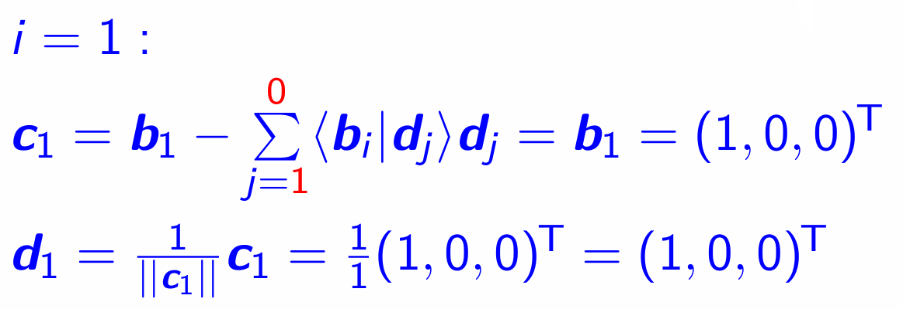
- ta suma je rovna $0$, protože ${\color{red} 0} < \color{red} 1$ (=konvence, tzv. "prázdná suma")

V 2. iteraci promítám na podprostor dimenze $1$ = na $\text{span}\set{\mathbf d_1}$

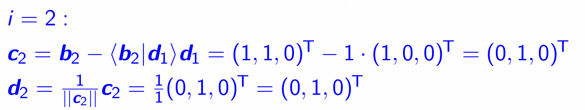

V 3. iteraci promítám na podprostor dimenze $2$ = na $\text{span}\set{\mathbf d_1, \mathbf d_2}$

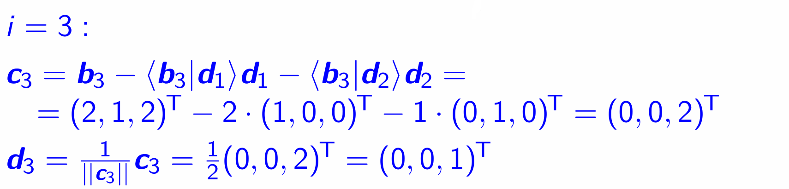

Tady to náhodou vyšlo $D = \set{\mathbf d_1, \mathbf d_2, \mathbf d_3} = \set{(1,0,0)^T, (0,1,0)^T, (0,0,1)^T}$, pro jiné pořadí výpočtu už nemusí.

Gram-Schmidtova ortonormalizace záleží na pořadí zpracování vektorů = pokaždé vznikne ortonormální báze, ale číselné hodnoty mohou vyjít jiné, viz ukázka (kde jsme přečíslovali vektory báze $B$):

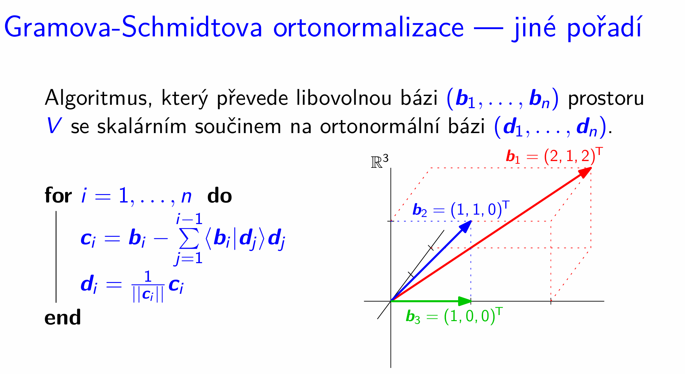
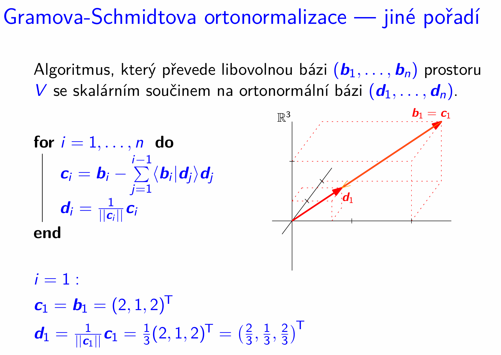
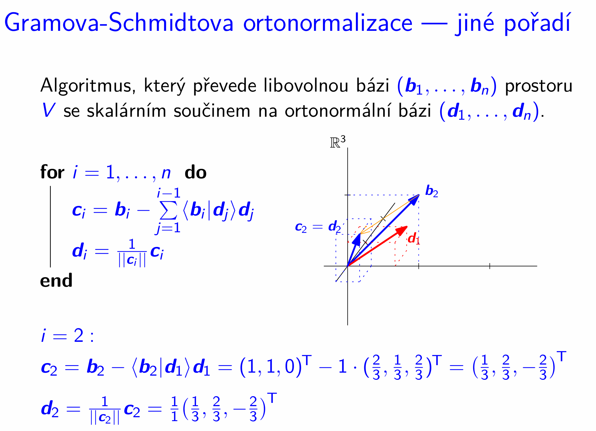
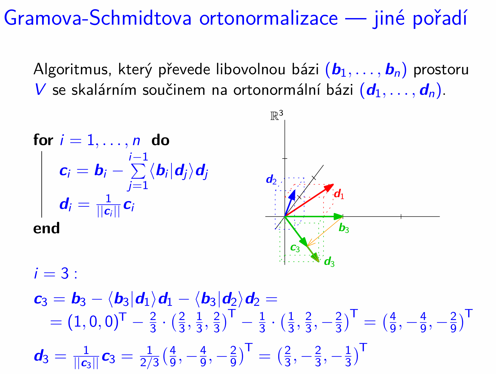

> Na závěr bych vás chtěl přesvědčit, že tento postup je korektní, že skutečně vždy vydá ortonormální bázi, která generuje stejný prostor jako původní báze.

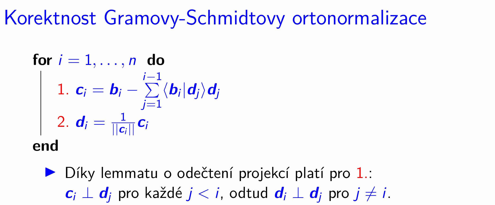
- protože $\mathbf d_i$ je jenom skal. násobek $\mathbf c_i$
- že jo v každém kroku máme $i-1$ vektorů, které tvoří ortonormální bázi, a když k nim přidáme $i$-tý vektor, kolmý na ty předchozí, tak budeme mít znovu ortonormální bázi, ale už o $i$ vektorech

- tj. chceme-li ověřit, že délka je $1$, tak to vyjde: 

	druhé rovnítko = linearita normy vůči skalárnímu násobku (= můžeme z normy vytknout $\frac{1}{\|\mathbf c_i\|}$) =vychází z linearity skal. součinu:

	$\displaystyle{\|\mathbf d_i\| := \sqrt{\langle \mathbf d_i \mid  \mathbf d_i \rangle} = \sqrt{\left\langle \frac{1}{\| \mathbf c_i\|} \mathbf c_i \mathrel{\Big|} \frac{1}{\|\mathbf c_i\|} \mathbf c_i \right\rangle}}$

	Ze skalárního součinu pod odmocninou můžeme vytknout jak z první tak z druhé složky, z té druhé sice (jsme-li v $\mathbb{C}$) komplexně sdružené číslo, ale to se nijak neprojeví, protože $\frac{1}{\|c_i\|}$ je vždy realné.

	$\displaystyle{= \sqrt{\frac{1}{\|\mathbf c_i\|} \cdot \frac{1}{\|\mathbf c_i\|} \langle \mathbf c_i \mid \mathbf c_i \rangle} = \sqrt{\frac{1}{\|\mathbf c_i\|^2} \cdot \|\mathbf c_i\|^2} = \frac{1}{\|\mathbf c_i\|} \|\mathbf c_i\|}$

> Pro úplnost je třeba ještě uvést, že v každé iteraci tohoto algoritmu se nám zachovává prostor, který je generován prvními $i$-vektory
>
>
- čili vyměnili jsme $\mathbf b_i$ z $\mathbf c_i$ a generuje to furt stejný prostor
- stejně tak když $\mathbf c_i$ vyměníme na $\mathbf d_i$

Lemma o výměně můžeme použít, protože $\mathbf c_i$ je lin. kombinace, ve které je u $\mathbf b_i$ nenulový koeficient.
- že jo $\mathbf c_i = 1 \cdot \mathbf b_i - \sum_{j=1}^{i-1} \langle \mathbf b_i \mid \mathbf d_j \rangle \mathbf d_j$

Pak také $\mathbf d_i$ je lin. kombinace $\mathbf c_i$, kde nenulový koeficient (dokonce tou nejjednodušší možnou = nenulovým skal. násobkem)

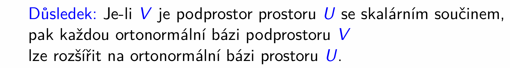
- Že jo báze prostoru $U$ je libovolných $n$ lineárně nezávislých vektorů z prostoru $U$ (kde $n = \dim U$), tak můžeme vzít ty z podprostoru a pak do těch $n$ doplnit dalšími LN z $U$, které projektujeme do těch co už máme v té ortonormální bázi.

Aka:

Báze $C$ prostoru $U$, jejichž prvních $k$ vektorů je z ortonormální báze $B$ podprostoru $V$ dimenze $k$ 

$C = (\mathbf b_1, \dots, \mathbf b_k, \mathbf c_1, \dots, \mathbf c_m)$, kde $m+k = \dim U$

($k = \dim V$)

> Pokud na tuto bázi pustíme Gramovu-Schmidtovu ortonormalizaci, tak, že vektory báze $B$ jsou na začátku, tak tím získáme nakonec ortonormální bázi celého prostoru $U$, které obsahuje vektory podprostoru $V$ jakou svou podmnožinu.

(že jo informaticky bych si řekl, že bych mohl skipnout prvních $k$, začít až od $c_1$ (tedy začít ortonormalizaci od $i=k+1$), ale nic se nestane, pokud to provedeme od začátku do konce = ty, které už kolmé jsou, a jednotkovou velikost mají, zůstanou nezměněny)

> Na Gramovu-Schmidtovu ortonormalizaci můžeme pohlížet také pomocí řádkových úprav matice. Pokud si výchozí bázi $B = (\mathbf b_1, \mathbf b_2, \mathbf b_3)$ narovnáme do matice coby její řádky, potom výpočet ortonormální báze odpovídá řádkovým úpravám:	
>
> 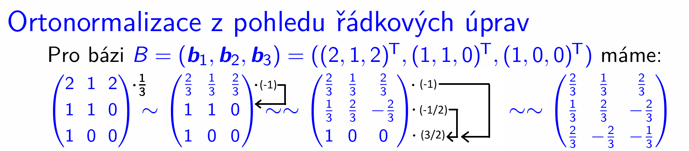
- tj. přičetli jsme k řádku vždy vhodné skalární násobky předchozích řádků
	- ty na obrázku jsou jen ty, co mě napadly, aby to vyšlo číselně, na následujícím obrázku jsou už ty, jejichž smysl odpovídá těm projekcím apod. (TODO: možná překreslit)
- řádky výsledné matice tvoří ortonormální bázi

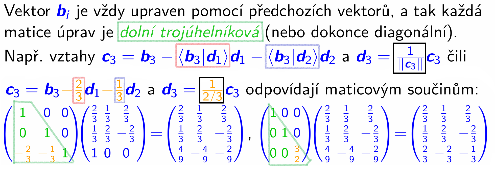
- to, že **dolní trojúhelníková** dává smysl, protože:
1. v 1. kroku Gram-Schmidtovy ortonormalizace na hlavní diadonále té matice úprav je, co mám udělat s tím původním vektorem báze (vždy ho budeme chtít vzít jednou, a od něj odečítat projekci) a vlevo od toho jsou koeficienty, kolikát máme odečíst násobky předchozích řádků, které už jsou vektory té nové báze $D$
2. v 2. kroku Gram-Schmidtovy ortonormalizace výsledný vektor škálujeme, aby byla jeho norma $1$, takže na hlavní diagonále je $1$ všude kromě řádku, která udává, co se má stát s naším řádkem, který chceme zmenšit/zvětšit.

Tyto dolní trojúhelníkové matice úprav můžeme mezi sebou vynásobit a získat matici, která "najednou" vyrobí z matice $A$, jejíž řádky jsou řádky báze, matici unitární $Q$, jejíž řádky jsou řádky ortonormální báze.
Označme si tuto matici $L^{-1}$.

Tedy:

$L^{-1}A = Q$

Tato matice bude též dolní trojúhelníková, protože dolní trojúhelníkové matice jsou uzavřené na součiny (= součin dvou dolních t. matic je dolní t. matice).

Když tuto rovnost vynásobíme zleva maticí $L$, dostáváme:

$A = LQ$

Jinými slovy:
### LQ rozklad
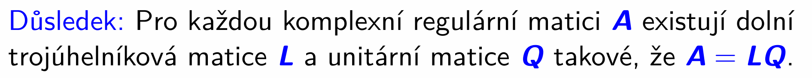

(prof. Fiala tomu LQ rozklad explicitně neříkal, ale podařilo se mi najít anglický [zdroj](https://rtmath.net/assets/docs/finmath/html/8ae6a59f-a8a0-497c-afa4-abfdc0509149.htm#!), který ano + je tam paralela s QR rozkladem)

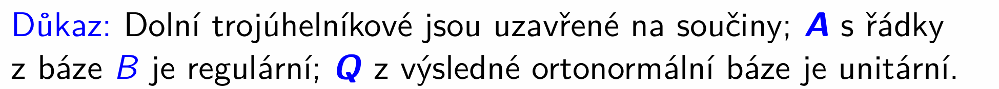
- regularita je důležitá, aby šlo udělat **unitární** matici (a + to dává smysl vzhledem k použítí = převodu báze na ortonormální)
	- cílová **unitární matice** $Q$ je definována $Q^{-1} = Q^H$, tedy je **regulární**, tedy má hodnost $n$. 
	
		Hodnost matice nemůžeme pomocí elementárních úprav zvýšit. Tedy, vstupní matice musí být regulární = mít hodnost $n$.

		Důvody (LA1):

		$$\dim(R_A) = \dim(S_A) = \operatorname{rank}(A) = \operatorname{rank}(A^T)$$
		---
		$$A \sim\sim A' \implies R_A = R_{A'} \implies \dim(R_A) = \dim(R_{A'})$$
		---
		$$\operatorname{rank}(A) = \operatorname{rank}(A')$$

		- elementární úpravy nemění dimenzi řádkového prostoru.	
			- dimenze řádkového prostoru je rovna dimenzi sloupcového prostoru (protože př. $\det A = \det A^T$ - tedy buď obě jsou singulární (rank < n), anebo regulární (rank = n))
				- tím jsme btw v LA1 určovali, jestli je matice singulární nebo regulární
					- provedli jsme Gaussovu eliminaci (=řádkové úpravy), a pak se dívali na počet pivotů (=rank), jestli je menší než $n$ nebo ne
						- spoléhali jsme na to, že ty úpravy to nezmění, že nám to řekne i o původní matici

- regularita je taky důležitá, aby nám vůbec mohla běžet  Gramova-Schmidtova ortonormalizace:

	V algoritmu Grama-Schmidta v každém kroku počítáme:

	$$\mathbf c_i = \mathbf b_i - \sum_{j=1}^{i-1} \langle \mathbf b_i \mid \mathbf d_j \rangle \mathbf d_j \quad \text{a pak normalizujeme} \quad \mathbf d_i = \frac{\mathbf c_i}{\| \mathbf c_i\|}$$

	Protože jsou řádky matice 
	$A$ lineárně nezávislé (matice je regulární), vektor 
	$\mathbf b_i$ nikdy neleží v lineárním obalu předchozích vektorů 
	$\operatorname{span}(\mathbf b_1, \dots, \mathbf b_{i-1})$.
	Díky tomu je vektor 
	$\mathbf c_i$ vždy nenulový (
	$\mathbf c_i \neq 0$), a tedy jeho norma je ostře kladná: 
	$\|\mathbf c_i\| > 0$.
	Můžeme jím bezpečně dělit a nikdy nedojde k dělení nulou.

	(Kdyby matice nebyla regulární, nějaký vektor 
	$\mathbf b_i$ by byl lineární kombinací předchozích, vyšlo by 
	$\mathbf c_i = \mathbf 0$ a algoritmus by zhavaroval na dělení nulou).

- a Gram-Schmidt převede libovolnou bázi lib. prostoru na ortonormální bázi
	- $L^{-1}$ je matice, která Gram-Schmidt. provede na regulární matici $A$, a tím vždy získáme unitární matici $Q$

___

Ještě btw k tomu 

$L^{-1}A = Q$

a 

$A = LQ$

Matice elementárních úprav (viz v rovnicích tzv. ekvivalentní úpravy) jsou bijektivní zobrazení, tj. že jo (viz věta o charakterizaci izomorfismů):
- $L \ \cdot$ to do changes
- $L^{-1} \ \cdot$ to undo changes

$L$ = úpravy, které je potřeba provést na $Q$, abychom dostali $A$

$L^{-1} $ = úpravy, které je potřeba provést na $A$, abychom dostali $Q$

### QR rozklad
> Jako bezprostřední důsledek dostáváme větu:
> 
> 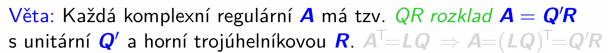

Důkaz: 

Víme, že libovolná komplexní regulární matice $A$ má $LQ$ rozklad.
Dále víme, že $A^T$ je též regulární (protože př. $\det A = \det A^T$, a nebo protože $\dim(R_A) = \dim(S_A)$). 

Tzn. $A^T$ má též $LQ$ rozklad, tj. $A^T = LQ$

Celou rovnici transponujeme:

$A =  (LQ)^T = Q^T L^T$

Označme si $Q^T$ jako $Q'$ a  $L^T$ jako $R$

Ten apostrof je tam pro rozlišení.

Tj. v $A = LQ$ a $A = QR$ není stejná matice $Q$

Jako důsledek těchto úvah o transpozici:

(ON = ortonormální)

| **Vlastnost** | **$LQ$ rozklad** | **$QR$ rozklad** |
| :--- | :--- | :--- |
| **Báze** | Řádky matice $A$ | Sloupce matice $A$ |
| **Unitární matice** | $Q$ má **řádky** jako ON bázi | $Q$ má **sloupce** jako ON bázi |
| **Trojúhelníková matice** | $L$ je **dolní** trojúhelníková (*Lower*) | $R$ je **horní** trojúhelníková (*Right/Upper*) |
| **Geometrický význam** | $i$-tý řádek $Q$ je kombinací prvních $i$ **řádků** $A$, viz ten Gram-Schmidt: $$\mathbf d_i = \frac{1}{\|\|\mathbf c_i\|\|} \left( \mathbf b_i - \sum_{j=1}^{i-1} \langle \mathbf b_i \mid \mathbf d_j \rangle \mathbf d_j \right)$$ | $i$-tý sloupec $Q$ je kombinací prvních $i$ **sloupců** $A$ |
| |$i$-tý řádek $A$ je kombinací prvních $i$ **řádků** $Q$ $$\mathbf b_i = \sum_{j=1}^{i-1} \langle \mathbf b_i \mid \mathbf d_j \rangle \mathbf d_j + \|\|\mathbf c_i\|\| \mathbf d_i$$  | $i$-tý sloupec $A$ je kombinací prvních $i$ **sloupců** $Q$ |
________

Tohle: 

$$\mathbf b_i = \sum_{j=1}^{i-1} \langle \mathbf b_i \mid \mathbf d_j \rangle \mathbf d_j + \|\mathbf c_i\| \mathbf d_i$$

jde vysvětlit pomocí:

$$A=\begin{pmatrix} 
\text{— } \mathbf b_1 \text{ —} \\ 
\vdots \\ 
\mathbf{\text{— } b_i \text{ —}} \\ 
\vdots \\ 
\text{— } \mathbf b_n \text{ —} 
\end{pmatrix} 
= \underbrace{\begin{pmatrix} 
L_{1,1} & 0 & \dots & 0 \\ 
\vdots & \ddots & & \vdots \\ 
{L_{i,1}} & {L_{i,2}} & \dots & {L_{i,i}} & 0 & \dots & 0 \\ 
\vdots & & \ddots & \vdots \\ 
L_{n,1} & L_{n,2} & \dots & L_{n,n} 
\end{pmatrix}}_{\large L}
\cdot
\underbrace{\begin{pmatrix} 
\text{— } \mathbf d_1 \text{ —} \\ 
\vdots \\ 
\text{— } \mathbf d_i \text{ —} \\ 
\vdots \\ 
\text{— } \mathbf d_n \text{ —} 
\end{pmatrix}}_{\large Q}$$

> Dlužno dodat, že $QR$ rozklad není jednoznačný, a další $QR$ rozklady se dají spočítat pomocí jiných metod.

> Téma skalárního součinu ještě neopustíme. Přestože jsme homogenní soustavy lin. rovnic už mnohokrát probírali, pomocí skal. součinu na ně získáme nový, netradiční pohled.

### Ortogonální doplněk

> Pojem kolmosti $2$ vektorů nyní rozšíříme na celé množiny. Dozvíme se přitom zajímavé poznatky o struktuře vektorových prostorů se skalárním součinem.
> 
> 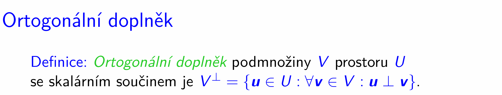

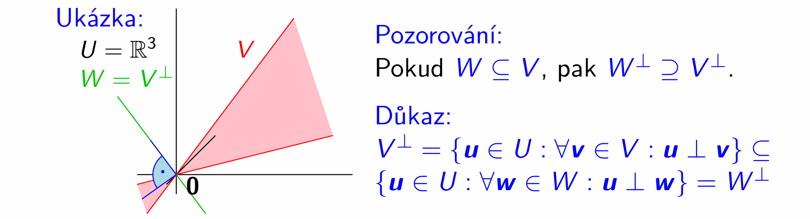
- intuitivně mi příjde víc vektorů které to filtrují => menší množina
	- pro $W^\perp$ je v podmínce jen $|W|$ vektorů, na které musí být vektor kolmý, aby v $W^\perp$ byl 
	- to je míň, než $|V|$ vektorů, na které musí být vektor kolmý, aby byl v $V^\perp$
- **PŘESNĚJI:** díky tomu, že $W \subseteq V$, tak pro členství v $V^\perp$ musí být vektor kolmý na všechny vektory z $W$ a případně nějaké navíc z $V$, proto je ta množina $V^\perp$ menší nebo rovna $W^\perp$

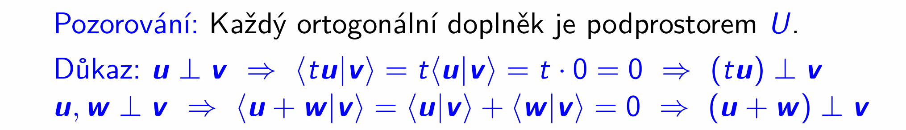
- že jo uzavřenost na skalární násobky ($\mathbf u \in V^\perp \implies t \mathbf u \in V^\perp$) a na součty ($\mathbf u \in V^\perp \land \mathbf w \in V^\perp \implies (\mathbf u + \mathbf w) \in V^\perp$)

Kdybychom tam chtěli formálněji přidat kvantifikátor($\forall \mathbf v \in V$), tak:

- Pro násobek skalárem:

	Nechť $\mathbf u \in V^\perp$ a $t \in T$. Pak:

$$\forall \mathbf v \in V: \langle t \mathbf u \mid \mathbf v \rangle = t \langle \mathbf u \mid \mathbf v \rangle = t \cdot 0 = 0 \implies t \mathbf u \in V^\perp$$

- Pro součet:

	Nechť $\mathbf u, \mathbf w \in V^\perp$. Pak:

$$\forall \mathbf v \in V: \langle \mathbf u + \mathbf w \mid \mathbf v \rangle = \langle \mathbf u \mid \mathbf v \rangle + \langle \mathbf w \mid \mathbf v \rangle = 0 + 0 = 0 \implies \mathbf u + \mathbf w \in V^\perp$$

A nebo se vyhnout i té konvenci s nechť, a nechat se unést kvantifikátory (běžnější styl je ten s "nechť")

$\forall \mathbf u, \mathbf w \in \mathbf U: \quad \big( \mathbf u \in V^\perp \land \mathbf w \in V^\perp \big) \implies \big( \forall \mathbf v \in V: \langle \mathbf u + \mathbf w \mid \mathbf v \rangle = \langle \mathbf u \mid \mathbf v \rangle + \langle \mathbf w \mid \mathbf v \rangle = 0 + 0 = 0 \big) \implies \mathbf u + \mathbf w \in V^\perp$
___
$\forall \mathbf u \in \mathbf U, \, \forall t \in T: \quad \mathbf u \in V^\perp \implies \big( \forall \mathbf v \in V: \langle t \mathbf u \mid \mathbf v \rangle = t \langle \mathbf u \mid \mathbf v \rangle = t \cdot 0 = 0 \big) \implies t \mathbf u \in V^\perp$
____

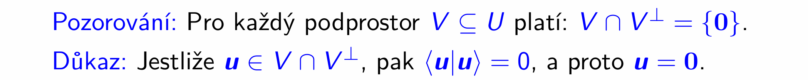
- platí pro podprostor, nikoli jen podmnožinu
- podprostor a jeho ortogonální doplněk se protínají pouze v počátku

**Důkaz:**	
1.  inkluze $\set{\mathbf 0} \subseteq V \cap V^\perp$:

	počátek totiž patří do všech podprostorů daného prostoru (a že jo $V^\perp$ je také podprostor), tj. každý průnik jej musí obsahovat

2. inkluze $V \cap V^\perp \subseteq \set{\mathbf 0}$:

	na druhou stranu, pokud by do toho průniku patřil nějaký vektor $\mathbf u$:

	$\mathbf u \in  V \cap V^\perp \implies \mathbf u \in V \land \mathbf u\in V^\perp \implies \mathbf u \perp \mathbf u \implies \langle \mathbf u \mid \mathbf u \rangle = 0 \implies \mathbf u = 0$

> Na realné matici si ukážeme, že jsme ve skutečnosti už s ortogonálním doplňkem už pracovali.
>
> Pokud si matici převedeme do odstupňovaného tvaru, můžeme určit její řádkový prostor ($R_A$), což je lin. obal všech nenulových řádků, a také, pomocí zpětné substituce můžeme určit jádro této matice ($\ker A$). 
>
> Tyto 2 prostory jsou ve skutečnosti navzájem ortogonálními doplňky.
> ### $\ker A = (R_A)^\perp$
> 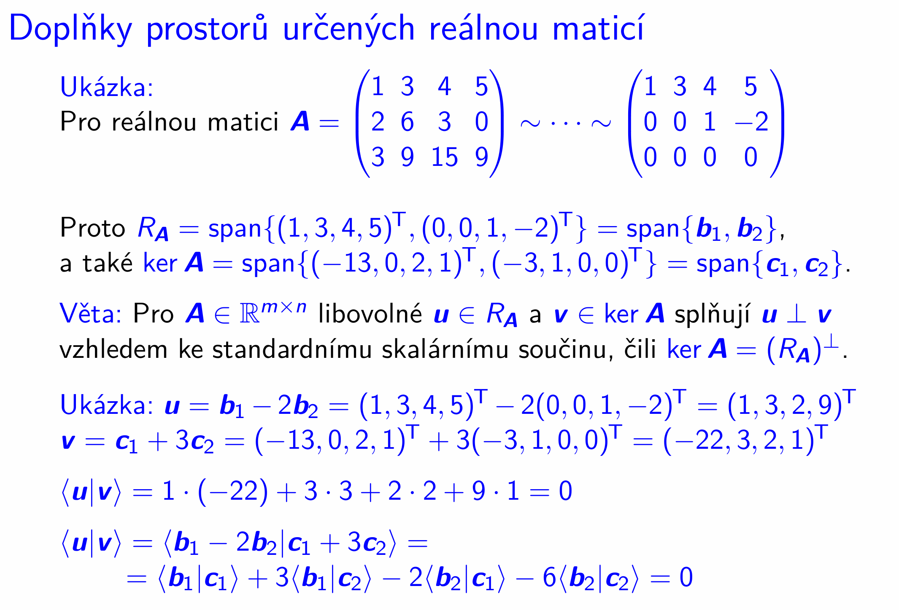

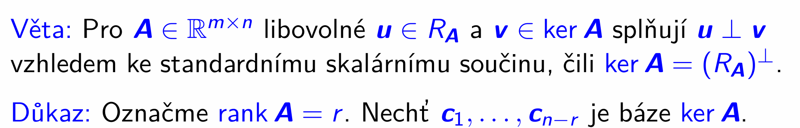
> - pomocí zpětné substituce získáme bázi jádra, což bude $n-r$ vektorů, kde $n$ je počet sloupců (že jo $n-r$ = počet volných proměnných)

> Búno můžeme předpokládat, že prvních $r$ řádků generuje řádkový prostor (pokud by to tak nebylo, řádky matice přerovnáme)
>
> 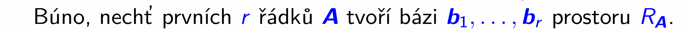

> Pro každé $\mathbf b_i$ (=řádek matice, který generuje řádkový prostor) a každé $\mathbf c_j$ (=vektor z báze jádra) platí:
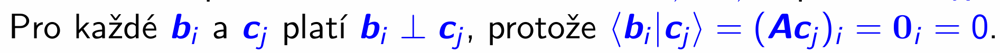
- $A \mathbf c_j = \mathbf 0$ platí protože $\mathbf c_j \in \ker A \iff A \mathbf c_j = \mathbf 0$, viz definice jádra $\ker A := \set{\mathbf x \in T^n | A \mathbf x = \mathbf 0}$
- $\mathbf b_i$ je $i$-tý řádek $A$, proto $\langle \mathbf b_i \mid \mathbf c_j \rangle$ odpovídá $i$-té složce vektoru $A \mathbf c_j$, která je teda rovna $0$
	- resp. přesně řečeno $\mathbf b_1$ a $\mathbf b_2$ z ukázky byly vektory řádků $A'$ (= $A$ převedené do odstupňovaného tvaru)
		- ale to je jedno, řádkovými úpravami se řádkový prostor nemění = prvních $r$ řádků $A$ generuje stejný prostor jako prvních $r$ řádků $A'$ (za předpokladu, že jsme řádky nijak nepermutovali s ostatními $n-r$ řádky)

> Potom $\mathbf u$ (=lib. vektor z **řádkového prostoru**) a $\mathbf v$ (=lib. vektor z **prostoru jádra matice**) splňují:
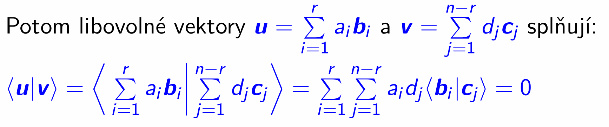
- $\langle \mathbf b_i \mid \mathbf c_j \rangle = 0$, viz o pár řádek výše
	- tohle: 

Tedy skutečně, libovolné dvojice vektorů z těchto dvou prostorů jsou kolmé, a tedy jsou si navzájem kolmé celé ty prostory $R_A$ a $\ker A$ (= jsou si navzájem ortogonálními doplňky).
___
> Hlavním poznatkem z této lekce je tato věta:
> ### Pro prostor $U$ konečné dimenze se skalárním součinem a každý jeho podprostor $V$ platí: $(V^\perp)^\perp = V$ a $\dim V + \dim V^\perp = \dim U$
> 
> 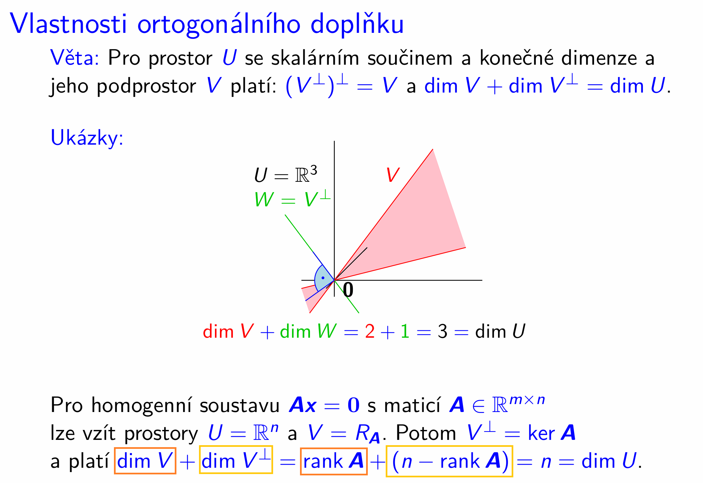
- $V^\perp = \ker A$  podle předchozí věty

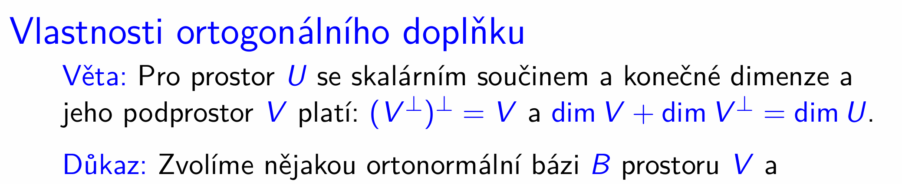
- tu můžeme nalézt pomocí Gramovy-Schmidtovy ortonormalizace

- opět pomocí Gramovy-Schmidtovy ortonormalizace
	- že jo vezmeme vektory z $B$ a přidáme k nim další nezávislé vektory z $U$, a celou takto vzniklou bázi ortonormalizujeme
		- potom bude $B \subseteq H$

> - všechno to jsou konečné množiny, protože prostor $U$ má konečnou dimenzi (=konečný počet vektorů v bázi)

> Naším cílem je ukázat, že tato množina $C$ je ve skutečnosti bází ortogonálního doplňku prostoru $V$

> Nejprve ukážeme, že lib. vektor z $V$ je kolmý ke každému vektoru, který lze vygenerovat z množiny $C$
>
> 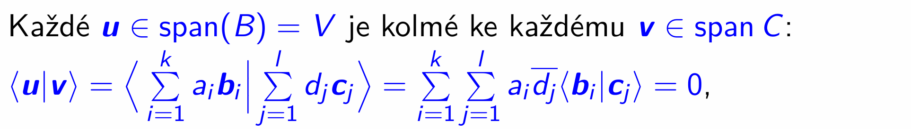
- $\langle \mathbf b_i \mid \mathbf c_j \rangle = 0$, protože to jsou 2 různé vektory ortonormální báze

- to odpovídá, každý vektor z $\text{span } C$ je kolmý na každý vektor z $V$

Zatím jsme si neukázali, že v $V^\perp$ nemohou být žádné další vektory. Na to se zaměříme nyní, tj. důkaz $V^\perp \subseteq \text{span } C$

(Cíl je že jo $(\text{span } C \subseteq V^\perp) \land (V^\perp \subseteq \text{span } C) \implies \text{span } C = V^\perp$)

> Nyní vězměme libovolný $\mathbf w \in V^\perp$ a podíváme se, jaké souřadnice má $[\mathbf w]_H$
>
> 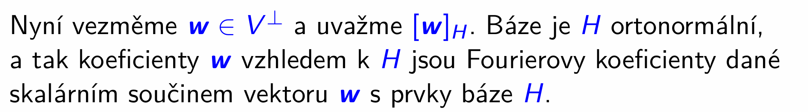

že jo $[\mathbf w]_H = (a_1, \dots, a_n)^T$,
kde ty koeficienty dostaneme z $\mathbf w = a_1 \mathbf h_1 + \dots + a_n \mathbf h_n$,
a protože je $H$ ortonormální, tak dokonce: 
$$\mathbf w = \langle \mathbf w \mid \mathbf h_1 \rangle \mathbf h_1 + \dots + \langle \mathbf w \mid \mathbf h_n \rangle \mathbf h_n$$
- toto je $\mathbf w$ vyjádřený pomocí lineární kombinace vektorů báze $H$ prostoru $U$, ve kterém všechny naše podprostory jsou
- dál v důkazu budeme pro $\mathbf w$ používat tuto lineární kombinaci

Důležité je si ještě uvědomit, že jsme si tu $H$ naporcovali na vektory $\mathbf b_1, \dots, \mathbf b_k$ a $\mathbf c_1, \dots, \mathbf c_l$ (tedy některé z těch mnou označených "háček" budou "béčka" a některá "céčka").

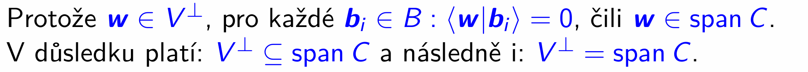
- $\langle \mathbf w \mid \mathbf b_i \rangle = 0$ protože $B$ je báze $V$

To znamená, že náš $\mathbf w$:

$$\mathbf w = \langle \mathbf w \mid \mathbf b_1 \rangle \mathbf b_1 + \dots + \langle \mathbf w \mid \mathbf b_k \rangle \mathbf b_k + \langle \mathbf w \mid \mathbf c_1 \rangle \mathbf c_1 + \dots + \langle \mathbf w \mid \mathbf c_l \rangle \mathbf c_l$$

je možné vyjádřit jenom pomocí vektorů $\mathbf c_1, \dots, \mathbf c_l$

To znamená, že $\mathbf w$ patří do lineárního obalu $C$. Předtím jsme řekli, že $\mathbf w$ je libovolný. Tzn. každý $\mathbf w \in \text{span }C$, tj. $V^\perp \subseteq \text{span }C$

> V tuto chvíli jsme ve skutečnosti ukázali i 2. z inkluzí, čili množina $C$ generuje ortogonální doplněk prostoru $V$.

- že jo $$\forall \mathbf w \in V^\perp: \quad \mathbf w =\langle \mathbf w \mid \mathbf c_1 \rangle \mathbf c_1 + \dots + \langle \mathbf w \mid \mathbf c_l \rangle \mathbf c_l$$

každý $\mathbf w$ je dán právě lineární kombinací vektorů z $C$, tzn. $C$ je dokonce báze $ V^\perp$ (ty vektory jsou LN). Tj. $\text{span } C = V^\perp$

> Nyní už je jednoduché důkaz dokončit:
>
> 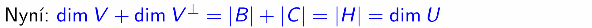
- už jsme dokázali, že $\text{span } C = V^\perp$, tzn. $\dim V^\perp = \dim \text{span } C = |C|$
- $\dim V = |B|$ máme z předpokladů důkazu ("zvolíme ON bázi $B$ prostoru $V$")

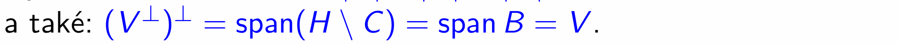

Na tohle, aby to bylo zcela zřejmé, provedeme kus důkazu, který jsme už provedli, symetricky:

1. 

	- kolmost je symetrická vlastnost

	Předtím jsme použili: "každé $\mathbf v \in \text{span }C$ je kolmé ke každému $\mathbf u \in \text{span }B$"

	Teď použijeme "každý vektor $\mathbf u \in\text{span }B$ je kolmý na každý vektor $\mathbf v \in \text{span } C$"

	$(\text{span }C)^\perp := \set{\mathbf u \in U | \forall \mathbf v \in \text{span }C: \mathbf u \perp \mathbf v}$

	a protože $\text{span}(B) \subseteq U$, tak:
	$$\text{span } B \subseteq (\text{span } C)^\perp$$

	substitujeme
	(už jsme dokázali $\text{span } C = V^\perp$):

	$$V \subseteq (V^\perp)^\perp$$

___

2. Nyní chceme ukázat $(V^\perp)^\perp \subseteq V$, abychom ukázali rovnost (zase 

$(V \subseteq (V^\perp)^\perp) \land  ((V^\perp)^\perp \subseteq V) \implies V = (V^\perp)^\perp$

)

Vezměme libovolný $\mathbf x \in (V^\perp)^\perp$. Znovu si jej můžeme vyjádřit jako lineární kombinaci vektorů báze $H$:

$$\mathbf x = \langle \mathbf x \mid \mathbf b_1 \rangle \mathbf b_1 + \dots + \langle \mathbf x \mid \mathbf b_k \rangle \mathbf b_k + \langle \mathbf x \mid \mathbf c_1 \rangle \mathbf c_1 + \dots + \langle \mathbf x \mid \mathbf c_l \rangle \mathbf c_l$$

Už víme, že $C$ je báze $V^\perp$, tedy víme $\langle \mathbf x \mid \mathbf c_i \rangle = 0$

Vidíme tedy, že každé $\mathbf x$ můžeme vyjádřit jenom pomocí vektorů $B$, což je báze prostoru $V$

$$\mathbf x = \langle \mathbf x \mid \mathbf b_1 \rangle \mathbf b_1 + \dots + \langle \mathbf x \mid \mathbf b_k \rangle \mathbf b_k$$

- tím jsme ukázali $\mathbf{x} \in (V^\perp)^\perp \implies \mathbf{x} \in \operatorname{span}(B) = V$, což je definice podmnožiny $(V^\perp)^\perp \subseteq V$

- můžeme tu rovnost ale interpetovat dále, a dostat z ní i druhou inkluzi, a tedy přímo rovnost:

	$\forall \mathbf x \in (V^\perp)^\perp: \quad \mathbf x = \langle \mathbf x \mid \mathbf b_1 \rangle \mathbf b_1 + \dots + \langle \mathbf x \mid \mathbf b_k \rangle \mathbf b_k$

	znamená, že $B$ je báze $(V^\perp)^\perp$, tedy bychom mohli říct i $\text{span } B = (V^\perp)^\perp$

	A čemu ještě se rovná $\text{span } B$, no přece $V$.

	Tedy $V = (V^\perp)^\perp$, QED

	- tohle přesně btw použil předtím:

		> > V tuto chvíli jsme ve skutečnosti ukázali i 2. z inkluzí, čili množina $C$ generuje ortogonální doplněk prostoru $V$.

		> - že jo $$\forall \mathbf w \in V^\perp: \quad \mathbf w =\langle \mathbf w \mid \mathbf c_1 \rangle \mathbf c_1 + \dots + \langle \mathbf w \mid \mathbf c_l \rangle \mathbf c_l$$
____

> V příštích přednáškách se budeme zabývat maticemi, které se skalárním součinem úzce souvisejí. Těmto maticím se říká pozitivně definitní.