# 3. Vlastní čísla a vlastní vektory

## Vlastní čísla a vlastní vektory matic a zobrazení (10:38, 50M)
> Vlastní čísla a vlastní vektory jsou pojmy, které pomohou určit pevné body lineárního zobrazení , nebo alespoň takové vektory, které při lin. zobrazení zachovávají směr

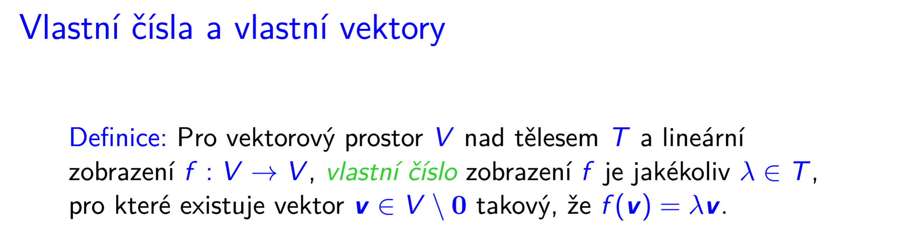
- kdybychom dovolili nulový vektor, pak by všechny prvky tělesa byly vlastními čísly ($f(\mathbf{0}) = \lambda \mathbf{0} \quad \forall \lambda \in T$)
- kdybychom to chtěli kvantifikovat tak $$\lambda \text{ je vlastní číslo matice } A \iff \exists \vec{v} \neq \vec{0} : A\vec{v} = \lambda\vec{v}$$

- INTUITIVNĚ ŘEČENO **každý vektor, co po provedení té operace = lineárního zobrazení** (př. zvetšení/zmenšení/překlopení/otočení, apod.) **zůstane na stejné přímce.**
	- v tom $f(\mathbf{v}) = \lambda \mathbf{v}$ je to $\lambda$ o kolik se zmenší/zvětší vektor, co zůstane na stejné přímce (a když $\lambda$ záporné, tak se ještě otočí o $180^\circ$ = jakoby překlopí na 2. stranu	)
- tady naopak nulový vektor povolíme, protože budeme chtít, aby množina vlastních vektorů tvořila vektorový prostor

	Ohledně tohohle jsem diskutoval, je to takový zajímavý edge case

	"Je třeba mít 0 jako vlastní vektor právě z důvodu, aby to byl vektorový podprostor. Může to vypadat jako technikálie, ale je to potřeba, aby fungovala správná představa o fungování lineárního zobrazení jakožto součet lineárních zobrazení podprostorů s příslušnými vlastními čísly"

	"Kolman nulový vektor napríklad nepovoloval ako vlastný pre žiadne vlastné číslo. Ale to sú naozaj len technické definície a keď ich vidíš použité tak  si už vieš domyslieť či tam ten nulový má byť alebo nie."

- v každém případě tam ten nulový vektor je trochu divný, protože k němu podle předchozí definice nebude žádné vlastní číslo
	- ale tak teda nevadí, je to jenom takový "lepidlo", aby ta množina vlastních vektorů byla uzavřená na součty (= že jo def. vekt. podprostoru + každý vekt. prostor je sám sobě podprostorem)

makes sense, viz. definice matice lineárního zobrazení (z [LA1](https://kam.mff.cuni.cz/~fiala/LA1/622-matice.pdf)):

Takže:

$[f]_{B,B} = \begin{pmatrix}
\vert & \vert \\
[f(\mathbf{b}_1)]_B & [f(\mathbf{b}_2)]_B \\
\vert & \vert
\end{pmatrix}$
- že jo ty $\mathbf{b}_1, \mathbf{b}_2 \in B$ jsou implicitně vyjádřeny vůči standardní bázi.
- aplikujeme na ně zobrazení $f$
- potom je vyjádříme jako koeficienty lin. kombinace pomocí vektorů $B$ = to je to $[\ ]_B$
- když pak provádíme maticový součin této matice s vektorem, který jsme taky vyjádřili jako koeficienty lineární kombinace TODO: doplnit

- **forward ref:** O této matici toho bude víc v videu "Podobné matice, diagonalizace" (nadpis "Proč matice $[f]_{B,B}$, je-li její báze $B$ tvořena pouze vlastními vektory, je diagonální a má na diagonále vlastní čísla")
	- pokud ty vektory báze budou vlastní vektory, tak matice v příslušných sloupcích bude na diagonále obsahovat vlastní čísla

(recap z LA1): **Vektor souřadnic ($[\ ]_B$)**

Definice: Nechť

$B = (\mathbf{b}_1, \dots, \mathbf{b}_n)$ je uspořádaná báze vektorového prostoru $V$ nad $T$. 
Vektor souřadnic $\mathbf{v} \in V$ vzhledem k bázi $B$ je

$$[\mathbf{v}]_B = (a_1, \dots, a_n)^T \in T^n, \text{ kde } \mathbf{v} = \sum_{i=1}^{n} a_i \mathbf{b}_i.$$

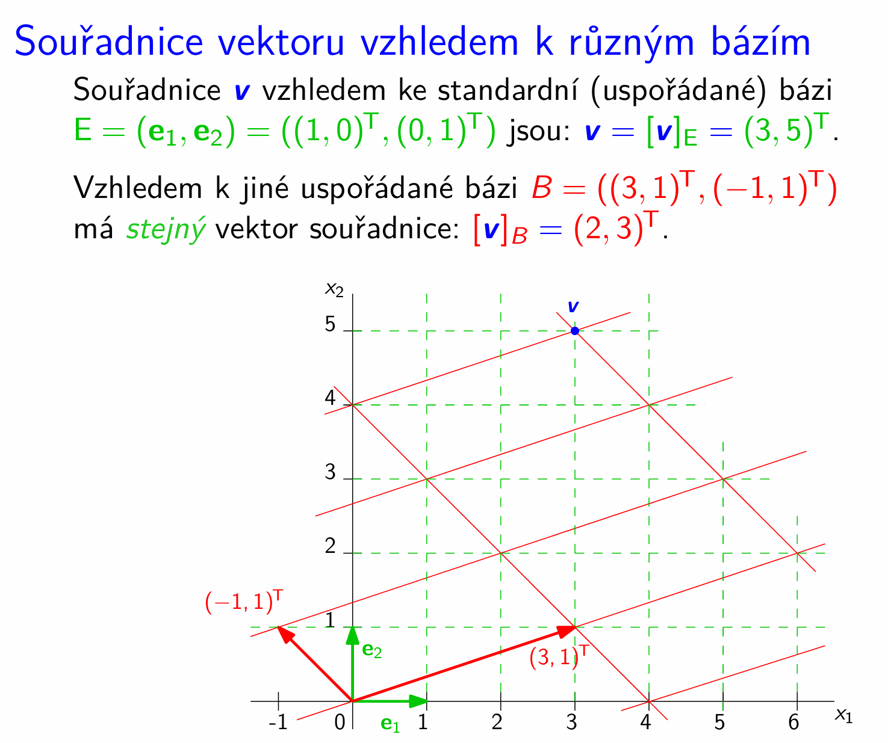
- **tedy celý ten výpočet je zde o tom, že máme vektor, který míří na nějaké místo, a chceme vědět, jaký vektor bude mířit na stejné místo, změníme-li bázi prostoru**

[zdroj LA1, Lineární nezávislost, báze, slide 6/14](https://kam.mff.cuni.cz/~fiala/LA1/532-baze.pdf)

(Btw, **výpočet vektoru souřadnic je lineární zobrazení**:

[zdroj "Lineární zobrazení, afinní prostory"](https://kam.mff.cuni.cz/~fiala/LA1/612-zobrazeni.pdf), slide 5/14
)

Pro tohle použití, co teď děláme s těmi zobrazeními jsou standardní báze $E$ a báze $B$ jenom různé báze stejného vektorového prostoru $V$, a vektory co cpeme dovnitř $[ \ \ ]$ jsou vyjádřeny implicitně vzhledem ke standardní bázi.

(jiná použití, kdy jsme měli 2 různé prostory a dávali jsme nějak souřadnice vektorovému prostoru sudých podgrafů teď neřeším)

**Příklad:**

báze $B$, která je “nestandardní”, třeba:

$$\mathbf{b}_1 = \begin{pmatrix} 2 \\ 0 \end{pmatrix}, \quad \mathbf{b}_2 = \begin{pmatrix} 0 \\ 2 \end{pmatrix}$$

Nyní vezměme vektor 
$\mathbf{e}_1 = \begin{pmatrix} 1 \\ 0 \end{pmatrix}$. Chceme najít jeho souřadnice vzhledem k bázi 
$B$, tedy 
$[\mathbf{e}_1]_B$.

Hledáme čísla 
$a_1, a_2$ taková, aby platilo:

$$\mathbf{e}_1 = a_1 \mathbf{b}_1 + a_2 \mathbf{b}_2$$
Dosadíme konkrétní čísla:

$$\begin{pmatrix} 1 \\ 0 \end{pmatrix} = a_1 \begin{pmatrix} 2 \\ 0 \end{pmatrix} + a_2 \begin{pmatrix} 0 \\ 2 \end{pmatrix}$$

Po spočtení soustavy:

$$[\mathbf{e}_1]_B = 
\begin{pmatrix}
a_1 \\
a_2
\end{pmatrix}
= 

\begin{pmatrix}
\frac 1 2 \\
0
\end{pmatrix}
$$

Získali jsme tedy z vektoru vyjádřeného k standardní bázi jeho vyjádření vzhledem k bázi $B$

**Proto dává smysl tento vzorec btw:**
$$[f]_{E,B} = \begin{pmatrix}
\vert				& \vert					\\
[f(\mathbf{e}_1)]_B	& [f(\mathbf{e}_2)]_B	\\
\vert				& \vert
\end{pmatrix}$$

To naše zobrazení $f$ je definováno s vstupním vektorem $\mathbf{v}$ vzhledem k standardní bázi, a výstupním vektorem $f(\mathbf{v})$ vzhledem ke standardní bázi.

My ale př. můžeme chtít, aby výstupní vektor byl vzhledem k bázi $B$, tak převedeme výsledky $f(\mathbf{e}_1)$, aby byly vyjádřené vzhledem k bázi $B$.

Získáme tak sloupce $[f(\mathbf{e}_1)]_B$ a $[f(\mathbf{e}_2)]_B$, a tedy když pak té matici dáme vstupní vektor $\mathbf{v}$ vyjádřený vzhledem ke standardní bázi, tak dostaneme lineární kombinaci sloupců vyjádřených k bázi $B$, tak i výsledek bude vyjádřený k bázi $B$.

S maticí přechodu by to vypadalo takto:

$[f]_{E, B} = [id]_{E, B} \cdot [f]_{E,E}$

kde 
$$[f]_{E,E} = 
\begin{pmatrix}
\vert			& \vert				\\
f(\mathbf{e}_1)	& f(\mathbf{e}_2)	\\
\vert			& \vert				\\
\end{pmatrix}
$$

a 
$$ 
[id]_{E, B} = 

\begin{pmatrix}
\vert				& \vert				\\
[\mathbf{e}_1]_B	& [\mathbf{e}_2]_B	\\
\vert				& \vert				\\
\end{pmatrix}
$$

že jo $\mathbf{w} := [f]_{E,E} \cdot \mathbf{v}$ nám vyrobí výsledek zobrazení vzhledem ke standardní bázi, a my ho pak musíme převést do výsledku vzhledem k bázi $B$

Takže násobíme $[id]_{E, B} \cdot \mathbf{w}$, čímž počítáme $[\mathbf{w}]_B$

**Takže máme 2 způsoby, jak spočítat vektor souřadnic**:

A) 1. způsob = podle definice:
1. Vektor $\mathbf{w}$ si můžeme vyjádřit jako lineární kombinaci $\sum_{i=1}^n a_i \mathbf{b_i}$, kde koeficienty $a_1, \dots, a_n$ neznáme, a spočteme je (soustavou)
2. Výsledek je $[\mathbf w]_B = (a_1, \dots, a_n)^T$

B) 2. způsob = přes matici přechodu

$[\mathbf w]_B = [id]_{E,B} \cdot [\mathbf w]_E$

($[\mathbf w]_E = \mathbf w$ že jo)

**Proč 2. způsob počítá to samé co první**

Z https://kam.mff.cuni.cz/~fiala/LA1/622-matice.pdf:

(

- VTIPNÝ JE, ŽE DŮKAZ **Proč 2. způsob počítá to samé co první** JE HNED POD TÍM: 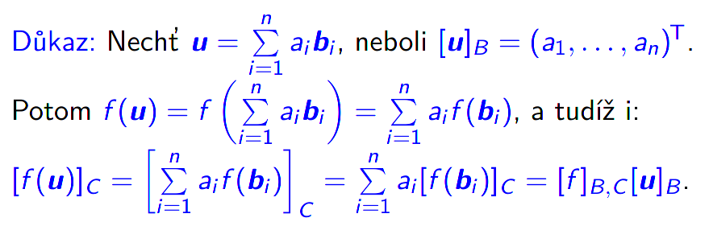

TO JEST POD TÍM DO NADPISU **Zpátky k LA2:** JE TO SPÍŠ JEN RAMBLING

nebo
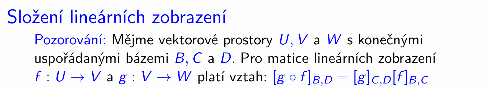

)

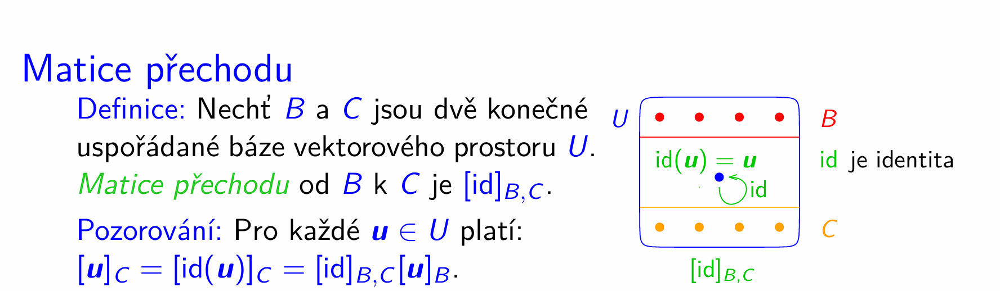
Náš případ $[\mathbf w ]_B = [id]_{E, B} \cdot [\mathbf w]_B$ z toho pozorování vychází. A to pozorování vychází z toho pozorování o použití matice lineárního zobrazení příp. z toho o složení lineárních zobrazení, zde toho $id(\mathbf u)$. (afaik by šlo i to druhé, protože se v [předchozí prezentaci](https://kam.mff.cuni.cz/~fiala/LA1/612-zobrazeni) (slide 5/14 "Transformace na vektor souřadnic") dozvědeli, že $[\mathbf w ]_B$ je lineární zobrazení, a tato notace je tak "syntax sugar" pro něco, co bychom mohli označit $[f]_{E, B}$).

**Moje alternativní (možná zbytečně komplikované) vysvětlení:**

Vektor $\mathbf w$ si můžeme vyjádřit jako lin. kombinaci $\sum_{j=1}^n w_j \mathbf e_j$

Pojďme upravovat vztah $[id]_{E,B} \cdot \mathbf w$

$$[id]_{E,B} \cdot \mathbf w = [id]_{E,B} \cdot \left( \sum_{j=1}^n w_j \mathbf e_j \right)$$

Víme, že pro maticový součin platí $A(B +C) =AB+AC$, a vektory jsou jen matice o 1 sloupci, tak $A(u + v) = Au + Av$ (u matic lin. zobrazení paralela s linearitou vůči součtu $f(u+v) = f(u) + f(v)$)

Což tady umožňuje udělat toto: 

$$[id]_{E,B} \cdot (w_1 \mathbf{e}_1 + w_2 \mathbf{e}_2) = ([id]_{E,B} \cdot w_1 \mathbf{e}_1) + ([id]_{E,B} \cdot w_2 \mathbf{e}_2)$$

Taky víme, že pro maticový součin platí $(tA)B = A(tB)$, což pro vektory znamená $(tA)\mathbf w = A(t\mathbf w)$ (= linearita vůči skalárnímu násobku $tf(\mathbf w)) = f(t\mathbf w)$)

Tedy $[id]_{E,B} \cdot w_1 \mathbf{e}_1 = w_1 \cdot [id]_{E,B} \cdot \mathbf{e}_1$

Jinými slovy díky linearitě maticového součinu můžeme:

$$[id]_{E,B} \cdot \left( \sum_{j=1}^n w_j \mathbf e_j \right) =  w_1 \cdot [id]_{E,B} \cdot \mathbf{e}_1 + \dots +  w_n \cdot [id]_{E,B} \cdot \mathbf{e}_n \\ = \sum_{j=1}^n w_j ( [id]_{E,B} \mathbf{e}_j )$$

$[id]_{E,B} \mathbf{e}_j$ vybere $j$-tý sloupec matice $[id]_{E,B}$, což je $[\mathbf{e}_j]_B$, protože tak jsme matici lineárního zobrazení, a konkrétně matici přechodu $[id]_{E,B}$ [definovali (slide 1/10)](https://kam.mff.cuni.cz/~fiala/LA1/622-matice.pdf)

$$\sum_{j=1}^n w_j ( [id]_{E,B} \mathbf{e}_j ) = \sum_{j=1}^n w_j [\mathbf{e}_j]_B $$

Teď použijeme, že zobrazení $[ \mathbf v ]_B$ [je lineární](https://kam.mff.cuni.cz/~fiala/LA1/612-zobrazeni.pdf) (slide 5/14 "Transformace na vektor souřadnic"), platí $f(\mathbf u) + f(\mathbf v) = f(\mathbf u + \mathbf v)$:

$$\sum_{j=1}^n w_j [\mathbf{e}_j]_B = \left[ \sum_{j=1}^n w_j \mathbf{e}_j\right]_B$$

A substitujeme: 

$$\left[ \sum_{j=1}^n w_j \mathbf{e}_j\right]_B = [ \mathbf w ]_B$$

Takže máme 

$$[id]_{E,B} \cdot \mathbf w = [ \mathbf w ]_B$$

s použitím vlastností maticového součinu, definice matice lineárního zobrazení, tvrzení, že zobrazení  $[ \mathbf v ]_B$ je lineární
____________________________________________
**Zpátky k LA2:**

$f(\mathbf{v}) = \mathbf{Av}$ že jo

### Ukázky
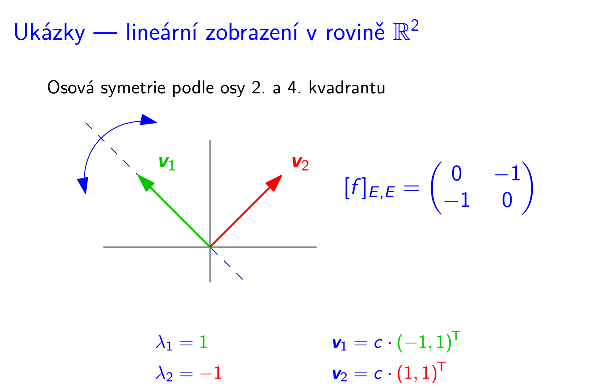
- všechno, co bylo na zelené ose (= všechny skalární násobky vektoru $(-1,1)^T$), zůstalo $1$ krát zvětšené
- všechno co bylo na červené ose (= všechny skalární násobky vektoru $(1,1)^T$) se $-1$ násobí = otočí na druhou stranu
- ta matice vznikla jako 

$\begin{pmatrix}
\vert & \vert \\
[f(\mathbf{e}_1)]_E & [f(\mathbf{e}_2)]_E \\
\vert & \vert
\end{pmatrix}$, kde $\mathbf{e}_1 = (1,0)^T$ a $\mathbf{e}_2 = (0,1)^T$ jsou vektory standardní báze

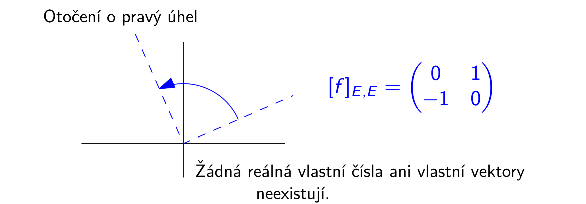
- nulový vektor se tady jako ten divný edge case zase nepočítá

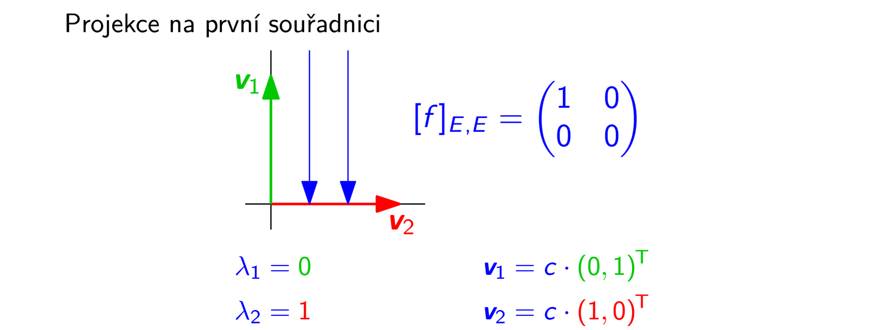
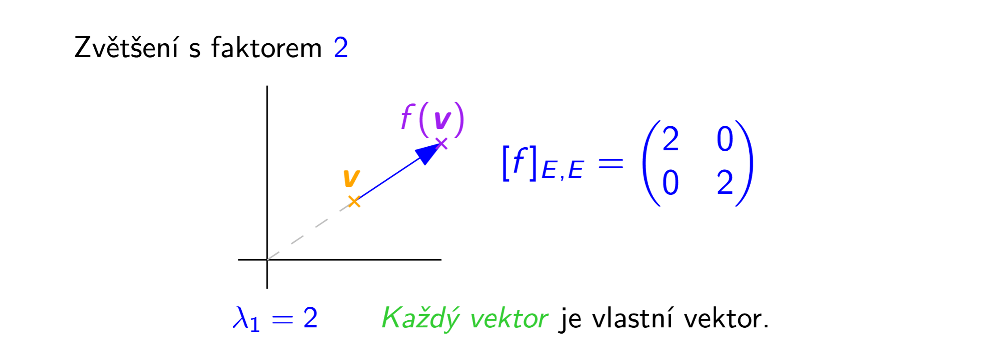
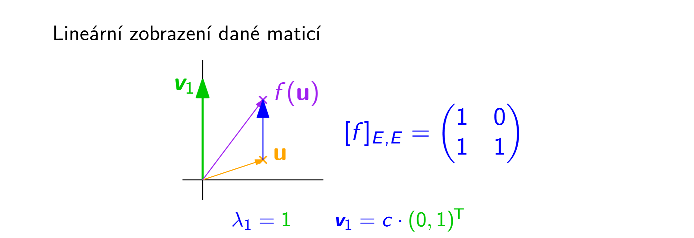
- afaik stejný typ úprav, který jsme dělali v části "Geometrický význam determinantu", konkrétně slide "Idea důkazu - elementární úpravy zachovávají objem" - kde jsme měnili "zkosení"
	- tj taky tady hýbeme s koncem vektoru $\mathbf u$ po přímce.
		= pouze vektory na svislé ose zůstávají na stejné přímce, ostatní vektory mění úhel, který svírají s vodorovnou osou
- "Lineární zobrazení dané maticí" je zde snad každé z nich, akorát tady tomu nedal konkrétnější název

> Pro obecné matice není jednoduché určit, co jsou její vlastní čísla a vlastní vektory.

> Na druhou stranu, je-li ta matice diagonální, potom už to jednoduché je. U ní jsou vlastní čísla totiž prvky na diagonále této matice, a jim odpovídající vlastní vektory tvoří standardní bázi

POZOR!!! Neplatí ale, že bychom mohli matici $A$ převést na diagonální matici Gaussovou metodou, a potom vyčíst vlastní čísla !!!
(ta se budou těmi úpravami měnit)

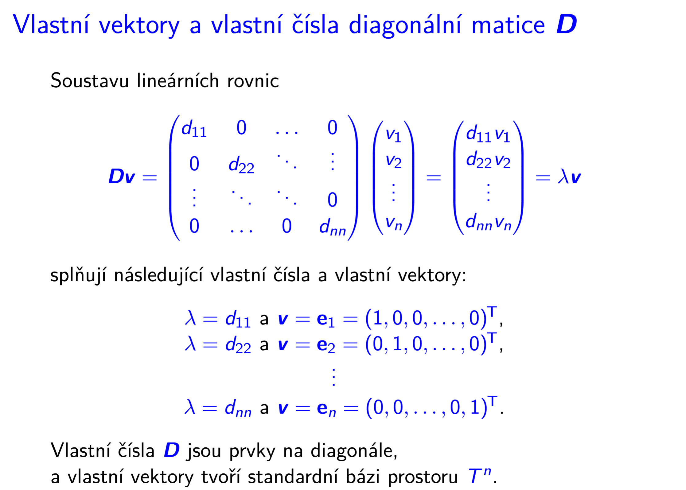
- nějak jsem tam byl nejdřív zmaten, jak to, že když násobíme jednotlivé šložky vektoru různými skaláry, tak jak je možné, že se to bude rovnat násobení všech složek stejným skalárem $\lambda$
	- pak jsem pochopil, že násobit budeme vektorem $\mathbf v := \mathbf e_i$, který má na jenom na $i$-tém místě $1$, a jinde $0$.
		- tím se z matice $D$ vybere $i$-tý sloupec, s koeficientem $d_{i,i}$
		- a na pravé straně, tak jen $i$-tá složka bude násobena $\lambda$
$$
\begin{pmatrix}
0 \\
\vdots \\
0 \\
d_{i,i} \\
0 \\
\vdots \\
0 \\
\end{pmatrix}
= 
\begin{pmatrix}
0 \\
\vdots \\
0 \\
\lambda \\
0 \\
\vdots \\
0 \\
\end{pmatrix}
$$

- **forward ref**: Jak se dozvíme v tomto videu, víc řešení opravdu nebude, protože matice řádu $n$ mají nejvýše $n$ různých lineárně nezávislých vlastních vektorů, a nejvýše $n$ vlastních čísel.

### Vlastnosti vlastních čísel a vlastních vektorů

#### Vlastní vektory odpovídající stejnému vlastnímu číslu tvoří podprostor
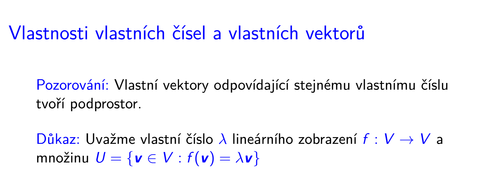
- různá vlastní čísla budou mít různé podprostory

Na této množině $U$ (= "vlastní vektory odpovídající stejnému vlastnímu číslu") ověřme axiomy podprostoru:

- uzavřenost na skalární násobky

 použito:
	1. linearita lin. zobrazení k skalárnímu násobku 
	2. $\mathbf u \in U$ je předpoklad, o který se opřeme:, $\mathbf u \in U \iff f(\mathbf u) = \lambda \mathbf u$, proto substituce
	3. komutativita a asociativita násobení skalárem
	4. $ f(t\mathbf u) = \lambda (t \mathbf u)  \iff t \mathbf u \in U$, je to tedy uzavřeno
- uzavřenost na součet

 použito:
	1. linearita lin. zobrazení k součtu
	2. substituce
	3. vytknutí $\lambda$ = distributivita skalárního násobku
	4. $f(\mathbf u + \mathbf v) = \lambda(\mathbf u + \mathbf v) \iff \mathbf u + \mathbf v \in U$, je to tedy uzavřeno

#### Geometrická násobnost vlastního čísla

> Dimenzi prostoru vlastních vektorů $U$, které přísluší vlastnímu číslu $\lambda$ , budeme označovat jako **geometrickou násobnost vlastního čísla**

#### Vlastní vektory odpovídající různým vlastním číslům jsou lineárně nezávislé
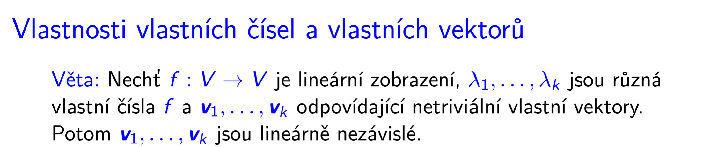
> Tzn. podprostory, které přísluší vlastním číslům $\lambda_1, \dots, \lambda_k$, se protínají pouze v počátku

BTW funfact - kdybychom to chtěli napsat ultraformálně:

Necht’ 
$V$ je vektorový prostor nad tělesem 
$\mathbb{T}$ a 
$f \in \mathcal{L}(V, V)$. 

($f \in \mathcal{L}(V, V)$ = alternativní značka pro: "$f$ je lineární zobrazení z $V$ do $V$", prof. Fiala tuto značku nepoužívá)

Pak platí:

$$\forall k \in \mathbb{N}, \forall \lambda_1, \dots, \lambda_k \in \mathbb{T}, \forall \mathbf{v}_1, \dots, \mathbf{v}_k \in V \setminus \{ \mathbf{0} \}:$$

$$\left( \left( \bigwedge_{i \neq j} \lambda_i \neq \lambda_j \right) \wedge \left( \bigwedge_{i=1}^k f(\mathbf{v}_i) = \lambda_i \mathbf{v}_i \right) \right) \implies \text{LN}(\mathbf{v}_1, \dots, \mathbf{v}_k)$$
Kde 
$\text{LN}(\mathbf{v}_1, \dots, \mathbf{v}_k)$ je zkratka pro lineární nezávislost, kterou můžeme dále rozepsat jako:

$$\forall a_1, \dots, a_k \in \mathbb{T}: \left( \sum_{i=1}^k a_i \mathbf{v}_i = \mathbf{0} \implies a_1 = a_2 = \dots = a_k = 0 \right)$$

Aka pro důkaz, který bude sporem, tuto implikaci znegujeme, dostaneme:

$$\left( \left( \bigwedge_{i \neq j} \lambda_i \neq \lambda_j \right) \wedge \left( \bigwedge_{i=1}^k f(\mathbf{v}_i) = \lambda_i \mathbf{v}_i \right) \right) \land \neg \text{LN}(\mathbf{v}_1, \dots, \mathbf{v}_k)$$
=> což že jo dává smysl = "kdyby to do cíle nevedlo, tak by to nebylo slučitelné s předpoklady", když tento výrok tedy neplatí, tak platí původní

tj. u $P \implies Q$ 
1. Předpoklad: Věřím předpokladům (
$P$) A SOUČASNĚ tvrdím, že cíl neplatí (
$\neg Q$).
2. Srážka: Nechám tyhle dvě věci v jedné místnosti a začnu z nich vyvozovat další kroky.
3. Výbuch (Spor): Najednou mi vyjde něco naprosto nemožného (např. 
$1 = 0$ nebo že „číslo je sudé a liché zároveň“).
4. Závěr: Protože matematika se nesmí „rozbít“, musí být chyba v tom, co jsem si myslel na začátku – tedy cíl musí platit.

##### Důkaz věty:
Myšlenka: začneme u nějakého $n$ lineárně závislých vektorů. Pak zjistíme, že pro $n-1$ vektorů nám vychází, že nutně musí být též lineárně závislé. Tak to opakujeme, než dojdeme k základnímu případu $n=1$. Ovšem pro $n=1$ vektorů určitě platí, že jsou lineárně nezávislé (je to že jo $1$ vektor). To je spor.
- těch mnoho iterací zmenšování $n$ si ale můžeme ušetřit
	- to je ta fráze "$k$ je nejmenší počet lin. závislých vektorů"
		- tím zaručíme, že tam není vektor navíc, který se neúčastní lin. kombinace, kterou vyjádřujeme nějaký jiný vektor, tj. že v té lin. kombinaci nejsou nulové koeficienty
			- a odebráním jednoho vektoru z takové množiny se už určitě stane, že vektory už **nebudou** lineárně závislé
				- ale tím argumentem, jako předtím, ukážeme, že $k-1$ vektorů je závislých
					- což je spor

Ještě ten počet $k$ se může že jo lišit podle množiny, kterou dostaneme. Víme, že to je alespoň $2$, ale může to být víc, př. $3$:

A protože chceme, aby to bylo pro všechny množiny, tak stanovíme $k$ a ne nějaký konkrétní počet lineárně závislých vektorů z toho vektorového prostoru.

- tj. $\mathbf v_1, \dots \mathbf v_k$ jsou lineárně závislé
	- definice závislosti (z [LA1](https://kam.mff.cuni.cz/~fiala/LA1/532-baze.pdf), 1.slide) je ovšem toto:
	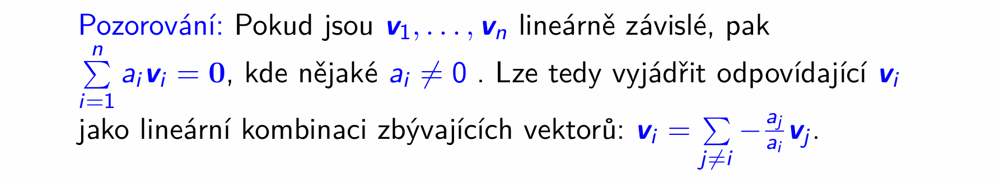
	=> stačí tam nějaké $a_i \neq 0$
		- tady jsou všechny $\neq 0$, to je ta minimalita
			- kdyby se nějaký vektor lin. kombinace neúčastnil, tak nemusí v té množině lin. závislých vektorů být

použito
- $\mathbf 0 = f(\mathbf 0)$ je že jo vlastnost lin. zobrazení:
protože platí linearita vůči skal. násobku: $f(\mathbf{0}) = f(0 \cdot \mathbf{v}) = 0 \cdot f(\mathbf{v}) = \mathbf{0}$
- linearita lin. zobrazení vůči součtu  a vůči skal. násobku.
- použítí předpokladu, že $\mathbf v_i$ je vlastní vektor = substituce $\lambda_i \mathbf v_i =  f(\mathbf v_i)$

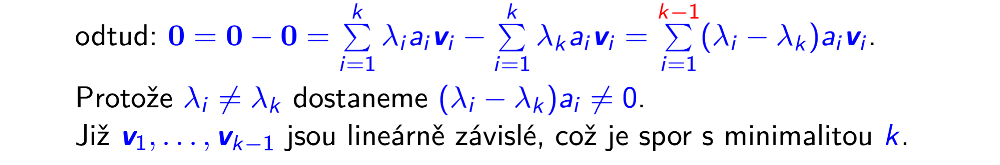
- takže zase s netriviálními koeficienty vyšla lineární kombinace $k-1$ vektorů $\mathbf 0$ => těch $k-1$ vektorů je určitě lineárně závislých
	- na začátku jsme ale řekli, že ten počet $k$ je mimimální, tedy odebrání jakéhokoli vektoru by působilo, že zbytek bude lin. nezávislý
		- spor, takže $\mathbf v_1, \dots, \mathbf v_n$ jsou lineárně nezávislé.

##### Důsledek:

- vl. č. nejvýš $n$ v případě, že by každému vlastnímu číslu náležel právě $1$ lin. nezávislý (=LN) vlastní vektor = **geometrická násobnost** každého vlastního čísla by byla právě $1$
	- že jo, kdyby nějakému vl. č. náležely $2$ LN vektory, tak by dimenze jejich podprostoru (= geometrická násobnost) byla $2$

> Nyní už víme, co jsou vlastní vektory i vlastní čísla, známe jejich definice, a také známe jejich některé vlastnosti

> Ovšem nevíme, jak vlastní vektory a vlastní čísla určit, protože v definiční rovnici jsou oba objekty jako neznámé. Jak se to dá provést, si předvedeme příště.

## Charakteristický polynom (19:39, 81M)
> Dnes si předvedeme, že úlohu nalezení vlastních čísel a vlastních vektorů si můžeme rozdělit na 2 části.

> Nejprve určíme vlastní čísla, a teprve poté budeme hledat vlastní vektory.

> K tomu nám budou užitečné polynomy a také postupy pro řešení soustav lineárních rovnic.

> Slibovaným nástrojem pro výpočet vlastních čísel je tzv. charakteristický polynom čtvercové matice $A$.

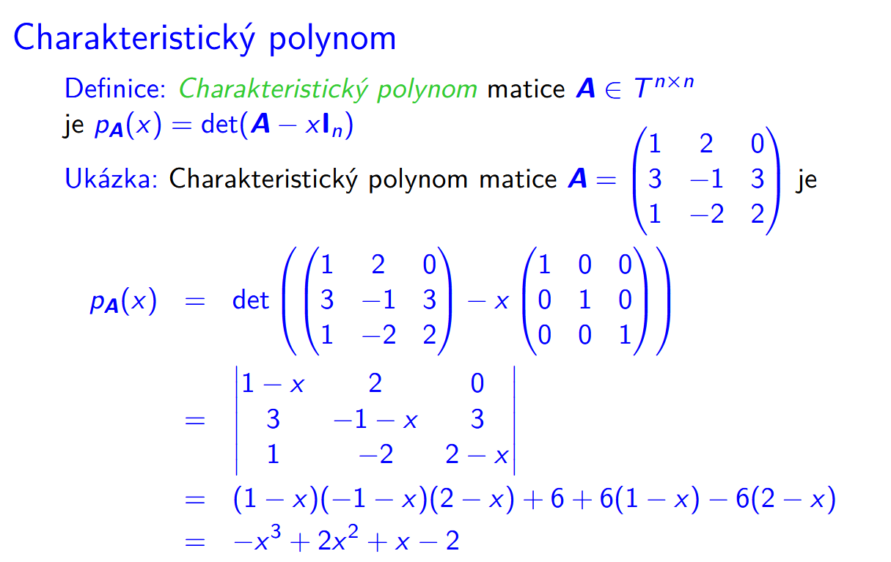

> Stupeň charakteristického polynomu se shoduje s řádem matice (= $n$-tá mocnina $x$, součin podle diagonály)

### Kořen charakteristického polynomu je vlastní číslo matice

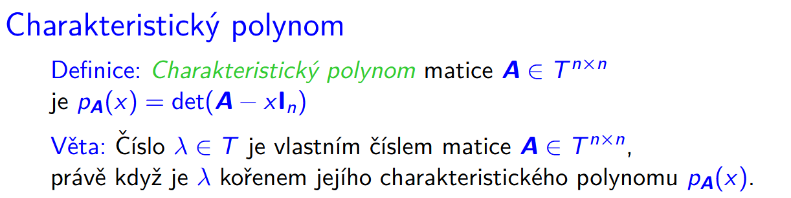

#### Důkaz (zároveň návod, jak spočíst vlastní vektor)
Řetízek ekvivalencí:

$\lambda$ je vlastní číslo $A$ $\iff$ 
$\exists \mathbf v \in T^n \setminus \set{\mathbf 0}: \lambda \mathbf v = A \mathbf v$ (existuje vlastní vektor $\mathbf v$)

$\iff$ (odečteme $\lambda \mathbf v$ )

$\exists \mathbf v \in T^n \setminus \set{\mathbf 0}: A \mathbf v - \lambda \mathbf v = \mathbf 0$

$\iff$ (chceme vytknout $\mathbf v$, ale nemůžeme, protože jedno je maticový součin, a jedno skalární násobek => opravíme tím, že vektor $\mathbf v$ zleva vynásobíme jednotkovou maticí, která ho nezmění, ale už tam bude maticový součin)

$\exists v \in T^n \setminus \set{\mathbf 0}: A \mathbf v - \lambda I \mathbf v = \mathbf 0$

$\iff$

$\exists v \in T^n \setminus \set{\mathbf 0}: (A - \lambda I) \mathbf v = \mathbf 0$

$\iff$ (Na toto se můžeme dívat jako na soustavu rovnic, s maticí $A - \lambda I$. Ta soustava má jako řešení nenulový $\mathbf v$. To znamená, že matice $A - \lambda I$ je singulární.)

$A - \lambda I$ je singulární

$\iff$ (to znamená, že její determinant je $0$)

$\det(A - \lambda I) = 0$

$\iff$ (to je přímo definice charakteristického polynomu)

$p_A (\lambda) = 0$

$\iff$

vlastní číslo $\lambda$ je kořen charakteristického polynomu

**V podstatě ten důkaz ukazuje, jak počítat vlastní vektor:**

$\lambda$ je vlastní číslo $A$ $\iff$  $\exists v \in T^n \setminus \set{\mathbf 0}: (A - \lambda I) \mathbf v = \mathbf 0$

A to $\mathbf v$, které z definice vl. čísla musí existovat, spočteme jako řešení soustavy
___________

> U polynomu jsme si zaváděli pojem násobnosti kořene. Připomínám, že jde o maximální mocninu lineárního členu $(x - \lambda)$, která dělí daný polynom beze zbytku 
### Algebraická násobnost vlastního čísla

= největší celé kladné číslo $k$, t.ž. $(x-\lambda_i)^k$ dělí $p_A(x)$ (tj. beze zbytku)

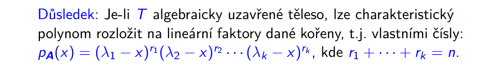
= z def. algebraicky uzavřeného tělesa = pro každý polynom stupně $\ge 1$ v něm existuje kořen

- ještě docela zajímavá záležitost, proč jsme mohli prohodit pořadí členů (u polynomů obecně jsme měli $(x - r_i)$, (kde $r_i$ je kořen) a pak u definice charakteristického polynomů jsme měli členy, kde jsme odečítali $x$, stejně jako tady máme $(\lambda_i - x)$)

	Zápis s členy $(\lambda_i - x)$ je trochu "elegantnější", protože skryje v reprezentaci polynomu člen $a_n = (-1)^n$ do těch závorek. 

	Odvození, proč je to ekvivalentní:

	$(\lambda_1 - x)^{r_1}(\lambda_2 - x)^{r_2} \dots (\lambda_k - x)^{r_k}$

	$ = (-1(x - \lambda_1))^{r_1}(-1(x - \lambda_2))^{r_2} \dots (-1(x - \lambda_k))^{r_k}$

	$ = (-1)^{r_1}(x - \lambda_1)^{r_1}(-1)^{r_2}(x - \lambda_2)^{r_2} \dots (-1)^{r_k}(x - \lambda_k)^{r_k}$

	$= (-1)^{r_1 + \dots + r_k} (x - \lambda_1)^{r_1}(x - \lambda_2)^{r_2} \dots(x - \lambda_k)^{r_k}$

	jelikož $r_1 + \dots + r_k = n$:

	$= (-1)^n (x - \lambda_1)^{r_1}(x - \lambda_2)^{r_2} \dots(x - \lambda_k)^{r_k}$

	A to odpovídá reprezentaci polynomu $a_n \cdot (x-r_1)(x-r_2) \dots (x-r_n)$,

	protože člen $a_n$ charakteristického polynomu skutečně bude $(-1)^n$:

	
	= že jo před tím $x$ je tam vždycky mínus., to znamená, že když ten determinant spočteme, dostaneme $-x^n$, tedy $(-1)^n x^n$

	**forward ref:** to bude zmíněno na slidu "Koeficienty charakteristického polynomu"

### Výpočet vlastních čísel a vlastních vektorů
1. Určíme charakteristický polynom matice $A$
2. Nalezeneme kořeny tohoto polynomu = vlastní čísla
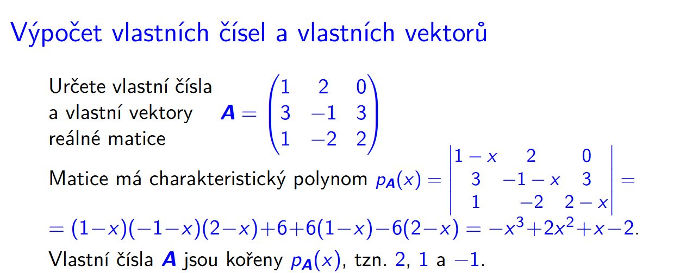
$-x^3 + 2x^2 + x - 2 = -x(x^2 - 1) + 2(x^2 - 1) = (x^2 - 1)(2-x)$
3. Určíme vlastní vektory k těm vl. číslům:

	$\lambda$ je vlastní číslo $A$ $\iff$  $\exists v \in T^n \setminus \set{\mathbf 0}: (A - \lambda I) \mathbf v = \mathbf 0$

	(viz důkaz věty "Kořen charakteristického polynomu je vlastní číslo matice")

	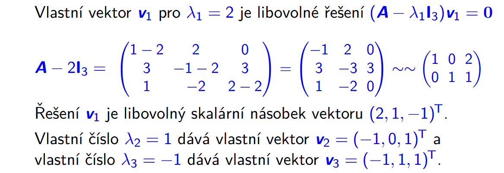
____
> U některých matic, jako př. u nulové matice můžeme charakteristický mnohočlen (=polynom) i jeho kořeny = vlastní čísla určit přímo.

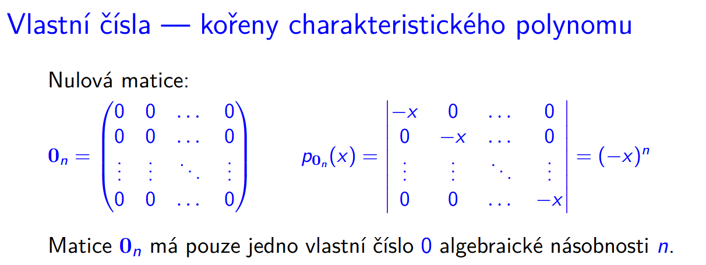

$p_{\mathbf 0_n}(x) = \det(\mathbf 0_n - x \cdot I_n)$
- ten determinant spočteme součinem hlavní diagonály, protože to je nejen trojúhelníková, ale dokonce diagonální matice.

$p_{\mathbf 0_n}(x) = 0$ => $(-x)^n = 0$ => $x=0$

algebraické násobnosti $n$, můžeme ten polynom dělit $(0 - x)^n$

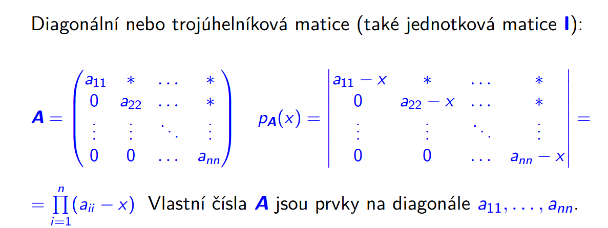
($*$ značí libovolný prvek tělesa, tj na obrázku je $A$ horní trojúhelníková matice = nulové prvky jsou **pod** hl. diagonálou)

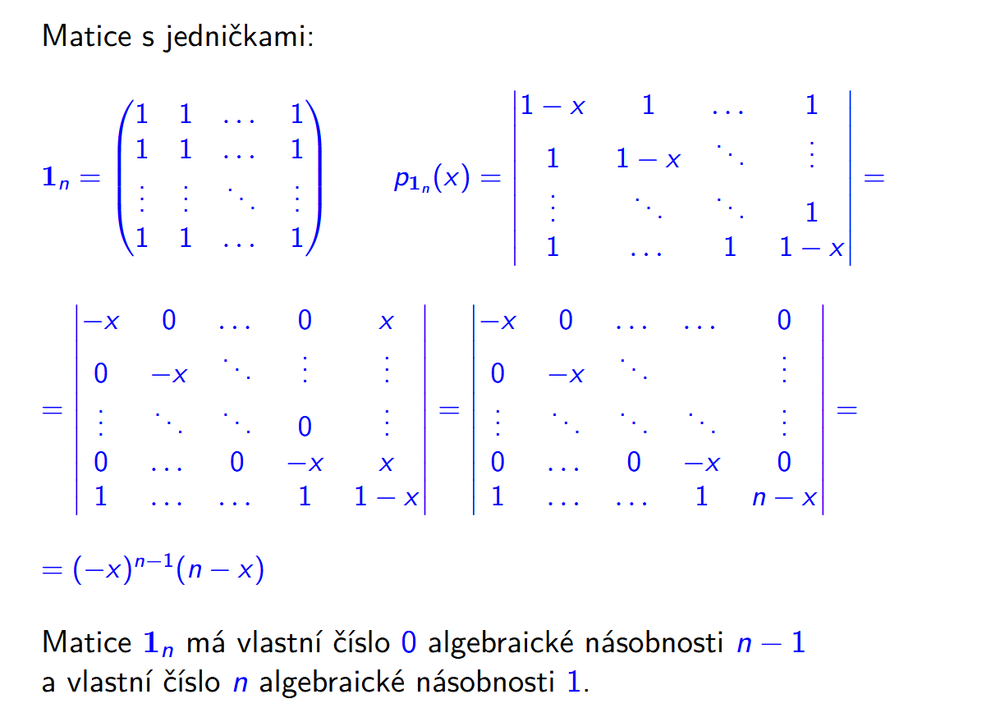
elementární úpravy:
1. odečteme poslední řádek od ostatních
2. k poslednímu sloupci přičteme všechny ostatní sloupce

determinant jako součin prvků na diagonále, protože je dolní trojúhelníková

### Konstrukce matic podle polynomu

> Je také zajímavé, že matice, jejíž sekundární diagonála obsahuje samé $1$, a poslední sloupec obsahuje parametry $b_0, \dots, b_{n-1}$, tak její charakteristický polynom obsahuje právě parametry $b_0, \dots, b_{n-1}$ jako koeficienty u příslušných mocnin $x$.

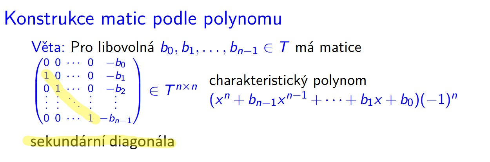
- I guess je to užitečné, když chceme nějaký polynom reprezentovat pomocí matice.
	- pak ale teda výsledek musíme kdyžtak přenásobit $-1$, když se nám nehodí jeho znaménko
#### Důkaz
Laplaceův rozvoj podle 1. řádku
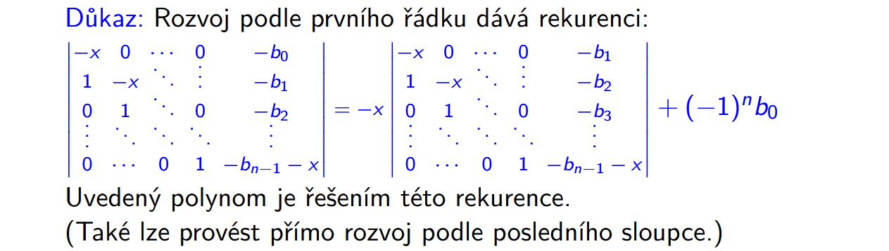
Ta pravá strana vznikla jako:

$$a_{1,1} (-1)^{1+1} \det(A^{1,1})+ a_{1,n} (-1)^{1+n} \det(A^{1,n})$$

$$(-1)^{1+n} \det(A^{1,n}) = 
(-b_0) \cdot (-1)^{1+n}
\begin{vmatrix}
1		&	-x	& 0 &	\dots	& 0 \\
0		&	1	&	-x		& \ddots & 0\\
0		&	0	&	1		& \ddots & 0		\\
\vdots	& \ddots&	\ddots	& \ddots & -x \\
0		& \dots &	0		&	0 & 1
\end{vmatrix} = b_0 \cdot (-1) \cdot (-1)^{1+n} \cdot 1 = (-1)^{n+2} \cdot b_0 = (-1)^{n} \cdot b_0
$$

Je horní trojúhelníková, det. je součin prvků hlavní diagonály.

Well, idk jak odvodit "Uvedený polynom je řešením této rekurence, ale vím, že, když víme, jak vypadá výsledek, tak to umíme ověřit indukcí.

Označme $(x^n + b_{n-1} x^{n-1} + \dots + b_1 x + b_0)(-1)^n$ jako $P_n(x)$

1. Základní případ $n=1$

	Pro něj ta matice bude $A = (-b_0)$

	$P_1(x) = \det(A - x \cdot I) = \det(-b_0 - x) = -b_0 - x = -1^1(x^1 + b_0)$

2. Předpokládejme, že pro matici řádu $n-1$ vzorec platí.
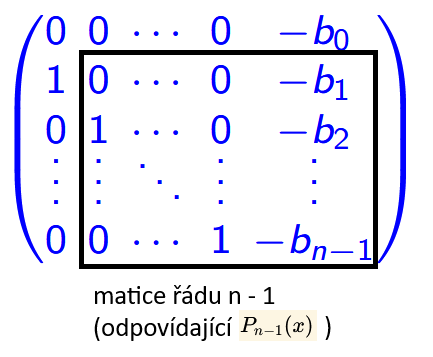

	Protože to zmenšujeme takto, tak se "posune" indexování (1. sloupec menší matice je 2. sloupec původní větší matice, analogicky s řádky) = budeme indexovat indexy původní větší matice.

	Předpokládejme tedy: $P_{n-1}(x) = (-1)^{n-1}(x^{n-1} + b_{n-1} x^{n-2} + \dots + b_1)$

3. Indukční krok

	Použijeme ten Laplaceův rozvoj podle 1. řádku:

	$$P_n(x) = -x(-1)^{1+1}P_{n-1}(x) + (-1)^n b_0$$

	A algebraickými úpravami do cíle:

	$$P_n(x) = -x \cdot \underbrace{(-1)^{n-1} (x^{n-1} + b_{n-1}x^{n-2} + \dots + b_1)}_{P_{n-1}(x)} + (-1)^n b_0$$

	Upravíme první část: $-x \cdot (-1)^{n-1} = (-1) \cdot (-1)^{n-1} \cdot x = (-1)^n \cdot x$.

	$$P_n(x) = (-1)^n \cdot x \cdot (x^{n-1} + b_{n-1}x^{n-2} + \dots + b_1) + (-1)^n b_0$$

	$$P_n(x) = (-1)^n \left[ x(x^{n-1} + b_{n-1}x^{n-2} + \dots + b_1) + b_0 \right]$$

	$$P_n(x) = (-1)^n (x^n + b_{n-1}x^{n-1} + \dots + b_1x + b_0)$$

	________

### Koeficienty charakteristického polynomu
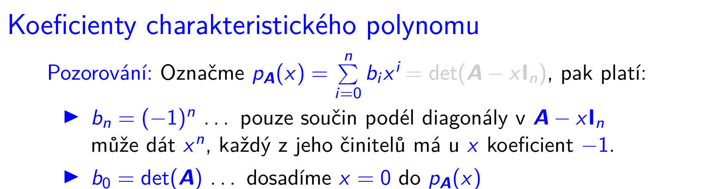
Zase, $0^0$ je v lineární algebře $1$:
$$\begin{align*}
p_A(x) &= \sum_{i=0}^n b_i x^i = \det(A - x I_n) \\

&= \sum_{i=0}^n b_i 0^i = \det(A - 0 I_n) \\
&= b_0 \underbrace{0^0}_{1} + \underbrace{\sum_{i=1}^n b_i 0^i}_{\forall i \ge 1: 0^i = 0} = \det(A) \\
&= b_0 = \det A
\end{align*}
$$
Dává to smysl, protože intuitivně bychom čekali, že $b_0 x^0$ z té sumy bude to samé jako $b_0$. Když do polynomu dáme $0$, tak všechny členy s $x$ se vynulují, a zůstane absolutní člen.

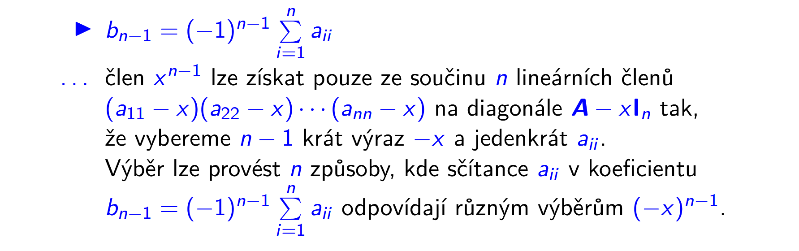
> člen $x^{n-1}$ lze získat pouze ze součinu členů na hlavní diagonále, protože permutace, která vybere nějaký prvek mimo diagonálu, proté vybere ještě alespoň $1$ mimo diagonálu. Z takových permutací můžeme nejvýš získat $n-2$ mocninu.

> V případě, že se nám podaří charakteristický polynom rozložit na součin lineárních členů, můžeme vyjádřit koeficienty $b_0$ a $b_{n-1}$ ještě vzhledem k vlastním číslům:

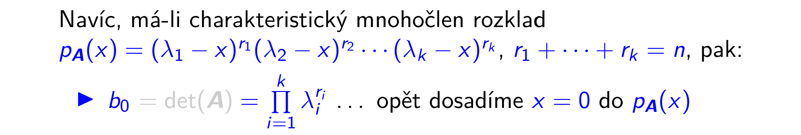
- tady zmíněno mimochodem, ale:

#### Determinant je roven součinu vlastních čísel umocněných  na jejich příslušné algebraické násobnosti
$$\det A = \prod_{i=1}^k \lambda_i^{r_i}$$

(tady, **má-li char. polynom rozklad na lin. členy** (což někdy obecně polynom němá, viz polynom $x^2 + 1$, idk jak to má char. polynom), ale v cvičení Maxové:
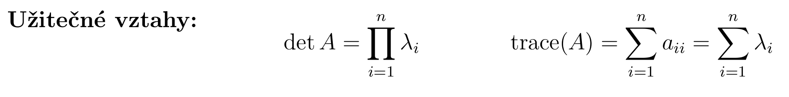
Že by to platilo vždy?
)

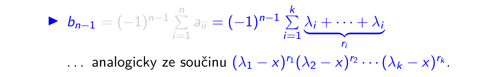
$p_A(x) = (\lambda_1 - x)^{r_1}(\lambda_2 - x)^{r_2} \dots (\lambda_k - x)^{r_k}$ můžeme rozepsat jako $n$ lineárních závorek (protože $r_1 + \dots + r_k = n$), kde každé $\lambda_i$ se opakuje v $r_i$ závorkách:

$p_A(x) = (\lambda_1 - x)(\lambda_2 - x) \dots (\lambda_n - x)$

Abychom po roznásobení všech závorek dostali člen, který obsahuje $x^{n-1}$, musíme:
1. z $n-1$ závorek vybrat člen $-x$
2. ze zbývající jedné závorky vybrat $\lambda_j$

Pro jednu konkrétní kombinaci dostaneme $\lambda_j \cdot (-x)^{n-1} = \lambda_j \cdot (-1)^{n-1} \cdot x^{n-1}$.

Takhle proces opakujeme pro každou závorku (protože každá může být jednou, ze které nevybereme $x$), celkový koeficient u $x^{n-1}$ bude součet těchto členů:

$$b_{n-1} = \lambda_1 (-1)^{n-1} + \lambda_2 (-1)^{n-1} + \dots + \lambda_n (-1)^{n-1} = (-1)^{n-1} \sum_{j=1}^n \lambda_j$$

A protože se každé $\lambda_j$ vyskytovalo v $r_j$ závorkách, tak ta sumu odpovídá $\sum_{i=1}^k r_i \lambda_i$, tedy:

$$b_{n-1} = \sum_{i=1}^k r_i \lambda_i$$

> Pro hledání kořenů polynom řádů vyšších než $5$ neexistují žádné přesné vzorce, a proto se při hledání kořenů a i vlastních čísel musíme spolehnout na numerické metody. U nich mlže být užitečné, víme-li předem, v jaké oblasti se čísla nacházejí. To říká následující věta:

### Věta o Geršgorinových kruzích

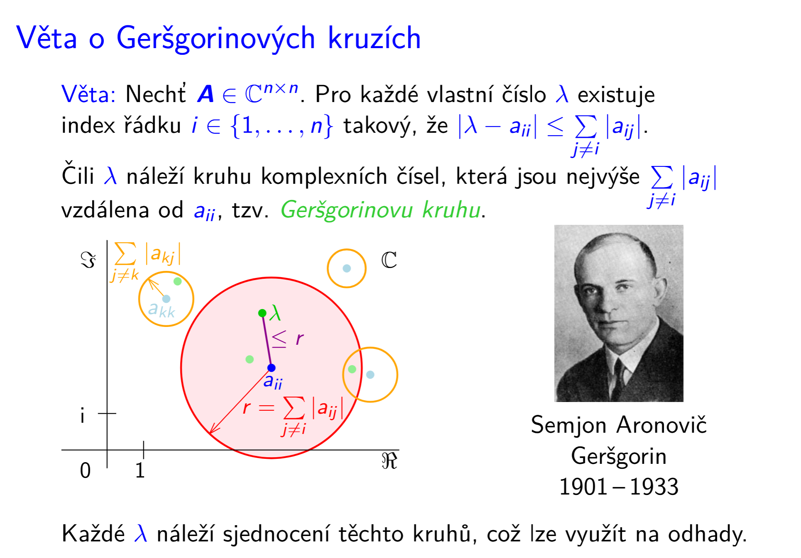
> Uvedené nerovnosti vymezují v komplexní rovině řadu kruhů, a každé vlastní číslo patří do některého z nich. Kruhy se mohou překrývat, a některé mohou obsahovat více vlastních čísel, ale také něktěré nemusí obsahovat žádné

Hezky to ilustruje alternativní zápis, co jsem našel:

Pro matici $A$ jsou řádkové Geršgorinovy kruhy:

$$D_i=\{z\in\mathbb C:\ |z-a_{ii}|\le R_i\}, \qquad R_i=\sum_{j\ne i}|a_{ij}|$$

Věta pouze zaručuje
$$\sigma(A)\subseteq \bigcup_{i=1}^n D_i$$

kde $\sigma(A)$ je množina vlastních čísel.

#### Důkaz
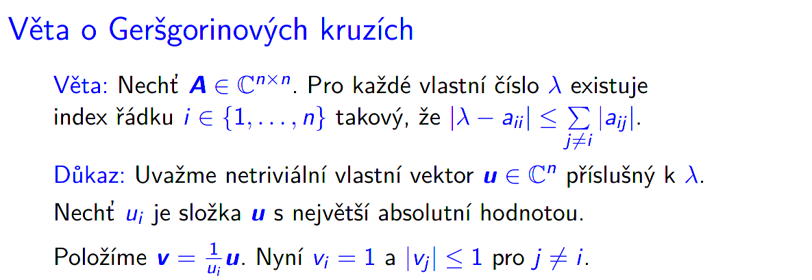
Nechť $\lambda$ je nějaké vlastní číslo. Pro něj musí existovat nějaký netriviální $\mathbf u$.
Určíme si, která je jeho složka s největší absolutní hodnotou, to bude $u_i$.

Vektor $\mathbf u$ normalizujeme tak, že ho vydělíme touto největší složkou.

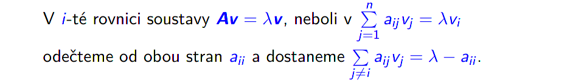
($i$-tá rovnice = součin prvků z $i$-tého řádku $A$ se složkami $\mathbf v$ a na pravé straně $\lambda$-násobek $i$-té složky vektoru $\mathbf v$, ovšem ta je rovna $1$)

$$\sum_{j=1}^n a_{ij}v_j = \lambda v_i$$

$$\sum_{j \neq i} a_{ij} v_j = \lambda v_i - a_{ii} v_i$$

$v_i = 1$:

$$\sum_{j \neq i} a_{ij} v_j = \lambda - a_{ii}$$

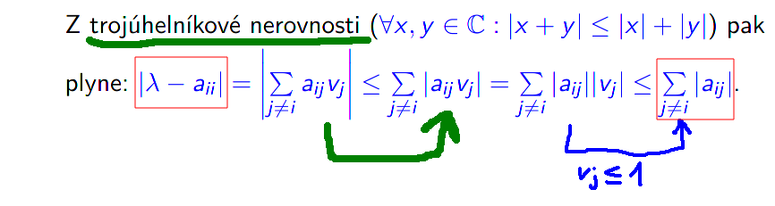

> Na závěr této lekce bych vám rád představil jeden jednoduchý dynamický systém, a ukázal, čemu v něm odpovídají vlastní čísla, a vlastní vektory:

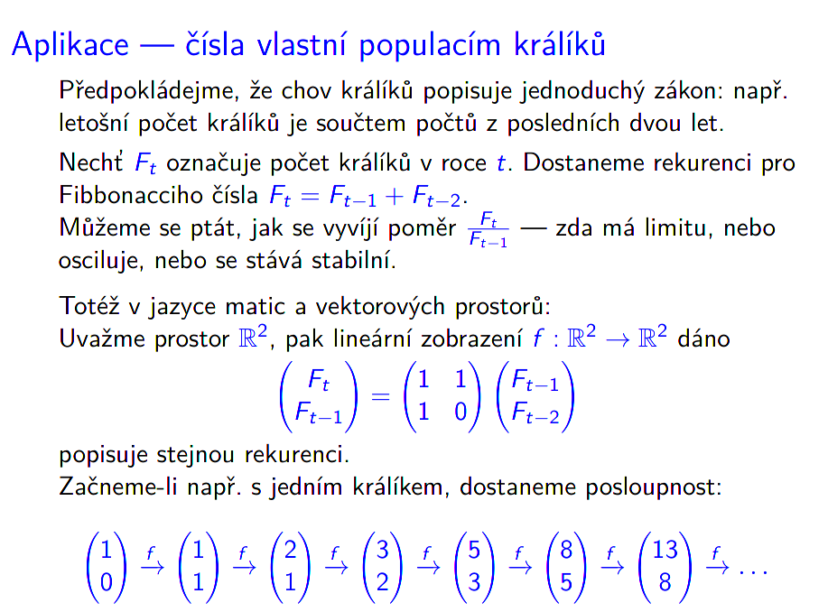

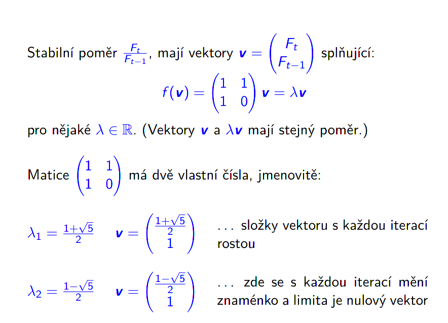

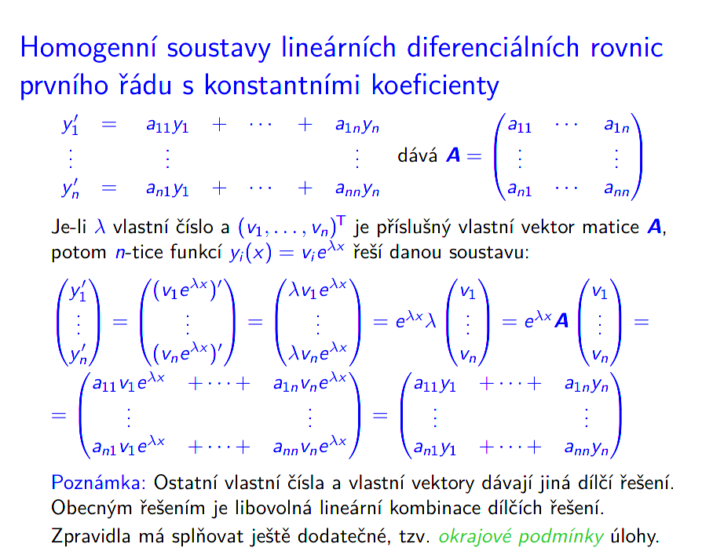

> Vlastní čísla a vlastní vektory lze také použít ke zjednodušení matice lineárního zobrazení. To budeme předmětem nektěré z příštích lekcí.

## Cayleyova-Hamiltonova věta (6:24, 36M)

Říká, že matice je "kořenem" svého charakteristického polynomu, tedy $p_{\mathbf A}(\mathbf A) = \mathbf 0_{n,n}$

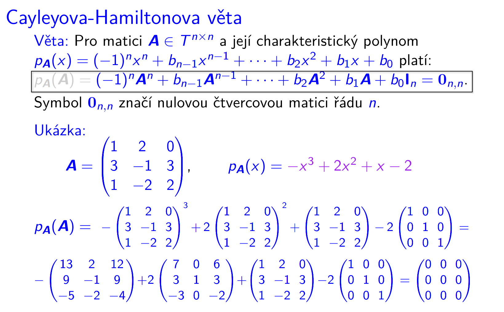

### Důkaz

Použijeme větu, že $\det(M) \cdot I_n = M \cdot \text{adj } M$ pro $M = A - x I_n$.
(tu větu jsme odvodili v důkazu Věty $A^{-1} = \frac{1}{\det A} \ \text{adj} \ A$, tam jsem podrobně okomentoval, proč platí).

$\det(M) \cdot I_n = M \cdot \text{adj } M$, kde $M = A - x I_n$

$\det(A - x I_n) \cdot I_n = (A - x I_n) \cdot \text{adj }(A - x I_n)$

Teď si rozebereme jednotlivé členy, vymyslíme jakým novým členům s mocninami $x$ se rovnají, potom nové členy znovu substitujeme do této rovnice, a odvodíme, že protože rovnost platí pro celek, tak musí platit i pro koeficienty u stejných mocnin $x$. 

Poté jakoby za $x^i$ "dosadíme" $A^i$ (pomocí běžných operací), a poté algebraickými úpravami dostaneme rovnost nule.

**ČLENY**:

1. $\det(A - x I_n)$

	$\det(A - x I_n) = p_A(x) = (-1)^n x^n + b_{n-1} x^{n-1} + \dots + b_2 x^2 + b_1 x + b_0$

2. $\text{adj }(A - x I_n)$

	$\text{adj }(A - x I_n)$ upravíme, uděláme z toho tzv. **maticový polynom** (nový pojem, polynom, kde koeficienty jsou matice).

	Prvek adjungované matice $M$ je znaménko $(-1)^{i+j}$ krát **determinant podmatice $A^{ij}$.**
	- když v té matici jsou $x$-ka, tak budou i vtom výsledku toho determinantu, což bude polynom
		- nejvyšší exponent u $x$ bude $n-1$, protože ty podmatice jsou řádu $n-1$, takže koeficient $-x$ z diagonály $n-1$ krát

	Tu matici $M$ můžeme složit z víc matic, kde bude vždycky:
	
	$$x^i \cdot \begin{pmatrix}{\text{matice koeficientů}} \\ \text{ kde, a kolikrát se  vyskytuje } x^i\end{pmatrix}$$

	Viz ukázka:

	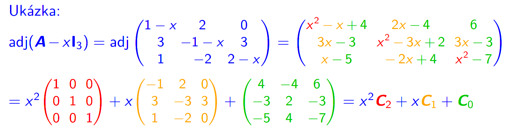

	Když to zformalizujeme:

	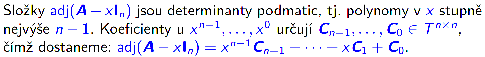

Teď ty členy dosadíme zpátky do naší rovnice $\det(A - x I_n) \cdot I_n = (A - x I_n) \cdot \text{adj }(A - x I_n)$:

$((-1)^n x^n + b_{n-1} x^{n-1} + \dots + b_2 x^2 + b_1 x + b_0)\cdot I_n = (A - x I_n) \cdot (x^{n-1} C_{n-1} + \dots + xC_1 + C_0)$

Roznásobíme:

$$(-1)^n x^n I_n + b_{n-1} x^{n-1} I_n + \dots + b_2 x^2 I_n + b_1 x I_n + b_0 I_n = -x^n C_{n-1} + x^{n-1}(AC_{n-1} - C_{n-2}) + \dots + x(AC_1 - C_0) + AC_0$$

Rovná se to, musejí se rovnat i koeficienty u stejných mocnin $x$:

koeficient u $x^n$: $(-1)^n I_n = -C_{n-1}$

koeficienty u $x^i$: $b_i I_n = AC_{i-1} - C_{i-2}$

koeficient u $x^0$: $b_0 I_n = AC_0$

**Jakoby za $x^i$ do charakteristického polynomu "dosadíme" $A^i$**:

Teď si napíšeme ty koeficienty:

$$(-1)^n I_n + b_{n-1} I_n + \dots + b_2 I_n + b_1 I_n + b_0 I_n = -C_{n-1} + (AC_{n-1} - C_{n-2}) + \dots + (AC_1 - C_0) + AC_0$$

A koeficient, který byl u $x^i$ vynásobíme zleva $A^i$

V prezentaci to napsal trochu komplikovaněji, ale je to to samé

- tj. $A^0 = I_n$, což explicitně nikde neřekl, ale mj. to dává smysl:
	- $A^{m+n} = A^m \cdot A^n$, tj. $A^{m+0} = A^m \cdot A^0$
	- $A \text{ "děleno" } A = A^1 \cdot A^{-1} = I_n$
		- tenhle argument jenom pro regulární matice, kdežto tady se $A^0 = I_n$ tak definuje pro všechny - aby př. to tady v tom důkazu vycházelo
	
	- **znění téhle Cayley-Hamiltonovy věty**, to $b_0 I$ v něm: $$b_n A^n + b_{n-1} A^{n-1} + \dots + b_1 A^1 + b_0 I = 0$$ 
	je analogie k předchozímu zápisu polynomu $\sum_{i=0}^n b_i x^i$, kde $b_0 x^0$ byl roven $b_0$ (viz diskuze, co je $0^0$, je to zde $1$ )
	- forward ref, dávalo by to smysl i protože: $A^k = R D^k R^{-1}$ aby platilo pro $k=0$: $A^0 = R D^0 R^{-1} = R \cdot I \cdot R^{-1} = R \cdot R^{-1} = I$ (Protože u diagonální matice 
$D$ jsou na diagonále čísla, a pro ně platí 
$d_{ii}^0 = 1$, což z 
$D^0$ udělá jednotkovou matici).

$$(-1)^n A^n + b_{n-1} A^{n-1} + \dots + b_2 A^2 + b_1 + b_0 I_n = -A^n C_{n-1} + A^{n-1}(AC_{n-1} - C_{n-2}) + \dots + A(AC_1 - C_0) + AC_0$$

Teď posčítáme pravou stranu. Konkrétně si uvědomme, co se stane se členy, které roznásobujeme:

$$A^i(AC_i - C_{i-1}) + A^{i-1}(AC_{i-1} - C_{i-2}) = A^{i+1} C_i \ \  \underbrace{- A^i C_{i-1} + A^{i-1} AC_{i-1}}_{0} \ \ - A^{i-1}C_{i-2}$$

A to pasuje jako takové domino:

$A^{i+1} C_i$ další dvojici roznásobovaných členů vlevo

$A^{i-1}C_{i-2}$ další dvojici roznásobovaných členů vpravo

První člen, před členy, na které to aplikujeme, je $-A^n C_{n-1}$.

Poslední člen, za členy, na které to aplikujeme, je $+A^1C_0$.

Celkově tedy vyjde nulová matice.

Zde slidy k tomu:

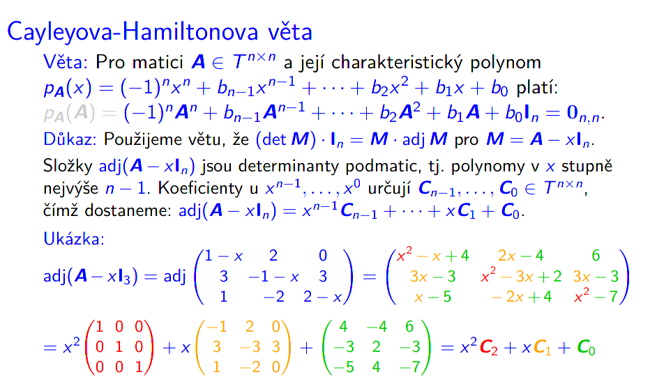
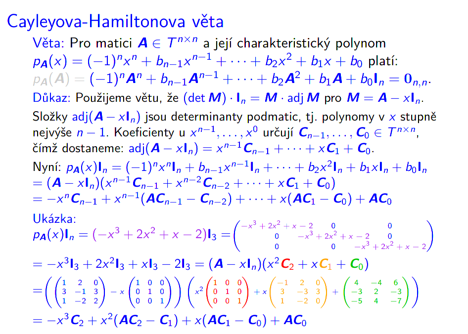
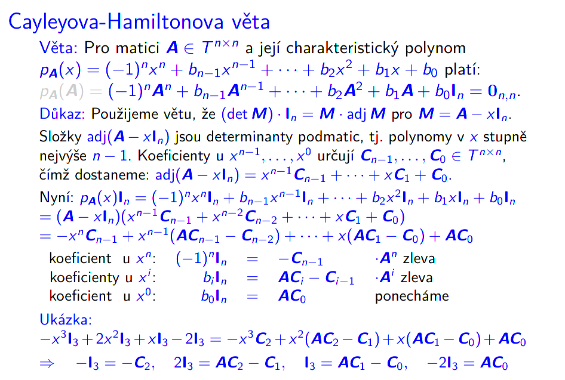
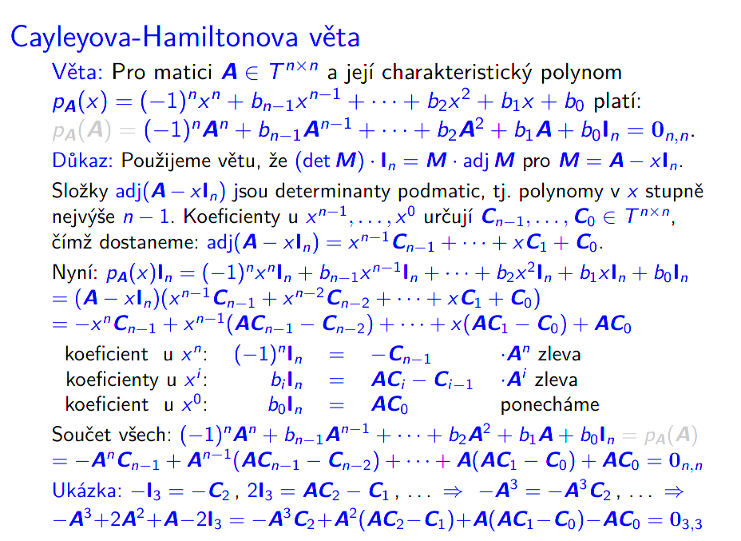

### Z kvízu:

Když jsou lineárně závislé, tak to můžeme vyjářit jako lineární kombinaci matic, které spolu s koeficienty dají nulovou matici:

$$\sum_{i=0}^n b_i A^i = 0_{n,n}$$

A to je přesně Cayley-Hamiltonova věta.

$$b_n A^n + b_{n-1} A^{n-1} + \dots + b_1 A^1 + b_0 I = 0$$

Ty konkrétní koeficienty tedy budou existovat, budou to koeficienty charakteristického polynomu $p_A$ (v něm je $b_n = (-1)^n$)